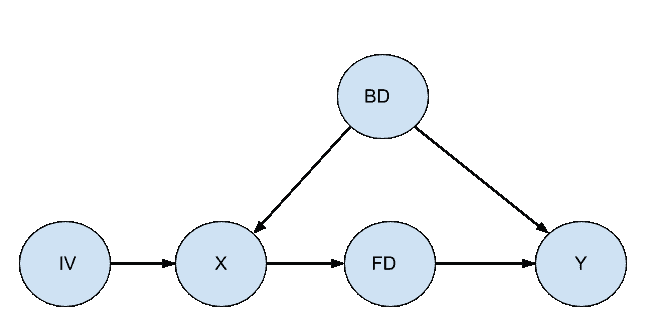
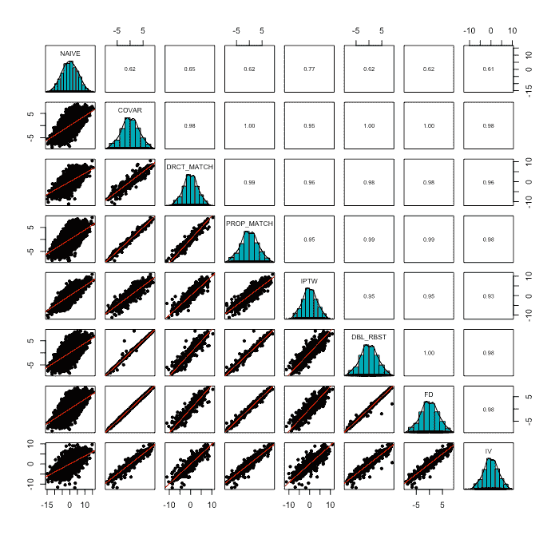

# 因果推断估计的快速比较

> 原文：<https://towardsdatascience.com/a-quick-comparison-of-causal-inference-estimates-d7995592025?source=collection_archive---------28----------------------->

## 有许多方法来估计因果效应的大小，这里我们使用一个最小复杂因果结构来检查这些估计是否一致。


来源: [Fascinadora](https://www.shutterstock.com/g/Fascinadora) 通过 [shutterstock](https://www.shutterstock.com/) (SL)

**1。简介**

作为一名实验行为科学家，我一直认为理解统计关系的因果方向性是实证科学的核心。我接受过经典实验设计的培训，在这种设计中，研究人员被认为对环境有完全的控制权，他们主要担心的是如何在时间或空间上定位不同的实验条件(例如[拉丁方设计](https://www.york.ac.uk/depts/maths/histstat/images/latin_square.gif))。然而，一旦你离开受控实验室实验的安全性，推断因果关系就成了一个大问题，很容易危及你结论的内在有效性。幸运的是，在过去的几十年里，统计因果关系的研究在理论和方法上都取得了巨大的进步，现在因果推断正在成为数据科学家工具箱中一个相当常见的工具。为了跟上当前的方法，我做了一个快速回顾，我对过多的估计因果效应的方法感到有些惊讶。在这个项目中，我将列出我在文献中发现的最常见的方法，将它们应用于一个简化的因果问题，并比较观察到的估计值。这种比较旨在作为一个简要的高层次概述，而不是作为因果推理的教程。关于这个主题的简要介绍，我推荐 Pearl 等人(2016 年)，关于深入的报道，感兴趣的读者可以查看 Pearl (2009 年)、Morgan 和 Winship (2015 年)或 Jason Roy 教授的在线课程(Roy，2020 年)。

**2。因果模型示例**

当使用统计方法推断因果关系时，通常我们感兴趣的是原因 X 对结果 y 的影响程度。当我们只观察这些变量时，或者如果随机化存在挑战(例如选择偏差)，我们通常需要考虑更广泛的变量集。在图 1 中，我给出了一个假设例子的因果图。这个例子包括三种主要类型的附加变量，帮助我们得到一个无偏的估计:后门，前门和工具变量。



*图一。在存在其他变量的情况下，原因 X 影响结果 Y 的假设性图形因果模型。如果我们测量这三个集合中的任何一个，就可以估计 X 对 Y 的因果影响:{X，Y，BD}、{X，Y，IV}或{X，Y，FD}*

假设 X 是一个二元变量，表示至少每周锻炼的效果(如果锻炼，X = 1；否则 x = 0 是连续测量的预期寿命。X 对 Y 的影响完全由变量 FD ( [前门标准](http://marcfbellemare.com/wordpress/wp-content/uploads/2019/08/BellemareBloemFDCAugust2019.pdf))调节，在我们的例子中，该变量可以是体重指数。此外，Y 和 X 都受到变量 BD ( [后门标准](https://ftp.cs.ucla.edu/pub/stat_ser/R195-SS.pdf) **)** 的影响，在我们的情况下，这可能是一些遗传因素，它们不直接影响 FD。最后，X 还受到 IV ( [工具变量](https://en.wikipedia.org/wiki/Instrumental_variables_estimation))的影响，在我们的示例中，它可能是靠近体育设施。

我们可以用以下模型实例化这个因果图:

IV = U

BD = U

X = { 0，if IV — BD + U <= 0

1, if IV — BD + U > 0}

FD = X + U

Y = 65 + FD + BD + U

*模型 1:实例化图 1 中图形模型的结构因果模型。U 分量是均值为 0 且 SD = 2 的正态分布误差项(或来自外部变量的输入)。*

出于当前模拟的目的，我从模型 1 中随机生成了 10，000 个实例，在下一部分中，我将使用不同的统计方法来估计 X 对 Y 的因果影响。

以下是相关代码:

```
generate_df <- function(n = 1000, path_weights) {
 #generate data frame from path_weights
 a <- path_weights
 sd_noise = 2
 iv <- rnorm(n, sd = sd_noise)
 bd <- rnorm(n, sd = sd_noise)
 x <- rnorm(n) + a[1]*iv + a[2]*bd
 x <- ifelse(x<=median(x), 0, 1)
 lm(x~iv + bd) %>% summary
 fd <- (rnorm(n, sd = sd_noise) + a[3]*x ) 
 lm(fd ~ x) %>% summary()
 y <- (65 + rnorm(n, sd = sd_noise) + a[4]*fd + a[5]*bd ) 
 lm(y ~ fd + bd) %>% summary()
 id <- rnorm(n)
 df <- data.frame(
  id = id, x = x, y = y, iv = iv, fd = fd, bd = bd)
 return(df)
}
path_weights <- c(1,-1,1,1,1)
df <- generate_df(n = 10000, path_weights)
```

**3。简单估计(观察 X 和 Y)**

X 对 Y 的因果效应的简单估计可以简单地从 X 预测 Y 的回归系数中获得。在这个例子中，因果效应是 b_naive = -0.97，令人惊讶地表明运动缩短了预期寿命近一年。

```
naive_fit <- lm(y~x, data = df)
summary(naive_fit)
```

当研究人员确信没有需要考虑的 BD 变量时(例如，当 X 被随机分配或好像被随机分配时)，简单估计是有用的。然而，对于大多数观察性研究和准实验性设计来说，天真的估计通常不是很有用。

**4。后门变量调节(观察 X、Y 和 BD)**

如果除了 X 和 Y 之外，您还可以测量 BD，那么您可以计算 X 对 Y 的因果影响的无偏估计，从而避免天真估计存在的问题。这里 BD 只是一个变量，但是它也可以是一组满足后门标准的变量。在回顾文献时，我发现了以下五种方法来估计因果关系，同时调整后门变量:

**4.1 协变量**

估计 X 对 Y 的因果影响的一种方法是运行回归模型，从 X 预测 Y，并将 BD 作为协变量。对于大多数受过线性回归训练但没有因果推理训练的研究人员来说，这通常是最直观的方法。

```
covariates_fit <- lm(y~x+bd, data = df)
summary(covariates_fit)
```

将这种方法应用于我们模拟的数据，我们发现 X 对 Y 的因果效应是 b _ 协变量= 1.01。根据这一分析，如果你锻炼，你会多活一年。请注意，这个估计不仅不同于天真的估计，两个估计实际上具有相反的符号，并导致相互矛盾的结论(查看[辛普森悖论](https://en.wikipedia.org/wiki/Simpson%27s_paradox)

**4.2 直接匹配**

上述协变量调整也可以通过直接匹配治疗组和对照组参与者的 BD 分数来完成。主要思想是，匹配程序将通过仅比较在 BD 分数上已经相似的对照组和治疗组受试者来消除 BD 对因果估计的影响:

```
greedymatch <- Matching::Match(Tr = df$x, M = 1, X = df[,”bd”])
matched <- df[unlist(greedymatch[c(“index.treated”, “index.control”)]),]
t.test(matched$y[matched$x == 1],matched$y[matched$x == 0], paired = TRUE)
```

当使用这种方法时，我们得到 b_direct_match = 1.05，这与我们使用协变量方法时观察到的结果非常接近。

**4.3 倾向评分匹配**

如果你需要考虑多个 BD 变量，找到好的匹配可能会非常困难(查看[维数灾难](https://en.wikipedia.org/wiki/Curse_of_dimensionality))。取而代之的是，你可以使用倾向分数匹配，在这里你首先计算在治疗组中的概率(也称为倾向分数，查看[这篇](https://www.tandfonline.com/doi/abs/10.1080/00273171.2011.568786)论文或者[这篇](http://freerangestats.info/blog/2017/04/09/propensity-v-regression)博客文章)，然后根据这些概率匹配参与者。

```
ps_fit <- glm(x~bd, data = df, family = “binomial”)
df$ps_score <- ps_fit$fitted.values
logit <- stats::qlogis # rename the function for clarity
greedymatch <- Match(Tr = df$x, M = 1, X = logit(df[,”ps_score”]), caliper = .2)
matched <- df[unlist(greedymatch[c(“index.treated”, “index.control”)]),]
t.test(matched$y[matched$x == 1],matched$y[matched$x == 0], paired = TRUE)
```

因果效应估计为 b_ps_match = 1.05，这实际上与前面的调整方法相同。

**4.4 治疗权重的逆概率**

您也可以使用加权回归，其中权重基于治疗的概率。具有高倾向分数的对照参与者和具有低倾向分数的治疗参与者接收更高的权重，调整由于 BD 变量引起的治疗/对照失衡。

```
df$weight <- ifelse(df$x == 1, 1/df$ps_score, 1/(1-df$ps_score))
iptw_fit <- lm(y ~ x, data = df, weights = weight)
summary(iptw_fit)
```

模拟数据的估计值为 b_iptw = 0.92，非常接近之前的估计值。

**4.5 双重稳健估计**

这是一种更先进的方法，为模型的错误设定提供了更多的空间。为了获得因果效应的无偏估计，正确指定倾向评分模型或结果回归模型就足够了。

```
dr_fit <- drgee::drgee(oformula=y~bd,
 eformula=x~bd,
 iaformula=~bd, olink=”identity”, elink=”identity”,
 estimation.method=”dr”,
 data=df)
summary(dr_fit)
```

因果效应是 b _ doubly _ robust = 1.01，也非常类似于之前的其他调整方法。

**5。工具变量(观察 X、Y 和 IV)**

如果你知道 BD 存在，但是你无法测量它，怎么办？如果您可以测量变量 IV，您仍然可以估计 X 对 Y 的因果影响。这种方法称为工具变量法，其中工具 IV 对 Y 的影响以 X 为中介，可用于估计 X 对 Y 的影响。运行这种分析的常用方法称为两阶段回归，其中第一阶段我们在工具 IV 上回归 X，第二阶段我们在第一阶段的残差上回归结果 Y。

```
stage1_fit <- stats::lm(x~iv, data = df)
df$stage1_predict <- predict(stage1_fit, type = “response”)
stage2_fit <- stats::lm(y~stage1_predict, data = df)
summary(stage2_fit)
```

在我们的例子中，工具变量法估计 X 对 Y 的因果影响为 b_iv = 0.96，非常接近于 BD 调整法。

**6。前门调节(观察 X、Y 和 FD)**

即使我们既不能测量 IV 也不能测量 BD，仍然有可能计算出 X 对 y 的因果影响的无偏估计。前门调整允许我们通过测量 X 对 FD 和 FD 对 y 的影响来实现这一点。

```
x_fd_fit <- lm(fd~x, data = df)
fd_y_fit <- lm(y~fd + x, data = df) # here x is included to block back-door effects
x_fd_fit$coefficients[2]*fd_y_fit$coefficients[2]
```

使用前门调整，我们估计 X 对 Y 的因果效应为 b_fd = 1.03。

**7。跨方法协议**

虽然我理解为什么有些方法应该返回相等或非常接近的估计值，但我仍然发现 X 和 Y 的因果关系可以用如此多的方法来估计，这既令人吃惊又有点令人困惑。为了检查不同方法的一致性，我基于图 1 中的因果图运行了一系列模拟。我使用了与模型 1 中概述的相同类型的关系，但对于每个模拟，我随机分配了一个随机回归系数，绝对值范围从 0.3 到 3。作为参考，对于较弱的关系(系数设置为 0.3)，FD 和 BD 一起解释了 Y 中 8%的方差，而较强的关系(系数设置为 3)解释了 68%的方差(基于 R)。



*图二。这里讨论的八种因果推断方法的因果效应估计值之间的相关性。*

我运行了 2000 次模拟，每次有 2000 行。对于每个模拟，我用上面列出的方法计算了 X 对 Y 的因果影响的八个不同的估计。图 2 描述了不同方法之间的一致性。如图所示，这两种方法基本一致，皮尔逊相关系数远高于 0.9。天真估计也与其他方法正相关，但它经常低估或高估真正的因果关系。

**8。警告和进一步观察**

当前项目的目标是为估计因果影响的主要方法提供一个快速的总体示例，并证明这些方法在结果上基本一致。然而，这个例子非常简短，忽略了许多重要的细节，其中一些我需要明确提到:

*   在这里，我把因果关系作为一个单一的概念，然而有不同类型的因果关系。例如，工具变量估计局部平均治疗效果，而这里应用的其他方法估计(边际)平均治疗效果。这两种影响不一定相等。
*   虽然图 1 中的因果图和随后的模型是基于各种理论原则和假设，但我只提供了外部参考，在此不做讨论。
*   这里的不同方法在估计上基本一致，但这部分是由于我用来生成数据的简单模型。例如，我没有包括[异质性治疗效果](https://egap.org/methods-guides/10-things-heterogeneous-treatment-effects)，不平衡组或偏斜分布，所有这些都会降低方法间的一致性。
*   匹配方法对所使用的特定算法以及 X 和 BD 之间的关系强度很敏感。
*   在试验因果关系的数量时，我注意到较弱的因果关系与方法间的一致性的显著下降有关。工具变量估计值尤其受到弱统计关系的影响(check Bound，Jaeger 和 Baker，1995 年)

**9。结论**

我发现赶上因果推理领域既具有挑战性又令人兴奋。对于一个新手来说，这个领域可能看起来支离破碎，不一致，并且经常专注于抽象的理论而不是应用。然而，除了这些最初的印象，令人着迷的是发现理论和方法逐渐趋同，并为研究人员提供了过多的创造性工具来寻找因果关系。将这些工具中最常见的放在一起，帮助我看到了理论和方法的融合，我希望它可能对其他研究人员和数据科学家有所帮助。

**参考文献**

奥斯汀市(2011 年)。减少观察性研究中混杂效应的倾向评分方法介绍。*多元行为研究*，46(3)，399–424。

Bellemare，M. F .，& Bloem，J. R. (2019)。如何使用前门标准评估治疗效果？

邦德、杰格、D. A .、贝克、R. M. (1995 年)。当工具和内生解释变量之间的相关性较弱时，工具变量估计的问题。*美国统计协会杂志*，90(430)，443–450。

邦德、杰格、D. A .、贝克、R. M. (1995 年)。当工具和内生解释变量之间的相关性较弱时，工具变量估计的问题。*美国统计协会杂志*，90(430)，443–450。

摩根公司和温希普公司(2015 年)。*反事实和因果推断*。剑桥大学出版社。

珀尔，J. (1993 年)。专家系统中的贝叶斯分析:评论:图形模型，因果关系和干预。*统计科学*，8(3)，266–269。

j .珀尔(2009 年)。因果关系。剑桥大学出版社。

j .珀尔、m .格里穆尔和 N. P .朱厄尔(2016 年)。统计学中的因果推断:初级读本。约翰·威利的儿子们。

《因果关系速成班:从观察数据推断因果关系》。*coursera.org*，网址:[https://www.coursera.org/learn/crash-course-in-causality](https://www.coursera.org/learn/crash-course-in-causality)