# 一个快速的深度学习方法:用 Python 中的 Keras 进行时间序列预测

> 原文：<https://towardsdatascience.com/a-quick-deep-learning-recipe-time-series-forecasting-with-keras-in-python-f759923ba64?source=collection_archive---------5----------------------->

在本教程中，我们将讨论/比较三个不同的人工神经网络(DNN、RNN 和 LTSM)在同一个**单变量**数据集上的表现——一家电子商务公司的广告日常支出。

# 目录

1.  **简介**

*   时间序列分析
*   为什么选择深度学习
*   进行深度学习的过程

2.**车型**

*   DNNs
*   RNNs
*   LSTM

3.**对比车型**

4.**期末总结**

# 1.1 时间序列分析

详细说明在我以前的帖子[这里](/a-quick-start-of-time-series-forecasting-with-a-practical-example-using-fb-prophet-31c4447a2274)。

# 1.2 为什么选择深度学习

我们知道统计模型可以预测时间序列。但是，这些方法有一些限制:

1.  需要**完成**数据进行培训。某些缺失值会导致模型的性能非常差。尽管有一些方法可以处理丢失的值，但是很难做到
2.  通常，处理**单变量**数据集，应用于**多变量**数据集具有挑战性
3.  **对缺失值敏感**

深度学习方法能够应对上述挑战:

1.  对缺失值不敏感
2.  合并外生变量的容易程度(适用于**单变量**数据集和**多变量**数据集 **)**
3.  捕捉**非线性**特征交互
4.  自动特征提取

我将简要解释神经网络方法的关键组件/概念，并展示如何用 python 代码中的 Keras 一步一步地应用神经网络。对于每个模型，我将遵循 5 个步骤来展示如何使用 Keras 建立一个预测时间序列的基本网络。

1.  预处理
2.  定义神经网络形状和模型编译
3.  拟合模型
4.  估价
5.  可视化预测

现在，让我们编码吧！

首先，快速浏览一下数据集:2017 年 1 月 1 日至 2019 年 9 月 23 日的广告日支出包括 996 天。数据集的前五行:

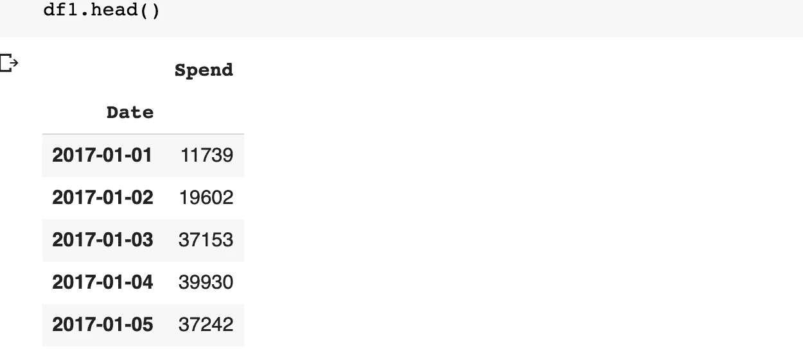

数据帧的前五行

绘制滚动平均值以可视化趋势/季节性，并运行 [Dickey-Fuller 测试](https://en.wikipedia.org/wiki/Dickey%E2%80%93Fuller_test)以检查数据集的平稳性，与我们在之前的教程第一部分和第二部分中所做的一样。

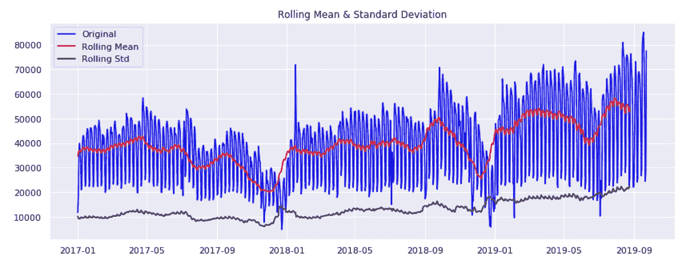

# 模式 1: DNN

*一个深度神经网络(****【DNN】****)是一个* ***人工神经网络*** *(* ***安*** *)在输入层* ***和输出层****—[来自维基](https://en.wikipedia.org/wiki/Deep_learning)*

*如何对时间序列数据应用 DNN？这里的**关键思想**是:我们把时间序列看作线性模型:{X(i) …X(i+t)}~Y(i+t+1)。在该格式中，显示了使用 t 步输入时间序列来预测下一步 Y(i+t+1)。*

*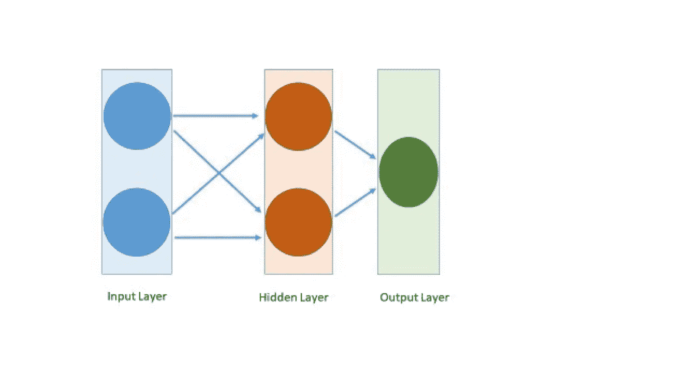*

*带有一个隐藏层的简单 DNN*

*在图中，我显示了一个隐藏层的 DNN 结构。接下来，让我们看看如何在我们的广告支出数据上实现这个模型。*

***第一步:数据预处理***

*导入 convert2matrix 的辅助函数来修整数据集，以便创建 DNN 的二维输入形状。一个完全连接的网络——RNN 和 LTSM 的主要区别*

*将数据集分为测试数据集和训练数据集。*

***第二步:定义神经网络形状并编译模型***

*我建立了一个非常简单的 DNN，只有一个隐藏层。*

***第三步:拟合模型***

*model=model_dnn(回看)*

*history=model.fit(trainX，trainY，epochs=100，batch_size=30，verbose=1，validation_data=(testX，testY)，callbacks =[early stopping(monitor = ' val _ loss '，patience=10)]，shuffle=False)*

***第四步:模型评估***

*打印出误差指标并生成模型损耗图。*

*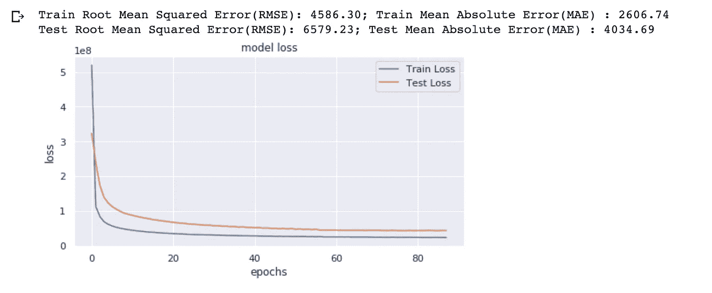*

*从上面的图表中，很明显我们过度拟合了我们的模型，因为模型在 40 个时期后几乎没有做任何事情。*

***步骤五。可视化预测***

*通过调用以下命令检查预测图:*

*预测 _ 绘图(测试，测试 _ 预测)*

*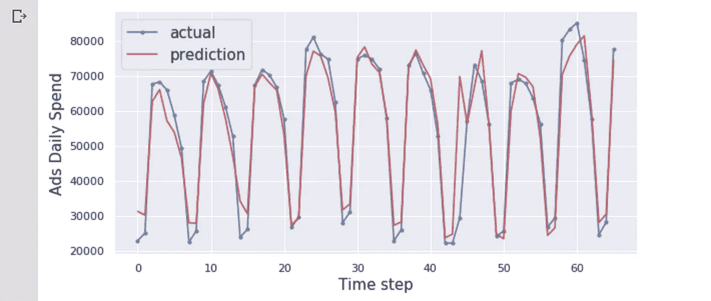*

*从图上看，尽管它错过了一些波峰和波谷，但它能够捕捉总体趋势和季节性，而无需任何参数调整或归一化预处理。*

# *模式 2: RNN*

***RNN(递归神经网络)**处理的序列不同于之前显示的全连接 DNN。*

*这里的**关键思想**:时序数据集是序列。*

*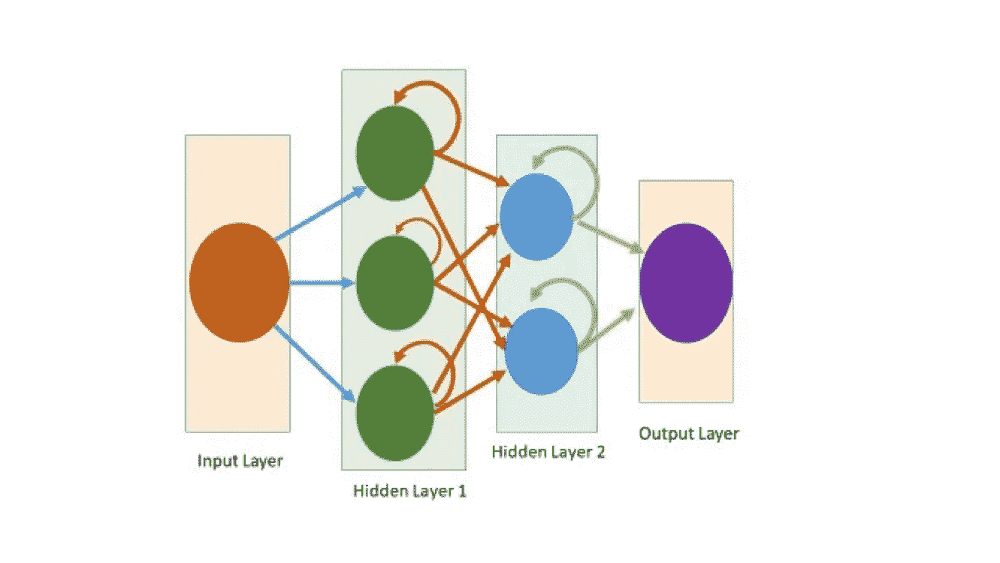*

*有两个隐藏层的 RNN*

*我们将在下面的案例研究中看到这个 RNN 形状。*

***第一步:数据预处理***

*RNN 输入形状:(批量大小，窗口大小，输入特征)*

*导入助手函数以创建矩阵*

***第二步:定义神经网络形状并编译模型***

*建立了一个有两个隐藏层的 RNN 模型。*

***第三步:拟合模型***

*模型=模型 _rnn(回望)*

*history=model.fit(trainX，trainY，epochs=100，batch_size=30，verbose=1，validation_data=(testX，testY)，callbacks =[early stopping(monitor = ' val _ loss '，patience=10)]，shuffle=False)*

***第四步:模型评估***

*打印出误差指标并生成模型损耗图。*

***产量低于***

*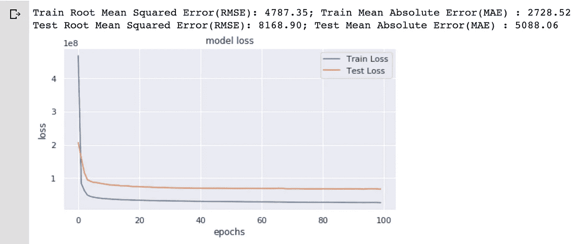*

*从上面的图表中，很明显我们过度拟合了我们的模型，因为模型在 20 个时期后几乎没有做任何事情。*

***第五步。可视化预测***

*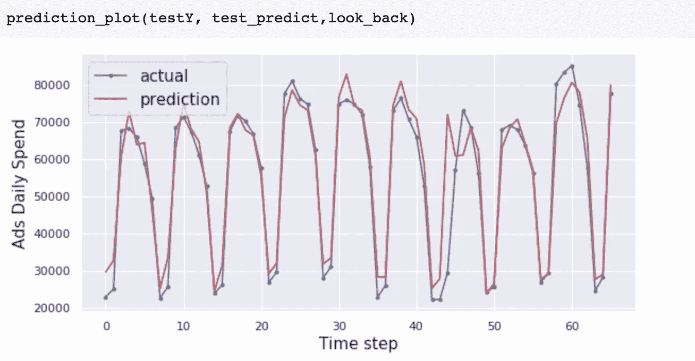*

*一般来说，预测看起来不错，测试误差较小。尽管它错过了一些高峰和低谷，但它能够捕捉总体趋势和季节性。*

# *模式 3:LSTM——RNN 家庭的一员*

*LSTM(长短期记忆)，由四个主要部件构成:输入门、输出门、存储单元和遗忘门*

*   ***输入门**:控制向单元格状态添加信息。换句话说，输入门将考虑哪些信息应该添加到单元状态，以确保添加重要信息而不是冗余信息或噪声。*
*   ***内存** **单元格** : (1)控制可以删除或刷新的值(2)包含可能需要保存的值，作为许多其他时间步骤的附加信息。*
*   ***输出门**:控制从当前单元状态中选择有用的学习信息作为输出。*
*   ***遗忘门**:控制从细胞状态中删除 LTSM 学习不再需要或不太重要的信息。这有助于优化 LSTM 网络的性能。*

*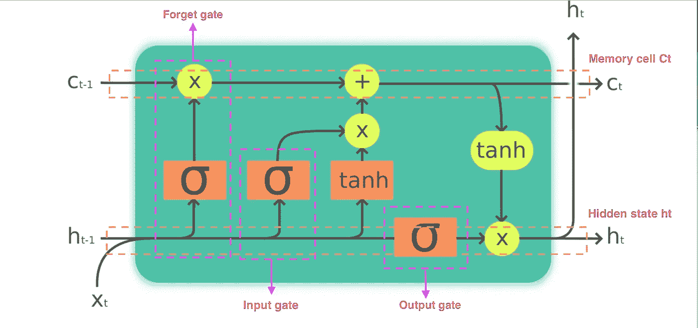*

*我修改了 https://en.wikipedia.org/wiki/Long_short-term_memory 的原始图片*

***第一步:数据预处理:***

*LSTMs 对输入数据的规模很敏感。在预处理步骤中，我应用了 scikit-learn 模块中的 **MinMaxScaler** 预处理类来标准化/重定数据集。*

*导入助手函数以创建矩阵*

*将数据集的范围重新调整为 0–1。*

*将数据集分为训练数据集和测试数据集。为 LSTM 创建输入三维输入形状。*

***第二步:定义神经网络形状并编译模型***

*这里，一个非常简单的两层 LTSM 没有隐藏层*

***第三步:拟合模型***

*model=model_lstm(回望)*

*history = model.fit(trainX，trainY，epochs=100，batch_size=30，validation_data=(testX，testY)，callbacks =[early stopping(monitor = ' val _ loss '，patience=10)]，verbose=1，shuffle=False)*

*这里有一个小提示:通常，当 LSTM 表现出过度适应时，尝试 GRU(门控循环单元)是 LSTM 的“简化版”。*

***第四步:模型评估***

*打印出误差指标并生成模型损耗图。*

*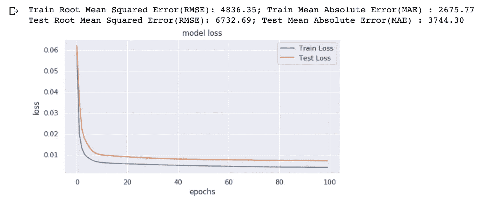*

*从上面的图表中，很明显我们过度拟合了我们的模型，因为模型在 20 个时期后几乎没有做任何事情。*

*通过在本文中比较不同模型的误差度量，我们得到了更好的结果(LSTM 显示了更小的误差度量)。迄今为止，LSTM 的表现优于其他两款车型。我们预测大约 2 个月(具体来说是 65 天)，MAE 等于 3744。换句话说，2 个月的预测广告支出将比实际支出少大约 3744 美元。平均每月花费 250 万美元以上。这是一个非常好的预测！此外，这是对我另一篇文章中的[统计模型结果的一大改进。](/time-series-forecasting-with-statistical-models-in-python-code-da457a46d68a)*

***第五步。可视化预测***

*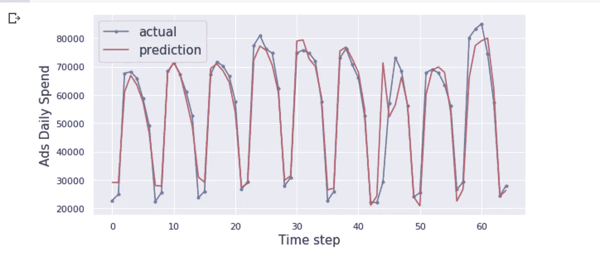*

*尽管它不能完美地捕捉所有的波峰和波谷，但在这个用例中，它确实比 DNN 或 RNN 模型做了更好的预测。*

# ***总结***

*到目前为止，我展示了在这个用例中使用深度学习来预测单变量时间序列数据。实际上，深度学习可以做得更多！我们可以通过添加其他特征(如星期几、节假日、经济影响等)将单变量时间序列数据转换为多变量时间序列，这对于应用于传统的统计模型来说是一个挑战。*

*除了为输入数据添加更多特征之外，还可以考虑其他过程来改进神经网络。*

*   *增加嵌入输出大小*
*   *添加批量标准化图层*
*   *尝试不同的学习率，激活功能，其他超参数*
*   *稍后添加辍学*
*   *尝试其他模式，如 GRU 或切换到[有线电视新闻网](https://en.wikipedia.org/wiki/Convolutional_neural_network)*
*   *等等。*

## *参考资料:*

* [## 用于视觉识别的卷积神经网络

### 计算机视觉在我们的社会中已经变得无处不在，在搜索、图像理解、应用程序、地图绘制…

cs231n.stanford.edu](http://cs231n.stanford.edu/)  [## keras-team/keras

### mnist_mlp.py 在 mnist 数据集上训练一个简单的深度多层感知器。py 在…上训练一个简单的 convnet

github.com](https://github.com/keras-team/keras/tree/master/examples)*