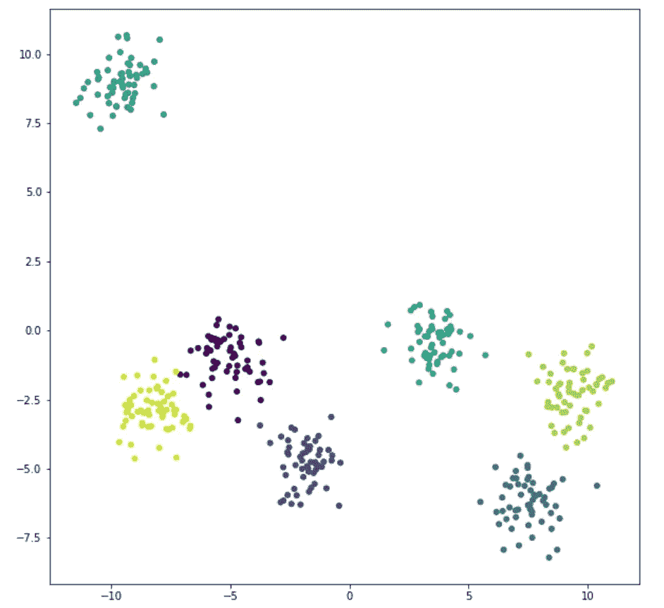
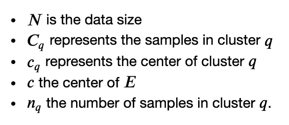
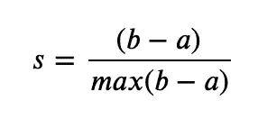
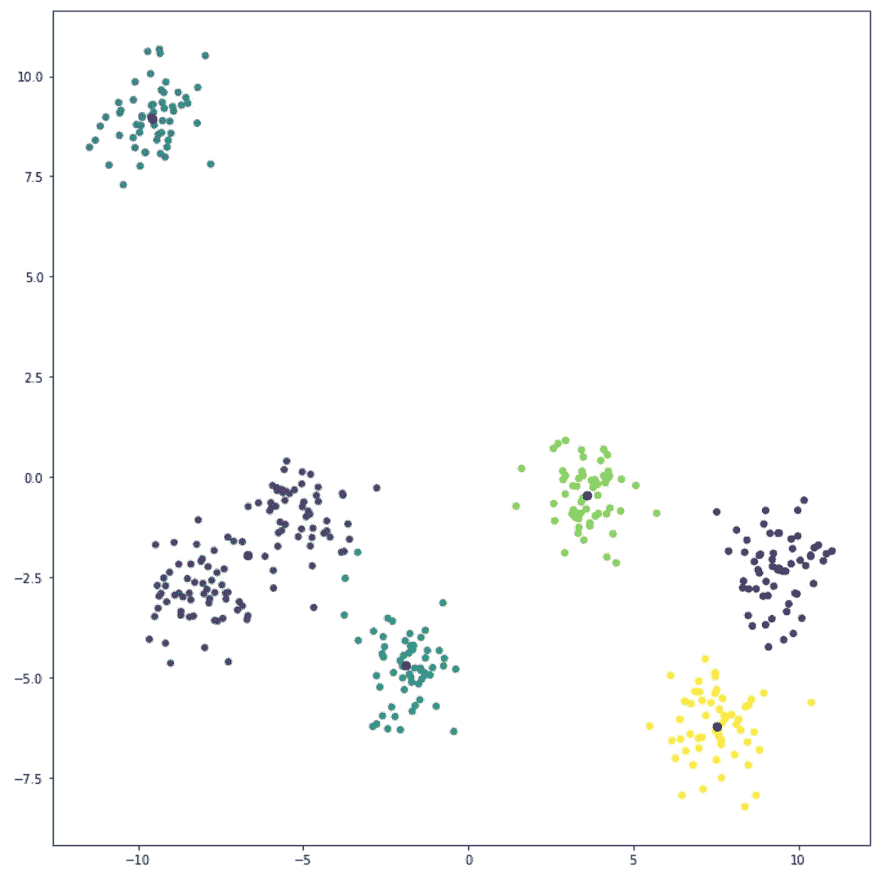

# k 均值聚类

> 原文：<https://towardsdatascience.com/a-quick-easy-k-means-clustering-tutorial-3ccee4ea7d5b?source=collection_archive---------49----------------------->

## 一个简单快捷的基本机器学习工具教程

作者安德鲁·科尔

数据至少是模糊的。它包含无限的信息宝藏，而解开这些信息需要同样模糊的方法。但是，和任何事情一样，必须有一个起点。分类是最有效的机器学习方法之一，它试图根据数据已有的特征将数据分类到特定的组中。然而，我们并不总是知道这些特征是什么，这就是问题所在。我们甚至不知道我们在数据集里看到了什么，我们只是呆呆地盯着它，而它也在看着我们。

幸运的是，有 ML 分类方法可以帮助解决这个模糊的问题。机器学习以两种状态存在:

*   **监督学习:**算法从已经包含标记数据的训练数据集中“学习”。训练数据集包含输入**和**输出数据，这是模型验证自身性能的方式。例如，我们有一个医院病人，我们**知道他**表现出症状 X、Y 和 Z，他们患有疾病 1。输入数据表示三种症状，而输出表示患者确实患有疾病 1。因为输入和输出是已知的，我们可以利用监督机器学习。
*   **无监督学习:**算法用**未知的**结果来推断数据中的模式。你不能真正地将数据归类到一个结果中，因为你甚至不知道结果的值可能是什么。例如，您有一家拥有 100，000 名客户及其购买历史的企业，您希望了解这些客户的人口统计分组，以便更好地调整您的业务模型。无监督学习方法在这里会更合适，因为它们将有效地将那些客户“分组”到仅基于可用数据的相似分组中。

# **K 均值聚类—模型**

我们将深入探讨如何创建一个基本的无监督学习模型，以及如何评估其成功的教程。无监督学习有许多应用，但我们将特别关注其中一个:聚类。聚类实质上将分散所有的数据点，并根据它们的特征对它们进行分组。目标是进行分组，使得**类内**相似性高(聚类内的相似性)，同时保持**类间**相似性低(聚类间的相似性)。

**聚类的主要目标是将数据点分组在一起，而不知道这些数据点实际上是什么。**

利用 k-均值聚类，我们确定有 *k-* 个聚类中心。通用算法流程如下:

1.数据将围绕整个数据集中预定数量的中心点进行分组。

2.每个单独的数据观测值将被分配到距离中心点“最近”的聚类(欧几里德距离)。

3.各个聚类中心点将被重新计算，因为它们周围都有它们的观测值

4.现在，根据一些“规则”，观察值被重新分配给其中一个集群(见下面的 **Init** )

5.这个过程是迭代的，所以如果观测点的重新分配可以实现更近的距离，它就会发生。如果没有，模型就完成了。

为了开始建模过程，我们导入必要的库并生成随机数据:

在这里，我们可以清楚地看到有 5 到 7 个清晰的数据点或数据簇。K-Means 算法现在将计算并试图找到“K”个聚类的中心点。我们将定义‘k’= 7。算法本身有些简单:

与任何机器学习模型一样，有大量的参数选项来帮助调整您的模型以适应您的数据(括号中的参数选项)。

*   **n_clusters:** 这是你的“k”值。该参数告诉算法将数据分组到多少个聚类中，因此需要计算多少个中心点。没有确定的方法来预先确定准确的 k 数，因此模型的迭代是必要的，并且最佳执行结果度量(我们稍后将讨论)将告诉您哪个数用于您的最终模型。
*   **init:** 这是你初始化函数的“规则”方法( **k-means++:** 默认；选择初始聚类中心以追求更快的收敛；**随机:**选择 k-随机观测值来选择初始中心； **ndarray:** 此参数允许您提供自己的初始中心点)
*   **算法:**指定聚类时使用的算法( **full:** “全期望最大化”)；在每次迭代中，出现 E 步(将点分配到最近的中心点)和 M 步(根据聚类元素更新聚类均值);**埃尔坎:**效率更高；使用稀疏数据时不可用；**自动**:根据给定数据自动拾取满/elkan)

上述代码的结果如下图所示。7 个聚类中每个聚类正中心的黑点代表每个聚类的计算中心点。

# **K 均值聚类:评估指标**

如前所述，聚类是一个迭代过程。没有很好的方法来预先确定我们应该在我们的模型中使用多少 k-clusters，因此我们必须运行多个模型，然后比较结果指标。sk-learn 库中可能有许多指标，但我们将重点关注两个:

*   **方差比(Calinski-Harabasz 评分):**这是一个聚类内的点的方差比。方差比率得分越高=模型性能越好。

*   **剪影评分:**评分越高=模特越好

— **a =** 一个数据样本与同一个聚类中所有其他点之间的平均距离

— **b** **=** 一个数据样本与下一个最近聚类中所有其他点之间的平均距离

值得注意的是，这两个指标都不一定比另一个“更好”。然而，重要的是，一旦你选择了一个评估指标，你就要坚持在所有模型中使用相同的指标。

# **剪影得分:k = 7**

# **卡林斯基-哈拉巴斯评分(方差比):k = 7**

现在我们有了 k=7 个集群的模型性能指标，我们将再次迭代模型，这次使用 k = 6。一旦新模型被拟合和预测，我们将比较指标。无论哪个更高，都将是性能更好的模型。代码如下:

当您比较两个生成的模型图时，我们无法真正区分两个中心，除了右上的浅紫色样本簇(x = -5，y = 0.0)这一事实。因此，我们必须比较评估指标，以确定哪个分数更好。让我们使用剪影分数作为我们的比较(同样，一旦你选择了一个指标，你必须在所有的模型迭代中使用它)。

# **结论**

我们现在有两个指标进行比较。

*   **k = 7**；轮廓得分= 0.70
*   **k = 6**；轮廓得分= 0.68

k=7 的轮廓分数高于 k=6，因此 k=7 是性能最好的模型。