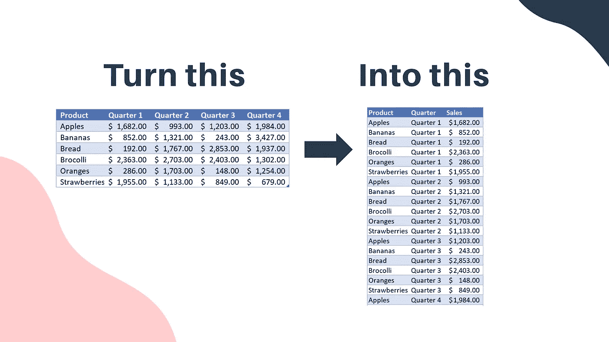
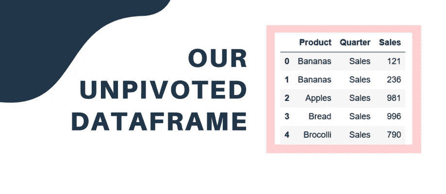
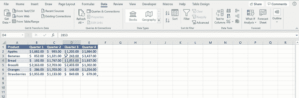

# Python 中一种快速、简单的数据反透视方法

> 原文：<https://towardsdatascience.com/a-quick-easy-way-to-unpivot-data-in-python-ea31dc707ae7?source=collection_archive---------10----------------------->

## 在熊猫中使用融化功能


让我们学习如何在熊猫身上融化数据(来源:Nik Piepenbreier)

在之前的一篇文章中，我们看了一下在 Python 中执行[三个常见的 Excel 任务。今天我们来看看一个函数，虽然在 Excel 中是可能的，但它隐藏得很好，有点笨拙。我说的是 Excel 中的“非透视”数据。](/learn-how-to-easily-do-3-advanced-excel-tasks-in-python-925a6b7dd081)

# 为什么取消数据透视？



让我们让下载的数据更有用！资料来源:Nik Piepenbreier

Python 和 Excel 使得分析数据和以跨表格式呈现分析变得非常容易。但是如果您只接收那种格式的数据呢？为了进行更有意义的分析，通常需要花费大量时间来重新格式化数据。我们称这个过程为“非旋转”。

# 开始取消透视数据

让我们通过运行以下命令将数据集加载到 Pandas 数据帧中:

```
import pandas as pd
df = pd.read_excel('[https://github.com/datagy/mediumdata/raw/master/pythonexcel.xlsx](https://github.com/datagy/mediumdata/raw/master/unpivot.xlsx)')
```

如果你想探索 Excel 中的数据，你可以[在这里](https://github.com/datagy/mediumdata/raw/master/unpivot.xlsx)下载文件。

我们可以通过编写以下代码打印出列名:

```
print(df.columns)
```

这将返回:

```
['Product', 'Quarter 1', 'Quarter 2', 'Quarter 3', 'Quarter 4']
```

本质上，我们希望将所有的季度放在一个列中(称为季度)，并将销售额放在一个单独的列中。熊猫融化功能使这变得非常容易。我们可以简单地写:

```
df = df.melt(id_vars = 'Product', var_name = 'Quarter', value_name = 'Sales')
```

让我们稍微分解一下:

*   **id_vars** :标识要用作标识符变量的列
*   **value_vars** :要取消透视的列。如果为空(如这里的情况)，则使用除了那些在 *id_vars* 中标识的列之外的所有列
*   **var_name** :为取消透视的列指定一个名称
*   **值名称**:为值列指定一个名称

当我们现在打印出 df 时，我们看到它以如下方式返回:



我们融化的数据框。资料来源:Nik Piepenbreier

# 在 Excel 中取消数据透视



在 Excel 中取消数据透视。资料来源:Nik Piepenbreier

现在，假设我们想在好的、旧的 Excel 中做这件事。我们该怎么做呢？在 Excel 2016 之前，这需要下载 Power Query 插件。从该版本开始，附加组件的功能被内置到主版本中。让我们从打开数据集开始。从那里开始:

1.  选择数据选项卡
2.  选择表格后，在获取和转换数据中选择表格/范围
3.  切换到变换菜单
4.  选择要取消透视的列
5.  单击取消透视列
6.  在主页选项卡上选择关闭并加载
7.  享受你的数据！

感谢阅读这篇文章！请务必查看我的其他帖子，包括[轻松学会如何！！)用 Python 做 3 个高级 Excel 任务](/learn-how-to-easily-do-3-advanced-excel-tasks-in-python-925a6b7dd081)。