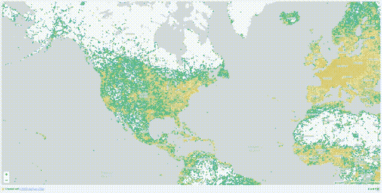
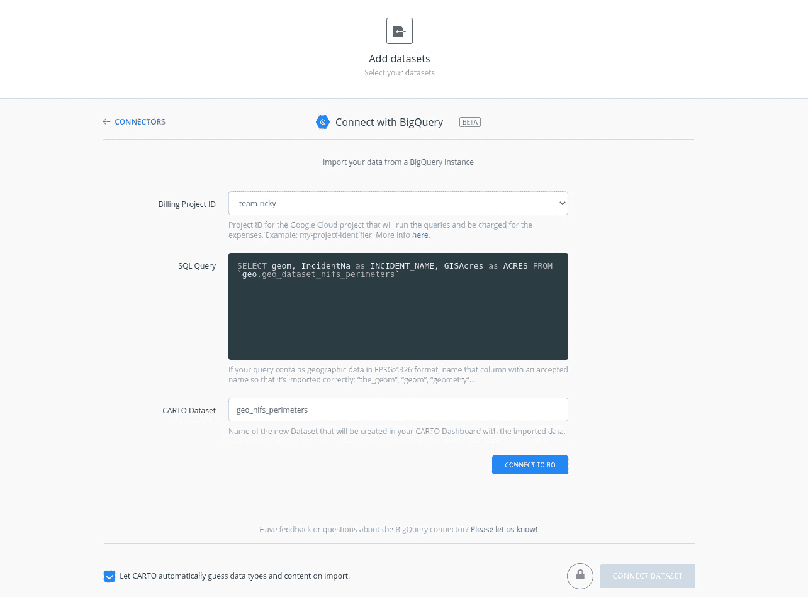
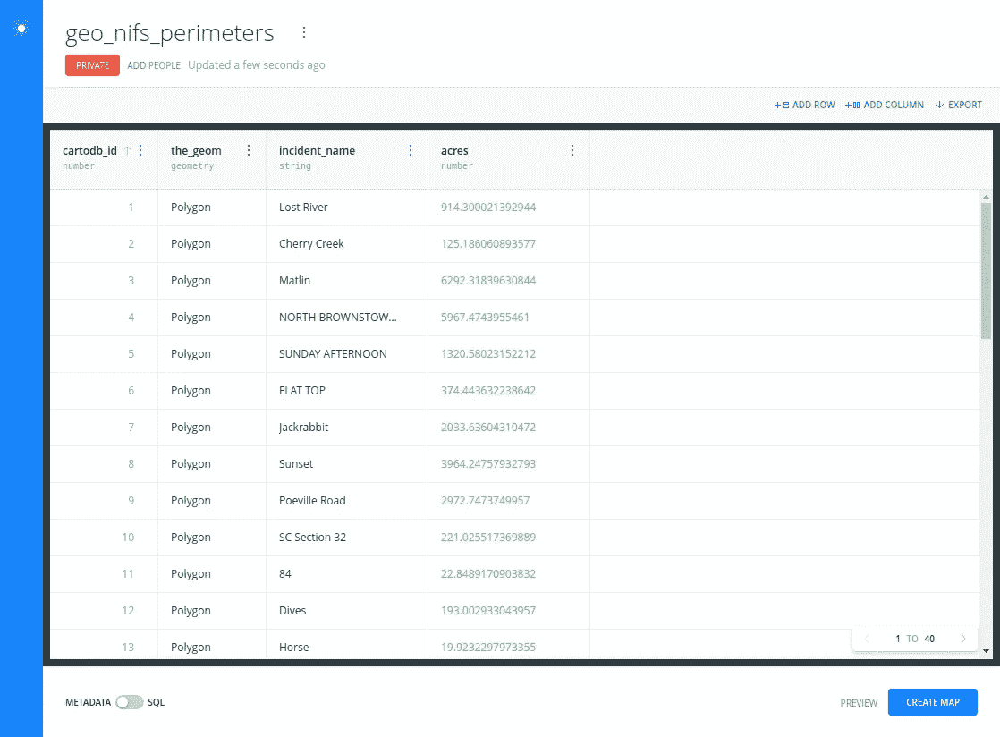
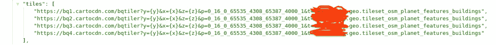
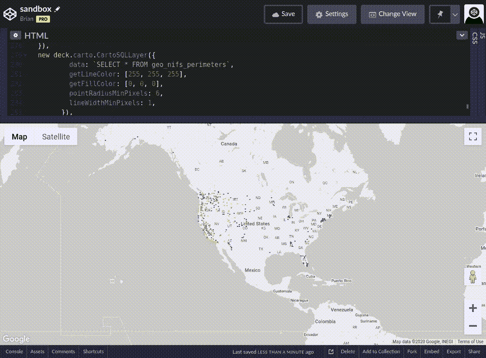

# CARTO BigQuery Tiler 的快速实验！

> 原文：<https://towardsdatascience.com/a-quick-experiment-with-the-carto-bigquery-tiler-b2ab37e48006?source=collection_archive---------59----------------------->

## 从 BigQuery 和 CARTO BigQuery Tiler 的实践教程开始。

我和我的朋友、共同主持人、数据黑客同事[朱莉](http://medium.com/@juliebprice) ( [推特](https://twitter.com/juliepricetech))，以及 CARTO 的帮助下创建的！

# 你好，世界！

最近，CARTO 推出了 BigQuery Tiler，我们有机会出席 2020 年[空间数据科学大会](https://spatial-data-science-conference.com/)，一睹 Tiler 的风采。

我们做了一个报告！

我们为这个演示创建了几个演示，我们想把它作为一个“你好，世界”的练习分享给 tiler！我们已经将数据和查询/代码加载到了一个 [Github 库](https://github.com/slagathorr/sdsc20-bqtiler-demo)中，欢迎您尝试一下。当第一次构建这些组件时，我们发现了许多关于许多不同组件的有用信息，但试图将它们联系在一起并不总是直截了当的，因此这包括了我们在此过程中吸取的许多经验教训，并给出了从数据创建到可视化的完整端到端示例。

在运行演示之前，需要回顾一些要点。readme 文件中列出了它们[，但这里也值得重申一下:](https://github.com/slagathorr/sdsc20-bqtiler-demo#read-me-first)

*   这是演示代码，旨在用于学习，而不是用于生产。它不是受支持的产品，因此随着时间的推移，情况可能会发生变化和损坏，我们将尽力修复它！
*   如果这是你第一次使用谷歌云，一定要开始你的[免费试用](https://cloud.google.com/free)并创建你的项目！
*   这使用了 [Google BigQuery](https://cloud.google.com/bigquery) ，会产生成本。请务必通过[定价页面](https://cloud.google.com/bigquery/pricing)了解您的项目将如何产生成本，如果这是您的第一个项目，请务必了解 [Google Cloud 试用和免费等级](https://cloud.google.com/free)。
*   这也使用 CARTO BigQuery Tiler。你需要成为测试版的一员。在这里找到关于这个[的更多信息。](https://carto.com/bigquery/beta/)
*   当然，你还需要一个[卡通账户](https://carto.com/signup)！
*   对于在 Google Cloud 和 BigQuery 的命令行中完成的任务，您可以利用预先安装了命令行工具的[云外壳](https://cloud.google.com/shell)，或者您可以[将 Google Cloud SDK](https://cloud.google.com/sdk/docs/install) 安装到您的本地(或虚拟)机器上。
*   在命令行中，确保通过运行`gcloud auth login`来设置您的用户，并运行`gcloud init`来设置您的默认项目。

# 加载数据

阅读完这些信息并设置好项目后，就可以加载数据集了。有两个数据集要加载； [NIFS 火灾周界数据](https://data-nifc.opendata.arcgis.com/)和[来自 OpenAQ](https://openaq.org/) 的数据。继续克隆/下载 [Github 库](https://github.com/slagathorr/sdsc20-bqtiler-demo)，并按照[readme 中的步骤加载数据](https://github.com/slagathorr/sdsc20-bqtiler-demo#load-the-data-before-starting-this)。完成后，BigQuery 中应该有下面的表:

*   `geo.geo_dataset_nifs_perimeters`
*   `geo.geo_dataset_openaq_demo`
*   `geo.geo_dataset_osm_planet_features_buildings`
*   `geo.tileset_openaq_wildfire`
*   `geo.tileset_osm_planet_features_buildings`

# 可视化 OpenStreetMaps (OSM)数据

当加载地理数据集时，您可以直接在 BigQuery 界面中预览它们(T4 ),看看它们是什么样子。一旦你创建了一个 tileset，你也可以预览它们，但因为它是原始的 tileset 数据，它可能不会有太大的意义。您可以使用 QGIS、deck.gl 和 Carto 的在线查看器等工具来可视化切片集。Carto Online Viewer 是一个基于 web 的 tilesets 可视化工具，可以让您快速查看数据的外观。当加入测试版时，它的文档会让你知道如何设置在线查看器，使用本教程中创建的 OSM tileset 就是一个很好的例子。如果您已经加入了测试版，并且可以访问它，那么现在是使用`geo.geo_dataset_osm_planet_features_buildings`表进行尝试的好时机。



CARTO Online Viewer 中的 OSM tileset 将如下所示。(图片由作者提供)

# 可视化 NIFS 和 OpenAQ 数据

为了制作演示中使用的第二个示例，我们使用 [deck.gl](https://deck.gl/) 在网页中创建可视化效果。我们还使用了 [codepen.io](http://codepen.io/) 来测试和显示网页和可视化效果，但是您也可以将代码粘贴到 [Github Gist](http://gist.github.com/) 中，并使用[bl.ocks.org](https://bl.ocks.org/-/about)来呈现它，或者如果您有自己喜欢的编辑和服务工作流，请使用它！

为了显示 NIFS 野火多边形，我们使用了[cartossqllayer](https://deck.gl/docs/api-reference/carto/carto-sql-layer)下拉数据并将其可视化。这意味着您还必须[在 CARTO](https://carto.com/help/tutorials/big-query-connector/) 中创建一个数据集才能使用它。在 CARTO 仪表板中，转到数据页面，创建一个新的 BigQuery 数据源，并使用您用来访问 Google Cloud 的帐户进行身份验证。在向导中，在 BigQuery 中选择存储您的`geo`数据集的项目，将输出命名为`geo_dataset_nifs_perimeters`，并使用以下查询:

```
SELECT geom, IncidentNa as INCIDENT_NAME, GISAcres as ACRES FROM `geo.geo_dataset_nifs_perimeters`
```



BigQuery 数据的 CARTO 向导。(图片由作者提供)

选择不同步下一页中的数据(这只是静态数据的一次性提取，因此不需要同步)，并将数据导入！这将为您提供一个来自 BigQuery 的 CARTO 新数据集，您可以使用它。



闪亮的新数据！(图片由作者提供)

该数据集现在可用于查询。包含源代码的 HTML 页面在`[/2_fire_perimeters/index.html](https://github.com/slagathorr/sdsc20-bqtiler-demo/tree/main/2_fire_perimeters)`的 Github 资源库中，需要做一些改动。

首先是 API 键。确保[获得您的 CARTO API 密钥](https://carto.com/help/getting-started/get-api-key/)，授予其访问`geo_nifs_perimeters`数据集的权限，并使用这些凭证来填充 index.html 文件中[第 259 和 260 行的变量。](https://github.com/slagathorr/sdsc20-bqtiler-demo/blob/a65bc4ab505b5e8c2589f880c19003388fb12664/2_fire_perimeters/index.html#L259-L260)

您还需要获得一个 Google Maps API 密钥，因为我们将它用作可视化中的底图。按照[指令获取您的 API 密钥](https://developers.google.com/maps/documentation/javascript/get-api-key)，然后将其插入到第 9 行的 [API 调用中。](https://github.com/slagathorr/sdsc20-bqtiler-demo/blob/a65bc4ab505b5e8c2589f880c19003388fb12664/2_fire_perimeters/index.html#L9)

最后，您需要为 BigQuery 中的 tilesets 添加数据访问。为此，我们使用了[多视图层](https://deck.gl/docs/api-reference/geo-layers/mvt-layer)。在[第 268 行](https://github.com/slagathorr/sdsc20-bqtiler-demo/blob/a65bc4ab505b5e8c2589f880c19003388fb12664/2_fire_perimeters/index.html#L9)中，用 tileset 的 URL 模板替换`url`占位符。在 BigQuery Tiler 文档的“使用 QGIS”一节中，有一节介绍了如何获取生成模板的 URL。您将得到一个包含大量信息的 JSON 响应，但是所需的 URL 将是第一个对象，看起来像这样:



原谅我的涂鸦。(图片由作者提供)

用生成的新 URL 替换`urls`，您应该可以开始了！您将获得一个可视化效果，显示任何给定野火质心 100 公里范围内的 OpenAQ 中的测量点，并与野火本身的多边形分层。



空气测量点和地图上的野火多边形。(图片由作者提供)

应该就是这样了！希望您能够浏览所有这些内容，作为 CARTO BigQuery Tiler 的介绍，以及可视化这些数据集的一些选项，这很有帮助。如果您遇到任何问题，请务必让我们知道。如果您有任何希望分享该功能帮助的使用案例，我们也很乐意听到！请务必在这里或在 Twitter ( [@brian_suk](http://twitter.com/brian_suk) 和 [@juliepricetech](http://twitter.com/juliepricetech) )上发表评论，为我们呐喊！谢谢，祝映射愉快！