# 深度学习中激活函数的快速指南

> 原文：<https://towardsdatascience.com/a-quick-guide-to-activation-functions-in-deep-learning-4042e7addd5b?source=collection_archive---------13----------------------->

## 深度学习中所有主要激活功能的快速讨论。

作者图片

在这篇文章中，我将给出一个在神经网络中使用的一些最常见的激活函数的快速概述。但在讨论它们之前，让我们先讨论一些与激活函数相关的基本概念。

# 内容-

1.  为什么我们需要激活函数？
2.  为什么我们总是在神经网络中选择非线性激活函数？
3.  通用逼近定理
4.  消失和爆炸梯度问题
5.  激活功能-

*   Sigmoid 函数
*   Softmax 函数
*   双曲正切值
*   热卢
*   泄漏 Relu
*   嗖嗖
*   参数化 Relu
*   ELU
*   Softplus 和 Softsign
*   卢瑟
*   格鲁
*   线性激活函数

6.如何决定应该使用哪个激活函数？

7.结论

8.信用

# 为什么我们需要激活函数？

正如我们所知，在人工神经元中，输入和权重是给定的，由此计算出输入的加权和，然后将其提供给激活函数，该函数将其转换为输出。所以基本上激活函数被用来将输入映射到输出。这种激活功能有助于神经网络学习数据中的复杂关系和模式。现在的问题是，如果我们不使用任何激活函数，让一个神经元给出输入的加权和作为输出，会怎么样。在这种情况下，计算将非常困难，因为输入的加权和没有任何范围，根据输入，它可以取任何值。因此，激活功能的一个重要用途是将输出限制在特定范围内。激活函数的另一个用途是在数据中添加非线性。我们总是选择非线性函数作为激活函数。让我们看看，为什么它很重要。

# 为什么我们总是在神经网络中选择非线性激活函数？

非线性意味着不能从输入的线性组合中产生输出。非线性在神经网络中很重要，因为线性激活函数不足以形成通用函数逼近器。如果我们在深度神经网络中使用线性激活函数，无论我们的网络有多深，它都将等同于没有隐藏层的线性神经网络，因为这些线性激活函数可以组合起来形成另一个单一的线性函数。因此，基本上我们的整个网络将被简化为一个单一的神经元，以组合的线性函数作为其激活函数，而这个单一的神经元将无法学习数据中的复杂关系。由于大多数现实世界的问题非常复杂，我们需要神经网络中的非线性激活函数。没有非线性激活函数的神经网络将只是一个简单的线性回归模型。

然而，在神经网络的最后一层，我们可以选择线性激活函数。

# 通用逼近定理

直接引用维基百科-

> 普适逼近定理指出，由人工神经元构成的前馈网络可以很好地逼近 Rⁿ.紧集上的任意实值连续函数

简而言之，这个定理表明神经网络可以学习任何连续函数。现在的问题是是什么让它这样做。答案是激活函数的非线性。

# 消失和爆炸梯度问题-

在反向传播期间的神经网络中，每个权重接收与误差函数的偏导数成比例的更新。在某些情况下，这个衍生项非常小，以至于更新非常小。特别是在神经网络的深层，通过各种偏导数的相乘来获得更新。如果这些偏导数非常小，那么总的更新变得非常小，接近于零。在这种情况下，权重将不能更新，因此将有缓慢或没有收敛。这个问题被称为消失梯度问题。

类似地，如果导数项非常大，那么更新也将非常大。在这种情况下，算法将超过最小值，并且不能收敛。这个问题被称为爆炸梯度问题。

有各种方法可以避免这些问题。选择合适的激活函数就是其中之一

# 激活功能-

# 1.Sigmoid 函数-

Sigmoid 是一个“S”形数学函数，其公式为-

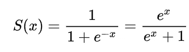

来源:维基百科

这是 sigmoid 函数的图表。你一定在学习逻辑回归的时候遇到过这个函数。尽管 sigmoid 函数非常受欢迎，但由于以下原因，它并不常用

乙状结肠函数(来源:维基百科)

优点-

1.  Sigmoid 函数是连续且可微的。
2.  它将输出限制在 0 和 1 之间
3.  非常明确的二进制分类预测。

缺点是

1.  它会导致渐变消失的问题。
2.  它不是以零为中心。
3.  计算成本高

示例-

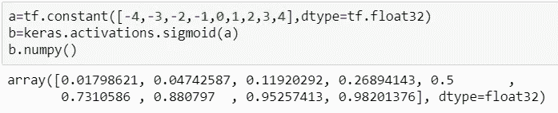

作者图片

# 2.Softmax 函数-

Softmax 函数是 sigmoid 函数对多类设置的推广。它通常用于多类分类的最后一层。它取一个“k”实数的向量，然后将其归一化为一个概率分布，该概率分布由对应于输入数的指数的“k”个概率组成。在应用 softmax 之前，一些向量分量可能是负的，或者大于 1，并且可能不等于 1，但是在应用 softmax 之后，每个分量将在 0-1 的范围内，并且将等于 1，因此它们可以被解释为概率。

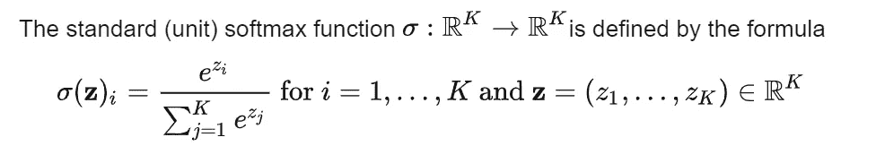

来源:维基百科

优点-

它可用于多类分类，因此可用于神经网络的输出层。

缺点是

这在计算上是昂贵的，因为我们必须计算大量的指数项。

示例-

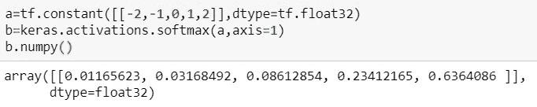

作者图片

# 3.双曲正切值

双曲正切或简称为“tanh”由以下各项表示

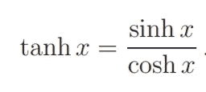

作者图片

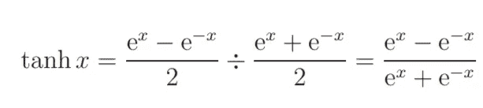

作者图片

它非常类似于 sigmoid 函数。它以零为中心，范围在-1 和+1 之间。

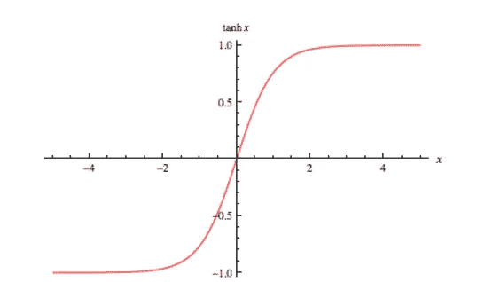

来源:维基百科

优点-

1.  它在任何地方都是连续且可微的。
2.  它以零为中心。
3.  它会将输出限制在-1 到+1 的范围内。

缺点是

1.  它会导致渐变消失的问题。
2.  计算开销很大。

示例-

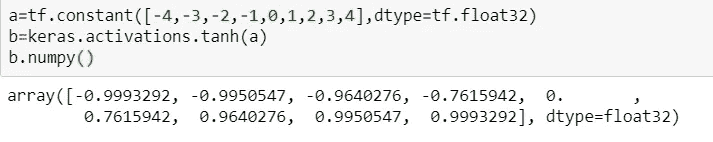

作者图片

# 4.Relu-

整流线性单元通常称为整流器或 relu

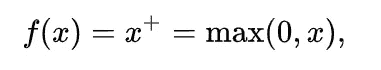

作者图片

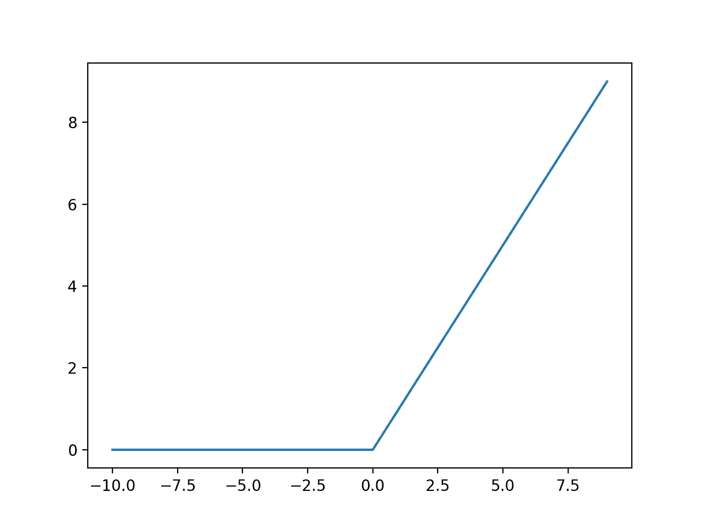

图像[来源](https://machinelearningmastery.com/rectified-linear-activation-function-for-deep-learning-neural-networks/)

优点-

1.  容易计算。
2.  不会导致渐变消失的问题
3.  由于不是所有的神经元都被激活，这造成了网络的稀疏性，因此它将是快速而有效的。

缺点是

1.  导致爆炸梯度问题。
2.  不在零中心。
3.  可以永远杀死一些神经元，因为它总是给负值 0。

示例-

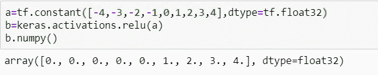

作者图片

为了克服 relu 激活中的爆炸梯度问题，我们可以设置它的饱和阈值，即函数将返回的最大值。

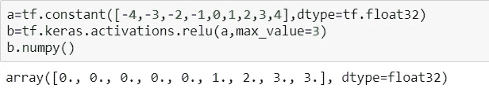

作者图片

图片[来源](https://pin.it/7KHrknq)

# 5.泄漏的 Relu-

漏 relu 是 relu 函数的改进。Relu 函数在每次迭代中会杀死一些神经元，这就是所谓的死亡 relu 条件。Leaky relu 可以克服这个问题，它不会给负值 0，而是使用相对较小的输入分量来计算输出，因此它永远不会杀死任何神经元。

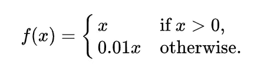

来源:维基百科

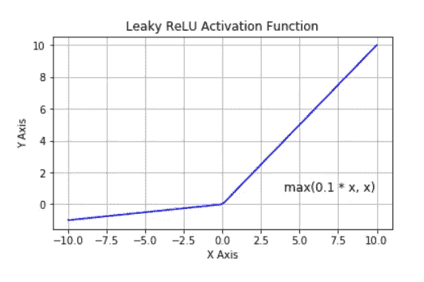

图片[来源](https://www.i2tutorials.com/explain-step-threshold-and-leaky-relu-activation-functions/)

优点-

1.  容易计算。
2.  不会导致渐变消失的问题
3.  不会导致将死的问题。

缺点是

1.  导致爆炸梯度问题。
2.  不在零中心

示例-

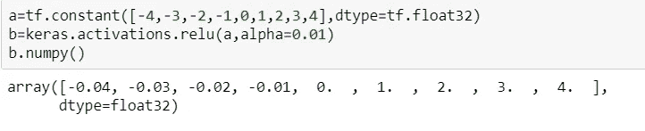

作者图片

# 6.参数化 Relu-

在参数化 relu 中，它不是为负轴固定一个速率，而是作为一个新的可训练参数传递，网络可以自行学习以实现更快的收敛。

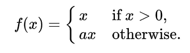

来源:维基百科

优点-

1.  网络将自己学习最合适的α值。
2.  不会导致渐变消失的问题

缺点是

1.  难以计算。
2.  性能取决于问题。

在 Tensorflow 中，参数化 relu 被实现为自定义层。示例-

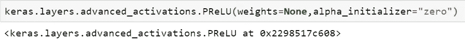

作者图片

# 7.嗖嗖-

swish 函数是通过 x 乘以 sigmoid 函数得到的。

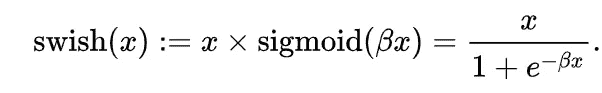

来源:维基百科

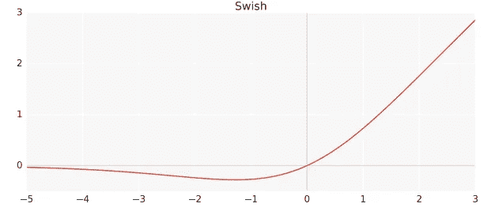

图像[来源](https://medium.com/@neuralnets/swish-activation-function-by-google-53e1ea86f820)

swish 功能是谷歌大脑团队提出的。他们的实验表明，在几个具有挑战性的数据集上，swish 往往比 Relu 的深度模型工作得更快。

优点-

1.  不会导致渐变消失的问题。
2.  被证明比 relu 略胜一筹。

缺点是

计算成本高

# 8.ELU-

指数线性单元(ELU)是 relu 的另一种变体，它试图使激活接近零，从而加快学习速度。它比 relu 具有更好的分类精度。elu 具有负值，使得激活的平均值更接近于零。

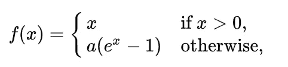

来源:维基百科

优点-

1.  不会导致将死的问题。

缺点是

1.  计算开销很大。
2.  没有避免爆炸梯度问题。
3.  阿尔法值需要决定。

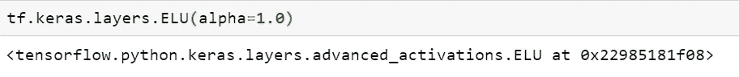

作者图片

# 9.Softplus 和 Softsign

Softplus 功能是-

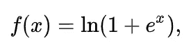

来源:维基百科

它的导数是一个 sigmoid 函数。

软设计功能是-

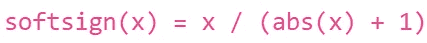

图像[来源](https://keras.io/api/layers/activations/)

Softplus 和 Softsign 用得不多，一般而言，relu 及其变体比它们更受欢迎。

优点-

1.  不会导致渐变消失的问题。

缺点是

1.  计算开销很大。
2.  比 Relu 慢。

示例-

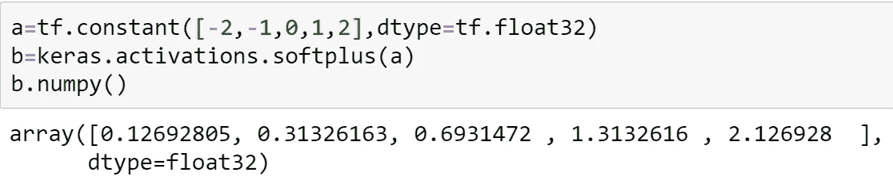

作者图片

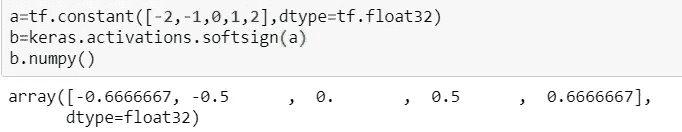

作者图片

# 10.卢瑟-

卢瑟代表比例指数线性单位。卢瑟被定义为-

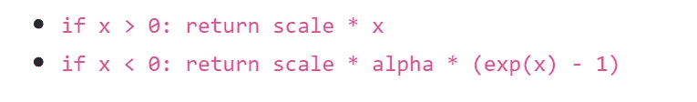

图片[来源](https://keras.io/api/layers/activations/)

其中 alpha 和 scale 是常量，其值分别为 1.673 和 1.050。选择 alpha 和 scale 的值，使得只要权重被正确初始化，输入的均值和方差在两个连续层之间保持不变。卢瑟被证明比 relu 更好，并具有以下优点。

优点-

1.  不会导致渐变消失的问题。
2.  不会导致死亡的问题
3.  比其他激活功能更快更好。

示例-

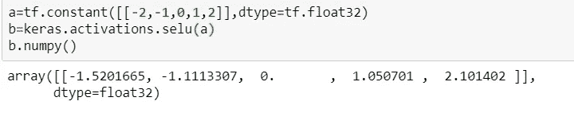

作者图片

# 11.线性激活-

正如我们之前讨论的，我们应该在神经网络中使用非线性激活函数。然而，在用于回归问题的神经网络的最后一层，我们可以使用线性激活函数。

示例-

作者图片

# 如何决定应该使用哪个激活函数

*   由于消失梯度问题，应避免使用 Sigmoid 和 tanh。
*   还应避免使用 Softplus 和 Softsign，因为 Relu 是更好的选择。
*   对于隐藏层，应该首选 Relu。如果它导致了将死的 relu 问题，那么应该使用它的修改版本，如 leaky relu、elu、SELU 等。
*   对于深度网络，swish 比 relu 表现更好。
*   对于回归的最终图层，线性函数是正确的选择，对于二元分类，sigmoid 是正确的选择，对于多类分类，softmax 是正确的选择。在自动编码器中应该使用相同的概念。

# 结论-

我们已经讨论了所有流行的激活函数及其优缺点。还有很多激活功能，但我们并不经常使用。我们也可以定义我们的激活函数。这里讨论的一些激活函数从未用于解决现实世界的问题。他们只是为了知识。大多数情况下，对于隐藏层，我们使用 relu 及其变体，对于最终层，我们根据问题的类型使用 softmax 或线性函数。

# 学分-

1.  [https://keras . io/API/layers/activations/# layer-activation-functions](https://keras.io/api/layers/activations/#layer-activation-functions)
2.  [https://www . analyticsvidhya . com/blog/2020/01/fundamentals-deep-learning-activation-functions-when-to-use-them/](https://www.analyticsvidhya.com/blog/2020/01/fundamentals-deep-learning-activation-functions-when-to-use-them/)
3.  [https://towards data science . com/everything-you-need-know-to-know-about-activation-functions-in-deep-learning-models-84ba 9 f 82 c 253](/everything-you-need-to-know-about-activation-functions-in-deep-learning-models-84ba9f82c253)
4.  [https://towards data science . com/comparison-of-activation-functions-for-deep-neural-networks-706 AC 4284 c8 a](/comparison-of-activation-functions-for-deep-neural-networks-706ac4284c8a)
5.  [https://missing link . ai/guides/neural-network-concepts/7-types-neural-network-activation-functions-right/](https://missinglink.ai/guides/neural-network-concepts/7-types-neural-network-activation-functions-right/)
6.  [https://en . Wikipedia . org/wiki/Rectifier _(neural _ networks)](https://en.wikipedia.org/wiki/Rectifier_(neural_networks))
7.  [https://mlfromscratch.com/activation-functions-explained/#/](https://mlfromscratch.com/activation-functions-explained/#/)
8.  [https://en . Wikipedia . org/wiki/Universal _ approximation _ theory](https://en.wikipedia.org/wiki/Universal_approximation_theorem)

作者图片

那都是我这边的。感谢阅读这篇文章。使用的少数图片的来源被提及，其余的是我的创作。请随意发表评论，建议改正和改进。通过 Linkedin 与我联系，或者你可以给我发邮件，地址是 sahdevkansal02@gmail.com。我期待听到您的反馈。查看更多这样的文章我的媒体简介。