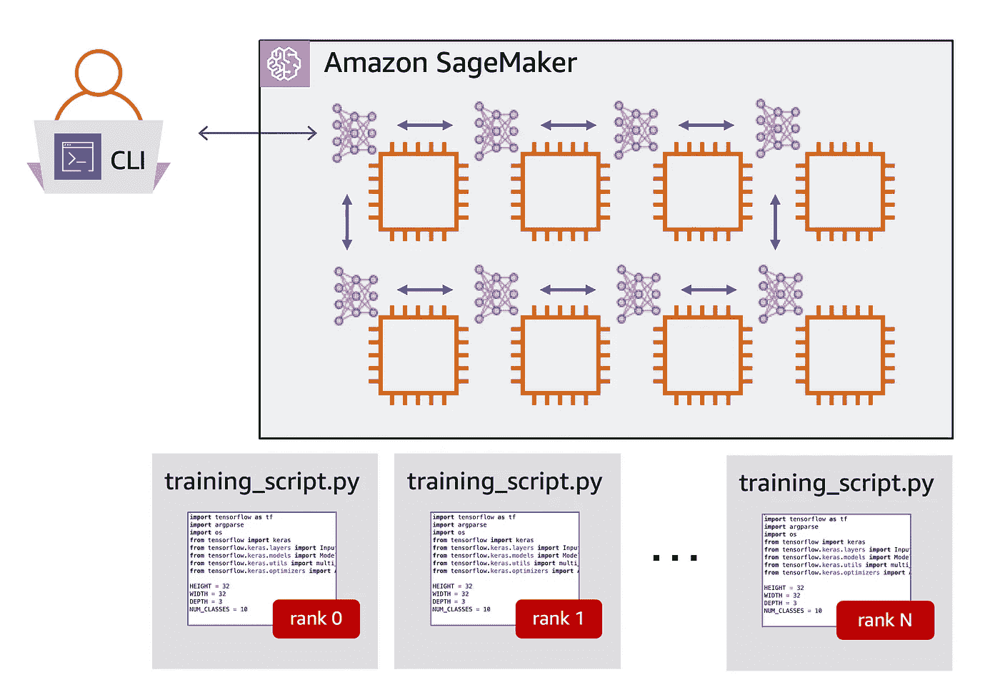

# 亚马逊 SageMaker 上 TensorFlow 和 Horovod 分布式培训快速指南

> 原文：<https://towardsdatascience.com/a-quick-guide-to-distributed-training-with-tensorflow-and-horovod-on-amazon-sagemaker-dae18371ef6e?source=collection_archive---------7----------------------->

## 了解分布式培训是如何工作的，以及 Amazon SageMaker 如何让它像在笔记本电脑上培训一样简单



使用`horovod`和 Amazon SageMaker 在多个 GPU 上分发培训，以实现更快的培训和更高的生产率

在深度学习中，越多越好。更多的数据、更多的层和更多的计算能力通常会导致更高的准确性和更好的模型鲁棒性。

我可能无法帮助你[收集更多数据](https://registry.opendata.aws/)，但我可以展示你如何在大量机器上进行分布式训练，以更快地训练和运行更多实验，并提高你的生产率。

在这篇博文中，我将介绍如何在不管理基础设施的情况下运行分布式培训——无需启动实例、设置集群、管理存储卷，也无需构建容器。带上你的训练脚本，指定 GPU 的数量，让 Amazon SageMaker 处理剩下的事情。

在本指南的第一部分，我将提供一步一步的指导来更新您的训练脚本，以使用 [Horovod](https://horovod.readthedocs.io/en/latest/#) 库。为了使分布式训练工作，不同 GPU 上的训练过程需要通信。Horovod 实现了这种无缝的通信，并提供了一个方便的 API 来为分发培训准备您的培训脚本。您所做的更改与 GPU 的数量无关，因此这是一次性的工作。

在本指南的第二部分，我将展示如何使用 Amazon SageMaker 在任意数量的 GPU 上运行更新后的训练脚本，或者只需修改一行代码。

想在阅读的时候跟着阅读并运行示例吗？Jupyter 笔记本和培训脚本可从以下网址获得:

> [https://github . com/shashankprasanna/distributed-tensor flow-horovod-sage maker](https://github.com/shashankprasanna/distributed-tensorflow-horovod-sagemaker)

# Horovod 和环全归约方法

Horovod 是一个分布式深度学习框架，支持流行的深度学习框架——tensor flow、Keras、PyTorch 和 Apache MXNet。本指南中的示例使用 TensorFlow 和 Keras。如果您是 PyTorch 或 MXNet 用户，更新您的脚本将遵循与这里描述的非常相似的过程。Horovod 文档页面也包含了大量其他框架的例子。

在分布式训练中，多个进程需要相互通信。为了实现训练过程之间的通信，Horovod 使用一种称为消息传递接口(MPI)的通信协议。为了平均梯度和更新模型的所有副本，它使用了一种称为 ring-all reducce 的方法(我们将回到这一点)。这些方法并不新鲜，在高性能计算(HPC)领域工作的科学家、研究人员和工程师已经使用了多年，以解决计算流体动力学、分子动力学、计算机图形学和其他领域的问题。

MPI 本身定义了在集群中的多个进程之间发送和接收信息的基本概念，例如`allreduce`、`allgather`和`broadcast`。正如你可能已经从它们的名字中推断出的那样——`allgather`从所有过程中收集数据(在深度学习的情况下，是梯度)。广播，将数据(梯度)从一个进程广播到所有其他进程。`allreduce`(从概念上讲)结合了这两种操作—从所有过程中收集数据，执行归约操作(例如，平均梯度)，然后广播(平均梯度)。


在 3 台各有 2 个 GPU 的机器上使用 6 个进程的 ring allreduce 的图示。rank 是全局唯一 ID，而 local rank 是每个 GPU 的本地唯一 ID

随着训练进程数量的增加，进程间通信也会增加，通信开销开始影响扩展效率。

`ring all-reduce`方法通过使通信成本独立于系统中的进程数量，对传统的`allreduce`方法进行了改进。它通过在逻辑环中安排进程来实现这一点，其中每个进程只接收来自其“左”邻居的数据，并向其“右”邻居发送数据，如附图所示。

深度学习的`ring-allreduce`过程在 [Horovod 博文](https://eng.uber.com/horovod/)和 [Horovod 论文](https://arxiv.org/pdf/1802.05799.pdf)中有更详细的描述。要使用 horovod 库，你并不真的需要知道`ring-allreduce`是如何工作的，但是对你使用的算法和库如何工作有一个直觉总是有帮助的。

要使用 update your training script 来使用 Horovod 库，您首先需要了解以下关键概念:

*   **大小:**进程/GPU 总数。这等于集群中计算实例的数量乘以每个实例的 GPU 数量。例如，如果您有 2 个`p3.16xlarge` EC2 实例。大小应该是 2(实例)x 8(GPU)= 16。
*   **等级:**唯一的进程 ID(大小— 1)。GPU 中的每个进程都知道自己的唯一级别。
*   **本地等级:**机器内唯一的进程 ID。例如，在每个有 8 个 GPU 的`p3.16xlarge` EC2 实例中，一个 GPU 的本地等级将从 0 到 7 不等。

# 分布式培训期间会发生什么？

出于说明的目的，让我们以 2 个 GPU 上的分布式训练作业为例——它们可以在相同的不同系统上，这无关紧要。以下是幕后发生的事情:


用两个培训过程说明分布式培训过程中发生的情况

**第一步:**正向传递期间，一切照常。模型的每个副本都使用它接收到的 batch_size 数据向前传递。

**步骤 2:** 然后执行反向传递以计算梯度。但是梯度还没有用于更新权重。

**步骤 3:** Horovod 现在对所有进程进行`allreduce`操作(平均梯度，然后广播)。在这个例子中是两个 GPU。

**步骤 4:** 最终的`allreduced`梯度现在用于更新每个模型

通过允许每个 GPU 对不同批次的数据进行训练，并降低梯度，您可以有效地对更大批次进行训练，从而加快训练速度。

# 更新您的培训脚本以使用 Horovod API

对于此演示，我将使用 CIFAR-10 数据集，该数据集由 60，000 张 32x32 的图像组成，这些图像属于 10 个不同的类(每个类 6，000 张图像)。博客帖子的 GitHub 存储库中提供了培训脚本以及 Jupyter 笔记本来运行完整的示例:

> [https://github . com/shashankprasanna/distributed-tensor flow-horo VOD-sage maker](https://github.com/shashankprasanna/distributed-tensorflow-horovod-sagemaker)

本节描述了为准备分布式培训而对以下文件所做的更改:

*   `[cifar10-tf-horovod-sagemaker.py](https://github.com/shashankprasanna/distributed-tensorflow-horovod-sagemaker/blob/master/code/cifar10-tf-horovod-sagemaker.py)`:主训练脚本
*   `[model_def.py](https://github.com/shashankprasanna/distributed-tensorflow-horovod-sagemaker/blob/master/code/model_def.py)`:模型架构定义脚本

为了让您更容易理解，我在上面的脚本中包含了完全相同的部分标题作为注释。寻找“变化`NUMBER`


在上面的脚本中寻找与注释完全相同的部分标题

## 变化 1:导入 horovod 和 keras 后端

将这些放在您的培训脚本的顶部，以导入 horovod。

```
import horovod.tensorflow.keras as hvd
import tensorflow.keras.backend as K
```

## 变化 2:初始化 horovod 并获得集群的大小

初始化`horovod`并获得集群中的 GPU 总数。如果只在 CPU 上运行，那么这将等于实例总数。

```
hvd.init()
size = hvd.size()
```

## 将 3 引脚 GPU 更改为本地进程(每个进程一个 GPU)

将 GPU 固定到当前进程。

```
config = tf.ConfigProto()
config.gpu_options.allow_growth = True
config.gpu_options.visible_device_list = str(hvd.local_rank())
K.set_session(tf.Session(config=config))
```

## 变化 4:使用集群的规模(工人总数)来扩展学习

通过根据 GPU 数量调整学习率来更新学习率。分布式训练时的有效批次为 batch_size 乘以`hvd.size()`。这个变化是在`model_def.py`

通过提高学习速率，您可以补偿批量大小的有效增加。

```
opt = SGD(lr=lr * size, decay=weight_decay, momentum=momentum)
```

## 变化 5:使用 Horovod 包装 Keras 优化器，使其成为分布式优化器

分布式优化器使用`allreduce`或`allgather`对梯度进行平均和广播，然后用平均梯度更新权重。这个变化是在`model_def.py`

```
opt = hvd.DistributedOptimizer(opt)
```

## 更改 6:添加了用于同步初始状态的回调，并且只在第一个工作线程(等级 0)上保存检查点

## 变化 7:更新步骤/时期的数量

您需要将每批图像的总数除以 GPU 的数量。

## 更改 8:更新脚本以接受超参数作为命令行参数

Amazon SageMaker 将在启动分布式培训作业时将这些值传递给脚本。

## 在 Amazon SageMaker 上运行分布式培训

现在，您已经完成了最困难的部分——修改您的训练脚本，使其可以分发。

剩下的过程——分布式培训——使用 Amazon SageMaker 相对简单。

要使用 Amazon SageMaker 运行分布式培训作业，请下载并安装 [SageMaker Python SDK](https://github.com/aws/sagemaker-python-sdk) 。为了更方便的体验，你还可以启动一个[亚马逊 SageMaker 笔记本实例](https://docs.aws.amazon.com/sagemaker/latest/dg/nbi.html)，它预装了 Jupyter 笔记本服务器、SageMaker Python SDK 和流行的深度学习框架。

运行 SageMaker 培训工作只涉及两个关键步骤，我将在下面重点介绍:

1.  创建 SageMaker `TensorFlow`估算器
2.  调用`fit()`函数

以下代码节选自博客文章库中的 Jupyter 笔记本。

> [https://github . com/shashankprasanna/distributed-tensor flow-horo VOD-sage maker/blob/master/cifar 10-sage maker-distributed . ipynb](https://github.com/shashankprasanna/distributed-tensorflow-horovod-sagemaker/blob/master/cifar10-sagemaker-distributed.ipynb)

使用 SDK，您需要指定以下细节，以便 Amazon SageMaker 可以获得所请求的资源并为培训做准备

*   你的训练脚本
*   具有培训脚本依赖关系的目录
*   保存已训练模型的位置
*   要在其上进行培训的 CPU 或 GPU 实例的类型
*   每个实例的 GPU 数量
*   TensorFlow 版本
*   分布类型— MPI(由 Horovod 使用)或参数服务器(分布式培训的替代方法)

您可以在 SageMaker TensorFlow 估算器中指定更多选项，您可以在文档中找到完整列表:[https://sagemaker.readthedocs.io/en/stable/index.html](https://sagemaker.readthedocs.io/en/stable/index.html)

实现如下:

定义估算器后，您需要指定亚马逊 S3 中训练、验证和测试数据集的路径，并将其传递给估算器的拟合函数。

你完了！坐下来，等待分布式培训作业完成。

您可以(并且应该)监控进度，我将在下一节中介绍这一点，但是首先，让我们仔细看看幕后发生了什么。


亚马逊 SageMaker 工作流程图

Amazon SageMaker 自动为您做了几件事，因此您不必担心基础架构级别的细节。简言之，SageMaker 将:

1.  选择您的培训脚本和依赖项
2.  在完全受管的群集中调配指定数量的实例
3.  提取指定的 TensorFlow 容器图像
4.  在每个实例上实例化容器。
5.  将训练代码下载到实例中，并使其在容器中可用
6.  从亚马逊 S3 复制训练数据集并使其在容器中可用
7.  使用 MPI 启动培训

当培训开始时，Amazon SageMaker 在每个实例上运行与 Horovod 更新的培训脚本完全相同的副本。每个副本使用 hvd.local_rank()知道其唯一的本地等级，并且 GPU 被固定到该特定进程。然后 Horovod 负责执行`ring-allreduce`，并用平均梯度更新每个 GPU 上的权重。


显示每个运行完全相同的训练脚本副本的 GPU 的图示。每个培训过程都由其等级唯一标识

一次培训完成后，SageMaker 将自动:

*   上传训练工件，如训练模型、检查点、张量板日志等。到亚马逊 S3 桶你指定
*   拆除培训集群，这样您就不会产生额外的成本

# 监控培训培训进度

有几个不同的监视作业的选项:

*   亚马逊 SageMaker 控制台
*   张量板

## 亚马逊 SageMaker 控制台

如果你进入 AWS 控制台> Amazon SageMaker >培训作业，你可以看到一个当前正在运行的作业和你过去运行过的作业的列表。单击一个作业，您可以看到诸如进度状态、实例类型、超参数、数据集和模型工件的 S3 位置等详细信息。


显示 Amazon SageMaker 控制台上培训工作的屏幕截图

进一步向下滚动，您可以看到 CPU、GPU 和其他资源利用率。


显示 Amazon SageMaker 控制台上的作业监控的屏幕截图

您还可以找到一个到[Amazon cloud watch](https://aws.amazon.com/cloudwatch/)dashboard 的链接，在这里您可以监控所有实例的培训工作日志。当出现问题时，这对于调试和诊断非常方便。


显示亚马逊 CloudWatch 上培训工作日志的屏幕截图

## 张量板

在[培训脚本](https://github.com/shashankprasanna/distributed-tensorflow-horovod-sagemaker/blob/master/generate_cifar10_tfrecords.py)中，您会注意到有两个 Keras 日志回调函数。第一个用于在本地容器中保存 tensorboard 日志文件，第二个用于将这些日志同步到调用 SageMaker estimator 函数时指定的亚马逊 S3 位置。

```
callbacks.append(TensorBoard(log_dir=logdir))
callbacks.append(Sync2S3(logdir=logdir, s3logdir=tensorboard_logs))
```

现在你可以在任何你喜欢的地方运行 TensorBoard(你的笔记本电脑，台式机，EC2 实例),并通过 TensorBoard 日志将它指向你在亚马逊 S3 的位置。您需要确保您拥有访问亚马逊 S3 的权限，并且可以使用 AWS CLI 进行设置。

在安装了 tensorboard 并具有 S3 读取权限的计算机上运行以下命令:

```
S3_REGION=us-west-2 tensorboard — logdir s3://{bucket_name}/tensorboard_logs/
```


多型号分布式训练进度实时监控。日志保存在亚马逊 S3，这使你可以运行 tensorboard，并监控任何机器上访问你的 S3 桶的进展。

# 节省时间有什么不好呢？

在处理大型模型和数据集时，分布式培训可以节省您的时间。有了 Horovod 这样的图书馆和 Amazon SageMaker 这样的服务，你可以不费吹灰之力扩大培训规模。在这篇博文中，我介绍了两个关键概念:

1.  如何使用 Horovod 更新您现有的培训脚本，使其可以分发。
2.  如何使用您的 horovod 更新培训脚本，并使用 Amazon SageMaker 运行分布式培训，同时必须设置和管理集群

我将为您提供一些为分布式培训选择合适实例的指导原则:

为了获得更好的性能，请始终支持使用多个 GPU 的单个实例，而不是使用单个 GPU 的多个实例。

在 AWS 上，您可以使用 1 个 GPU ( `p3.2xlarge`)、4 个 GPU(`p3.8xlarge`)和 8 个 GPU(`p3.16xlarge`和`p3dn.24xlarge`)访问实例。

假设你想用 4 个 GPU 来运行分布式训练，总是倾向于单个`p3.8xlarge`实例，而不是 4 个`p3.2x large`。这样做的好处是，当进程需要通信来执行所有的 reduce 操作时，它们不会跨越网络障碍来与其他实例的 CPU 和 GPU 通信。这将增加通信延迟，可能会影响培训效果。同样，如果你想将训练分配给 8 个 GPU，那么选择单个`p3.16xlarge`或带有 8 个 GPU 的`p3dn.24xlarge`对 8 个`p3.2xlarge`或 2 个`p3.8xlarge`。这些多 GPU 实例包括 NVIDIA 的 NVLink 技术，该技术支持高带宽的 GPU 间通信，以加速 Horovod 执行的 allreduce 操作。

感谢阅读，我希望你喜欢这个指南。GitHub 上的所有代码和示例都可以在这里找到:

> [https://github . com/shashankprasanna/distributed-tensor flow-horovod-sage maker](https://github.com/shashankprasanna/distributed-tensorflow-horovod-sagemaker)

如果您对本指南有任何疑问，对如何改进它有任何建议，或者对新指南有任何想法，请通过 twitter (@shshnkp)、LinkedIn 联系我，或者在下面留下评论。尽情享受吧！