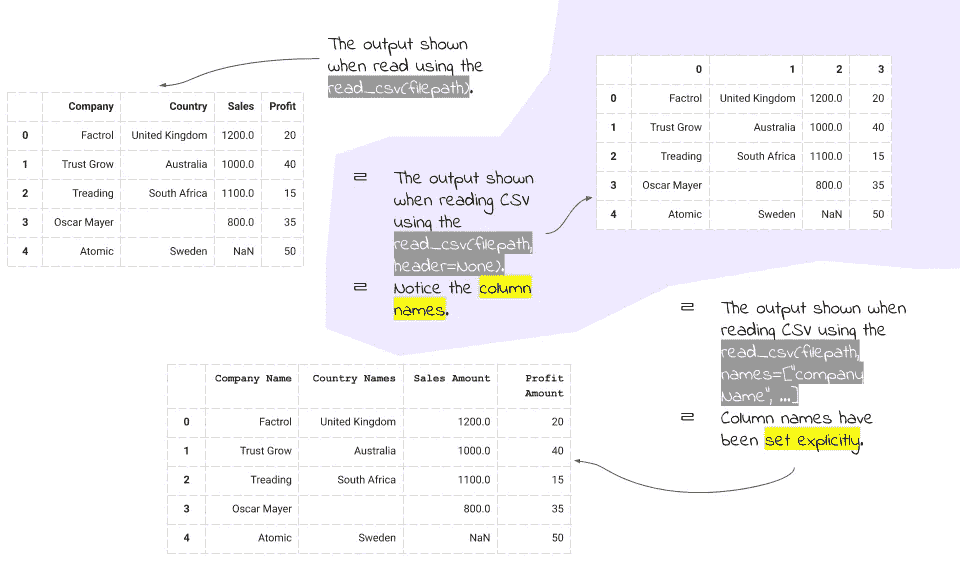
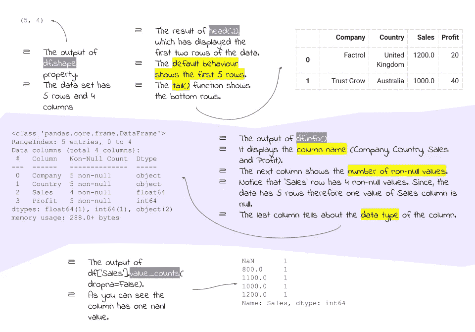
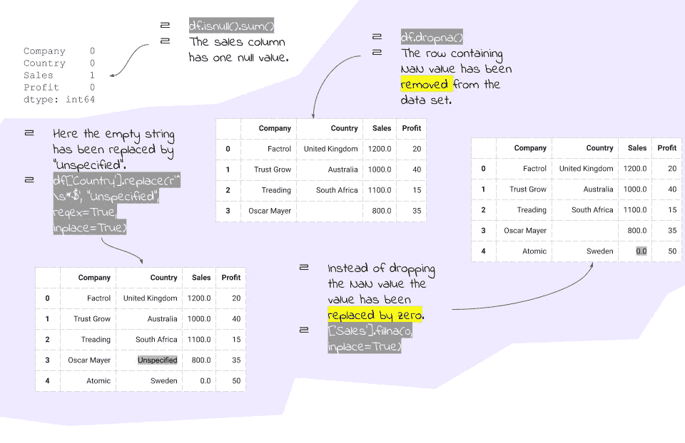
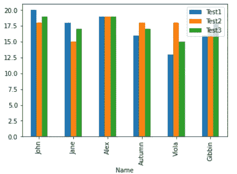

# 使用 Pandas 的基本探索性数据分析指南。

> 原文：<https://towardsdatascience.com/a-quick-guide-to-exploratory-data-analysis-using-pandas-959b7ea1483e?source=collection_archive---------46----------------------->

## 更好地理解您的数据。


艾萨克·史密斯在 [Unsplash](https://unsplash.com/s/photos/analysis?utm_source=unsplash&utm_medium=referral&utm_content=creditCopyText) 上拍摄的照片

使用库(比如 Matplotlib)绘制图形或查询数据相对容易。然而，为了能够绘制图表，数据必须采用特定的格式。这篇文章背后的动机之一是理解如何为进一步的处理准备数据。本文还讨论了执行基本操作，如查询、排序和可视化 Pandas 数据帧。

# 读取数据。

虽然数据可以以多种格式提供，但为了便于讨论，我们假设数据是逗号分隔值(CSV)格式。

```
import pandas as pd
df = pd.read_csv("path/to/file.csv")
```

上面的语法非常标准，大多数时候已经足够了。 *read_csv()* 的默认行为假设 csv 文件中的第一行是列标题，并将其用作创建的数据框的标题。但是，下面的变化要求使用第一行作为数据的一部分。

```
df = pd.read_csv("path/to/file.csv", header=None)
```

在这种情况下，您可以将列标题明确指定为—

```
df = pd.read_csv("path/to/file.csv", names=["Column 1", "Column 2"])
```

如果未指定 *names* 参数，则从 0 开始对列进行索引。



read_csv()函数概述。(使用谷歌幻灯片创建)。

# 熟悉数据。

一旦你读了你的数据，下一步就是让你自己适应数据集。让我们从查看数据集中的记录数量开始。

```
#Assume that the data is stored in a variable df
rowsInData = df.shape[0]
colsInData = df.shape[1]#A concise way
rowsInData, colsInData = df.shape
```

一旦你知道了数据的大小，让我们看看数据是什么样子的。您可以使用 *head()* 函数来查看数据集的起始行。 *tail()* 函数用于查看数据集的底部行。

```
df.head()# The default behaviour of head() is to show the first five rows of the data. You can pass an integer value to view more or less rows. The following variation shows the first 10 row.df.head(10)
```

看到这些数据后，让我们试着更好地理解这些数据。如果您知道存储在列中的数据的数据类型，这将非常有帮助。它帮助您将适当的功能应用到列。例如，如果列是 float 或 integer 数据类型，那么您可以对它们应用像 *mean()* 和 *max()* 这样的函数。 *info()* 函数返回数据帧的摘要以及每一列的数据类型。

```
df.info()
```

让我们看看存储在列中的不同类型的数据。

```
df[col].value_counts(dropna=False)
```

上面的命令将帮助你看到你存储在' col '中的每一项的频率。在某些情况下，您可能会看到不想要的值，例如数字的 NaN 值或字符串的空值。让我们在下一节讨论如何清理数据集。



熟悉数据集的总结。(使用谷歌幻灯片创建)。

## 清理数据集。

清理数据集最简单的方法是删除包含不需要的值的行。另一个令人信服的方法是估算缺失数据。让我们看看如何处理非数字(NaN)值。

```
#To get the count of null values in each column use the following syntax
df.isnull().sum()#Dropna removes rows containing NaN values.
df.dropna()
```

除了删除行之外，您还可以选择用 0 来替换 NaN 值，或者用相应列的平均值来替换它。

```
#Fill missing values with zeros
df[col].fillna(0, inplace=True)#Fill missing values with column mean
mean = df[col].mean()
df[col].fillna(mean,inplace=True)# inplace = True parameter modifies the original dataframe. In case inplace = False a new data frame is returned after the necessary operations are applied.
```

显然，您不能计算字符串值的平均值，但是可以使用 comparison 和 regex 来查找不需要的格式的字符串，并用您选择的值替换它们，或者删除相应的行。

```
#There can be multiple ways to drop rows but let's see two ways #The following command replaces strings having a single space character with NaN and then uses dropna() function to remove the rows as discussed earlier.df[col].replace(' ', np.nan, inplace=True)
df.dropna()#If you are familiar with regex it can be extremely useful. The following command uses regular expressions to grab a string which is composed of whitespaces (\s in regex refers to whitespace characters) and replaces them with NaN.df[col].replace(r'^\s*$', np.nan, regex=True, inplace=True)
df.dropna()
```

如果您不想删除，而是想要替换丢失的字符串值，您可以按如下方式操作—

```
#Replace using strict comparison
df[col].replace(' ', "Some Value", inplace=True)#Replace using regular expression
df[col].replace(r'^\s*$', "Some Value", regex=True, inplace=True)
```



数据集清理总结。(使用谷歌幻灯片创建)。

## 更改列的数据类型。

假设您希望 CSV 中的某个特定字段只有整数值，但是该列意外地有一个字符串值。在这种情况下，不能将列作为整数处理。让我们看看如何处理这种情况。

如前所述，您可以选择查找字符串值并用任何合适的值替换它。

一旦替换了字符串值，就可以按如下方式转换列的数据类型

```
df[col] = pd.to_numeric(df[col])
```

# 使用数据集。

一旦处理完数据，下一步就是从数据中提取有价值的信息。为了便于讨论，让我们考虑一个由几个学生的分数组成的非常小的数据集。下面是 CSV 数据的表格表示。

讨论中使用的数据集的表格表示。

## 查询数据。

基本的查询是列出分数高于某个值的学生。以下查询显示了 Test1 得分大于 15 的所有记录。除了大于号运算符，还可以使用其他关系运算符，如> =、

```
df.query('Test1 > 15')
```

Rows in which marks stored in Test1 are more than 15.

The following query shows how to perform comparison on string values. There also exists the not equal (!=) operator. The following query retrieves marks for John.

```
df.query('Name == "John"')
```

Retrieving marks for John.

Apart from basic comparison for string you can also apply functions such as *startswith()* 、 *endswith()* 和 *contains()* 来过滤数据。以下示例查询姓名以 j 开头的学生的分数。

```
df.query('Name.str.startswith("J")', engine='python')
```

检索姓名以 j 开头的学生的分数。

虽然 pandas 提供了基于字符串值列的过滤方法，但是没有比使用 regex 更强大的了。下面的示例使用 regex 检索以开头的名称。

```
df.query('Name.str.contains("^A", regex=True)', engine='python')
```

使用正则表达式获取姓名以 a 开头的学生的分数。

您也可以使用*和*和*或*组合多个条件。以下查询检索学生在前两次测试中得分超过 16 分的记录。

```
df.query('Test1 > 16 and Test2 > 16)')
```

学生在测试 1 和测试 2 中的分数超过 16 分的记录。

您并不总是希望将值与常数进行比较。以下语法用于比较两列的相应值，并返回满足条件的行。该查询显示了与第一次测试相比，在第二次测试中成绩有所提高的学生列表。

```
df.query('Test1 < Test2')
```

与测试 1 相比，学生在测试 2 中的表现有所提高的记录。

## 列选择。

您可能不希望看到包含所有列的结果。让我们来看看如何有条件地检索仅用于 Test2 的标记。

```
#The following statement shows just the Name and Test2 columns only if test2 marks are more than 15\. It doesn't show full rows as earlier.df[['Name', 'Test2']].query('Test2 > 15')
```

仅显示名称和 Test2 列，因此 Test2 > 15。

## 整理数据。

下一个最常见的操作是对数据进行排序。让我们看一个例子，按照 Test3 中获得的分数降序排列学生。

```
#Let's select only Name and Test3 columns first.
temp = df[['Name', 'Test3']]#Now's let's sort by Test3 in ascending order.
temp.sort_values(by=['Test3'])#Sorting by Test3 in descending order.
temp.sort_values(by=['Test3'], ascending=False)
```

按降序排列的 Test3。

## 绘制数据图表。

您可以使用 Matpoltlib 等库来绘制和可视化数据，这将有助于快速找到数据中的趋势和模式。但是为了统一起见，让我们使用 Pandas dataframe 类提供的 *plot()* 函数。

“姓名”和“测试 1”中得分的条形图。

```
df.plot.bar(x='Name', y='Test1')
```


测试 1 的分数。

下图比较了每个学生在所有三次考试中的分数。

```
df.plot.bar(x='Name', y=['Test1', 'Test2', 'Test3'])
```



每个学生在三次测验中的分数。

您当然可以根据自己的需求绘制更多信息图表，但是为了使讨论简单，我们就在这里结束吧。