# 管理机器学习实验的快速指南

> 原文：<https://towardsdatascience.com/a-quick-guide-to-managing-machine-learning-experiments-af84da6b060b?source=collection_archive---------10----------------------->

## 如何使用亚马逊 SageMaker 组织您的机器学习实验、试用、作业和元数据，并获得安心

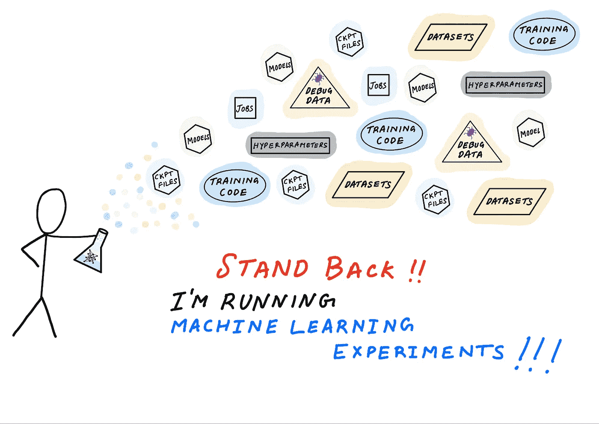

作者插图。受 xkcd.com 的启发

“实验”这个词对不同的人有不同的含义。对于科学家来说(也希望对于严谨的数据科学家来说)，实验是一个确定结果是否与某些假设一致或冲突的经验程序。在机器学习实验中，你的假设可能是某个特定的算法(比如梯度提升树)比备选方案(比如随机森林、SVM、线性模型)更好。通过进行一项实验并通过改变变量值进行多次试验，您可以收集数据并解释结果以接受或拒绝您的假设。科学家称这个过程为科学方法。

不管你是否遵循科学方法，进行和管理机器学习实验都是困难的。这很有挑战性，因为要跟踪和管理大量的变量和工件。以下是你可能想要跟踪的一些事情的非详尽列表:

*   **参数**:超参数，模型架构，训练算法
*   **作业**:预处理作业、培训作业、后处理作业——这些作业消耗其他基础设施资源，如计算、网络和存储
*   **工件**:训练脚本、依赖项、数据集、检查点、训练模型
*   **度量**:训练和评估准确度，损失
*   **调试数据**:权重、偏差、梯度、损耗、优化器状态
*   **元数据**:实验、试验和作业名称、作业参数(CPU、GPU 和实例类型)、工件位置(例如 S3 桶)

作为一名开发人员或数据科学家，您最不想做的事情就是花更多的时间管理电子表格或数据库来跟踪实验和相关的实体以及它们之间的关系。

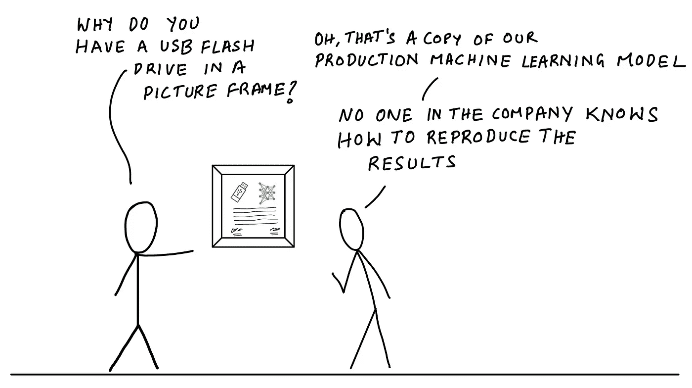

作者插图

您是否经常努力找出一周前训练的模型使用了哪些数据集、训练脚本和模型超参数？一个月前？一年前？你可以查看你的笔记、审计跟踪、日志和 Git 提交，并尝试拼凑出导致该模型的条件，但你永远无法确定你是否在一开始就组织好了一切。我有不止一个开发人员告诉我“我们不知道如何复制我们的生产模型，从事这项工作的人已经不在了——但是它很有效，我们不想弄乱它”。

在这篇博文中，我将讨论如何定义和组织你的实验，这样你就不会陷入这样的境地。通过一个代码示例，我将展示如何使用 Amazon SageMaker Experiments 运行实验、跟踪实验数据并检索数据进行分析。你需要的关于特定实验或培训工作的数据总是可以在你需要的时候快速获得，而不需要你记账。

> GitHub 上提供了 Jupyter 笔记本中的完整示例:[https://GitHub . com/shashankprasanna/sage maker-experiments-examples . git](https://github.com/shashankprasanna/sagemaker-experiments-examples.git)

# 剖析一个机器学习实验

跟踪机器学习实验的关键挑战是有太多的实体要跟踪，它们之间的关系很复杂。实体包括参数、工件、作业，实验、试验和实体之间的关系可以是一对一、一对多、多对一。如果能自动追踪一切不是很好吗？这样你就可以少担心，变得更有效率，因为你知道你的实验总是自我记录的。这正是我们要采取的方法。

让我们从介绍几个关键概念开始。在整篇文章中，我将继续讨论这些问题，所以这不会是你最后一次听到它们。通过提前展示这些关键概念，我希望在您浏览示例时，它能让您更好地理解实验、试验、试验组件、工作、工件、指标和元数据之间的关系。

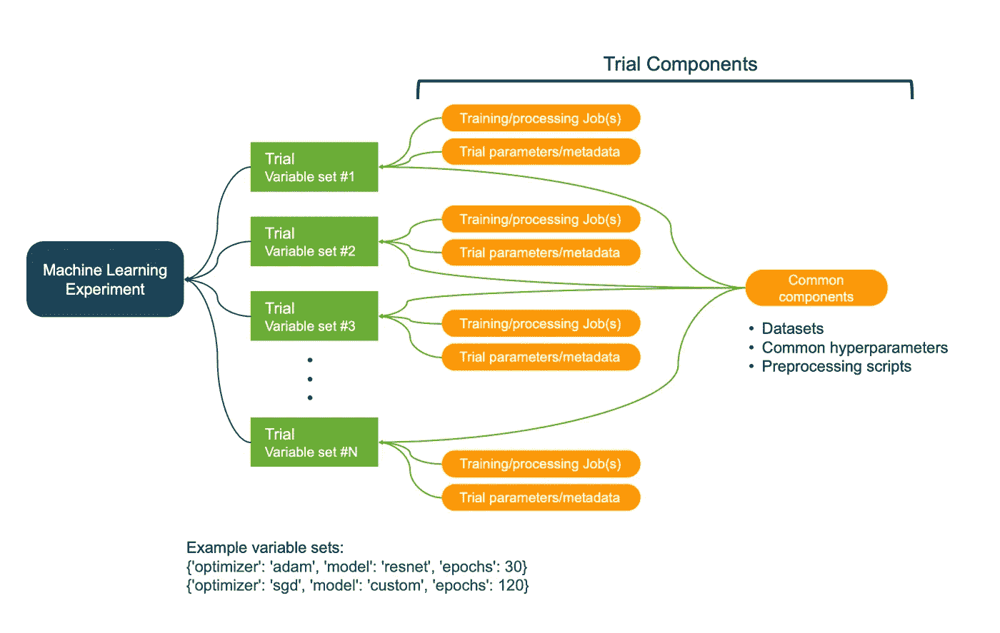

实验、试验和试验组件之间的关系。作者插图。

*   **机器学习实验**:测试假设的系统程序(如模型 A 优于模型 B，超参数 X 对响应 Y 有积极影响)
*   **变量**:您改变和测量响应的可控因素(例如，模型架构、超参数)
*   **试验**:对特定变量集的训练迭代。变量集可以从变量交互的详尽集合(例如，模型架构、优化器、其他超参数)中取样。
*   **试验组件**:各种参数、作业、数据集、模型、元数据和其他工件。试用组件可以与试用相关联(例如培训工作)，也可以是独立的(例如元数据)

实验、试验和试验组件的属性:

*   一个实验的独特之处在于它的目标或假设
*   一个实验通常包含多个试验，每个变量集一个试验。
*   试验的唯一特征是其变量集，从您定义的变量空间取样。
*   试验组件是与特定试验相关联的任何工件、参数或作业。
*   试验组件通常是试验的一部分，但它可以独立于实验或试验而存在。
*   试用组件不能与实验直接关联。它必须与实验相关的试验相联系。
*   一个试验组件可以与多个试验相关联。这有助于跟踪实验中所有试验共有的数据集、参数和元数据。

这些概念会随着你对例子的理解而变得更加清晰，所以如果你没有记住它们也不用担心。我们将从创建实验开始构建每一步。

# 使用亚马逊 SageMaker 管理机器学习实验、试验、作业和元数据

内化到目前为止所讨论的概念的最好方法是通过代码示例和插图。在这个例子中，我将定义一个问题陈述，制定一个假设，创建一个实验，创建跟踪各种工件和参数的跟踪器，运行试验，最后分析结果。我将使用亚马逊 SageMaker 实验来完成这项工作。我在 GitHub 上的以下 Jupyter 笔记本中为您提供了完整的工作示例:[sage maker-experiments-examples . ipynb](https://github.com/shashankprasanna/sagemaker-experiments-examples/blob/master/sagemaker-experiment-examples.ipynb)。

运行这款笔记本最快最简单的方法就是在[亚马逊 SageMaker Studio](https://www.google.com/url?q=https://docs.aws.amazon.com/sagemaker/latest/dg/gs-studio-end-to-end.html&sa=D&ust=1594678841396000&usg=AOvVaw2cy88G_jVDZwtiTK2xuuG0) 上运行。SageMaker Studio 笔记本让您只需单击一下即可启动 Jupyter 笔记本环境，它包括一个实验跟踪窗格和可视化功能，使跟踪您的实验变得更加容易。你也可以在装有[亚马逊 SageMaker python SDK](https://sagemaker.readthedocs.io/en/stable/) 和[亚马逊 SageMaker Experiments](https://www.google.com/url?q=https://github.com/aws/sagemaker-experiments&sa=D&ust=1594678841396000&usg=AOvVaw1kDJEMDIndVR2geKlw01Cl) 包的笔记本电脑或台式机上运行这个。

## 第一步:制定一个假设并创建一个实验

第一步是定义你的假设。如果你更喜欢商业演讲而不是学术演讲，你可以指定一个实验目标。“尝试一堆东西，选择最好的”可能很诱人，但是在定义你的问题之前做一点努力会让你以后安心。

让我们定义一个假设的例子。你的假设考虑了你的领域专长和你所做的任何初步研究或观察。例如:

> **假设**:如果我使用我的自定义图像分类模型，它将在 CIFAR10 数据集上提供比 ResNet50 模型更好的准确性

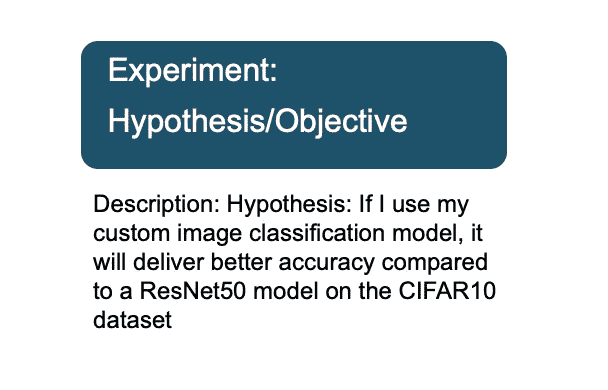

一个实验是由其假设唯一定义的。通过陈述假设，你现在有了一个清晰的路径来设计一个实验，选择正确的变量并收集足够的数据来接受或拒绝这个假设。使用 SageMaker 实验 SDK，您可以如下定义一个实验。在描述中，我包括了我的实验假设。

以下代码创建了一个 SageMaker 实验:

## 步骤 2:定义实验变量

一个实验包括一系列变量，这些变量在多次试验中会发生变化。这些变量可能是超参数，如批量大小、学习速率、优化器、模型架构或您认为会对响应产生影响的其他因素，即我们示例中的准确性或损失。在实验设计领域，这些也被称为受控因素。

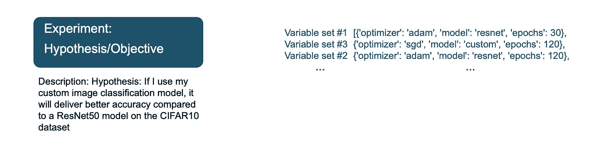

在我们的例子中，我想测试我们定制的神经网络架构的功效，我认为它比现成的 ResNet50 更好。因此，模型架构是我们的第一个可变或受控因素。我还想研究其他超参数对响应的影响——优化器(adam、sgd、rmsprop)、时期(在更少的时期获得高精度)。我可以用下面的代码来定义这些。

输出:

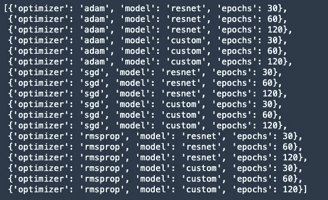

不属于实验一部分的其他超参数可以是静态的(在整个实验中不变)，所以我称它们为静态超参数。

**注意**:这并不意味着静态超参数对响应没有影响。这意味着在这个实验中，它不是一个你能控制的变量。还有一些你无法控制的因素，比如，软件的 bug，操作系统低效的资源分配，天气或者你运行实验时的心情。这些在实验设计领域被称为不可控因素。

## 步骤 3:跟踪实验数据集、静态参数、元数据

在我为步骤 2 中的每个超参数选项启动几个实验测试和训练工作之前，我必须确保我还跟踪了测试中常见的工件和参数。

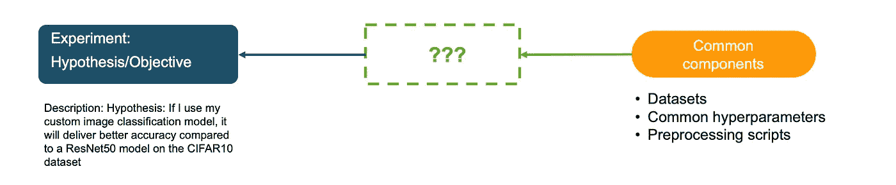

在本例中，以下各项在试验中保持不变:

*   静态超参数(批量、学习率、重量衰减、动量)
*   变量列表(模型架构和变量超参数)
*   培训、验证和测试数据集
*   生成 TFRecord 文件的数据集预处理脚本

你可以追踪任何你想和这个实验相关的东西。以下代码使用上述信息创建了一个名为“实验-元数据”的跟踪器:

该跟踪器是一个试用组件，目前与实验无关。回想一下，在“机器学习实验的剖析”中，试验组件不能与实验直接关联。它必须首先与试验相关联。在下一节中，我将把这个公共试验组件与实验中的所有试验关联起来。

## 步骤 4:创建试用并启动培训工作

在第 2 步中，我通过改变优化器、模型和时期创建了一个包含 18 个变量集的列表。在这一步中，我将遍历这些集合，并为每个集合创建一个试验和一个培训作业。这里是方法。对于每个变量集，我将:

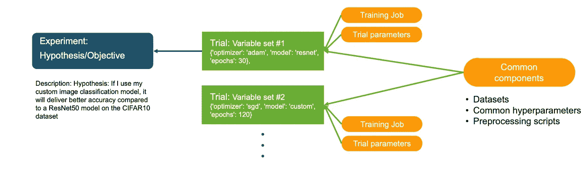

1.  创建一个试验，并将其与实验相关联
2.  将步骤 3 中的追踪器与该试验相关联，作为试验组件
3.  创建新的跟踪器来跟踪试验特定的超参数，并将其作为试验组件与试验相关联
4.  使用试验特定的超参数创建培训作业，并将其作为培训作业试验组件与试验相关联

以下代码摘录显示了如何实现上述步骤 a-d。

所展示的节选内容仅供举例说明，完整示例，在 Github 上运行本笔记本:[https://Github . com/shashankprasanna/sage maker-experiments-examples/blob/master/sage maker-experience-examples . ipynb](https://github.com/shashankprasanna/sagemaker-experiments-examples/blob/master/sagemaker-experiment-examples.ipynb)

运行上述代码后，您将看到 SageMaker 产生了多个培训作业，每个作业都与其独特的试验相关联。

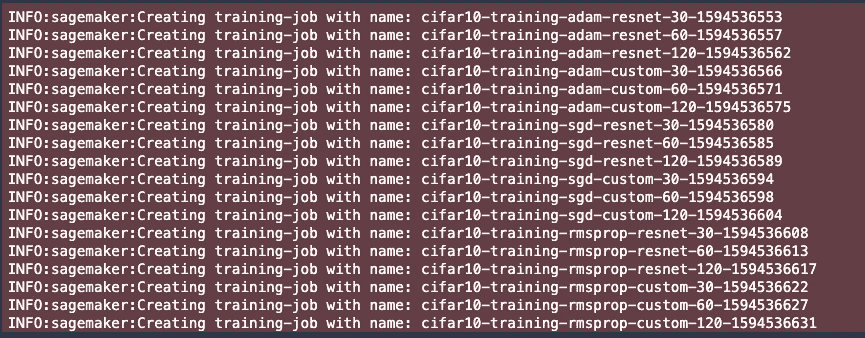

在亚马逊 SageMaker Studio 中，还可以在左侧的实验窗格中查看实验试用。

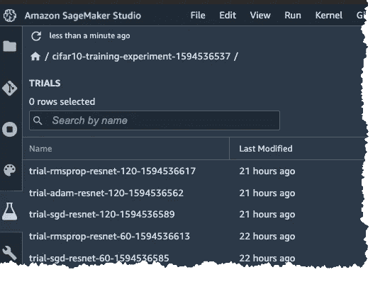

如果双击其中一个试验，您可以看到相关的试验组件:

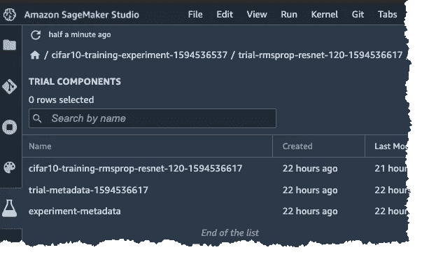

*   **cifar 10-training-rms prop-resnet-120-XXXXX**:培训工作的试用组件
*   **试验-元数据-XXXXX** :试验特定超参数的试验组件
*   **实验-元数据**:所有试验共有的实体的试验组件(静态超参数、变量列表、训练、验证和测试数据集、数据集预处理脚本)

# 第五步:分析实验结果

在训练作业完成运行之后，我现在可以比较所有的试运行，并对实验进行推断。只需在前期做一点点努力，仔细定义和组织您的实验，并利用 SageMaker Experiments 等服务，您就不必花太多时间通过组合多个数字和模拟源来获取分析报告。你可以休假或从事不同的项目，而你的老板认为你正在努力梳理 Git 提交、审计跟踪和将数据输入电子表格。

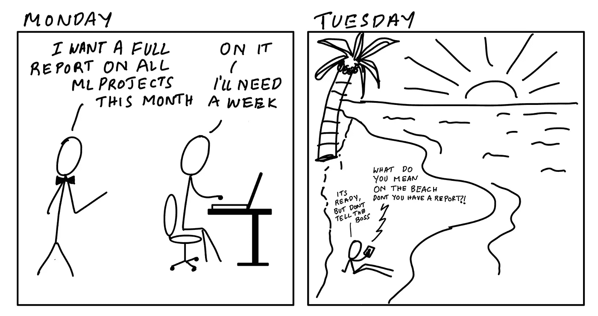

作者插图。

在这一部分，我将提取一份关于我刚刚运行的实验的报告。我需要的只是实验的名称，使用 SageMaker 实验包，我可以使用下面的代码进行分析:

在下面的输出中，您可以看到,( 1)总体最佳精度,( 2)60 个历元时的最佳精度,( 3)30 个历元时的最佳精度都与我的定制模型相对应。

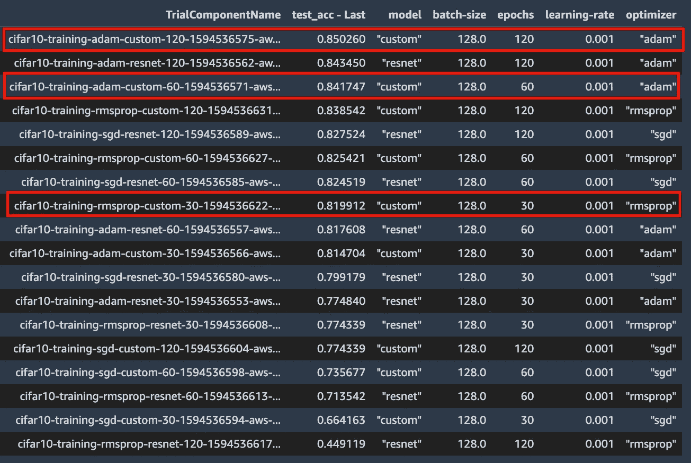

我可以使用这些数据来接受或拒绝我的假设，即对于 CIFAR10 数据集，我的自定义模型比 ResNet50 提供了更好的准确性。我构建这个例子是为了说明实验管理的关键概念，上面的数据可能不足以得出任何结论。在这种情况下，你可以通过更新你的假设和变量来进行另一个实验。

# (奖励)步骤 6:使用 SageMaker 调试器可视化性能曲线

如果您喜欢深入研究每项培训工作并分析指标、权重或梯度信息，您可以使用 SageMaker 调试器。SageMaker Debugger 自动从每个培训作业中捕获一些默认的调试信息，您还可以定制应该发出哪些数据供以后分析。如果你对用 SageMaker 调试机器学习感兴趣，可以看看我之前的一篇深入调试的文章:

> 博文:[如何调试机器学习模型以尽早发现问题](https://www.google.com/url?q=https://towardsdatascience.com/how-to-debug-machine-learning-models-to-catch-issues-early-and-often-5663f2b4383b?source%3Dfriends_link%26sk%3Db771dd7ba7c03b541707a2fffe33c08e&sa=D&ust=1594678841411000&usg=AOvVaw251bgTKU2lqd9gxkjQYmLT)

smdebug 开源库允许您读取和分析调试数据。下面的代码将下载训练期间每个步骤的所有试验的验证准确性，并绘制 30、60 和 90 个时期的 3 个最佳模型。您还可以在训练期间绘制中间张量和梯度，以便进一步调试。查看上面的博文了解更多细节。

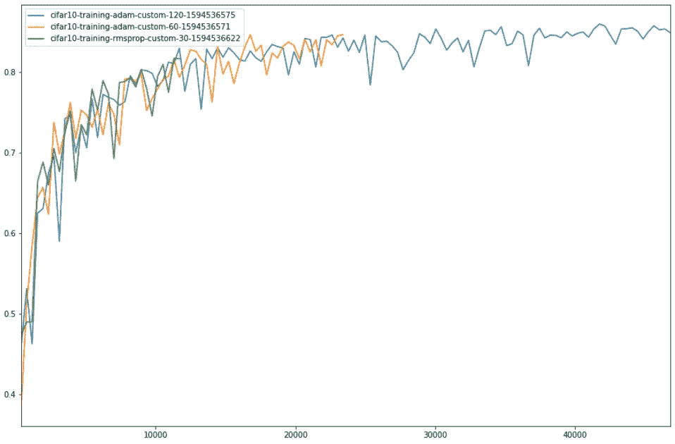

最高性能模型在 30、60 和 120 个时期的验证准确度与步骤

# 感谢阅读

自机器学习的早期以来，我们已经走过了漫长的道路。从高质量的开源机器学习框架到大规模培训和部署模型的全面管理服务，以及端到端的实验管理，无论您的机器学习需求是什么，都不缺乏工具。在这篇博文中，我介绍了如何使用 Amazon SageMaker 减轻与管理机器学习实验相关的痛苦。我希望你喜欢阅读。GitHub 上的所有代码和示例都可以在这里找到:

> [https://github . com/shashankprasanna/sage maker-experiments-examples](https://github.com/shashankprasanna/sagemaker-experiments-examples)

如果你觉得这篇文章有趣，请看看我在机器学习和 SageMaker 上的其他博客帖子:

*   [如何调试机器学习模型以尽早发现问题](https://www.google.com/url?q=https://towardsdatascience.com/how-to-debug-machine-learning-models-to-catch-issues-early-and-often-5663f2b4383b?source%3Dfriends_link%26sk%3Db771dd7ba7c03b541707a2fffe33c08e&sa=D&ust=1594678841414000&usg=AOvVaw3xf7J8BkGEz5spu4Mn3G83)
*   [亚马逊 SageMaker 上 TensorFlow 和 Horovod 分布式培训快速指南](https://www.google.com/url?q=https://towardsdatascience.com/a-quick-guide-to-distributed-training-with-tensorflow-and-horovod-on-amazon-sagemaker-dae18371ef6e?source%3Dfriends_link%26sk%3D0a1f6a2e7716d4272c79156cf7c5f294&sa=D&ust=1594678841415000&usg=AOvVaw0dsjAt7_kTh8PlSRDeS-p3)
*   [亚马逊 SageMaker 使用 Spot 实例节省培训成本快速指南](https://www.google.com/url?q=https://towardsdatascience.com/a-quick-guide-to-using-spot-instances-with-amazon-sagemaker-b9cfb3a44a68?source%3Dfriends_link%26sk%3D937b581bef3605c84c07cfd32c5842d1&sa=D&ust=1594678841415000&usg=AOvVaw076pW4-hjMtZ1Y3j4J65w1)
*   [Kubernetes 和亚马逊 SageMaker 的机器学习——两全其美](https://www.google.com/url?q=https://towardsdatascience.com/kubernetes-and-amazon-sagemaker-for-machine-learning-best-of-both-worlds-part-1-37580689a92f?source%3Dfriends_link%26sk%3Dd00ea50a38338520fa8c1eee7ee3f732&sa=D&ust=1594678841415000&usg=AOvVaw3PSjSfjod8kCcmcLB3O6ca)

如果你对这篇文章有疑问，对如何改进它有建议或者对新帖子有想法，请在 twitter ( [@shshnkp](https://www.google.com/url?q=https://twitter.com/shshnkp&sa=D&ust=1594678841416000&usg=AOvVaw1McAkagBVCPUGQRkUVr9rp) )， [LinkedIn](https://www.google.com/url?q=https://www.linkedin.com/in/shashankprasanna/&sa=D&ust=1594678841416000&usg=AOvVaw06DiNqFV7UPWfHUaIwIy0Z) 联系我或者在下面留下评论。尽情享受吧！