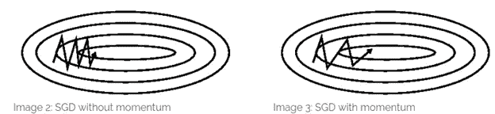
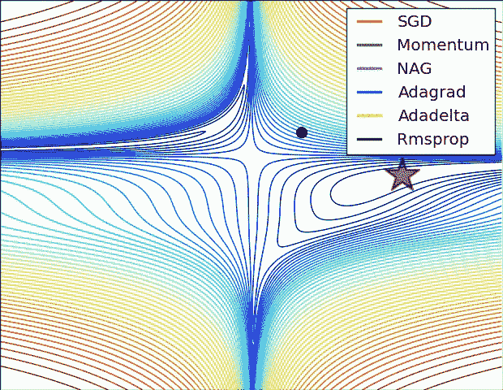

# 神经网络优化器(快速)指南及其在 Keras 中的应用

> 原文：<https://towardsdatascience.com/a-quick-guide-to-neural-network-optimizers-with-applications-in-keras-e4635dd1cca4?source=collection_archive---------23----------------------->

## SGD，Adagrad，Adam 等等

随着深度学习的快速发展，出现了过多的优化器，人们可以选择来编译他们的神经网络。有这么多优化器，很难选择一个来使用。本文将简要说明各种神经网络优化器之间的区别。

# **SGD**

与批量梯度下降或普通梯度下降相反，随机梯度下降更新每个训练示例 *x* 和 *y* 的参数。SGD 以高方差执行频繁更新，导致目标函数大幅波动。

新币波动。[来源](https://upload.wikimedia.org/wikipedia/commons/f/f3/Stogra.png)

SGD 的波动使它能够从一个局部极小值跳到一个可能更好的局部极小值，但是使收敛到一个精确的极小值变得复杂。

动量是 SGD 的一个参数，可以添加到峡谷中以帮助 SGD，峡谷是表面在一个维度比另一个维度弯曲得更陡的区域，常见于 optima 周围。在这些场景中，SGD 在峡谷的斜坡周围振荡，沿着局部最优的底部犹豫前进。

[来源](https://stats.stackexchange.com/questions/366728/why-doesnt-feature-standardization-make-sgd-with-momentum-redundant)

动量有助于在正确的方向上加速 SGD，因此抑制了多余的振荡，如图 2 所示。

内斯特罗夫动量是对标准动量的改进——一个盲目跟随斜坡的球是不令人满意的。理想情况下，球会知道它要去哪里，所以它可以在山坡再次向上倾斜之前减速。内斯特罗夫加速梯度(NAG)可以通过在 SGD 到达上坡区域之前减慢它的速度，帮助减少收敛中不必要的冗余，从而使动量具有预见性。

# 阿达格拉德

Adagrad 使学习率适应参数，对与频繁出现的特征相关联的参数执行较小的更新(低学习率),对与不频繁出现的特征相关联的参数执行较大的更新(高学习率)。因此，Adagrad 在处理稀疏数据方面是有帮助的。

Adagrad 消除了手动调整学习率的需要——大多数实现都保留默认值 0.01。然而，Adagrad 的算法导致学习率随着每次迭代而收缩，最终变得无穷小，在这个速度下，算法无法获得任何新知识。

Adadelta 是 Adagrad 的扩展，它寻求解决模型学习率收敛到 0 的问题。RMSprop 是 Adadelta 的另一个版本，它试图解决 Adadelta 试图解决的相同问题。

**亚当**

Adam 是为每个参数计算自适应学习率的另一种方法。除了像 Adadelta 和 RMSprop 一样存储以前的渐变，Adam 还实现了 momentum 的一个版本。Adam 的行为就像一个有摩擦的重球，更喜欢误差曲面中的平坦极小值，可以被视为 RMSprop 和 SGD 的组合，具有动量。

Nadam 是另一个优化器，它结合了 adam 和 NAG。

# 形象化

## 比尔函数

GIF:亚历克·拉德福德

请注意，Adagrad、Adadelta 和 RMSprop 几乎立即朝着正确的方向前进，并非常快地收敛，而具有动量的 SGD 和 NAG 则偏离了轨道，让人想起一个球滚下山坡的形象。然而，NAG 很快就能通过向前看来纠正它的路线。

## 鞍点

GIF:亚历克·拉德福德

注意 SGD(有动量和没有动量)和 NAG 发现很难突破到最小值，并且卡在中间。然而，新币与势头和唠叨最终逃脱鞍点。阿达格拉德、RMSprop 和阿达德尔塔迅速向负斜率下驶去。

# 我应该使用哪种优化器？

如果输入数据是稀疏的，最好的结果将来自自适应学习率方法。总体而言，Adam 可能是深度神经网络的最佳总体选择。

如果你喜欢阅读，看看我在神经网络方面的其他工作:

*   [神经网络层指南及其在 Keras 中的应用](/a-guide-to-neural-network-layers-with-applications-in-keras-40ccb7ebb57a?source=post_stats_page---------------------------)
*   [神经网络损失函数指南及其在 Keras 中的应用](https://medium.com/@andre_ye/a-quick-guide-to-neural-network-optimizers-with-applications-in-keras-e4635dd1cca4?source=your_stories_page---------------------------)