# DBMS 中关系代数运算符的快速指南

> 原文：<https://towardsdatascience.com/a-quick-guide-to-relational-algebra-operators-in-dbms-1ff2ddecaad7?source=collection_archive---------2----------------------->

## 带有示例的关系代数运算符快速介绍

数据库管理系统(DBMS)必须有一种查询语言，以便用户可以访问存储在数据库中的数据。**关系代数(RA)** 被认为是一种*过程查询语言*，用户在其中告诉系统执行一组操作以获得期望的结果。即用户告诉应该从数据库中检索什么数据以及如何检索。在本文中，我将简要介绍关系代数，并通过示例和 PostgreSQL 命令完成一些操作。

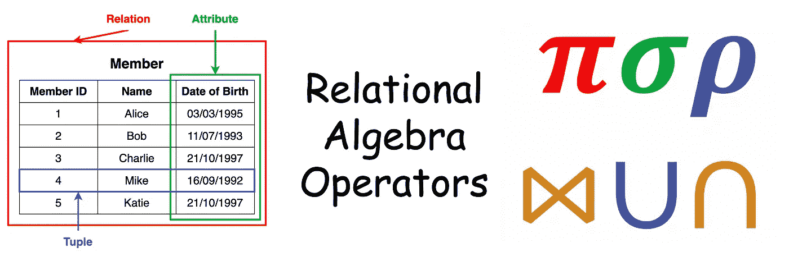

# 什么是关系代数？

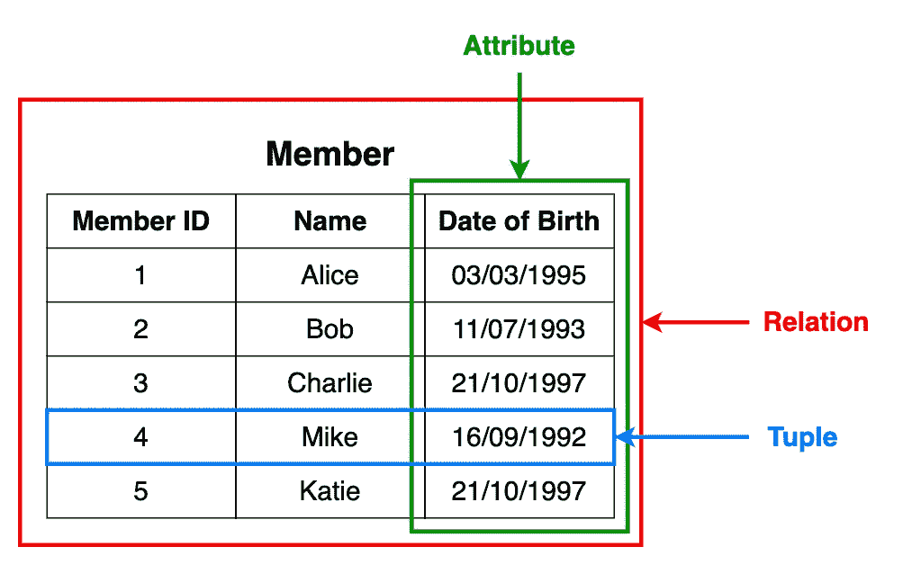

图一。关于关系数据库的基本术语

根据[维基百科](https://en.wikipedia.org/wiki/Relational_algebra)，

> 关系代数是一个代数家族，具有良好的语义，用于对存储在关系数据库中的数据进行建模，并在其上定义查询。

RA 为关系数据库提供了理论基础。我假设您知道关系数据库中使用的基本术语。现在注意术语**关系**、**属性**和**元组**，如图 1 所示。

在本文中，我们将介绍以下 RA 运算符。

1.  推断
2.  选择
3.  重新命名
4.  叉积
5.  自然连接
6.  条件连接
7.  联盟
8.  交集
9.  集合差异

我们将考虑以下 3 个表作为示例来解释这些 RA 操作。我们有一个**会员**表(会员详情)**图书**表(图书详情)**借阅**表(借阅图书详情)。

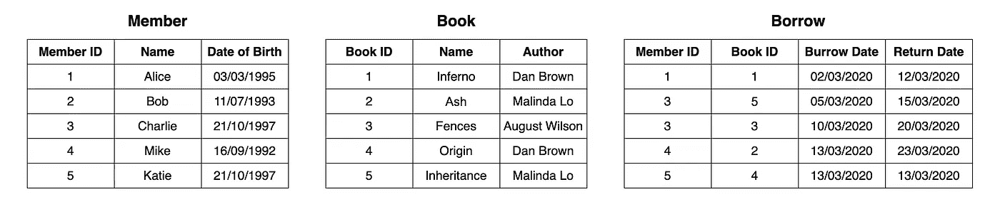

图二。三个示例关系

# 1.投影(π)

投影用于从关系中选择所需的数据列。请注意，投影会删除重复的数据(元组)。

> **查询:**借书会员的会员 id。

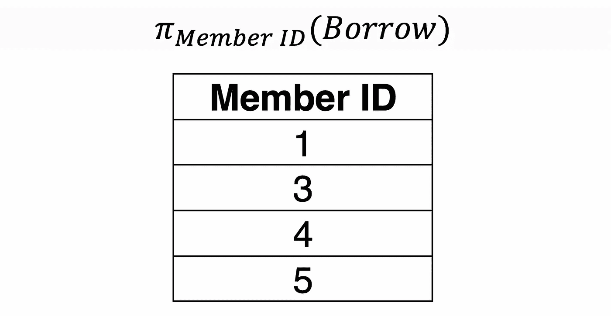

> **查询:**会员的会员 id 及其所借书籍的书籍 id。

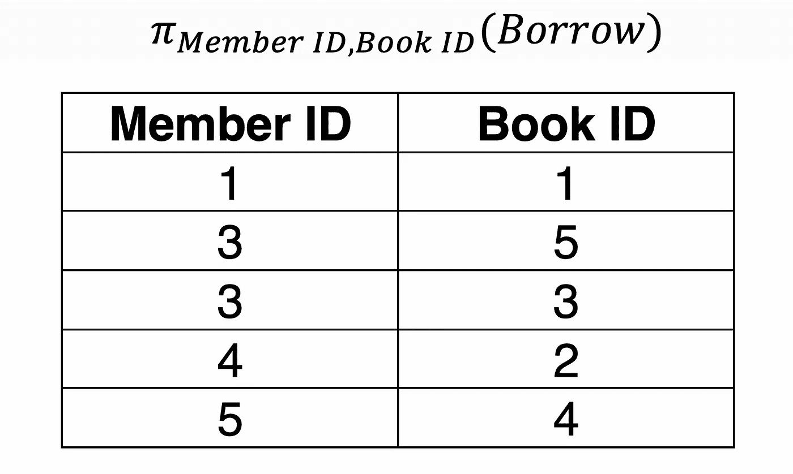

# 2.选择(σ)

选择用于从关系中选择所需的数据元组。在选择过程中，我们可以指定数据必须满足的某些条件。

> **查询:**1997 年 10 月 21 日出生的成员的详细信息。

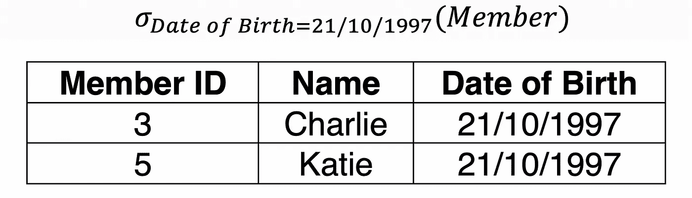

# 3.重命名(ρ)

重命名操作允许重命名某个输出关系。

> **查询:**将成员关系重命名为 LibraryMemebr。

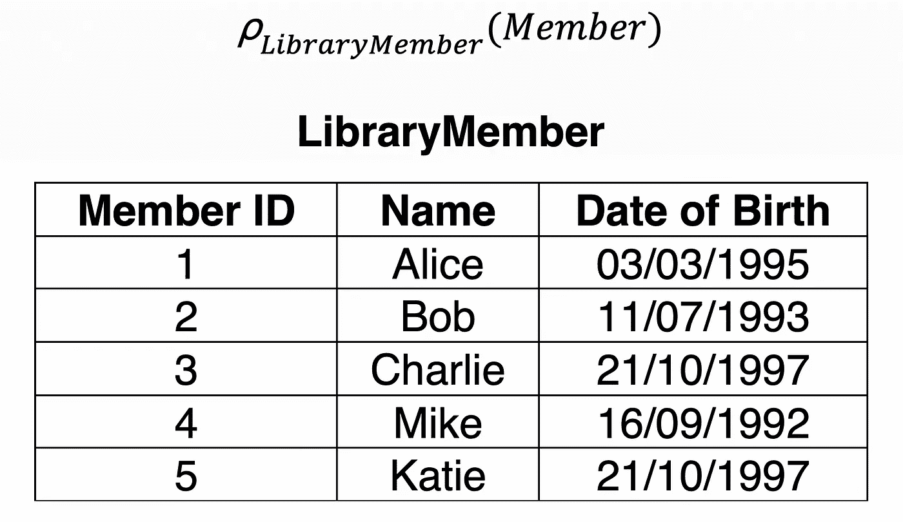

# 4.叉积(✕)

叉积用于将两个不同关系中的数据组合成一个组合关系。如果我们考虑两个关系: **A** 带 ***n*** 元组和 **B** 带 ***m*** 元组， **A ✕ B** 将由 ***n.m*** 元组组成。

> **查询:**会员✕借

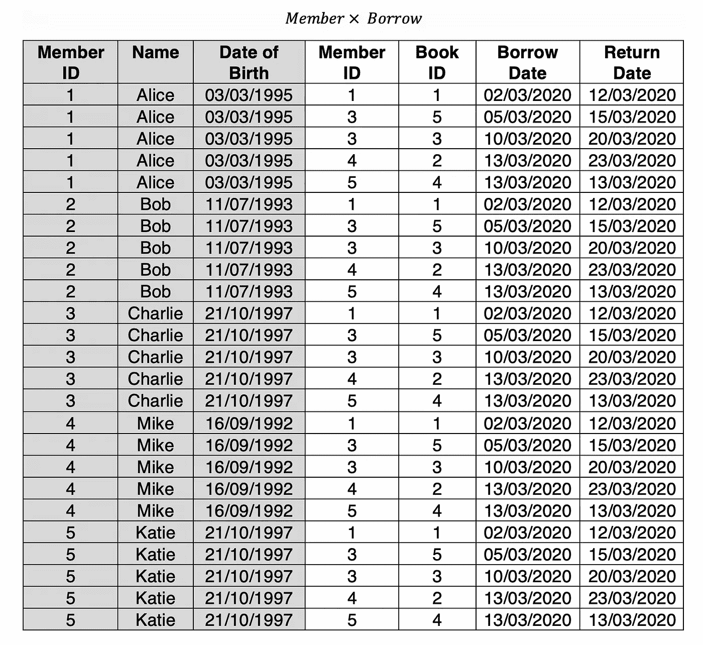

注意，成员关系有 5 个元组，钻取关系有 5 个元组。因此成员✕·博洛有 5✕5 = 25 个元组。

# 5.自然连接(⋈)

两个或多个关系之间的自然连接将产生元组的所有组合，其中它们对于公共属性具有相等的值。

> **查询:**会员⋈借

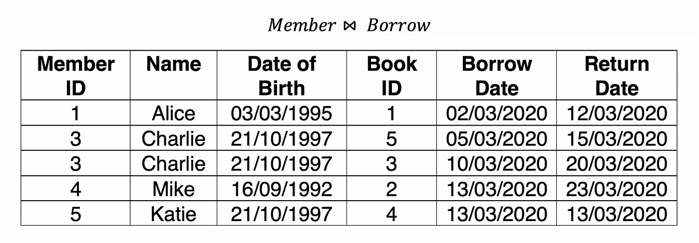

请注意，本例中的公共属性是成员 ID。

# 6.条件连接(⋈c)

条件连接类似于自然连接，但是在条件连接中，我们可以使用操作符大于、小于、等于或不等于来指定任何连接条件。您也可以使用 AND (^)和 OR (v)运算符来组合条件。

> **查询:**挖掘了多本书的会员的借阅明细。

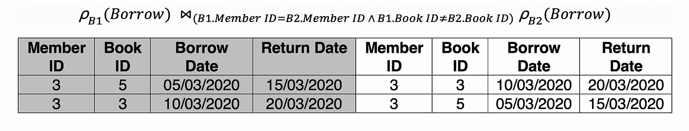

# 7.联盟(⋃)

RA 中的并运算非常类似于集合论中的并运算。但是，对于两个关系的联合，这两个关系必须具有相同的属性集。

> **查询:**Charlie 和 Mike 所借图书的图书 id。

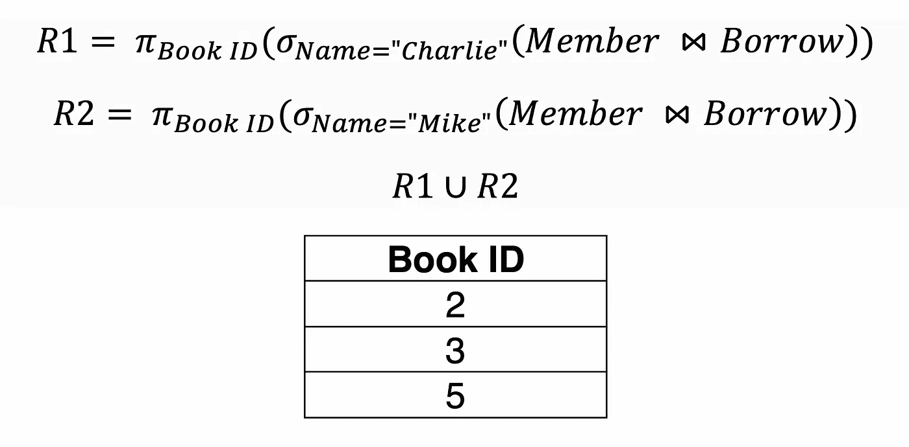

# 8.十字路口(⋂)

RA 中的交集运算与集合论中的非常相似。但是，对于两个关系的交集，这两个关系必须具有相同的属性集。

> **查询:**同时借阅了《Fences》和《Inheritance》两本书的会员的会员 id。

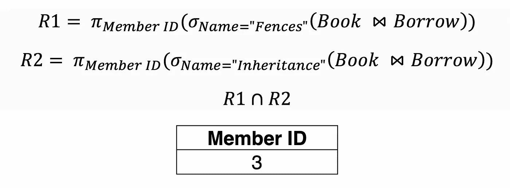

# 9.设置差异(-)

RA 中的集差运算非常类似于集合论中的集差运算。然而，对于两个关系之间的集合差异，两个关系必须具有相同的属性集合。

> **查询:**从未借过书的会员的会员 id。

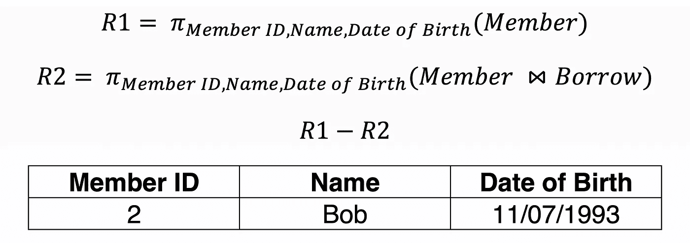

R1 将返回所有成员爱丽丝、鲍勃、查理、迈克和凯蒂的详细信息。R2 将归还爱丽丝、查理、迈克和凯蒂借书的详细资料。当我们取 R1 和 R2 之间的差值时，将返回 Bob 的详细信息。

# 最后的想法

创建这些关系的 PostgreSQL 命令和演示每个 RA 操作符的查询可以在下面给出的 SQL Fiddle 链接中找到。你运行它们，到处玩，看看会发生什么。😊

 [## 一个简单的在线测试和分享数据库问题及其解决方案的工具。

### 模式面板使用此面板来设置您的数据库问题(创建表、插入以及您需要的任何其他语句…

sqlfiddle.com](http://sqlfiddle.com/#!15/3ca77/24) 

此外，如果您想在您的机器上试验这些命令，您可以从下面链接中提供的 gists 下载它们。

关系代数操作符看起来很简单，但是在表示复杂查询和查询优化时，它们变得非常强大(将在以后的文章中讨论)。

希望这篇文章对你有用。我很想听听你的想法。😊

感谢您的阅读！

干杯！😃