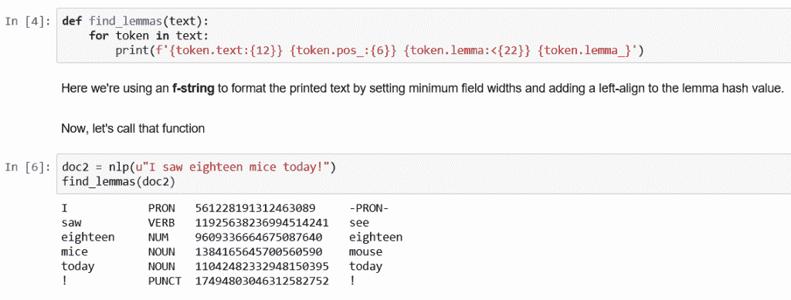

# 使用 spaCy | NLP |进行标记化和短语匹配的快速指南第 2 部分

> 原文：<https://towardsdatascience.com/a-quick-guide-to-tokenization-lemmatization-stop-words-and-phrase-matching-using-spacy-nlp-b29b407adbfc?source=collection_archive---------28----------------------->

## 使用 spaCy 的文本预处理步骤，NLP 库

**spaCy**是专门为**生产使用**而设计的。它帮助您构建处理和“理解”大量文本的应用程序。它可以用来构建**信息抽取**或**自然语言理解**系统或为**深度学习**预处理文本。在本文中，您将了解使用 spaCy 的标记化、词条化、停用词和短语匹配操作。

这是**空间系列**的第二篇文章。在我的上一篇文章中，我已经解释了空间安装和基本操作。如果您对此不熟悉，我建议从第 1 条开始，以便更好地理解。

> *第一条—* [*空间-安装-基础-操作-自然语言处理-文本处理-库/*](https://ashutoshtripathi.com/2020/04/02/spacy-installation-and-basic-operations-nlp-text-processing-library/)

# 标记化

标记化是文本处理任务的第一步。记号化不仅仅是将文本分解成单词、标点符号等称为记号的部分。然而，还不止这些。spaCy do 智能标记器，它在内部识别一个“.”是标点符号并将其分隔成标记，或者它是缩写(如“美国”)的一部分，但不要分隔它。

**spaCy** 应用特定于语言类型的规则。我们用一个例子来理解。

```
import spacy
nlp = spacy.load("en_core_web_sm")doc = nlp("\"Next Week, We're coming from U.S.!\"")
 for token in doc:
 print(token.text)
```


*   **空白**首先根据原始文本中的可用空白开始拆分。
*   然后，它从左到右处理文本，并对每个项目(基于空白的拆分器)执行以下两项检查:
*   **例外规则检查:**“美国”中可用的标点符号不应被视为进一步的标记。它应该保持不变。然而，我们的惶然应该被分裂成“我们”和“‘惶然’
*   **前缀、后缀和中缀检查:**标点符号，如逗号、句号、连字符或引号，将被视为标记并分离出来。

如果匹配，则应用规则，标记器继续循环，从新分割的子字符串开始。这样，spaCy 可以拆分复杂的嵌套标记，如缩写和多个标点符号的组合。


*   **前缀**:查找开头的字符`$ ( " ¿`
*   **后缀**:查找末尾的字符`mm ) , . ! "` mm 是一个单位的例子
*   **中缀**:查找中间的字符`- -- / ...`
*   **异常**:特殊情况规则，当应用标点规则时，将一个字符串拆分成几个记号或防止一个记号被拆分`St. N.Y.`

请注意，标记是原始文本的一部分。标记是 Doc 对象的基本构建块——帮助我们理解文本含义的一切都是从标记及其相互关系中派生出来的。

# 作为标记的前缀、后缀和中缀

*   空格将分隔不构成单词组成部分的标点符号。
*   句子末尾的引号、逗号和标点符号将被赋予各自的符号。
*   但是，作为电子邮件地址、网站或数值的一部分存在的标点符号将作为令牌的一部分保留。

```
doc2 = nlp(u"We're here to guide you! Send your query, email contact@enetwork.ai or visit us at http://www.enetwork.ai!")for t in doc2:
 print(t)
```


**注意**感叹号、逗号都被赋予了自己的记号。然而，电子邮件地址和网站 URL 中的冒号并不是孤立的。因此，电子邮件地址和网站都会保留。

```
doc3 = nlp(u'A 40km U.S. cab ride costs $100.60')
for t in doc3:
 print(t)
```


在这里，距离单位和美元符号被赋予它们自己的记号，然而，美元数量被保留，数量中的点不是孤立的。

# 令牌生成中的异常

作为已知缩写的一部分存在的标点符号将作为标记的一部分保留。

```
doc4 = nlp(u"Let's visit the St. Louis in the U.S. next year.")
for t in doc4:
 print(t)
```


在这里,“圣”和“美国”的缩写都保留了下来。St .旁边的均值点不作为令牌分开。美国也一样。

# 清点代币

使用 len()函数，可以计算文档中的标记数。

```
len(doc4)
```


# 统计 Vocab 条目

`Vocab`对象包含一个完整的项目库！


请注意，所有的 doc 对象都是从英语语言模型创建的，我们在开始时使用

> `*nlp = spacy.load("en_core_web_sm")*`

因此 vocab len 将是相同的。

# 令牌中的索引和切片

*   `Doc`对象可以被认为是`token`对象的列表。
*   因此，可以通过索引位置检索各个标记。
*   可以通过切片来检索令牌的跨度:


# 不允许分配令牌


# 词汇化

*   与词干化相反，词汇化看起来不仅仅是单词缩减，而是考虑一种语言的全部词汇来对单词进行形态分析。
*   was 的引理是 be，rats 的引理是 rat，mice 的引理是 mouse。此外,“meeting”的引理可能是“meet”或“meeting ”,这取决于它在句子中的用法。
*   词汇化查看周围的文本来确定给定单词的词性。它不对短语进行分类。

**注意**空间没有词干。因为变元化被认为比词干化更能提供信息。

```
doc1 = nlp(u"I am a runner running in a race because I love to run since I ran today")
for token in doc1:
 print(token.text, '\t', token.pos_, '\t', token.lemma, '\t', token.lemma_)
```


**创建一个函数，以更结构化的方式查找并打印词条**。

```
def find_lemmas(text): for token in text: print(f'{token.text:{12}} {token.pos_:{6}} {token.lemma:<{22}}{token.lemma_}')
```

在这里，我们使用一个 **f 字符串**通过设置最小字段宽度和添加 lemma 哈希值的左对齐来格式化打印文本。

现在，让我们调用这个函数

```
doc2 = nlp(u"I saw eighteen mice today!")
find_lemmas(doc2)
```



**注意**中`saw`的引理是`see`,`mice`的引理是`mouse` , `mice`是`mouse`的复数形式，see `eighteen`是一个数，*不是*是`eight`的扩展形式，这是在计算引理时检测到的，因此保持`eighteen`不变。

```
doc3 = nlp(u"I am meeting him tomorrow at the meeting.")
find_lemmas(doc3)
```


这里`meeting`的引理是由其词性标签决定的。

对于作为动词的第一个`meeting`，它已经将引理计算为`meet`。第二个`meeting`是一个名词，它将引理计算为`meeting`本身。

这就是我们可以看到 spaCy 在计算引理时处理词性的地方。

```
doc4 = nlp(u"That's an enormous automobile")
find_lemmas(doc4)
```


**注意**词汇化不会*而不是*将单词缩减到它们最基本的同义词——也就是说`enormous`不会变成`big`,`automobile`不会变成`car`。

# 停止言语

*   像“a”和“the”这样的词出现得如此频繁，以至于它们不像名词、动词和修饰语那样需要彻底标记。
*   我们称之为*停用词*，可以从待处理的文本中筛选出来。
*   spaCy 有一个内置列表，里面有大约 305 个英文停用词。


**您可以使用** `len()` **功能**打印停用词的总数。


# 添加用户定义的停用词

有时，您可能希望在默认集合中添加停用字词。也许你决定`'btw'`(“顺便说一下”的常用简写)应该被认为是一个停用词。

```
#Add the word to the set of stop words. Use lowercase!
nlp.Defaults.stop_words.add('btw') #alwasy use lowercase while adding the stop words#Set the stop_word tag on the lexeme
nlp.vocab['btw'].is_stop = True
```


# 删除停用词

或者，您可以决定`'without'`不应被视为停用词。

```
#Remove the word from the set of stop words
nlp.Defaults.stop_words.remove('without')#Remove the stop_word tag from the lexeme
nlp.vocab['without'].is_stop = Falselen(nlp.Defaults.stop_words)nlp.vocab['beyond'].is_stop
```


# 词汇和匹配

在这一部分中，我们将识别和标记与我们自己定义的模式相匹配的特定短语。

# 基于规则的匹配

*   spaCy 提供了一个名为`Matcher`的规则匹配工具。
*   它允许您构建一个令牌模式库。
*   然后，它将这些模式与 Doc 对象进行匹配，以返回找到的匹配项的列表。

您可以匹配令牌的任何部分，包括文本和注释，并且可以向同一个匹配器添加多个模式。

```
#Import the Matcher library
from spacy.matcher import Matcher
matcher = Matcher(nlp.vocab)
```


# 创建模式

在文学作品中,“united states”这个短语可能是一个或两个单词，带或不带连字符。在这一节中，我们将开发一个名为“unitedstates”的匹配器来查找所有三个:

```
pattern1 = [{'LOWER': 'unitedstates'}]
pattern2 = [{'LOWER': 'united'}, {'LOWER': 'states'}]
pattern3 = [{'LOWER': 'united'}, {'IS_PUNCT': True}, {'LOWER': 'states'}]matcher.add('UnitedStates', None, pattern1, pattern2, pattern3)
```

进一步打破它:

*   `pattern1`查找小写文本为“unitedstates”的单个令牌
*   `pattern2`按顺序查找两个相邻的单词“united”和“states”
*   `pattern3`查找三个相邻的记号，中间的记号可以是任何标点。*

*请记住，单个空格是没有标记的，所以它们不算标点符号。
一旦我们定义了我们的模式，我们将它们传递给名为‘United States’的`matcher`，并将*回调*设置为`None`

# 将匹配器应用于 Doc 对象

为了让你明白，我把美国写成了不同的形式，比如“美国”、“美国”、“美国”和“美国”

```
doc = nlp(u'The United States of America is a country consisting of 50 independent states. The first constitution of the UnitedStates was adopted in 1788\. The current United-States flag was designed by a high school student - Robert G. Heft.')found_matches = matcher(doc)
print(found_matches)for match_id, start, end in found_matches:
 string_id = nlp.vocab.strings[match_id] # get string representation
 span = doc[start:end] # get the matched span
 print(match_id, string_id, start, end, span.text)
```


# 设置模式选项和量词

您可以通过传递一个`'OP':'*'`参数来使令牌规则可选。这让我们可以简化我们的模式列表:

```
#Redefine the patterns:
pattern1 = [{'LOWER': 'unitedstates'}]
pattern2 = [{'LOWER': 'united'}, {'IS_PUNCT': True, 'OP':'*'}, {'LOWER': 'states'}]#Remove the old patterns to avoid duplication:
matcher.remove('UnitedStates')#Add the new set of patterns to the 'SolarPower' matcher:
matcher.add('someNameToMatcher', None, pattern1, pattern2)doc = nlp(u'United--States has the world's largest coal reserves.')found_matches = matcher(doc) print(found_matches)
```


这找到了两个单词的模式，有和没有连字符！

以下量词可以传递给`'OP'`键:


# 小心旅鼠！

假设我们在某个句子中有另一个词“太阳能”。现在，如果我们想同时匹配“太阳能”和“太阳能供电”，寻找“供电”的*引理*并期望它是“电力”可能很有诱惑力。情况并不总是这样！*形容词*‘powered’的引理还是‘powered’:

```
pattern1 = [{'LOWER': 'solarpower'}]
pattern2 = [{'LOWER': 'solar'}, {'IS_PUNCT': True, 'OP':'*'}, {'LEMMA': 'power'}] # CHANGE THIS PATTERN#Remove the old patterns to avoid duplication:
matcher.remove('someNameToMatcher') #remove the previously added matcher name#Add the new set of patterns to the 'SolarPower' matcher:
matcher.add('SolarPower', None, pattern1, pattern2)doc2 = nlp(u'Solar-powered energy runs solar-powered cars.')found_matches = matcher(doc2)
print(found_matches)
```


matcher 找到了第一个词，因为 lemmatizer 将“Solar-powered”视为动词，而不是第二个词，因为它认为它是形容词。
对于这种情况，最好设置显式令牌模式。

```
pattern1 = [{'LOWER': 'solarpower'}]
pattern2 = [{'LOWER': 'solar'}, {'IS_PUNCT': True, 'OP':'*'}, {'LOWER': 'power'}] pattern3 = [{'LOWER': 'solarpowered'}] pattern4 = [{'LOWER': 'solar'}, {'IS_PUNCT': True, 'OP':'*'}, {'LOWER': 'powered'}]#Remove the old patterns to avoid duplication:
matcher.remove('SolarPower')#Add the new set of patterns to the 'SolarPower' matcher:
matcher.add('SolarPower', None, pattern1, pattern2, pattern3, pattern4)found_matches = matcher(doc2)
print(found_matches)
```


# 其他令牌属性

除了引理之外，我们还可以使用各种令牌属性来确定匹配规则:

# 令牌通配符

您可以传递一个空字典`{}`作为通配符来表示**任何标记**。例如，您可能想在不知道`#`字符后面是什么的情况下检索标签:

# 短语匹配器

在上一节中，我们使用了令牌模式来执行基于规则的匹配。另一种更有效的方法是在术语列表上进行匹配。在这种情况下，我们使用 PhraseMatcher 从短语列表中创建一个 Doc 对象，并将其传递给`matcher`。

```
#Perform standard imports, reset nlp
import spacy
nlp = spacy.load('en_core_web_sm')# Import the PhraseMatcher library
from spacy.matcher import PhraseMatcher
matcher = PhraseMatcher(nlp.vocab)
```

在这个练习中，我们将导入一篇维基百科上关于*里根经济学*
的文章来源:[https://en.wikipedia.org/wiki/Reaganomics](https://en.wikipedia.org/wiki/Reaganomics)

```
with open('../TextFiles/reaganomics.txt') as f:
doc3 = nlp(f.read())#First, create a list of match phrases:
phrase_list = ['voodoo economics', 'supply-side economics', 'trickle-down economics', 'free-market economics']#Next, convert each phrase to a Doc object:
phrase_patterns = [nlp(text) for text in phrase_list]#Pass each Doc object into matcher (note the use of the asterisk!):
matcher.add('VoodooEconomics', None, *phrase_patterns)#Build a list of matches:
matches = matcher(doc3)#(match_id, start, end)
matches
```


前四个匹配项是里根经济学定义中使用这些术语的地方:

```
doc3[:70]
```


# 查看比赛

有几种方法可以获取匹配周围的文本。最简单的方法是从文档中获取一片比匹配更宽的令牌:


这都是关于文本预处理操作，包括标记化、词条化、停用词和短语匹配。希望你喜欢这篇文章。

相关文章:

*   [Spacy 安装和基本操作| NLP 文本处理库|第 1 部分](https://ashutoshtripathi.com/2020/04/02/spacy-installation-and-basic-operations-nlp-text-processing-library/)
*   [使用 spaCy | NLP |第 3 部分](https://ashutoshtripathi.com/2020/04/13/parts-of-speech-tagging-and-dependency-parsing-using-spacy-nlp/)进行词性标注和依存解析
*   [命名实体识别 NER 使用空间|自然语言处理|第 4 部分](https://ashutoshtripathi.com/2020/04/27/named-entity-recognition-ner-using-spacy-nlp-part-4/)
*   [如何使用 spaCy | NLP 系列|第 5 部分](https://ashutoshtripathi.com/2020/05/04/how-to-perform-sentence-segmentation-or-sentence-tokenization-using-spacy-nlp-series-part-5/)进行句子分割或句子分词
*   [从文本中提取数字特征| NLP 系列|第 6 部分](https://ashutoshtripathi.com/2020/09/02/numerical-feature-extraction-from-text-nlp-series-part-6/)
*   [使用空间的 Word2Vec 和语义相似度| NLP 空间系列|第 7 部分](https://ashutoshtripathi.com/2020/09/04/word2vec-and-semantic-similarity-using-spacy-nlp-spacy-series-part-7/)

如果您有任何改进内容的反馈或想法，请写在下面的评论部分。你的评论很有价值。

谢谢大家！

参考资料:

*   [https://spacy.io/usage/spacy-101](https://spacy.io/usage/spacy-101)
*   [https://www . udemy . com/course/NLP-natural-language-processing-with-python/](https://www.udemy.com/course/nlp-natural-language-processing-with-python/)

*原载于 2020 年 4 月 6 日*[*【http://ashutoshtripathi.com】*](https://ashutoshtripathi.com/2020/04/06/guide-to-tokenization-lemmatization-stop-words-and-phrase-matching-using-spacy/)*。*