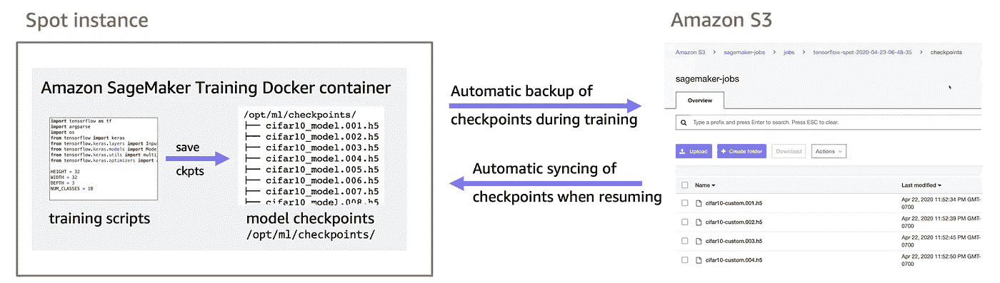
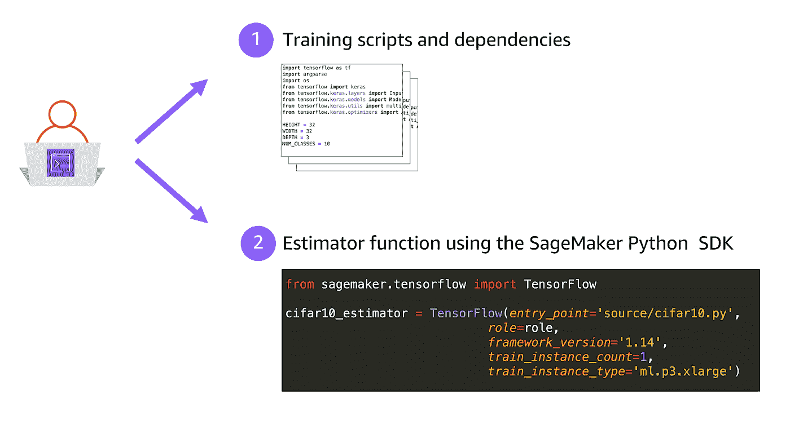
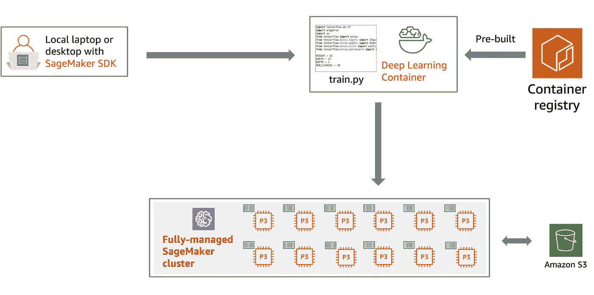
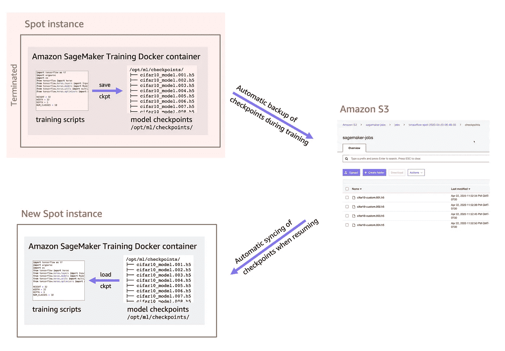
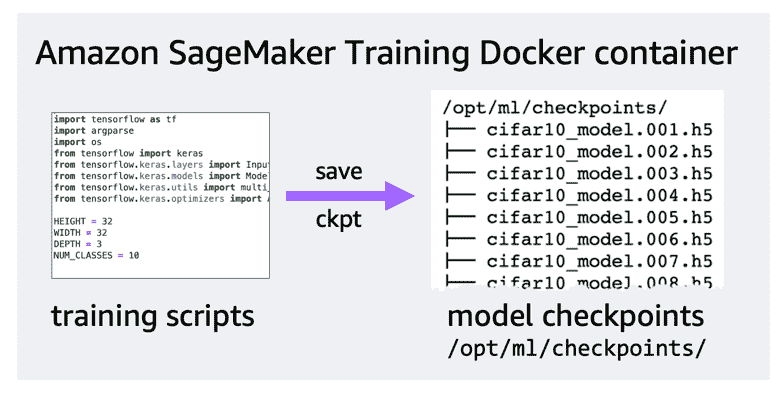
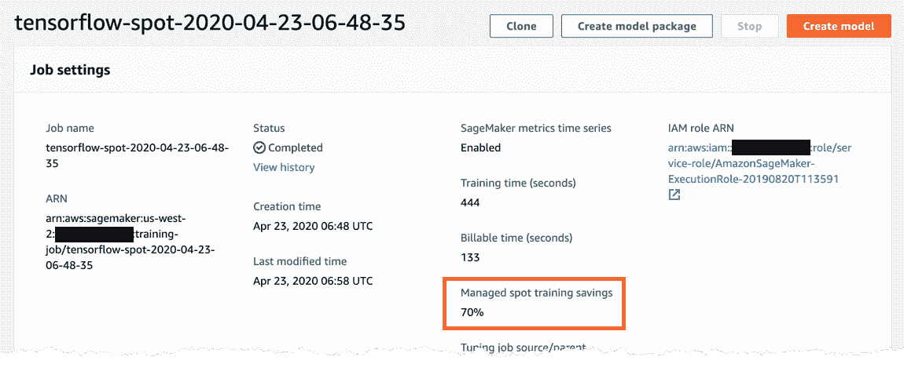
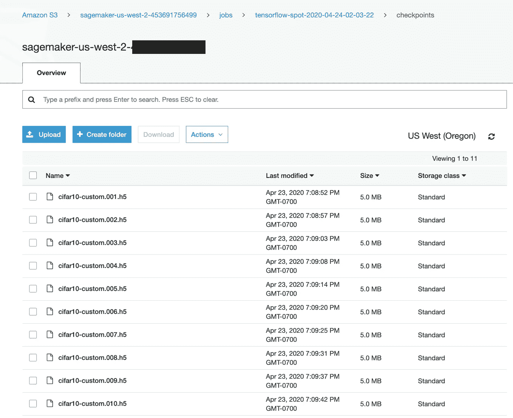
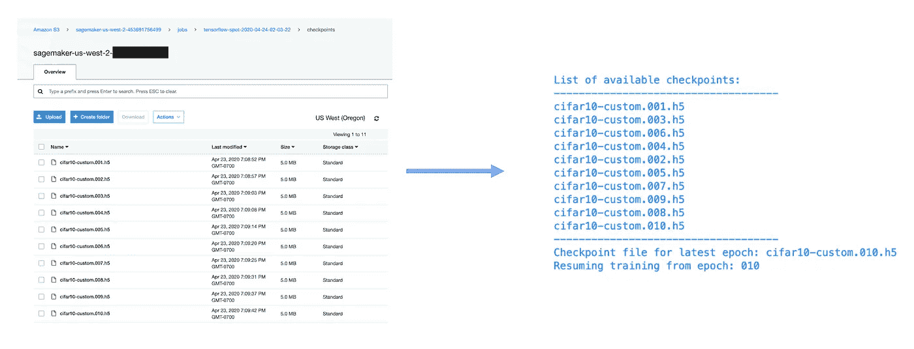

# Amazon SageMaker 使用 Spot 实例的快速指南

> 原文：<https://towardsdatascience.com/a-quick-guide-to-using-spot-instances-with-amazon-sagemaker-b9cfb3a44a68?source=collection_archive---------15----------------------->

## 通过 Amazon SageMaker 上的托管现场培训，降低您的深度学习培训成本

亚马逊 SageMaker 将自动备份和同步检查点亚马逊 S3，让您可以轻松恢复训练

降低机器学习培训成本的最简单方法之一是使用亚马逊 EC2 Spot 实例。与按需费率相比，Spot 实例允许您以高达 90%的大幅折扣访问备用 Amazon EC2 计算能力。那么为什么不总是使用 Spot 实例呢？好吧，可以，只要你的工作量能容忍突然的打扰。由于 Spot 实例是备用容量的一部分，因此只需通知 2 分钟就可以回收它们！

深度学习培训是可以容忍中断的工作负载的一个很好的例子，我以前写过关于使用亚马逊 EC2 Spot 实例进行深度学习培训的。然而，作为一名机器学习开发人员或数据科学家，您可能不希望管理现场车队请求、轮询容量、轮询终止状态、手动备份检查点、在恢复培训时手动同步检查点，以及在每次想要运行培训作业时设置一切。

亚马逊 SageMaker 提供[管理的现场培训](https://docs.aws.amazon.com/sagemaker/latest/dg/model-managed-spot-training.html)，这是一种使用亚马逊 EC2 现场实例为亚马逊 SageMaker 培训工作降低培训成本的便捷方式。这意味着您现在可以节省高达 90%的培训工作量，而无需设置和管理 Spot 实例。Amazon SageMaker 将自动为您提供 Spot 实例，如果 Spot 实例被回收，Amazon SageMaker 将在容量可用后自动恢复培训！

在这篇博客文章中，我将提供一个分步指南，通过 Amazon SageMaker 使用 Spot 实例进行深度学习训练。我将介绍您需要做哪些代码更改来利用 Amazon SageMaker 的自动检查点备份和同步到 Amazon S3 特性。我将使用 Keras 和 TensorFlow 后端来说明如何利用 Amazon SageMaker 管理的现场培训。您还可以在另一个框架上实现相同的步骤，比如 PyTorch 或 MXNet。

> GitHub 上有一个关于 Jupyter 笔记本的完整例子:【https://github.com/shashankprasanna/sagemaker-spot-training 

# 哪些工作负载可以利用 Spot 实例？

为了利用 Spot 实例节省，您的工作负载必须能够容忍中断。在机器学习中，有两种类型的工作负载大致属于这一类别:

1.  无状态的微服务，比如模型服务器(TF Serving，TorchServe — [读我的博文](https://aws.amazon.com/blogs/machine-learning/deploying-pytorch-models-for-inference-at-scale-using-torchserve/))，服务推理请求
2.  有状态作业，如深度学习训练，能够通过频繁的检查点保存其完整状态。

在第一种情况下，如果 Spot 实例被回收，流量可以被路由到另一个实例，假设您已经为高可用性设置了冗余服务。在第二种情况下，如果 Spot 实例被中断，您的应用程序必须立即保存其当前状态，并在容量恢复后继续训练。

在本指南中，我将涵盖第二种用例，即使用开源深度学习框架(如 TensorFlow、PyTorch、MXNet 等)的深度学习培训工作的 Spot 实例。

# 快速回顾亚马逊 SageMaker 如何开展深度学习培训

我先说亚马逊 SageMaker 是如何运行深度学习训练的。这一背景对于理解 SageMaker 如何管理 Spot 训练以及备份您的检查点数据和恢复训练非常重要。如果你是亚马逊 SageMaker 用户，这应该是一个快速提醒。

## 你的职责:

开发您的培训脚本并将其提供给 SageMaker SDK Estimator 函数，Amazon SageMaker 会处理剩下的工作

1.  使用 TensorFlow、PyTorch、MXNet 或其他支持的框架编写培训脚本。
2.  编写一个 SageMaker Python SDK Estimator 函数，指定在哪里可以找到您的训练脚本，在什么类型的 CPU 或 GPU 实例上进行训练，在多少个实例上进行训练(对于分布式)，在哪里可以找到您的训练数据集，以及在亚马逊 S3 的哪里可以保存训练好的模型。

## 亚马逊 SageMaker 的职责:

亚马逊 SageMaker 培训工作流程

亚马逊 SageMaker 将管理基础设施细节，所以你不必这样做。亚马逊 SageMaker 将:

1.  将您的培训脚本和依赖项上传到亚马逊 S3
2.  在完全受管的群集中调配指定数量的实例
3.  提取指定的 TensorFlow 容器映像，并在每个实例上实例化容器。
4.  从亚马逊 S3 下载训练代码到实例中，并使其在容器中可用
5.  从亚马逊 S3 下载训练数据集，并使其在容器中可用
6.  跑步训练
7.  将训练好的模型复制到亚马逊 S3 的指定位置

# 运行亚马逊 SageMaker 管理的现场培训

Spot 实例可以被抢占，并且只需 2 分钟通知就可以终止，因此经常检查训练进度非常重要。谢天谢地，亚马逊 SageMaker 将管理其他一切。它会自动将您的培训检查点备份到亚马逊 S3，如果培训实例因容量不足而终止，它会持续轮询容量，并在容量可用时自动重新开始培训。

Amazon SageMaker 会自动将您的数据集和检查点文件复制到新的实例中，并将其提供给 docker 容器中的训练脚本，以便您可以从最新的检查点恢复训练。

亚马逊 SageMaker 将自动备份和同步检查点文件到亚马逊 S3

让我们来看一个例子，看看你如何准备你的培训脚本，使现场培训准备就绪。

# 亚马逊 SageMaker 通过 TensorFlow 和 Keras 管理现场培训

为了确保您的训练脚本能够利用 SageMaker 管理的 Spot 实例，您需要实现:

1.  频繁节省检查点和
2.  从关卡恢复训练的能力。

我将展示如何在 Keras 中进行这些更改，但是您可以在另一个框架中遵循相同的步骤。

## **步骤 1:保存检查点**

亚马逊 SageMaker 会自动备份和同步你的训练脚本生成的检查点文件到亚马逊 S3。因此，您需要确保您的训练脚本将检查点保存到运行训练的 docker 容器上的本地检查点目录中。保存检查点文件的默认位置是`/opt/ml/checkpoints`，Amazon SageMaker 会将这些文件同步到特定的 Amazon S3 存储桶。本地和亚马逊 S3 检查站的位置都是可定制的。

将您的检查点本地保存到/opt/ml/checkpoints(路径是可定制的)，Amazon SageMaker 会将其备份到 Amazon S3

如果你正在使用 Keras，这是非常容易的。创建 ModelCheckpoint 回调类的一个实例，并通过将其传递给 fit()函数将其注册到模型中。

> 完整的实现可以在这个文件中找到:[https://github . com/shashankprasanna/sagemaker-spot-training/blob/master/code/cifar 10-training-sagemaker . py](https://github.com/shashankprasanna/sagemaker-spot-training/blob/master/code/cifar10-training-sagemaker.py)

以下是相关摘录:

请注意，我正在通过`initial_epoch`,这是您通常不会在意的。这让我们可以从某个纪元开始恢复训练，当你已经有了检查点文件时，这将会很方便。

## **步骤 2:从检查点文件恢复**

当 spot 容量在中断后重新可用时，Amazon SageMaker 将:

1.  启动新的 spot 实例
2.  用您的训练脚本实例化 Docker 容器
3.  将数据集和检查点文件从亚马逊 S3 复制到容器中
4.  运行您的培训脚本

您的脚本需要实现从检查点文件恢复训练，否则您的训练脚本将从头开始训练。您可以实现如下所示的`load_checkpoint_mode`函数。它接受本地检查点文件路径(`/opt/ml/checkpoints`是缺省值)，并返回从最新检查点加载的模型和相关的纪元编号。

有许多方法可以查询目录中的文件列表，从文件名中提取纪元编号，并用最新的纪元编号加载文件名。我使用`os.listdir()`和正则表达式。我相信你能想出更聪明、更优雅的方法来做同样的事情。

> 该文件中提供了完整的实现:[https://github . com/shashankprasanna/sagemaker-spot-training/blob/master/code/cifar 10-training-sagemaker . py](https://github.com/shashankprasanna/sagemaker-spot-training/blob/master/code/cifar10-training-sagemaker.py)

以下是相关摘录:

## **第三步:指导亚马逊 SageMaker 进行现场培训**

您可以从您的笔记本电脑、台式机、Amazon EC2 实例或 Amazon SageMaker 笔记本实例启动 Amazon SageMaker 培训工作。只要您安装了 Amazon SageMaker Python SDK，并且拥有运行 SageMaker 培训作业的正确用户权限。

要运行托管的现场培训作业，您需要为标准的 Amazon SageMaker Estimator 函数调用指定几个附加选项。

> 该文件中提供了完整的实现:[https://github . com/shashankprasanna/sage maker-spot-training/blob/master/TF-keras-cifar 10-spot-training . ipynb](https://github.com/shashankprasanna/sagemaker-spot-training/blob/master/tf-keras-cifar10-spot-training.ipynb)

以下是相关摘录:

*   `**train_use_spot_instances**`:指示亚马逊 SageMaker 运行托管现场培训
*   `**checkpoint_s3_uri**`:指示 Amazon SageMaker 将您的检查点文件同步到这个 Amazon S3 位置
*   `**train_max_wait**`:指示 Amazon SageMaker 在此时间过后终止作业，并且现货产能不可用。

就是这样。这些都是你需要做出的改变，以大幅降低你的培训成本。

要监控您的培训工作并查看节省情况，您可以查看 Jupyter 笔记本上的日志或导航至`Amazon SageMaker Console > Training Job`，点击您的培训工作名称。一旦训练完成，你应该看到你节省了多少。例如，在一个`p3.2xlarge` GPU 实例上进行 30 个纪元的培训，我能够节省 70%的培训成本！

Amazon SageMaker 控制台中显示成本节约和其他有用信息的培训工作截图

# 在亚马逊 SageMaker 上模拟现场中断

如果出现中断，你如何知道你的训练是否能正常恢复？

如果您熟悉运行 Amazon EC2 Spot 实例，那么您知道可以通过终止 Amazon EC2 Spot 实例来模拟应用程序在 Spot 中断期间的行为。如果有能力，Spot fleet 将启动一个新实例来替换您终止的实例。您可以监视您的应用程序，检查它是否处理中断并正常恢复。不幸(还是幸运？)，您不能手动终止 Amazon SageMaker 培训实例。你唯一的选择就是停止整个培训工作。

幸运的是，在恢复训练时，您仍然可以测试代码的行为。要做到这一点，首先要运行一个 Amazon SageMaker 管理的 Spot training，如前一节所述。假设你运行了 10 个纪元的训练。Amazon SageMaker 会将您的检查点文件备份到指定的 Amazon S3 位置 10 个时期。前往亚马逊 S3 验证检查点是否可用:

亚马逊 S3 的检查站，由亚马逊 SageMaker 自动为您备份

现在运行第二个训练运行，但是这次提供第一个任务的检查点位置给`checkpoint_s3_uri`

`checkpoint_s3_uri = tf_estimator.checkpoint_s3_uri`。

以下是来自 [Jupyter 笔记本](https://github.com/shashankprasanna/sagemaker-spot-training/blob/master/tf-keras-cifar10-spot-training.ipynb)的相关摘录:

[https://github . com/shashankprasanna/sage maker-spot-training/blob/master/TF-keras-cifar 10-spot-training . ipynb](https://github.com/shashankprasanna/sagemaker-spot-training/blob/master/tf-keras-cifar10-spot-training.ipynb)

通过向`checkpoint_s3_uri`提供你之前工作的检查点，你是在告诉 Amazon SageMaker 将这些检查点复制到你新工作的容器中。然后，您的训练脚本将加载最新的检查点并继续训练。在下图中，你可以看到训练将从第 10 个纪元开始恢复。

从亚马逊 S3 自动复制的先前工作的最新检查点恢复训练

以这种方式模拟中断和 Amazon SageMaker 如何管理中断之间的关键区别在于，您正在创建一个新的培训任务来测试您的代码。在现场中断的情况下，Amazon SageMaker 将简单地恢复现有的中断作业。

# 拯救快乐！

我知道我没有必要说服你节约成本是一件好事。希望我已经向您展示了，使用 Amazon SageMaker 管理的现场培训可以轻松节省培训成本。通过最少的代码更改，您可以节省超过 70%的培训成本。你现在可以平静地运行 GPU 培训工作，而不会破产。

感谢阅读，我希望你喜欢这个指南。GitHub 上的所有代码和示例都可以在这里找到:

> [https://github.com/shashankprasanna/sagemaker-spot-training](https://github.com/shashankprasanna/sagemaker-spot-training)

如果你对这篇文章有疑问，对如何改进它有建议，或者对新的指南和文章有想法，请在 twitter ( [@shshnkp](https://twitter.com/shshnkp) )， [LinkedIn](https://www.linkedin.com/in/shashankprasanna/) 联系我，或者在下面留下评论。拯救快乐！