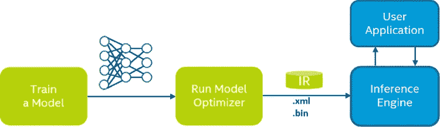
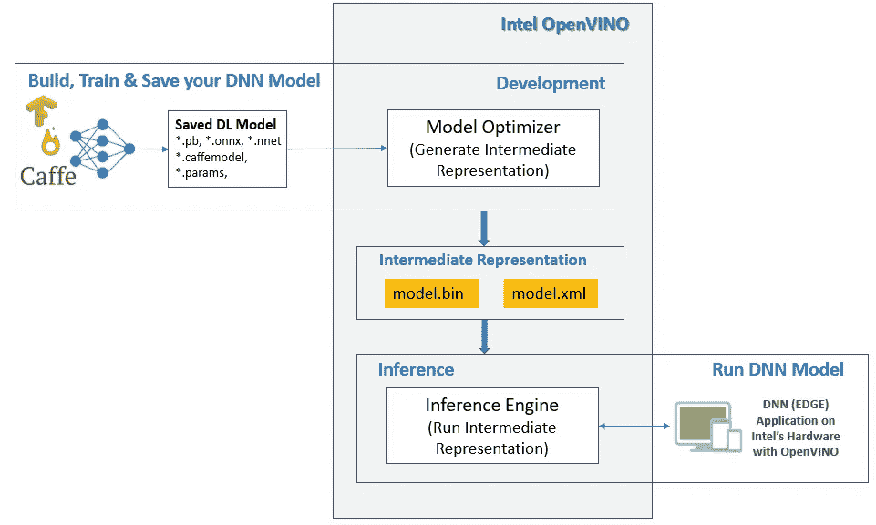

# 快速介绍英特尔的 OpenVINO 工具包，用于更快的深度学习推理

> 原文：<https://towardsdatascience.com/a-quick-intro-to-intels-openvino-toolkit-for-faster-deep-learning-inference-d695c022c1ce?source=collection_archive---------55----------------------->

## 让我们优化您的深度学习模型


由 [Unsplash](https://unsplash.com?utm_source=medium&utm_medium=referral) 上的 [Clarisse Croset](https://unsplash.com/@herfrenchness?utm_source=medium&utm_medium=referral) 拍摄的照片

深度学习模型正变得日益沉重，除了更快地训练它们，很多关注点也围绕着 IOT/ Edge 设备上实时用例的更快推理。因此，大约两年前，英特尔发布了 [OpenVINO toolkit](https://docs.openvinotoolkit.org/) ，用于在英特尔硬件上优化深度学习模型的推理。

为了了解 OpenVINO 的所有基础知识，我把这篇文章分成了 3 个部分，根据你的兴趣，你可以选择下面的任何一个:

1.  ***什么*** 是 OpenVINO
2.  ***为什么/什么时候*** 打开葡萄酒
3.  ***如何从*** 到*构建* & *运行*一个玩具 NN 上 OpenVINO

## 什么是 OpenVINO

英特尔的**Open**Visual**I**NNeural network**O**optimization(Open vino)toolkit 使视觉应用(或任何其他 DNN)能够在英特尔的处理器/硬件上更快地运行。

> open vino toolkit 是一个全面的工具包，用于快速开发模拟人类视觉的应用程序和解决方案。基于卷积神经网络(CNN)，该工具包扩展了英特尔硬件上的 CV 工作负载，最大限度地提高了性能。
> -[https://docs.openvinotoolkit.org/](https://docs.openvinotoolkit.org/)

直截了当地说，英特尔试图出售他们的底层处理器([CPU](https://www.intel.in/content/www/in/en/products/processors/core.html)、[igpu](https://www.cpu-monkey.com/en/intel_igpus)、[vpu](https://software.intel.com/content/www/us/en/develop/topics/iot/hardware/vision-accelerator-movidius-vpu.html)、[高斯&神经加速器](https://docs.openvinotoolkit.org/latest/_docs_IE_DG_supported_plugins_GNA.html)和[FPGA](https://www.intel.com/content/www/us/en/products/programmable/fpga/new-to-fpgas/resource-center/overview.html))，让你的 AI(视觉)应用运行得更快。

> **这不是为了更快的训练你的深度学习任务的工具包，而是为了更快的推断你已经训练好的深度神经模型。**

OpenVINO toolkit 的工具主要组件有

1.  [模型优化器](https://docs.openvinotoolkit.org/latest/_docs_MO_DG_Deep_Learning_Model_Optimizer_DevGuide.html)
2.  [推理机](https://docs.openvinotoolkit.org/latest/_docs_IE_DG_Deep_Learning_Inference_Engine_DevGuide.html)

关于工具包的完整细节，请查看。



英特尔 OpenVINO，[来源](https://docs.openvinotoolkit.org/latest/_docs_MO_DG_Deep_Learning_Model_Optimizer_DevGuide.html)

模型优化器(单个框架的一个`.py`文件)的任务是获取一个已经训练好的 DL 模型，并对其进行调整，以优化目标设备的执行。模型优化器的输出是您的 DL 模型的中间表示。

IR 是一组 2 个文件，描述您的 DL 模型的优化版本

1.  `*.xml` -描述网络拓扑
2.  `*.bin` -包含权重(&偏差)的二进制数据

模型优化器的输出(IR 文件)是我们必须传递给推理机的，推理机在您的硬件上运行它。

因此，为了充分利用您的英特尔硬件，在生产环境中运行您的 ML(边缘、云……)应用，您只需生成您的 DL 模型的 IR 文件，并在推理引擎上运行，而不是直接在硬件上运行。

# 为什么/何时打开葡萄酒

如上所述，许多边缘/云应用已经在使用更先进的英特尔硬件/处理器/架构。

因此，人们想要转向 OpenVINO 的最重要原因之一是**充分利用底层英特尔硬件**。

除此之外，我还看到许多应用开发团队转向 OpenVINO，仅仅是为了英特尔已经为他们的边缘应用优化的预训练模型

[](https://software.intel.com/content/www/us/en/develop/tools/openvino-toolkit/pretrained-models.html) [## open vino Toolkit 英特尔发行版的预训练模型

### 英特尔发布的 open vino toolkit 包括两组优化的模型，可以加快开发和…

software.intel.com](https://software.intel.com/content/www/us/en/develop/tools/openvino-toolkit/pretrained-models.html) [](https://github.com/opencv/open_model_zoo) [## opencv/open _ model _ 动物园

### 该存储库包括优化的深度学习模型和一组演示，以加快高性能…

github.com](https://github.com/opencv/open_model_zoo) 

因此，您需要做的就是，下载一个预训练模型的 IR 文件，并将其与您的最终应用程序的推理引擎一起使用。

这种预训练模型的主要缺点是，当需要时，用你的服装数据重新训练这些模型并不总是容易的，因为不是所有提供的模型的重新训练/微调都有很好的记录。

如果你正在考虑使用一个 [TF 模型动物园](https://github.com/tensorflow/models/blob/master/research/object_detection/g3doc/detection_model_zoo.md)(或者类似的其他 DL 框架)或者构建/训练你自己的定制 Tensorflow(或者 PyTorch 等等..)模型，并期望很容易(甚至每次都可能)将其转换为所需的 IR 文件，但情况并非总是如此。

> 检查[【1】](https://software.intel.com/en-us/forums/intel-distribution-of-openvino-toolkit/topic/843611)[【2】](https://software.intel.com/en-us/forums/intel-distribution-of-openvino-toolkit/topic/808548)等未解决的问题/bug。

因此，在决定将您的任何应用程序移植到 OpenVINO 时，快速检查以下几点非常重要:

1.  如果您从 IR 文件开始，那么您也有适当的理解/文档来重新训练所提供的 IR 文件背后的模型
2.  如果您正在构建自己的 DNN 模型，您可以使用 Model Optimizer 将您的模型架构(尽管尚未训练)转换为 IR

只要您对以上两点都满意，您应该可以选择 OpenVINO 作为您的 DL 应用程序，但是如果不是，您可能需要重新评估您的决定。



如何使用 OpenVINO

# 如何在 OpenVINO 上构建和运行一个玩具 NN

理解 OpenVINO 如何工作的最佳方式是在其上构建、训练和推断你自己的玩具深度学习模型。请记住，只有在我们保存了 DL 模型之后，OpenVINO 才会出现。

因此，让我们构建一个我们想要解决的玩具线性回归问题，决定一个我们想要尝试的 DL 框架，我为这篇文章选择了 PyTorch，但可以随意获得相同的 [TensorFlow 版本](https://github.com/AbhishekAshokDubey/OpenVino/tree/master/tensorflow_getting_started)。

## 回归问题:Y = 2 X1 + 5 X2

让我们生成相同的样本数据

让我们建立一个快速神经网络来解决上述回归问题。

让我们训练我们的神经网络模型

在保存 PyTorch 模型并将其用于 OpenVINO 之前，请检查其预测输出

```
predicted = model.forward(torch.torch.FloatTensor(normed_test_data.values)).data.numpy()
print(model.state_dict())
```

现在，让我们首先保存您的 pyTorch 模型，以便我们可以在以后使用 model optimizer 获得模型的 IR 文件。

> 现在这就是我们需要 OpenVINO 的地方

所以在我们进入下一步之前，我们需要安装 OpenVINO 工具包。

[](https://software.intel.com/content/www/us/en/develop/tools/openvino-toolkit/choose-download.html) [## 选择并下载英特尔发布的 OpenVINO 工具包

### 选择打算用于开发或部署的操作系统。Linux*(支持 Ubuntu、CentOS 和 Yocto…

software.intel.com](https://software.intel.com/content/www/us/en/develop/tools/openvino-toolkit/choose-download.html) 

安装完工具包后，让我们将保存的 PyTorch 模型转换成 IR 文件

> 现在，一旦我们有了 IR 文件，最后一步就是在 OpenVINO 推理引擎上运行我们的 NN 模型

注意:虽然下面的演示是在我的带英特尔 CPU 的笔记本电脑上运行的，但是您可以根据您的目标硬件更新设备。

## 恭喜你。
您已经成功地在 OpenVINO 上端到端地构建、训练并执行了一个玩具神经网络模型。

如果您需要查看示例代码，请查看下面的 repo:

[](https://github.com/AbhishekAshokDubey/OpenVino) [## AbhishekAshokDubey/OpenVino

### 在 GitHub 上创建一个帐户，为 AbhishekAshokDubey/OpenVino 开发做贡献。

github.com](https://github.com/AbhishekAshokDubey/OpenVino) 

## 所以去吧，自己试试！

更多参考:

1.  [https://docs.openvinotoolkit.org/](https://docs.openvinotoolkit.org/)
2.  [https://www.youtube.com/watch?v=kY9nZbX1DWM](https://www.youtube.com/watch?v=kY9nZbX1DWM)
3.  [https://github.com/AbhishekAshokDubey/OpenVino](https://github.com/AbhishekAshokDubey/OpenVino)
4.  [https://docs . openvinotoolkit . org/latest/_ docs _ IE _ DG _ introduction . html](https://docs.openvinotoolkit.org/latest/_docs_IE_DG_Introduction.html)
5.  [https://software . Intel . com/content/www/us/en/develop/tools/open vino-toolkit . html](https://software.intel.com/content/www/us/en/develop/tools/openvino-toolkit.html)