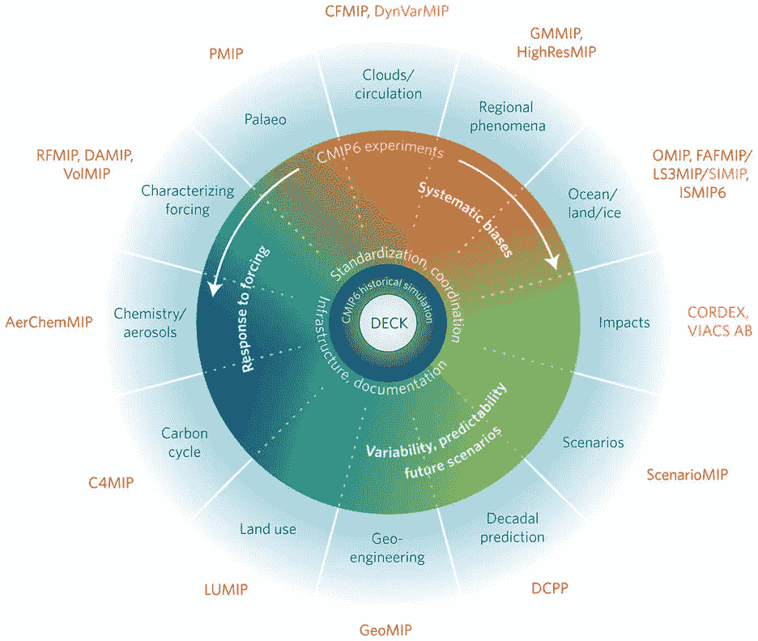
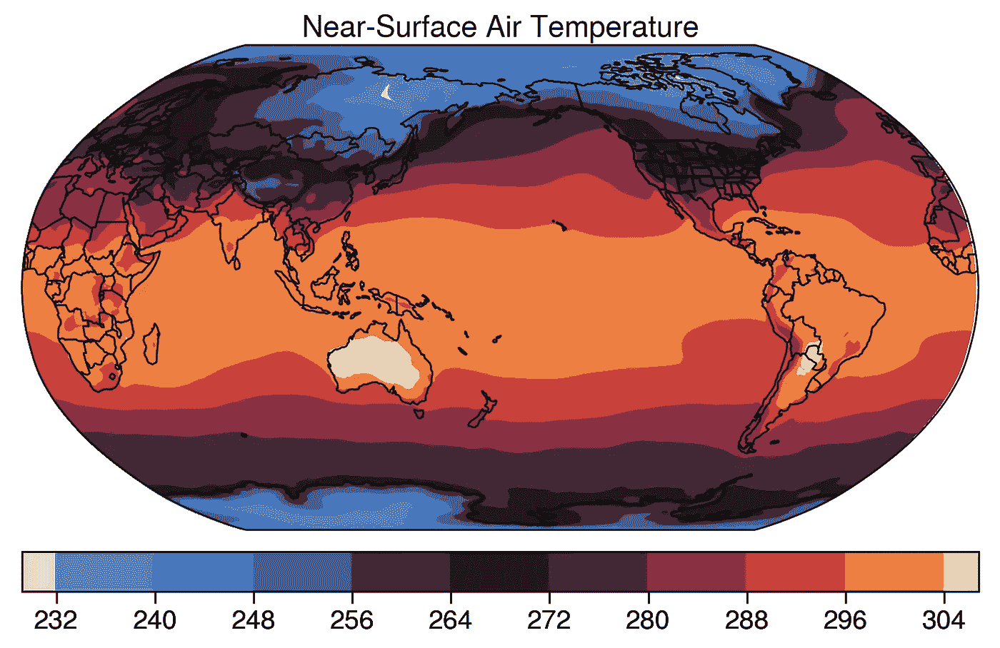

# CMIP6 快速介绍

> 原文：<https://towardsdatascience.com/a-quick-introduction-to-cmip6-e017127a49d3?source=collection_archive---------21----------------------->

## 气候数据科学

## 如何用 Python 轻松访问下一代气候模型？

[耦合模型相互比较项目](https://www.wcrp-climate.org/wgcm-cmip) (CMIP)是一项巨大的国际合作努力，旨在提高关于气候变化及其对地球系统和我们社会的影响的知识。它从 90 年代就开始了，今天我们正走向第六阶段(CMIP6)，这将为政府间气候变化专门委员会(IPCC)的下一份评估报告(AR6)提供大量信息。

CMIP6 正在赞助几个不同的团体研究几个不同的科学问题，从遥远过去的气候到森林砍伐和土地使用变化的影响。完成后，整个项目预计将从 20 多个气候模型中释放大约 20 到 40pb 的数据。这就是你所谓的**大数据**，但是你怎么能尝试所有这些信息呢？



CMIP6 中的 MIPs。图片来源:[辛普金斯(2017)](https://www.nature.com/articles/nclimate3398) 。

# **设置您的工具箱**

```
import intake
import xarray as xr 
import proplot as plot 
import matplotlib.pyplot as plt
```

除了`Matplotlib`，这些包不是你通常在数据科学教程中看到的。另一方面，如果您想处理气象数据集，这些包是绝对重要的。

*   [入口](https://intake.readthedocs.io/en/latest/quickstart.html):共享和加载数据集的包。这将是您通过`[intake-e](https://intake-esm.readthedocs.io/en/latest/installation.html)[sm](https://intake-esm.readthedocs.io/en/latest/installation.html)`目录与云的连接。
*   [Xarray](http://xarray.pydata.org/en/stable/installing.html) :这是针对 n 维数据集的`Pandas`，比如气候模型的输出。
*   Proplot:Python 中数据可视化的下一件大事。说真的。
*   Matplotlib:在任何 Python 生态系统中用于数据可视化的旧的好的标准包。

# 读取数据目录

```
# necessary url
url = "[https://raw.githubusercontent.com/NCAR/intake-esm-datastore/master/catalogs/pangeo-cmip6.json](https://raw.githubusercontent.com/NCAR/intake-esm-datastore/master/catalogs/pangeo-cmip6.json)"# open the catalog
>>> dataframe = intake.open_esm_datastore(url)
```

由于 [Pangeo](https://pangeo.io/) 的努力，现在您可以通过利用`intake-esm`包访问所有可用的 CMIP6 数据集。上面的`df`变量本质上是一个常见的`DataFrame`，您可能对`Pandas`很熟悉，因此您可以很容易地检查像列名这样的重要信息。

```
>>> dataframe.df.columns
    Index(['activity_id', 'institution_id', 'source_id', 'experiment_id', 'member_id', 'table_id', 'variable_id', 'grid_label', 'zstore', 'dcpp_init_year'],dtype='object')
```

这些列中的每一列都是以 CMIP 项目的受控词汇表命名的，这种组织方式确保了数百万个数据集被整齐地保存，就像在一个巨大的图书馆中一样。你可以在这里读到更多关于这个[的内容。](https://docs.google.com/document/d/1yUx6jr9EdedCOLd--CPdTfGDwEwzPpCF6p1jRmqx-0Q/edit)

# 搜索数据集

弄乱了词汇表之后，获得想要的数据集就非常简单了。在这里，你将直接看到历史*实验的 NCAR 模型每月近地面气温输出。对此的查询如下所示:*

```
>>> models = dataframe.search(experiment_id='historical',
                              table_id='Amon',
                              variable_id='tas',
                              institution_id='NCAR',
                              member_id='r11i1p1f1')
```

这个搜索产生了一个`intake_esm.core.esm_datastore`数据类型，您可以使用它来最终获得您搜索的数据集。变量`models`给你更多关于它的信息，它基本上是一个类似字典的结构。

```
>>> models 
pangeo-cmip6-ESM Collection with 1 entries:
	> 1 activity_id(s)

	> 1 institution_id(s)

	> 1 source_id(s)

	> 1 experiment_id(s)

	> 1 member_id(s)

	> 1 table_id(s)

	> 1 variable_id(s)

	> 1 grid_label(s)

	> 1 zstore(s)

	> 0 dcpp_init_year(s)
```

# 终于拿到数据了

为此，您首先需要从字典中获取数据集:

```
>>> datasets = models.to_dataset_dict()
Progress: |███████████████████████████████████████████████████████████████████████████████| 100.0% 

--> The keys in the returned dictionary of datasets are constructed as follows:
	'activity_id.institution_id.source_id.experiment_id.table_id.grid_label'

--> There are 1 group(s)
```

这产生了另一个`dict`，但是不同的是，现在您可以用`datasets.keys()`获得数据集的键:

```
>>> datasets.keys()
dict_keys(['CMIP.NCAR.CESM2.historical.Amon.gn'])>>> dset = datasets['CMIP.NCAR.CESM2.historical.Amon.gn']
```

好消息是`dset`是一个直接的`xarray.core.dataset.Dataset`，所以你可以通过强大的`Xarray`包很容易地使用它做任何你想做的事情，它特别适合处理网格气象数据。

绘图永远是有趣的部分，你可能熟悉地理空间投影的[卡通](https://scitools.org.uk/cartopy/docs/latest/)包和其他几个应用程序。然而，这里您将使用新的`Proplot`包，因为它简单易用。一个简洁明了的情节如下:

```
fig, ax = plot.subplots(axwidth=4.5, tight=True,
                        proj='robin', proj_kw={'lon_0': 180},)
# format options
ax.format(land=False, coast=True, innerborders=True, borders=True,
          labels=True, geogridlinewidth=0,)map1 = ax.contourf(dset['lon'], dset['lat'], dset['tas'][0,0,:,:],
                   cmap='IceFire', extend='both')ax.colorbar(map1, loc='b', shrink=0.5, extendrect=True)plt.show()
```

然后*瞧！*好看的罗宾逊投影中的近地面气温图。



# 最后的话

由于 Pangeo 社区的努力，CMIP6 比以往任何时候都更容易为任何想要尝试的人所用。复杂的气候模型现在对任何学生、公民科学家或全职科学家来说，只要有一个相对像样的互联网连接就可以使用。

这有着巨大的潜力，可以开启新的贡献，增进知识，并有助于实现气候抗御力和缓解战略。

PS:上面代码的 Jupyter 笔记本在这个[资源库](https://github.com/willyhagi/climate-data-science)中可用。