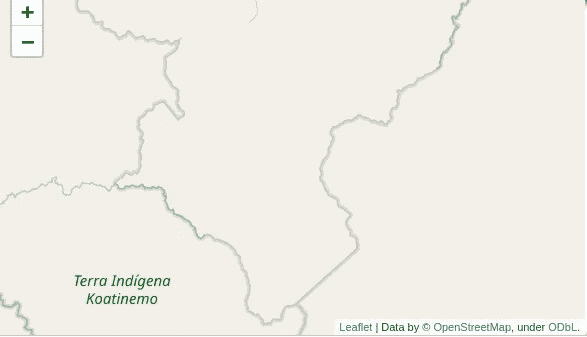
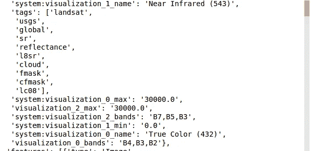
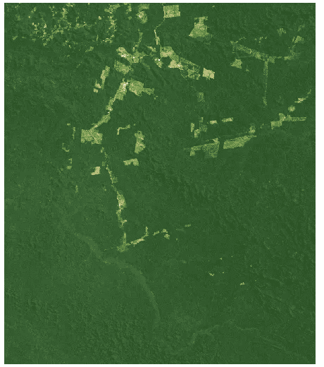
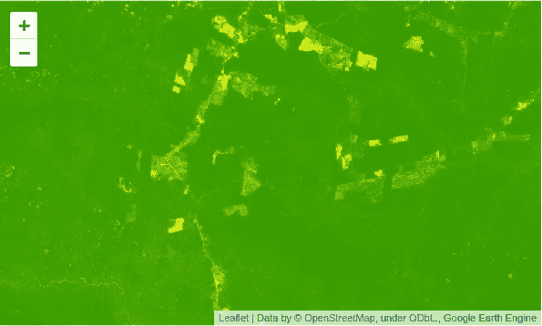

# 谷歌地球引擎快速介绍

> 原文：<https://towardsdatascience.com/a-quick-introduction-to-google-earth-engine-c6a608c5febe?source=collection_archive---------6----------------------->

## 气候数据科学

## 云中卫星和气候数据财富的一瞥。

[谷歌地球引擎](https://earthengine.google.com/) (GEE)是一个基于云的地理空间应用平台，拥有来自卫星的大量数据，包括来自著名的 [Landsat](https://landsat.gsfc.nasa.gov/) 计划的数据和几个气候数据集。最棒的是，任何有足够兴趣和相对体面的互联网连接的人都可以使用该平台，使环境处理易于使用，并提供给最需要的人。

使用 GEE 有几种方法，每一种都有它的优点和缺点。虽然基于 Javascript 的[代码编辑器](https://developers.google.com/earth-engine/playground)可能是最常用的工具，而[资源管理器](https://explorer.earthengine.google.com/#workspace)非常适合休闲的外观，但在这里您将接触 Python API。与此同时，您可以随意探索[可用数据集](https://developers.google.com/earth-engine/datasets/)和许多成功的[案例研究](https://earthengine.google.com/case_studies/)。

# 报名

基本上，任何拥有谷歌账户的人都可以注册使用 GEE，安装必要的软件包非常简单。[注册后，](https://signup.earthengine.google.com/#!/)可以用`pip`安装地球引擎 Python API:

```
pip install earthengine-api
```

之后，您需要在您的计算机上设置您的身份验证凭据。整个(不太长)过程在[手册](https://developers.google.com/earth-engine/python_install_manual)中有详细描述，鼓励您按照最后的描述测试安装。完成这些快速步骤后，您就可以开始收集大量可供探索的数据集了。

# 导入包

地球引擎包简称为`ee`，有了它，你就可以开始设置你的工具箱了。除了`ee`，在本教程中，你还需要用于交互式地图的`[Folium](https://python-visualization.github.io/folium/index.html)`和`[geehydro](https://pypi.org/project/geehydro/)`，这是一个用于 GEE 平台中淹没动力学的包，但非常有用，因为它模拟了 Javascript API 的一些功能。你也可以用`pip`安装这些其他的包:

```
pip install folium
pip install geehydro
```

要导入所有包:

```
import ee 
import folium
import geehydrofrom datetime import datetime as dt
from IPython.display import Image
```

当您使用 API 时，您需要做的第一件事是初始化到服务器的连接:

```
# initialize the connection to the server
>>> ee.Initialize()
```

# 选择世界上的一个地区

有了卫星图像，你可以调查地球上的任何地方，甚至是你永远无法涉足(或者至少你不应该涉足)的偏远地方。在本教程中，您将探索巴西帕拉州 [Ituna/Itatá](https://terrasindigenas.org.br/pt-br/terras-indigenas/5202) 土著土地的最新状况。这片受保护的土地是一些孤立的土著部落的家园，也是亚马逊地区采矿、伐木和经营牧场绝对违法的地方之一。不幸的是，根据巴西国家空间研究所(INPE)的说法，这个地方也成为去年受巴西农业边界推进影响最大的地方，威胁到居住在那里的部落的生活和生物多样性。

借助`Folium`，你可以看看这个遥远的地方在哪里:

```
# the Ituna/Itatá Indigenous Land in Brazil.
Ituna_map = folium.Map(location=[-4.06738, -52.034], zoom_start=10)
>>> Ituna_map
```



与 Koatinemo 土著土地相邻的 Ituna/Itatá土著土地的边界。

# Landsat 8 系列

Landsat 8 是长期运行的 Landsat 计划的最新成员，自 2013 年以来一直在轨道上运行，持续评估全球各地的地表状况。大地卫星图像在农学、环境保护和与土地使用有关的变化等领域的应用广为人知并已确立。

关于 Landsat 8 有几个技术细节，但你应该知道的基本知识是，它以中等分辨率收集多光谱空间信息，在电磁波谱的 11 个不同波段中，波段范围为 15 至 100 米分辨率。它还有 16 天的重访时间，这意味着每 16 天你就有一个特定地方的新图像。

使用`ee`，您可以通过一行代码访问整个 Landsat 8 集合:

```
landsat = ee.ImageCollection("LANDSAT/LC08/C01/T1_SR")
```

每个系列都有自己的 id，您可以在 GEE 目录中找到它们。上图中， **Landsat 8 表面反射等级 1** 产品的 EE 片段 id 为`"LANDSAT/LC08/C01/T1_SR"`，与目录中描述的[相同。](https://developers.google.com/earth-engine/datasets/catalog/LANDSAT_LC08_C01_T1_SR)

这将为您提供整个世界的全部影像，因此您必须根据您感兴趣的区域和时间对其进行裁剪。对于该区域，您将使用纬度/经度信息和`ee.Geometry.Rectangle`在 Ituna/Itatá Land 周围设置一个矩形:

```
# setting the Area of Interest (AOI)
Ituna_AOI = ee.Geometry.Rectangle([-51.84448, -3.92180,
                                   -52.23999, -4.38201])
```

`.filterBounds()`方法允许您选择上面定义的 AOI:

```
# filter area
landsat_AOI = landsat.filterBounds(Ituna_AOI)
```

另一个细节是，您可能对收集的整个时间跨度不感兴趣，而是对特定的时间段感兴趣。对于 Ituna/Itatá Land，您将选择该地区 2019 年旱季的一小段时间。为什么是旱季？云是卫星图像分析的一个主要问题，在亚马逊地区，这个问题更加严重，因此选择没有强降雨和云层覆盖的月份是一个不错的策略。此外，在这几个月里，森林砍伐非常猖獗，(人类引起的)火灾季节开始了。

```
# choose dates
landsat = landsat.filterDate('2019-07-01','2019-12-01')
```

# 一点元数据

你可以很容易地`.getInfo()`了解上面的 Landsat 集合或者任何你可能感兴趣的特定信息。对于上面量身定制的`landsat_AOI`系列，它将为您提供关于它的所有**信息，这些信息可能会有点杂乱且过于专业。**

```
>>> landsat_AOI.getInfo()
```



而且还不止这些。

可以更有选择性，过滤掉不想要的信息。假设您只需要知道在上面选择的时间段内您从 Landsat 获得了多少图像，只需:

```
>>> print('Total number:', landsat_AOI.size().getInfo())
Total number: 9
```

另一个例子是显示 Landsat 8 的每个波段是如何命名的，这对后续步骤很有用:

```
# the names of each Landsat 8 band
>>> landsat_AOI.first().bandNames().getInfo()['B1',
 'B2',
 'B3',
 'B4',
 'B5',
 'B6',
 'B7',
 'B10',
 'B11',
 'sr_aerosol',
 'pixel_qa',
 'radsat_qa']
```

# 选择一个`Image`

可以更有选择性，根据特定标准设置系列。在本教程中，您将根据`'CLOUD_COVER'` id 从`landsat_AOI`集合中选择最不模糊的图像。

```
# the least cloudy image
least_cloudy = ee.Image(landsat_AOI.sort('CLOUD_COVER').first())# how cloudy is it?
>>> print('Cloud Cover (%):', least_cloudy.get('CLOUD_COVER').getInfo())
Cloud Cover (%): 0
```

方便的是，亚马逊地区 0%的卫星图像很难看到。这张很完美，但是是什么时候拍的？

```
# when was this image taken?
date = ee.Date(least_cloudy.get('system:time_start'))
time = date.getInfo()['value']/1000.>>> dt.utcfromtimestamp(time).strftime('%Y-%m-%d %H:%M:%S')'2019-08-11 13:36:22'
```

八月是亚马逊地区旱季最干燥的月份之一，所以它的干旱率为 0%也就不足为奇了。

# 可视化卫星图像

使用卫星影像进行分析时，通常的做法是组合不同的波段。由于[每个波段](https://landsat.gsfc.nasa.gov/landsat-8/landsat-8-bands/)代表电磁波谱的一部分，由于植被、水、土壤等类型的光谱特征，将它们组合起来可以看到同一表面的不同视图。最简单的方法是红绿蓝(RGB)合成，当使用 Landsat 8 影像时，您需要使用波段 4(红色)、3(绿色)和 2(蓝色)。

基于 Javascript 的代码编辑器很容易允许使用`Map.AddLayer()`进行交互式可视化，但不幸的是，这对于标准 Python API 是不可用的。使用来自`ee`的`.getThumbURL()`模块和来自`IPython`的本地`.display()`模块可以制作一个简单的静态地图:

```
parameters = {'min': 0,
              'max': 1000,
              'dimensions': 512,
              'bands': ['B4', 'B3', 'B2'],
              'region': Ituna_AOI}

>>> Image(url = least_cloudy.getThumbUrl(parameters))
```



在 Ituna/Itatá土著土地上非法砍伐森林的进展。

`parameters`变量存储了使用`ee`分析卫星图像时可以探索的选项。它的工作方式与 Javascript API 的工作方式相同，我们鼓励你组合不同的波段并对其进行调整，以获得相同数据的不同可视化效果。

出于本教程的目的，简单的 RGB 合成图像很好地调查了非法伐木和其他行为的发展，而这些行为是不应该发生的。在上面的图片中，所有不是强烈绿色的东西都是违法的。这发生在 2019 年 8 月中旬，但不幸的是，作为 2020 年的 2 月，情况要糟糕得多。

# 归一化差异植被指数(NDVI)

有更多的定量方法来调查土地使用变化和森林砍伐。也许最著名的方法是使用归一化差异植被指数(NDVI ),它广泛存在于一些土地管理、农业和保护研究中。

NDVI 需要近红外(NIR)和可见(VIS)波段的信息，对于大地卫星 8 号来说，这是波段 5 和 4。计算简单，NDVI =(近红外-可见光)/(近红外+可见光)，但从中获得的见解可能是巨大的。在一些更经典的研究中，它的范围是-1 比 1 或 0 比 1。值为负或 0 的像素可能是许多事物，如河流或严重退化的土地，而接近 1 的像素肯定是植被密集的部分。

由于这是一种常见的做法，您可以快速计算任何归一化差异指数( [NDVI 是**而不是**唯一的](https://www.hindawi.com/journals/js/2017/1353691/))与`.normalizedDifference`:

```
ndvi = least_cloudy.normalizedDifference(['B5', 'B4'])
```

在这之后，你肯定会希望在一张漂亮的地图上看到它。虽然您已经知道了原生方式，但是`geehydro`允许您使用`Folium` 绘制交互式地图，就像代码编辑器使用`Map.AddLayer()`一样:

```
palette = ['red', 'yellow', 'green']ndvi_parameters = {'min': 0,
                   'max': 1,
                   'dimensions': 512,
                   'palette': palette,
                   'region': Ituna_AOI}Ituna_map.addLayer(ndvi, ndvi_parameters)
Ituna_map
```



Ituna/Itatá土著土地的 NDVI 互动地图。

使用`geehydro`允许 Javascript 和 Python API 之间更大程度的可复制性，在两种不同的人之间架起了一座桥梁。如果你对 Javascript 一窍不通，现在你可以理解互联网上的几个 GEE 教程中的代码了。

# 最后的话

GEE 是一个很好的学习如何使用卫星图像的工具，可能性是巨大的。土地使用变化研究、可持续农业和对敏感地区(如 Ituna/Itatá)的监测，只要有良好的互联网连接和足够的兴趣，任何人都可以参与其中。灵活的 Python API 和`geehydro`的有用性可以结合起来，快速搭建平台使用。有了它，大量不同的数据集和丰富的信息随时可以被发现。活着是多么美好的时光。

本教程的交互式 Jupyter 笔记本在我的 [**气候数据科学**](https://github.com/willyhagi/climate-data-science) 资源库中免费提供。