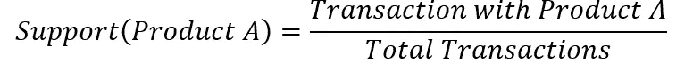
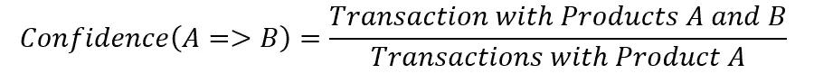
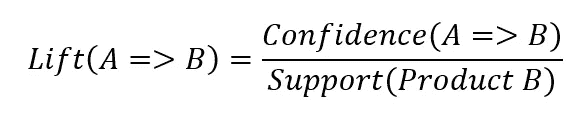

# 购物篮分析快速入门

> 原文：<https://towardsdatascience.com/a-quick-introduction-to-market-basket-analysis-d3292fc89517?source=collection_archive---------33----------------------->

## 带有真实世界演示的初级读本


[菠萝供应公司](https://unsplash.com/@pineapple?utm_source=medium&utm_medium=referral)在 [Unsplash](https://unsplash.com?utm_source=medium&utm_medium=referral) 上的照片

零售商可以获得前所未有的购物者交易量。随着购物习惯变得越来越电子化，每次购物的记录都整齐地存储在数据库中，随时可供读取和分析。有了这样一个数据仓库，他们可以发现消费者的行为模式。

# 什么是购物篮分析？

购物篮分析是一组关联性计算，旨在确定哪些商品一起销售。例如，杂货店可以使用购物篮分析来确定消费者通常同时购买热狗和热狗面包。

如果你曾经去过一个在线零售商的网站，你可能会在一个产品的页面上看到这样的推荐:“购买了这个产品的顾客也购买了”或者“顾客一起购买这些”。更有可能的是，这家在线零售商进行了某种市场购物篮分析，将这些产品联系在一起。

精明的零售商可以利用这一知识来为定价、促销和商店布局决策提供信息。前面提到的杂货店可能会出售热狗，但会增加热狗面包的利润。顾客会买更多的热狗，感觉好像找到了便宜货，而商店会卖出更多的产品，增加他们的收入。

# 购物篮分析背后的数学

对于所购买商品的每一个组合，都会计算三个关键的统计数据:支持度、信心和提升度。

**支持度**是一个项目相对于其他所有购买项目的普遍受欢迎程度。在杂货店，牛奶会有很高的支持度，因为许多购物者每次旅行都会买。支持以 0 到 1 之间的数字给出。数学上:



**置信度**是购买了产品 A 的顾客也购买了产品 b 的条件概率。棉花糖和全麦饼干之间的置信度可能很高，因为它们通常是一起购买的。置信度是一个介于 0 和 1 之间的数字。数学上:



**Lift** 是购买产品 A 时，产品 B 的销量增加。汉堡肉饼和小圆面包之间可能有很大的差距，因为随着肉饼的销量增加，它们会带动小圆面包的销量。数学上:



与其他两种方法相比，Lift 有点不同寻常。升力不是一个介于 0 和 1 之间的值，而是由它与 1:

*   Lift = 1 表示产品之间没有关系
*   lift > 1 表明产品之间存在正相关关系
*   lift < 1 表示产品之间存在负相关关系

# Apriori 算法


克莱顿·罗宾斯在 [Unsplash](https://unsplash.com?utm_source=medium&utm_medium=referral) 上的照片

到目前为止，执行购物篮分析最常用的方法是 [Apriori 算法](https://en.wikipedia.org/wiki/Apriori_algorithm)。该算法由 Agrawal 和 Srikant 于 1994 年首次提出，由于其对零售商有意义地跟踪交易关联的影响，已经变得具有历史重要性。

虽然 Apriori 算法仍然有用并被广泛使用，但它在较大数据集上的计算时间也很长。幸运的是，大多数实现都提供了信心和支持的最小参数，并对每个事务的项目数进行了限制，以减少处理时间。

为了演示，我将使用名为 [*高效的 Python 实现——apriori*](https://pypi.org/project/efficient-apriori/)。注意，这个库是为 Python 3.6 和 3.7 设计的。老版本的 Python 可能会使用*[*apy ori*](https://pypi.org/project/apyori/)，支持 2.7 和 3.3–3.5。*

# *数据处理*

*为了展示 Apriori 算法的应用，我将使用在 [Kaggle](https://www.kaggle.com/sulmansarwar/transactions-from-a-bakery) 上提供的一个面包店的交易数据集。*

```
*import pandas as pd
import numpy as np# Read the data
df = pd.read_csv("BreadBasket_DMS.csv")# eliminate lines with "NONE" in items
df = df[df["Item"] != "NONE"]*
```

*在通常导入 Pandas 和 Numpy 来帮助处理数据之后，先前保存的 CSV 文件被读取到数据帧中。*

*有几行数据在 Item 列中包含“NONE ”,这不是特别有用，所以这些数据被过滤掉了。*

```
*# Create and empty list for data processing
transaction_items = []# Get an array of transaction numbers
transactions = df["Transaction"].unique()for transaction in transactions:
    # Get an array of items per transaction number
    items = df[df["Transaction"] == transaction]["Item"].unique() # Add the item to the list as a tuple
    transaction_items.append(tuple(items))*
```

*与其他支持 Pandas 数据框的库不同，efficient-apriori 需要事务行作为一个列表中的一系列元组。*

*为了创建这种数据结构，需要收集一系列唯一的事务 ID 号。对于每个事务 ID，与该 ID 相关联的 Numpy 个项目数组被分组。最后，它们被转换成元组并放在一个列表中。*

# *执行 Apriori 算法*

```
*# import apriori algorithm
from efficient_apriori import apriori# Calculate support, confidence, & lift
itemsets, rules = apriori(transaction_items, min_support = 0.05, min_confidence = 0.1)*
```

*导入库后，Apriori 算法可以放在一行中。请注意 min_support 和 min_confidence 参数，它们指定了要计算的最小支持值和置信度值。这些的实际值在不同类型的数据之间会有所不同。将它们设置得太高不会产生任何结果。将它们设置得太低会产生太多的结果，并且需要很长时间来运行。*

*这是一个需要反复试验才能确定的金发女孩问题。对于特别大的数据集，可能需要一些初步的支持计算来确定一个好的基线。*

*对于这个特定的数据集，大多数交易包含一个单一的项目购买。虽然这本身是一个有趣的结果，但这意味着支持和信心的最小值需要设置得相对较低。*

```
*# print the rules and corresponding values
for rule in sorted(rules, key = lambda rule: rule.lift):
    print(rule)*
```

*最后，结果被放入规则变量中，该变量可能会被打印出来。结果应该如下所示:*

```
*{Coffee} -> {Cake} (conf: 0.114, supp: 0.055, lift: 1.102, conv: 1.012)
{Cake} -> {Coffee} (conf: 0.527, supp: 0.055, lift: 1.102, conv: 1.103)*
```

*为了更好地理解输出，请看指定咖啡和蛋糕规则的两行。这两条线都给出了信心(conf)、支持(supp)和升力，但是两条线之间的顺序被交换了。*

*在第一行中，概率被测量为以咖啡为条件的蛋糕，而在第二行中，概率被测量为以蛋糕为条件的咖啡。换句话说，在买了咖啡的顾客中，没有多少人还买了蛋糕。然而，在购买蛋糕的顾客中，大多数也购买了咖啡。这就是置信度值不同的原因。*

*这是一个微妙但重要的区别，需要理解。*

*此外，提升值大于 1，表明蛋糕的销售促进了咖啡的销售，反之亦然。*

*了解这一点后，面包店可以通过以下方式利用这一分析:*

*   *将咖啡和蛋糕更紧密地放在菜单板上*
*   *提供一餐蛋糕和一杯咖啡*
*   *开展蛋糕优惠券活动，推动咖啡销售*

# *结论*

*市场篮子分析是一套计算方法，旨在帮助企业了解其销售中的潜在模式。某些互补商品经常一起购买，Apriori 算法可以隐藏它们。*

*了解产品销售如何应用于从促销、交叉销售到推荐的方方面面。虽然我给出的例子主要是零售驱动的，但任何行业都可以从更好地了解他们的产品如何移动中受益。*