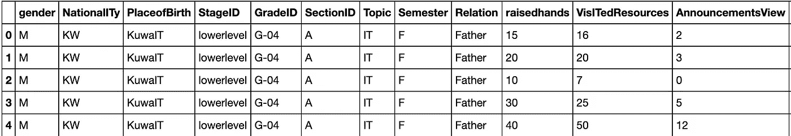
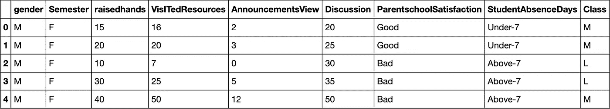
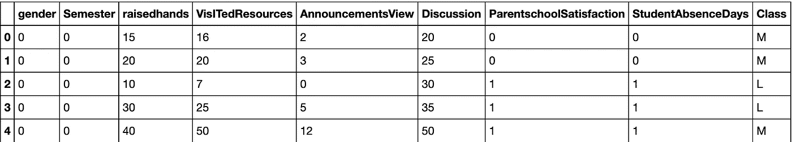
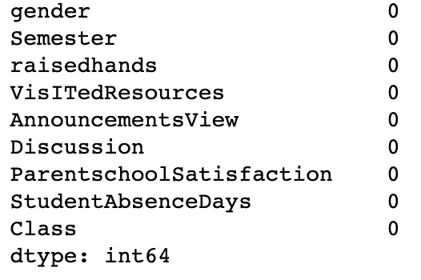
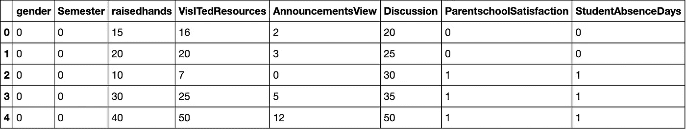
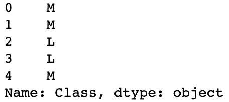
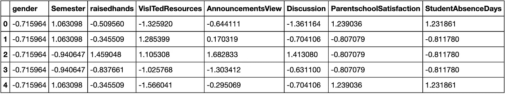
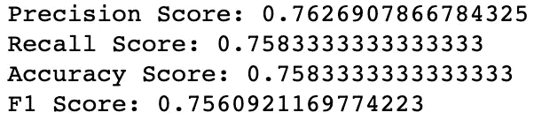

# 关于 KNN 的简短一课

> 原文：<https://towardsdatascience.com/a-quick-little-lesson-on-knn-98381c487aa2?source=collection_archive---------34----------------------->

## 对于初学者，由初学者


这与 KNN 无关。虽然现在想想，我猜这些树技术上来说都是邻居！(来源:作者)

如题所示，这里有一个关于如何在 SciKit-Learn 中构建一个简单的 KNN 模型的简短课程。我将使用[这个数据集](https://www.kaggle.com/aljarah/xAPI-Edu-Data)。它包含学生学习成绩的信息。

包括的特征有学生举手的次数、他们的性别、家长满意度、他们缺课的频率以及他们参与课堂讨论的频率。

每个学生被分成三个班级:高年级(H)、中等年级(M)和低年级(L)。我使用了其他特征来预测它们属于哪个类别。

仅供参考:

*   高，90–100
*   中等，70–89
*   低，0–69

好吧，酷！让我们开始吧。

# 库导入

```
**import** **numpy** **as** **np**
**import** **pandas** **as** **pd**
**import** **seaborn** **as** **sns**
**import** **statsmodels.api** **as** **sm**

**from** **sklearn.model_selection** **import** train_test_split
**from** **sklearn.preprocessing** **import** StandardScaler
**from** **sklearn.neighbors** **import** KNeighborsClassifier
**from** **statsmodels.formula.api** **import** ols**from** **sklearn.metrics** **import** precision_score, recall_score,
                            accuracy_score, f1_score**import** **matplotlib.pyplot** **as** **plt**
%matplotlib inline
```

首先，您想要导入您将需要的所有库。有些人在过程的每个阶段导入每个库，但是我个人喜欢在开始的时候全部导入。

从技术上讲，我们不会真的使用 Seaborn 或 MatplotLib，但我喜欢把它们放在身边，以防万一我想在这个过程中可视化一些东西。

# 初始数据导入

```
df = pd.read_csv('xAPI-Edu-Data.csv')
df.head()
```



部分输出截图。

酷！数据一开始就很好。没有丢失的值，也没有异常值。然而，我们必须做少量的预处理来为我们的模型做好准备。

## 预处理

```
*# Dropping all unnecessary columns*

df = df.drop(['NationalITy', 'PlaceofBirth', 'StageID', 'GradeID',
              'SectionID', 'Topic', 'Relation',
              'ParentAnsweringSurvey'],
              axis = 1,
              inplace = False)
df.head()
```



输出截图。

在为 KNN 模型提供信息时，您只希望包含您实际上希望做出决策的特性。这似乎是显而易见的，但我认为值得一提。

```
*# Binary encoding of categorical variables*

df['gender'] = df['gender'].map({'M': 0, 'F': 1})
df['Semester'] = df['Semester'].map({'F': 0, 'S': 1})
df['ParentschoolSatisfaction'] = df['ParentschoolSatisfaction'].map({'Good': 0, 'Bad': 1})
df['StudentAbsenceDays'] = df['StudentAbsenceDays'].map({'Under-7': 0, 'Above-7': 1})

df.head()
```



输出截图。

如果你从来没有这样做过，可能不太明显的是，你必须编码你的分类变量。想想也有道理。一个模型并不能真正诠释‘好’或‘坏’，但它可以诠释 0 和 1。

```
*# Check for missing values*

df.isna().sum()
```



输出截图。

我知道我已经说过，我们没有任何缺失的价值观，但我只是想彻底了解一下。

```
*# Create a new dataframe with our target variable, remove the target variable from the original dataframe*

labels = df['Class']
df.drop('Class', axis = 1, inplace = **True)**
```

然后—

```
df.head()
```



截图输出。

```
labels.head()
```



输出截图。

接下来，我们希望将目标特征与预测特征分开。我们这样做是为了给我们的数据创建一个训练/测试分割。说到！

# 训练/测试分割

```
X_train, X_test, y_train, y_test = train_test_split(df, labels,
                                                    test_size = .25,
                                                    random_state =
                                                    33)
```

*我意识到上面的格式很糟糕，我只是想让它对于这篇中型文章来说更易读。

# 缩放数据

下一部分提出了两个要点:

1.  你需要缩放数据。如果不这样做，绝对值较大的变量将在模型中被赋予更大的权重，而没有真正的原因。我们有二进制编码的特征(0，1)，但我们也有学生举手次数的特征(0-80)。我们需要把它们放在同样的尺度上，这样它们在模型中就有同样的重要性。
2.  您必须在执行训练/测试分割后缩放数据。如果你不这样做，你会有泄漏，你会使你的模型失效。要获得更全面的解释，请查看 Jason Browlee 的这篇文章,他拥有大量关于机器学习的惊人资源。

好消息是，这非常容易做到。

```
scaler = StandardScaler()

scaled_data_train = scaler.fit_transform(X_train) 
scaled_data_test = scaler.transform(X_test)

scaled_df_train = pd.DataFrame(scaled_data_train, columns =
                               df.columns)scaled_df_train.head()
```



输出截图。

太棒了。简单的柠檬榨汁机，我们的数据是成比例的。

# 符合 KNN 模型

```
*# Instantiate the model*
clf = KNeighborsClassifier()

*# Fit the model*
clf.fit(scaled_data_train, y_train)

*# Predict on the test set*
test_preds = clf.predict(scaled_data_test)
```

真的就这么简单。现在，我们想看看我们的基线模型表现如何。

# 评估模型

```
**def** print_metrics(labels, preds):
    print("Precision Score: **{}**".format(precision_score(labels,
           preds, average = 'weighted')))
    print("Recall Score: **{}**".format(recall_score(labels, preds,
           average = 'weighted')))
    print("Accuracy Score: **{}**".format(accuracy_score(labels,
           preds)))
    print("F1 Score: **{}**".format(f1_score(labels, preds, average =
           'weighted')))print_metrics(y_test, test_preds)
```



输出截图。

就这样，几乎不费吹灰之力，我们就创建了一个预测模型，能够以 75.8%的准确率将学生分类到他们的学术表现类别。还不错。

我们或许可以通过调整模型的参数来改善这一点，但我将把这留给另一篇文章。

快乐学习。😁