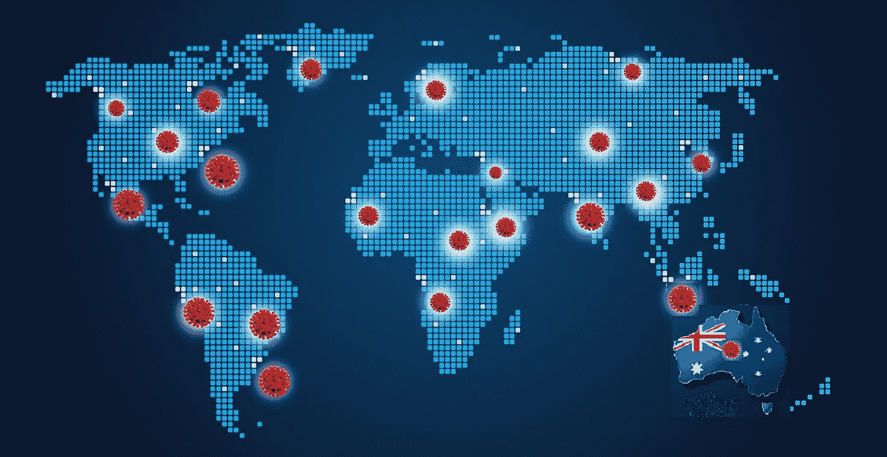
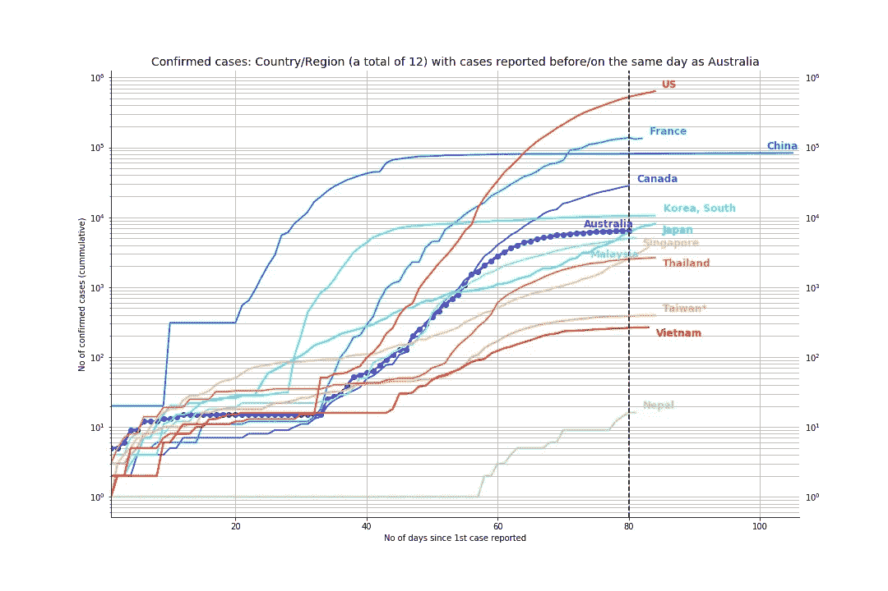
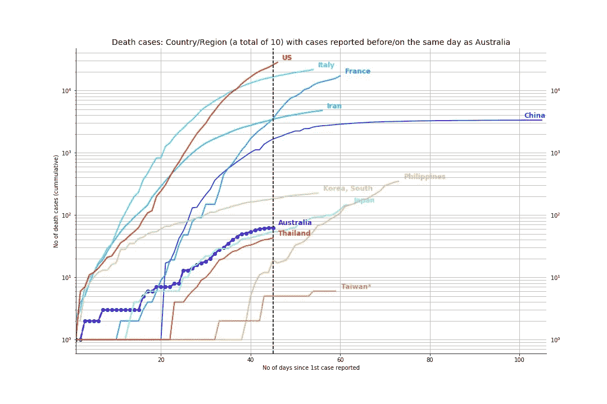
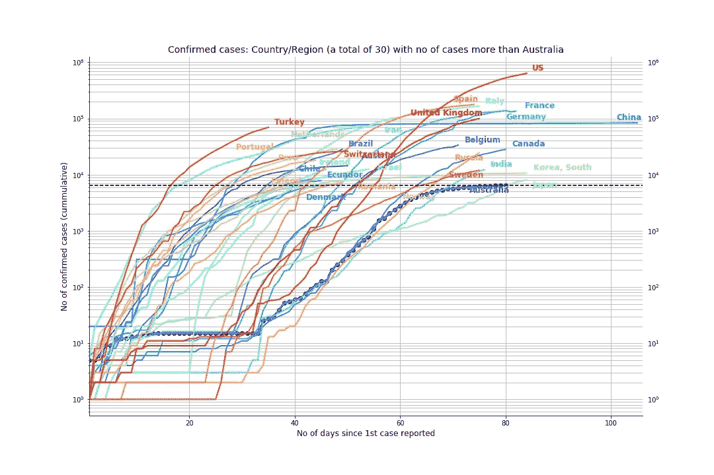
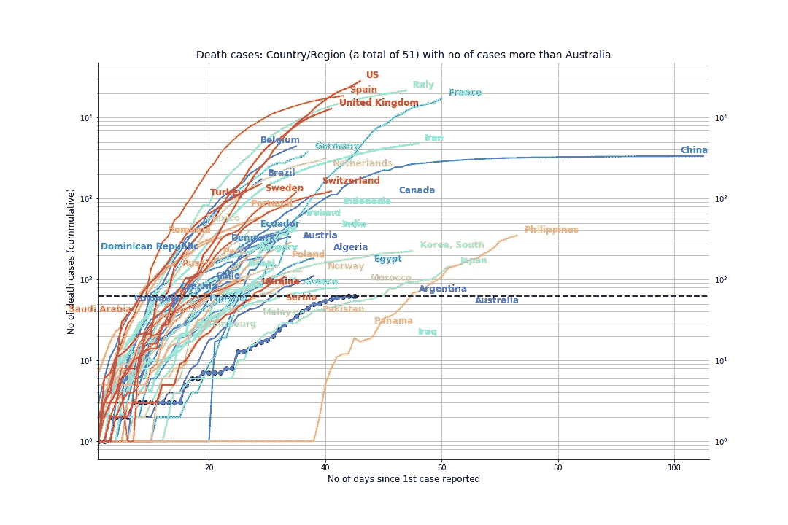
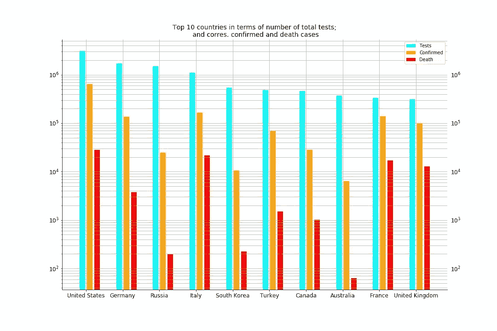
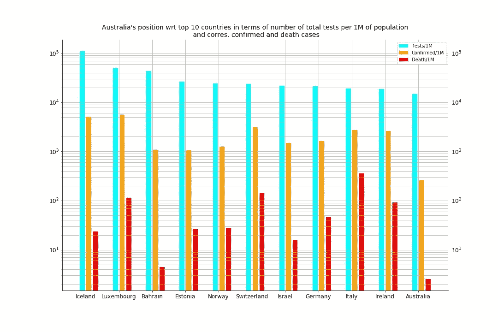

# 快速浏览澳洲的新冠肺炎

> 原文：<https://towardsdatascience.com/a-quick-look-at-covid-19-in-australia-7b730694201e?source=collection_archive---------55----------------------->

## 澳大利亚在病例、死亡和检测方面的表现如何

皮沙贝

新冠肺炎扰乱了整个世界，影响了我们生活中的几乎所有事情。虽然澳洲是一个远离一切的“大岛”，但它没有逃过世界卫生组织(世卫组织)3 月 11 日宣布的疫情。自 2019 年 12 月中国武汉报告冠状病毒爆发以来，它已在几个月内蔓延至全球危机。

**截至 2020 年 4 月 15 日**，全球确诊病例总数已达 198 万例，死亡人数超过 12.66 万。澳大利亚记录了 6440 例确诊病例和 63 例死亡。为了了解澳大利亚与世界其他国家相比的新冠肺炎，我们调查了澳大利亚与其他国家在容量、速度和测试方面的比较数据。

# 数据

我们使用了来自人道主义数据交换( [HDE](https://data.humdata.org/event/covid-19) )的时间序列和人口数据集。它包含从 1 月 22 日记录的病例数，由约翰·霍普金斯大学系统科学和工程中心汇编。

*   [数据集](https://data.humdata.org/dataset/novel-coronavirus-2019-ncov-cases)追踪全球受新冠肺炎影响的人数，包括确诊、康复和死亡病例。
*   跟踪各国开展的测试数量的数据集。

鉴于 HDE 的数据集没有 1 月 22 日之前中国的数据，我们使用了 1 月 1 日至 21 日中国记录的病例数据，数据来源于“2019 年新型冠状病毒疾病爆发的流行病学特征(新冠肺炎)-中国，2020 年”(《中国疾病预防控制中心》，CCDC 周刊/第 2 卷/第 x 期)。

# 将澳洲与较早或同时出现新冠肺炎病例的国家进行比较

2020 年 1 月 26 日，澳大利亚记录了首例确诊病例。在澳洲之前或同时，总共有 12 个国家报告了新冠肺炎病例。除中国之外，所有其他 11 个国家从第 1 天起报告的病例数(1-5)处于类似规模。如下图所示，我们从第一天开始绘制了所有国家的地图。截至 2020 年 4 月 15 日的第 80 天，澳大利亚在确诊病例数方面在这些 **13** 个国家中排名第**7**，这使澳大利亚处于这些国家的中间。

美国、法国、加拿大与澳大利亚正处于相同的转折点，在第一例病例传入该国 30 天后，病例数量急剧增加。有趣的是，直到第 55 天左右(2020 年 3 月 25 日)，加拿大和澳大利亚都在同一轨迹上。3 月 23 日实施了第一阶段限制，一个月后实施了第二阶段限制。从那以后，加拿大在人数上继续增长，与美国和法国一样，但是澳大利亚开始变平曲线。

与新加坡、台湾和越南等其他几个较早推出全国性社会距离措施的国家相比，澳大利亚在没有政府管理措施的情况下，肯定在第二个月就超过了他们的速度。然而，我们可以看到，差距在第三个月越来越小，而澳大利亚花了很大的努力来拉平曲线。

# 将澳洲与新冠肺炎早些时候或同时死亡的国家进行比较

3 月 4 日，澳大利亚记录了首例死亡病例。总共有 **10** 个国家在澳洲之前或同时报告了新冠肺炎的死亡。如下图所示，我们从第一天开始绘制了所有国家的地图。在这 11 个国家中，截至 2020 年 4 月 15 日的第 46 天，澳大利亚在死亡人数上排名第**第 9**，澳大利亚排名垫底。

像美国、意大利和法国这样的国家从死亡报告开始就一直在上升，并且在进入第二个月时仍在上升，数量更大，速度更快。有趣的是，日本和澳大利亚的死亡人数几乎相同。

台湾的人口与澳大利亚相似，但人口密度要高得多，但他们设法保持了异常低的死亡人数。根据台湾国立卫生研究院传染病主任的说法，台湾已经采取了措施，并利用了他们以前应对 SARS 的经验。

# 将澳大利亚与有更多或相同确诊病例的国家进行比较

截至 4 月 15 日，即澳大利亚自首例确诊病例以来的第 80 天，共有 **30 个**国家报告了比澳大利亚更多的确诊病例。鉴于已经有 6 个国家比澳大利亚更早或与澳大利亚同时发现新冠肺炎病例，其余 24 个国家都在本国发现了首例病例，但病例数量的增长速度比澳大利亚快得多。例如，土耳其在一个月内就达到了与中国几乎相同的确诊病例数。大量国家比澳大利亚更快地出现更多病例，这可能表明澳大利亚在总体上控制传播方面行动较早。

# 将澳大利亚与死亡人数更多或相同的国家进行比较

如前所述，有 10 个国家比澳大利亚更早或同时报告死亡，其中 8 个国家的死亡人数比澳大利亚多。截至 4 月 15 日，这是澳大利亚自第一例确诊以来的第 46 天，另有 43 个国家在报告第一例死亡后的短时间内报告的死亡人数超过澳大利亚。例如，比利时在一个月内报告的死亡人数与中国几乎相同，而不是两个月。大多数 T2 国家报告的死亡人数以更快的速度急剧上升。这可能表明，与这些国家的其他卫生保健系统相比，澳大利亚卫生系统在处理感染病例方面总体上处于更好的条件或状况。

# 将澳大利亚与测试排名靠前的国家进行比较

测试已经成为控制传播和确定开放国家或缓解社会距离措施的准备状态的关键措施。为了了解澳大利亚的情况，我们看一下截至 4 月 15 日的快照数据，如下图所示，澳大利亚在已进行或记录的测试总数方面排名第**第 8**。

美国、意大利、法国和英国在检测数量和确诊病例之间的比例相似。这些国家做了大量的检测，也有非常多的确诊病例。有趣的是，韩国和澳大利亚在这一比例方面更接近，但有大量的检测和少量的确诊病例。值得一提的是，在这些做大量检测的顶尖国家中，澳大利亚是死亡人数最少的一个。

为了比较澳大利亚和世界上每百万人口检测数排名前 10 位的国家，见下图。除了德国和意大利，所有其他国家在每百万人口的检测数量上都从榜首滑落。总的来说，澳大利亚总的测试次数和每百万人的测试次数表明，与其他国家相比，我们在测试方面做得相当好。

# 全部的

截至 2020 年 4 月 15 日，澳大利亚共有 6440 例确诊病例，共有 63 例死亡，病死率为 0.97%。这远低于 6.39%的世界平均水平。没有世界级的医疗保健系统和政府采取的严格措施，这是不可能的。当然，还有许多其他因素，如测试和财务方案等，对澳大利亚的曲线变平产生了很大影响。

> 我们所有人都在帮助澳洲对抗新冠肺炎并保持团结方面扮演着重要的角色！

[*吉塔达斯*](https://www.linkedin.com/in/gitadas/) *是计算机视觉和机器学习领域的研究者和开发者。如果我们能帮助人们了解新冠肺炎，Gita 和我都有同样的热情探索数据，并与新冠肺炎一起获得洞察力。*

*请随时访问*[*GitHub repo*](https://github.com/gitadas/Covid-19-Predication-for-Australia/blob/master/COVID-19_v1.ipynb)*，我们欢迎您的反馈和意见。*

*这篇文章在 LinkedIn* [*帖子*](https://www.linkedin.com/pulse/quick-look-covid-19-australia-catherine-lopes-ph-d-/) *上也有。*

***编者注:*** [*走向数据科学*](http://towardsdatascience.com/) *是一份以数据科学和机器学习研究为主的中型刊物。我们不是健康专家或流行病学家，本文的观点不应被解释为专业建议。想了解更多关于疫情冠状病毒的信息，可以点击* [*这里*](https://www.who.int/emergencies/diseases/novel-coronavirus-2019/situation-reports) *。*