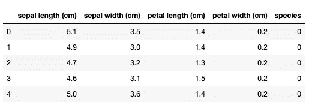
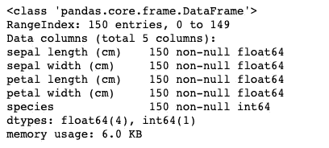
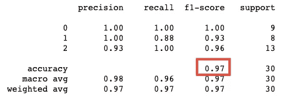
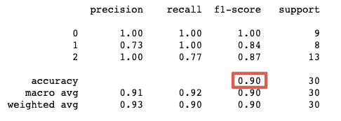
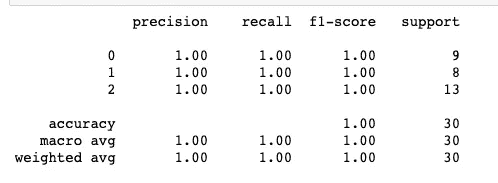
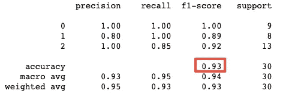
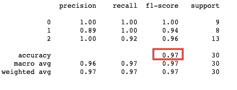

# 5 种 scikit-learn 分类算法的快速概述

> 原文：<https://towardsdatascience.com/a-quick-overview-of-5-scikit-learn-classification-algorithms-33fdc11ab0b9?source=collection_archive---------25----------------------->

## 了解如何使用这五种算法，只用几行代码就能构建模型


图片来自[皮克斯拜](https://pixabay.com/?utm_source=link-attribution&utm_medium=referral&utm_campaign=image&utm_content=3252160)

**简介**

在本文中，我将向您展示如何使用 scikit- learn 为分类目的构建快速模型。

我们将使用具有三个不同目标值的 Iris 数据集，但是您应该能够对任何其他多类或二进制分类问题使用相同的代码。

您将学习如何拆分模型的数据，如何使算法适合五种不同类型模型的数据，然后使用分类报告对结果进行简要评估。

我们将在这里使用的算法是:

> 逻辑回归
> 
> KNN
> 
> 决策图表
> 
> 随机福里斯特
> 
> 梯度推进

是时候开始了！

**加载数据和快速数据浏览**

让我们使用以下代码加载 Iris 数据集:

```
from sklearn.datasets import load_iris
import pandas as pddata = load_iris()
df = pd.DataFrame(data['data'], columns=data['feature_names'])
df['species'] = data['target']
df.head()
```



这个数据集中只有五列。最后一栏*物种*是我们将试图预测的，我们将称之为目标。所有其他列将作为特征，并使用它们来进行预测。

在您自己的数据集中，清楚地确定什么是目标，什么是特征是很重要的。

让我们调用 info()函数来进一步了解我们的数据:

```
df.info()
```



如您所见，只有 150 个条目，任何一列都没有丢失值。此外，所有值要么是浮点数，要么是整数。

然而，从数据集描述中，我知道*物种*不是一个连续变量，而是一个分类变量(因此分类不是回归)。

我们可以检查这一点，并通过 value_counts()函数查看目标值是如何分布的:

```
df.species.value_counts()2    50
1    50
0    50
Name: species, dtype: int64
```

我们可以看到,*物种*列只有三个值:0、1 和 2，并且所有的类都有相同数量的例子:每个类 50 个。就目标值分布而言，这是一个完美平衡的数据集。

由于我们的数据是*“非常干净”*，没有缺失值或分类变量作为特征，并且在目标方面平衡良好，我们可以实际进入建模部分。

****如果您的数据有缺失值，您必须通过删除或用近似值替换它们来处理。此外，如果有分类变量作为特征，那么就需要一键编码。*

**将数据集分为训练和测试**

在将数据拟合到模型之前，有必要将数据分为训练和测试部分。这一点很重要，因为您不应该在对其进行训练的相同数据上测试您的模型。

幸运的是，使用 scikit-learn 中的 train_test_split 函数很容易做到这一点:

```
from sklearn.model_selection import train_test_split
x_train, x_test, y_train, y_test = train_test_split(df.drop('species', axis=1), df.species ,test_size = 0.2, random_state=13)
```

由于此功能，我们现在将数据分为 4 个部分:

> x _ 火车
> 
> x _ 测试
> 
> y _ 火车
> 
> y _ 测试

x 前缀是指保存特征信息的数据部分，y 前缀的数据保存数据的目标部分。你可以从我之前写的[文章](/splitting-your-data-to-fit-any-machine-learning-model-5774473cbed2)中了解更多关于这个函数是如何工作的。

从现在开始，我将在列车部分(x_train 和 y_train)拟合模型，并在测试部分(x_test 和 y_test)进行测试。

我们现在可以安装我们的第一个模型。

**逻辑回归**

让我们从实现逻辑回归的第一个模型开始。

我们将从 scikit-learn 线性模型包中导入模型，并使用 fit()函数训练模型，然后使用 predict()函数对测试集进行预测:

```
from sklearn.linear_model import LogisticRegression
clf = LogisticRegression().fit(x_train, y_train)
predictions = clf.predict(x_test)
```

如您所见，我使用了 fit()函数训练数据部分(x 和 y 部分),为了进行预测，我仅使用了 x_test。我现在可以将预测值与实际目标值进行比较(y_test)。

直到现在我也不知道我的模型是否做了正确的预测。为了对此进行评估，我将使用 sci-kit learn 中的 classification_report:

```
from sklearn.metrics import classification_report
print(classification_report(y_test, predictions))
```



分类报告将我们对目标变量的预测与实际类别进行比较。我希望你们主要关注的指标是准确性。在这种情况下，我们已经正确预测了 97%的类，还不错。

在本文中，我不打算详细解释分类报告，但我想强调的是，在比较模型和准确性的同时，关注精确度、召回率和 f 值是非常重要的。为此，我打印了整个报告，而不仅仅是准确性。我认为这是一个方便的功能，可以将所有这些指标汇总在一起。如果你想了解更多关于精确度、召回率、f 分数的知识，也想学习阅读混淆矩阵，请查看这篇[文章](/reading-a-confusion-matrix-60c4dd232dd4)。

回到准确性…看起来简单的逻辑回归允许我们获得 97%的正确预测。毫无疑问，这是一个很好的起点，如果我对此感到满意，我就可以用它来高精度地预测花卉种类。

**K-最近邻(KNN)**

现在让我们在相同的数据上训练**K-最近邻:**

```
from sklearn.neighbors import KNeighborsClassifier
neigh = KNeighborsClassifier()
neigh.fit(x_train, y_train)
predictions = neigh.predict(x_test)
```

**我们已经为算法使用了默认参数，所以我们正在寻找五个最近的邻居，并且在估计类预测时给它们相等的权重。**

**您现在可以调用分类报告:**

```
from sklearn.metrics import classification_report
print(classification_report(y_test, predictions))
```

****

**具有默认值的 KNN 似乎比逻辑回归略差。准确率从 0.97 下降到 0.9，平均召回率、准确率和 f 值似乎也降低了。**

**我们可以和 KNN·帕拉姆一起玩，看看是否可以改进。可能的改进包括改变用于预测的邻居数量或使用考虑邻居邻近性的不同权重。**

****决策树****

**让我们看看另一种分类算法。我现在将调用一个带有默认参数的决策树来执行:**

```
from sklearn.tree import DecisionTreeClassifier
clf = DecisionTreeClassifier(random_state=0)
clf.fit(x_train, y_train)
predictions = clf.predict(x_test)
```

**我提供的唯一参数是一个随机状态。这就是为什么我的结果是可重复的。**

```
from sklearn.metrics import classification_report
print(classification_report(y_test, predictions))
```

****

**正如你所看到的，这个决策树在测试数据集上表现得非常好。我预测所有的类都是正确的！**

**乍一看似乎很棒，但我可能在这里太适合了。我可能应该使用交叉验证来调整模型参数，以防止过度拟合。**

**以下代码仅对训练数据执行 10 重交叉验证，并打印出每一重的准确度:**

```
from sklearn.model_selection import cross_val_score
cross_val_score(clf, x_train, y_train, cv=10)array([1\.        , 0.92307692, 0.91666667, 0.91666667, 0.91666667,
       1\.        , 0.91666667, 1\.        , 1\.        , 0.90909091])
```

**通过检查输出，我可以看到，在一些数据拆分中，我确实获得了 100%的准确性，但有相当多的数据拆分的准确性几乎低了 10%。原因是我使用的数据集非常小。仅仅一个实例的错误分类就会导致巨大的准确性波动。**

******一般来说，正如我在这里演示的那样，使用默认算法构建第一个模型是没问题的，但下一步应该是使用交叉验证运行参数。***

****随机福里斯特****

**让我们尝试用它的默认参数调用随机森林分类器。**

**您可以将随机森林视为一组决策树。森林实际上是通过使用许多决策树，然后对结果进行平均来构建的。我不打算在这里解释算法的细节，而是用它的默认参数调用它。**

```
from sklearn.ensemble import RandomForestClassifier
clf = RandomForestClassifier(random_state=0)
clf.fit(x_train, y_train)
predictions = clf.predict(x_test)
```

**让我们运行一个分类报告:**

```
from sklearn.metrics import classification_report
print(classification_report(y_test, predictions))
```

****

**我们这里有 93%的准确率。我们已经看到了以前的分类算法的一些更好和一些更差的结果。**

**为了调整和改进算法，您可以调整估计器的数量、深度和结构。这需要学习更多关于树和算法本身如何工作的知识。有很多关于这方面的文章，所以我建议你搜索一下，如果你想了解更多的话。**

****梯度增强****

**让我们试试我们将在本文中提出的最后一个算法:梯度推进分类器。这是另一种树型算法，对于许多机器学习问题非常有效。**

**让我们使用 scikit-learn 函数调用 is:**

```
from sklearn.ensemble import GradientBoostingClassifier
clf = GradientBoostingClassifier(random_state=0)
clf.fit(x_train, y_train)
predictions = clf.predict(x_test)
```

**并运行分类报告:**

```
from sklearn.metrics import classification_report
print(classification_report(y_test, predictions))
```

****

**这是另一个得分很高的算法。我们已经达到了 97%的准确率。**

**看起来我们所有的模型都做了相当不错的预测，即使使用了默认的未调整参数！**

****比较分类算法****

**你可以看到，我们已经提出了五个算法，它们都在测试集上取得了很高的准确率。该算法的准确率从 90% (KNN)到 100%(决策树)。**

**理论上，这种算法中的任何一种都可以用来以相当高的准确度(超过 90%)预测花卉香料。**

**因为我们已经做了相当快速的分析，并且没有深入每个实现的细节，所以很难决定哪个算法是最好的。这将需要对每个算法实现进行更多的分析和调整。**

****总结****

**您已经大致了解了五种基本分类算法，并学习了如何使用默认参数调用它们。阅读完本文后，您还应该能够使用快速分类报告来评估它们的性能。**

**下一步应该是更多地了解每种算法，并对其进行调整以提高性能和避免过度拟合。**

***最初发表于 about datablog . com:*[5 个 scikit-learn 分类算法的快速概述](https://www.aboutdatablog.com/post/a-quick-overview-of-5-scikit-learn-classification-algorithms)，*2020 年 5 月 19 日。***

***PS:我正在 Medium 和*[***aboutdatablog.com***](https://www.aboutdatablog.com/)*上撰写深入浅出地解释基本数据科学概念的文章。你可以订阅我的* [***邮件列表***](https://medium.com/subscribe/@konkiewicz.m) *以便在我每次写新文章时得到通知。如果你还不是中等会员，你可以在这里加入*[](https://medium.com/@konkiewicz.m/membership)**。****

***下面还有一些你可能喜欢的帖子***

***[](/9-pandas-visualizations-techniques-for-effective-data-analysis-fc17feb651db) [## 9 熊猫有效数据分析的可视化技术

### 学习如何使用折线图、散点图、直方图、箱线图和其他一些可视化技术

towardsdatascience.com](/9-pandas-visualizations-techniques-for-effective-data-analysis-fc17feb651db) [](/what-are-lambda-functions-in-python-and-why-you-should-start-using-them-right-now-75ab85655dc6) [## python 中的 lambda 函数是什么，为什么你现在就应该开始使用它们

### 初学者在 python 和 pandas 中开始使用 lambda 函数的快速指南。

towardsdatascience.com](/what-are-lambda-functions-in-python-and-why-you-should-start-using-them-right-now-75ab85655dc6) [](/7-practical-pandas-tips-when-you-start-working-with-the-library-e4a9205eb443) [## 当你开始与图书馆合作时，7 个实用的熊猫提示

### 解释一些乍一看不那么明显的东西…

towardsdatascience.com](/7-practical-pandas-tips-when-you-start-working-with-the-library-e4a9205eb443)***