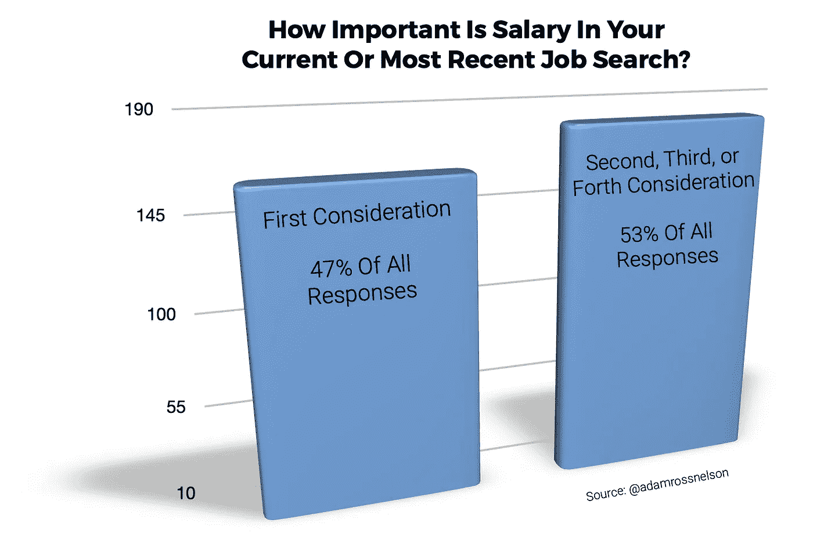
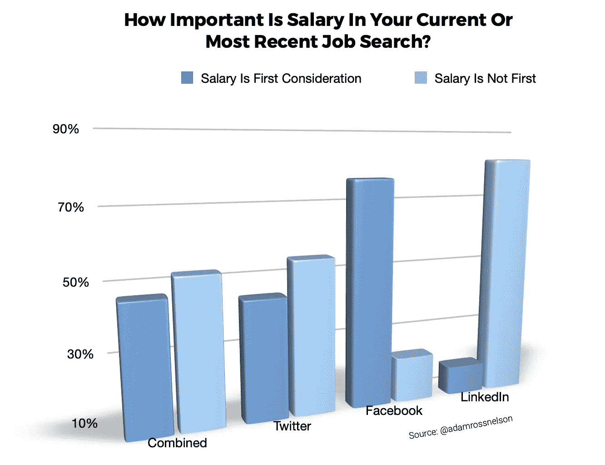

# 对数据科学和研究导向的专业人员、方法和结果的快速调查

> 原文：<https://towardsdatascience.com/a-quick-poll-of-data-science-research-oriented-professionals-fd2fd0629d7?source=collection_archive---------47----------------------->

## 这项民意调查旨在评估在求职过程中，在数据科学和其他研究相关专业领域工作的专业人士中，薪资有多重要

# 介绍

在与现任、前任和有抱负的数据科学家交谈时，我听到了一个常见的抱怨。招聘人员会根据你的薪资历史或你的薪资期望来筛选你。

招聘人员这样做我很困扰，不仅是为了应聘者，也是为了招聘人员。为了进一步推动对话，我利用社交媒体进行了一次民意调查。

我在 2020 年 10 月底和 11 月初进行了这项民意调查。我在 LinkedIn、Twitter 和脸书上发布了调查结果。我使用了标签、关键词和论坛，我认为它们会鼓励那些从事数据科学或其他研究导向职业的人做出回应。我还(通过 Twitter)推广了这项调查，以增加回复数量。

伴随民意调查的提示和帖子要求受访者在决定如何回答时考虑他们当前或最近的求职情况。

# 结果

Image credit:作者对社交媒体投票结果的可视化。

这些民意调查收集了 343 份答复。Twitter 有 269 条，脸书有 47 条，LinkedIn 有 27 条。这里的视觉聚集了来自所有三个平台的响应。

下面的图片提供了分类结果的视图。

尽管综合结果显示，大多数受访者将薪资列为第二、第三、第四或较低的关注点，但各平台的回复模式有所不同。在脸书的回答中，大多数人确实表示薪水是他们最关心的问题。在 Twitter 和 LinkedIn 的回复中，薪资并不是第一关注点。

这和随后的视觉崩溃反应从四类降到两类。

# 结论

Image credit:作者对社交媒体投票结果的可视化。该图显示，在脸书的回答中，大多数人确实表示薪水是他们最关心的问题。然而，在 Twitter 和 LinkedIn 的回复中，薪水并不是第一关注点。

这项简短的、非科学的民意调查表明，数据科学家和其他研究专业人士认为薪水是他们求职的一个重要因素。但是，也许有一半的候选人有他们认为更重要的其他考虑。

尽管这项调查有许多已知和未知的弱点，但它为在招聘过程中询问薪水的相关讨论带来了曙光。

当招聘人员问这个问题时，我对候选人有些担心。候选人似乎面临着一个不可能的选择，要么提出他们认为招聘者会满足的薪水(可能薪酬过低)，要么提出代表应得和应得的职业发展的薪水(可能有被拒绝的风险)。

我也担心招聘人员。当招聘人员在讨论薪资要求的早期筛选候选人时，就失去了从候选人那里了解什么才是真正重要的机会。这种策略也有可能错过优秀的候选人，这些人可能会被与薪资无关的因素所吸引。与此相关的是，对非薪金因素做出反应的候选人现在可能会抵制以后被其他组织聘用的尝试。

对于招聘人员来说，更好的方法是问候选人“在工作机会谈判中，你最重要的考虑因素是什么？”然后，听候选人说。之后，谈谈对候选人重要的考虑因素。然后在入职期间和之后，确保进一步解决你现在知道对新员工很重要的需求和愿望。

 [## 加入我的介绍链接媒体-亚当罗斯纳尔逊

### 作为一个媒体会员，你的会员费的一部分会给你阅读的作家，你可以完全接触到每一个故事…

adamrossnelson.medium.com](https://adamrossnelson.medium.com/membership) 

# 感谢阅读

感谢阅读。把你的想法和主意发给我。你可以写信只是为了说声嗨。如果你真的需要告诉我是怎么错的，我期待着尽快和你聊天。推特:[@ adamrossnelson](https://twitter.com/adamrossnelson)LinkedIn:[亚当罗斯尼尔森](https://www.linkedin.com/in/arnelson/)。