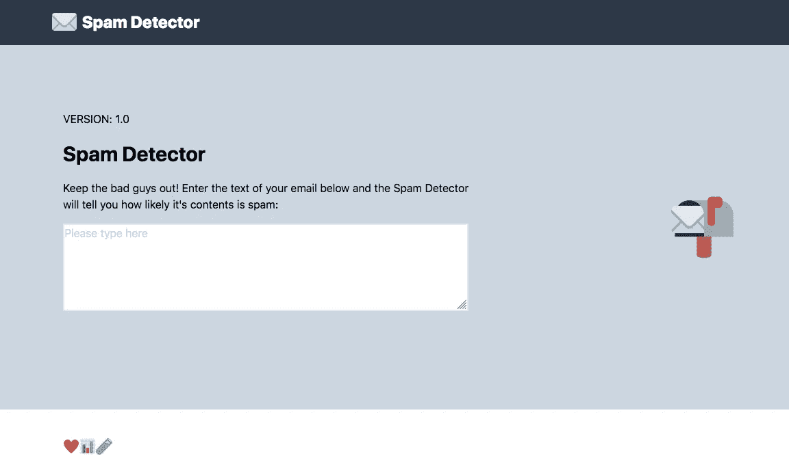
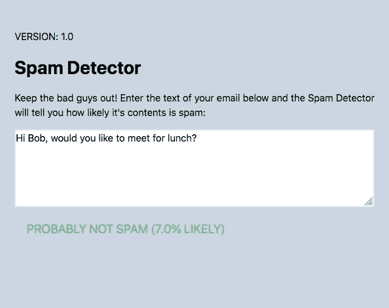
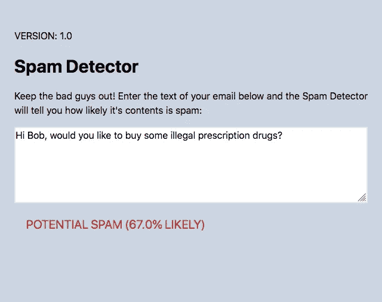

# 数据科学项目 JustPy 快速入门

> 原文：<https://towardsdatascience.com/a-quick-primer-on-justpy-for-data-science-projects-c04bcf87040?source=collection_archive---------37----------------------->

## 只用 Python 构建一个简单的原型站点


你知道什么最棒吗？

制作一个新的模型，并展示出来进行更多的测试。

*你知道什么不好吗？*

做一个新模型，却没有一个很好的方式来展示它。

越来越容易找到一些数据并建立一个模型(无论是低劣的还是深刻的)。你可以训练和测试(以及更多的测试)，但是就像你做的任何东西一样，在使用新数据之前，很难说它有多有用。我确实制作了一些模型，认为它们得分很高，然后当用新的输入进行测试时，显示出它们的真实面目。

你有时会遇到的麻烦是把这个模型放到一个可用的版本中，比如一个网站。你不想要一个蹩脚的纯文本页面，但编写网站代码需要时间和完全不同的技能。不要误解我的意思，我认为 HTML、CSS 和 Javascript 通常是每个人都知道的很好的语言，因为它们在我们现代世界的几乎每个领域都很方便，但是拥有丰富的 web 设计经验不应该是制作有用的数据科学项目的先决条件。有一些 web 框架可以利用您的 Python 技能(比如 Flask 和 Django)，但对我来说，这两种框架都有自己独特的复杂性。

[输入 JustPy](https://justpy.io/) 。这个方便的 Python 包为您提供了在 Python 文件中快速创建网页的能力。它并没有消除对熟悉 web 设计语言的需求，但是可以大大简化事情，特别是对一个模型的测试。它还可以很好地处理熊猫和共享数据可视化。我花了一些时间创建了一个基本模板，您可以在自己的数据科学项目中使用它，但我想分享一下基本知识的概述。

# 你好世界！

在此之前，让我们先来看看这两个神奇的编码词。您首先需要安装 JustPy，这可以通过 pip 轻松完成:

```
pip install justpy
```

接下来，您创建一个 Python 文件，这是您的基本页面:

```
import justpy as jp

def hello_world():
   wp = jp.WebPage()
   p = jp.P()
   p.text = 'Hello!'
   return wp

jp.justpy(hello_world)
```

让我们一行一行地了解一下。首先，我们开始导入 JustPy 并使用他们喜欢的缩写`jp`。接下来，我们将整个页面放在一个函数中，使其清晰且易于调用。在函数内部，我们首先用`jp.WebPage()`创建一个网页实例。需要知道的重要一点是，我们总是要创建页面的实例，然后向其中添加内容。就像网页一样，我们所有的其他标准 web 组件也以类的形式存在。对于这个例子，我们创建一个段落标签的实例，`jp.P()`，然后用一个值设置它的文本属性。有了这些，我们就可以返回网页实例了。最后，我们用`jp.justpy`调用我们的函数，我们就有了一个页面！

# 查看标签类

所以我注意到有助于理解标记类的许多选项。让我们看一个 div 标签:

```
main = jp.Div(
         classes='bg-gray-400 italic', text="My main div", a=wp)
```

这需要您将要更新的三个主要实例变量:`classes`、`text`和`a`。是您想要添加到标签中的类。关于 JustPy 需要注意的一件重要事情是，它集成了 [Tailwind CSS](https://tailwindcss.com/) ，这是一个实用的 CSS 框架，可用于轻松设置页面元素的格式和样式。与其他一些 CSS 框架不同，Tailwind 是相当低级的，所以要获得你想要的外观可能需要一些组合类。`text`显而易见，但了解这一点很重要。是嵌套标签的标签。因为你不像 HTML 那样嵌套标签，你必须告诉每个标签实例它需要放在哪里。在上面的例子中，我只是把这个 div 放在我们的主网页实例中。

# 轻松输入

我认为最初吸引我测试它的原因之一是它可以如何无缝地与输入一起工作，当连接 Python 和 HTML 时，这有时感觉像是一件苦差事。有使用表单的能力，但是对于一个简单的文本输入例子，你可以有这样的东西:

```
in = jp.Input(placeholder='Please type here')
```

嘣，投入！输入的值将存储在类实例中，在这个场景中，它将存储在`in.value`中。您可以实时查看异步函数输入的内容，或者存储并提交进行处理。

# 推出垃圾邮件检测器

好了，我们对基础有了一些了解，让我们来看一个例子！假设您的任务是为公司电子邮件帐户创建一个垃圾邮件检测器。你有一套很好的电子邮件标签，并建立了一个非常直接的逻辑回归模型，你感觉很好。然后就发生了，有人说“我能试试吗？”。与其惊慌失措，不如把这个模型处理掉，然后和你的网页一起放入一个新的 Python 文件中！

为了帮助简化设计，我找到了一个带有顺风模板的网站，并以此为基础。我创建了两个主要函数，一个用于处理输入，一个用于网页。所以在一个 Python 文件中，viola:



看起来相当不错！最重要的是，它不需要大量的文件或依赖项目录。我的整个页面是用一个 Python 文件构建的，还有一个我构建模型的地方。我将它设置为在输入时自动处理，但是你可以看到它在查找垃圾邮件时表现良好。

优点:



坏消息是:



您可以从[我的回购这里](https://github.com/jnawjux/justpy_model_template)跳出来，创建自己的 easy JustPy 模型网页来测试我们自己的数据科学项目。尽情享受吧！