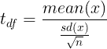
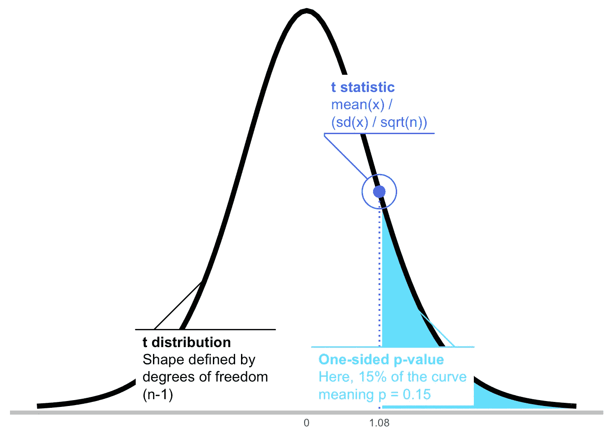
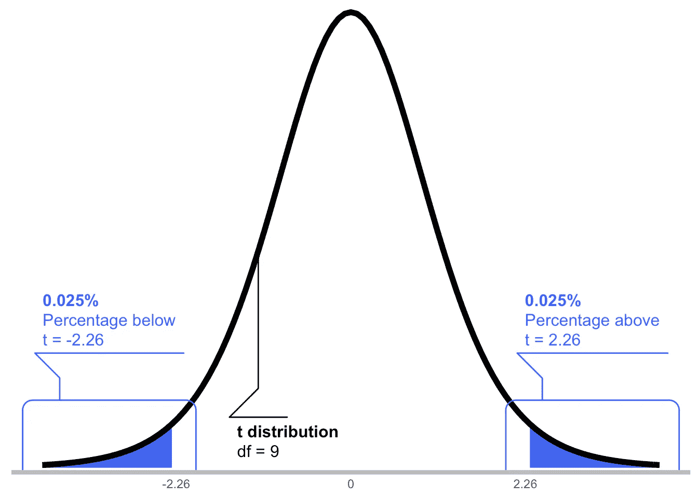
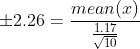
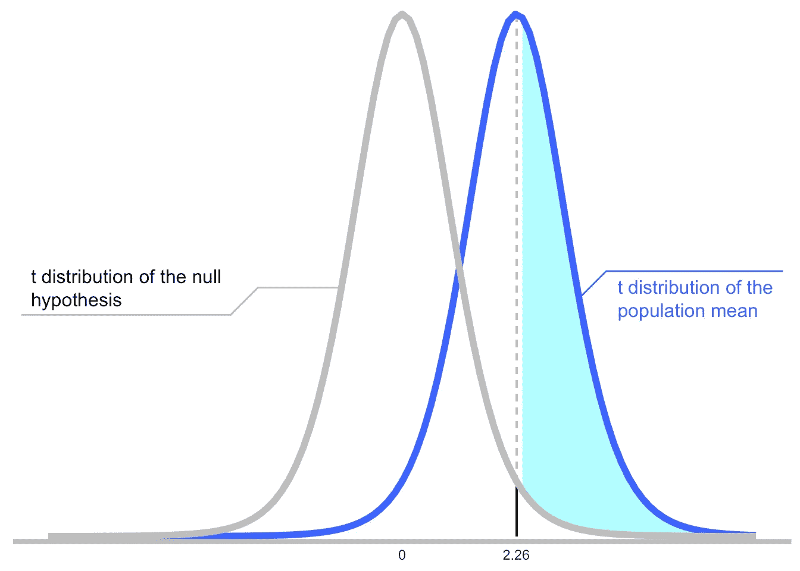
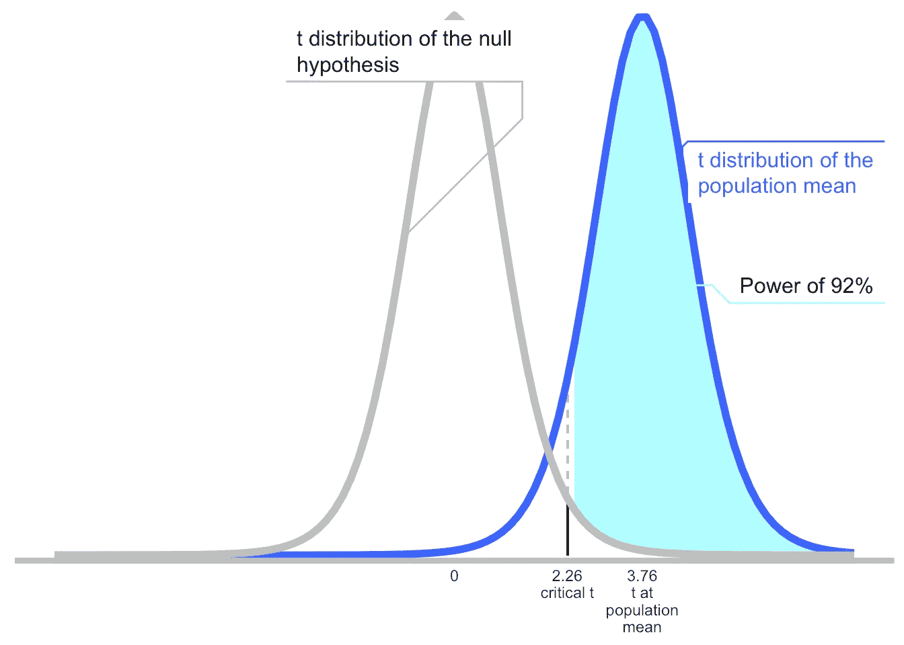
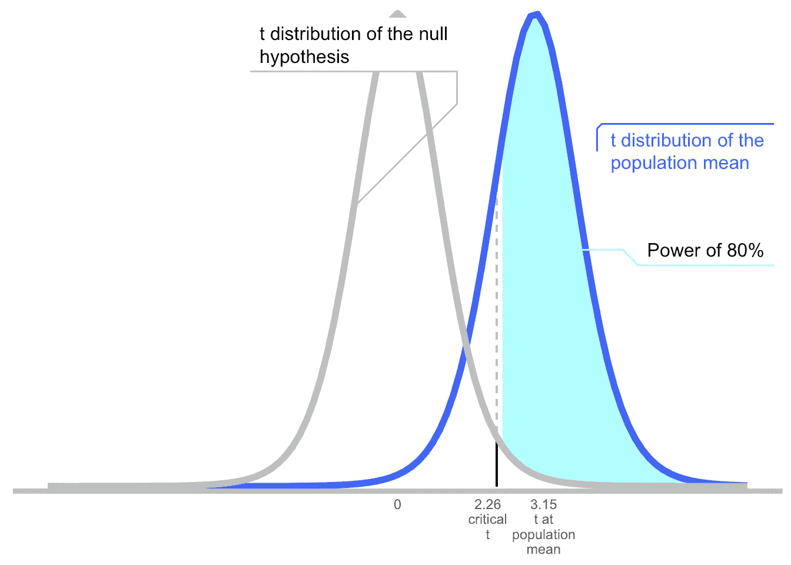

# 统计能力的 4 步复习

> 原文：<https://towardsdatascience.com/a-quick-refresher-of-statistical-power-fe8ae5e0c317?source=collection_archive---------42----------------------->

## 当你忘记如何计算功耗时，这是一个简单易懂的指南

10 多年来，我经常谈论统计的力量，但无法记住细节。如果你和我一样，收藏这篇文章！我将快速介绍在更新您的幂计算知识时需要遵循的四个步骤。

1.  *了解你的重要性测试*
2.  *知道如何从 p* 回来工作
3.  *处理两次不确定性*
4.  *从 p 开始工作两次*

复制这篇文章的所有代码在 GitHub 上都有[。](https://github.com/drsimonj/StatisticalPowerRefresher)

## 我们的数据和统计测试

我们将使用双尾[单样本 *t* 测试](https://en.wikipedia.org/wiki/Student%27s_t-test#One-sample_t-test)来评估以下问题的平均答案是否与 0 有显著差异。

在我们的疫情问题中，人们对回家的感觉从-2(糟糕)到 2(很好)进行评分。由[谷歌](https://www.flaticon.com/authors/google)从[平面图标](https://www.flaticon.com/)制作的图标

# 1.了解你的重要性测试

首先要知道你的功率计算意味着真正知道你如何从数据到 p 值。单样本 *t* 测试的步骤:

*   根据平均值、标准偏差和样本量计算出一个 *t* 统计量:

获得 t 统计量的公式，然后从相应的 *t* 分布映射到 p 值。sd =标准偏差，n =样本量。使用[编码](https://www.codecogs.com/latex/eqneditor.php)准备的方程式。

*   将其映射到带有自由度的 *t-* 分布，样本大小减 1。
*   从该点开始的曲线百分比等于 *p* 值。

*注:为清晰起见，只显示了一面。双边测试的 p 值加倍。*

# 2.知道如何从 p 返回工作

功率计算从*p*-值返回到关于数据的缺失信息。假设我们知道标准偏差(1.17)和样本量(10)，并希望计算平均值，其中 *p =* 0.05。有了*p*-值和样本量，我们就可以得到*t*-值(回想一下，这是一个双尾检验)。

将所有内容代入公式:

做数学和`mean(x) = +/-0.84`。对于我们的标准差和样本，高于 0.84 或低于-0.84 的平均值将具有小于 0.05 的*p*-值。

# 3.两次处理不确定性

假设人口平均值确实是 0.84，确切地说，t = 2.26，T2 = 0.05。你不能保证得到一个重要的结果。记得为什么吗？

在 null (0)附近有一个*t*-分布，因为即使它是真的，我们也很少用那个精确的值对一个组进行采样。同样，我们很少会看到 0.84，即使它是真正的潜在平均值。所以有第二个分布，它描述了在给定真实总体均值的情况下，我们可能观察到的情况。为了简单起见，我们将使用一个等价于零的 *t-* 分布，但是看看[非中心性参数](https://en.wikipedia.org/wiki/Noncentrality_parameter)如何被用于变得严重。

如果总体平均值在临界值 *t* 上，这意味着我们将有 50%的时间观察到样本平均值高于临界值。这是“功效”——在给定特定总体均值的情况下，观察到统计显著结果的概率——总体均值为 0.84。

任何值的幂是其采样分布下超出与零值显著差异点的面积。就像计算另一个 *p* 值一样，如果你知道你的显著性测试，这应该是轻而易举的。在这个例子中，1.40 的总体平均值映射到 3.76 的 *t* 值，并且具有 92%的功效。

# 4.从 *p* 返回工作两次

计算功效很有趣，但更实际的是计算样本大小或可能产生显著结果的效果。两者都涉及设定两种概率:

1.  显著性的阈值(称为 alpha，通常为 0.05)。
2.  期望的功率(称为β，通常为 0.80)

## 计算效果大小

让我们从了解样本大小开始，并希望评估我们可以检测到多大的影响。假设我们可以将我们的调查发送给另外 10 个人，并认为标准差与之前大致相同(1.17)是合理的。显著性阈值为 0.05 时，什么总体均值(正向)具有 0.80 的功效(样本产生显著结果的概率为 80%)。

> ***p1。*** *算出位于意义边界的意思。这里没有变化。是+/-0.84。*
> 
> ***p2***。计算出将分布中最低的 20%和最高的 80%分开的平均值。如果 T30 分布集中在 0(我们马上会解决这个问题)，它将是-0.33。

我们现在需要找到这两点的交汇点。想象移动总体平均值的分布(用于 *p2* )，直到定义 80%功效的值与显著性阈值相同。也就是说，移动分布，使得-0.33 现在是 0.84。分布的中心/平均值相应地移动并落在 1.17(纯粹是巧合，它与标准偏差相匹配)。瞧啊。对于我们已知的样本大小和标准偏差，如果真实总体均值为 1.17 或更大——对应于 3.15 的 *t* 值——我们将有相当好的机会(80%)观察到显著的结果。

## 计算样本大小

让我们反过来试试。假设平均值 1.17 是对我们有意义的最小值，但是我们不确定需要多大的样本。其他标准相同(标准差= 1.17，显著性阈值= 0.05，功效= 0.80)。

这个问题更棘手，因为在不知道样本大小(这涉及到自由度)的情况下，我们不知道 *t* 分布的形状。我们可以通过一些迭代来解决它。在高层次上…

> 第一步。选择一个样本大小。
> 
> 第二步。从 p 回工作两次:
> ***p1。*** *算出位于意义边界的平均值。* ***p2。*** *算出将人口分布分割为 80%的平均值。移动它，使人口值集中在预先确定的效果大小(1.17)。*
> 
> 第三步。如果 p1 和 p2 的结果相等，则停止。 *如果不是，从步骤 1 开始用不同的样本量。*

有很多方法可以优化这一点，你可以在我的代码中找到一个简单的解决方案。不管你怎么做，结果都是 10(验证最后一部分)。为了多样化，让我们尝试一些不同的东西。如果总体均值为 0.02，我们需要多大的样本量才能达到 80%的功效？

27,037!

# **结论**

统计学，像所有的技术课题一样，具有挑战性。学习细节会加深你的理解，但不要觉得有压力去记忆它们。当你学习新技术的时候，学习它的实用价值，它们能解决和不能解决的问题，优势和劣势。当需要技术资料的时候，就准备一篇这样的文章吧:)

感谢阅读。如果你喜欢这个，并且对更高级的电力话题感兴趣，你可能会喜欢我的文章，“Booking.com 如何用 CUPED 增加在线实验的电力”