# Gephi 布局快速教程—使用问答 StackOverflow 数据集

> 原文：<https://towardsdatascience.com/a-quick-tutorial-on-gephi-layouts-daa87fec5a20?source=collection_archive---------22----------------------->

前几天，当我为一个做社交网络分析的朋友准备教学/咨询服务时，我需要修改 Gephi 的布局。以下是我重新学习的总结。

Gephi 是一个令人惊叹的开源网络分析和(交互式！)可视化软件，提供大量非常有用的工具，用于探索图形数据、计算统计数据、检测集群、社区等。它不需要任何编码技能。即使你*有*的编码技能，也请暂时停止使用 Python 的 NetworkX，尝试一下 Gephi。值了。

Gephi 提供的一个非常好的特性是一系列不同的布局算法——也就是您实时查看图表的方式。让我们尝试它们，看看它们背后的直觉是什么，以及它们的利弊。

我们将使用这个来自 Kaggle 的 [StackOverflow](https://www.kaggle.com/stackoverflow/stacksample) 数据集。我创建了一个以**人**为节点的网络，当且仅当 A 回答了 B 的问题时，A — > B 链接才存在。边的权重就是答案的分数。我用 Python 中的 **pandas** 库创建了这个。

当我在 Gephi 中可视化结果图时，它看起来并不太好——因为它是随机布局:

StackOverflow 图的 R̶o̶r̶s̶c̶h̶a̶c̶h̶ ̶t̶e̶s̶t̶随机布局。

# **ForceAtlas**

我们来试试另一种布局: **ForceAtlas** 。这对于小世界/无标度网络是一个有用的布局，对于探索网络也是有用的，因为它不会在绘图时引入偏差。复杂度为 O(N ),建议将其用于< 10K 节点。该算法将强连接的节点拉在一起，并将弱连接的节点推开。你通常需要调整它的参数来得到一个好的显示。

一些定义:

*   小世界:对于每个节点来说，它没有很多邻居，但它的邻居很可能是彼此的邻居，并且大多数节点可以通过**小**步数从每个其他节点到达。(听说过六度分离的想法吗？)
*   无标度:这只是程度分布遵循幂律:

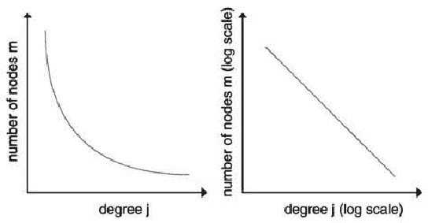

我们如何检验我们的网络是否是无尺度的？直接去统计，运行“平均度”计算。这是我的:

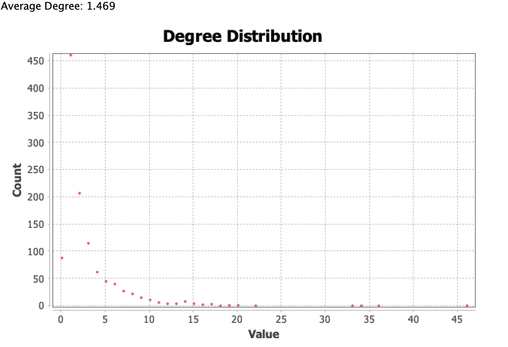

看起来像是幂律！也许原力图集会好看。

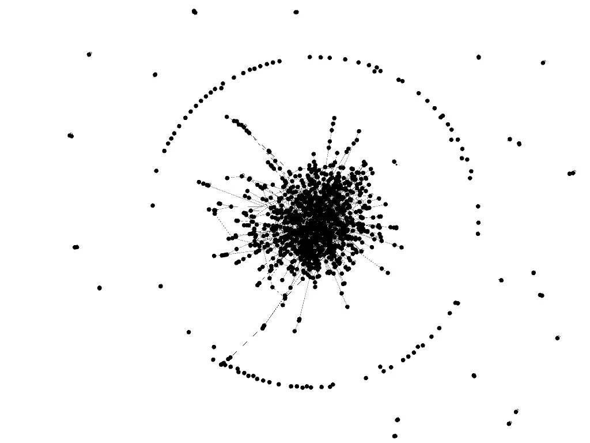

ForceAtlas(默认参数)

这更好——至少孤立的节点被推到了外面。不过网络的中心有点乱。通过选择“按大小调整”参数，我们避免了节点重叠。如果你想要更高的精度，速度可以降低。这是这个过程的前 20 秒:

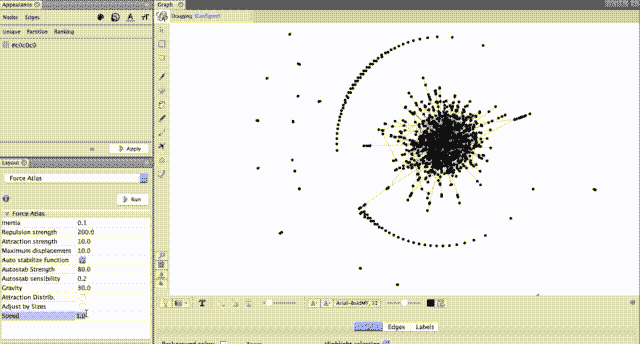

使用“按大小调整”参数移除重叠的节点

这是最后的结果:

按大小调整强制图集

我们可以做得更好。通过到这里:

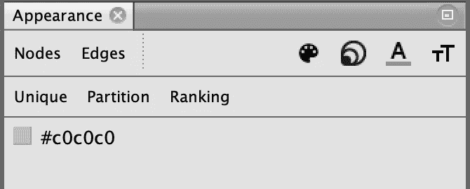

选择“节点”、“等级”和同心圆选项，我们可以使节点的大小与度量成比例，例如，出度。在这之后，我们可以再次运行布局算法，我们得到这个:

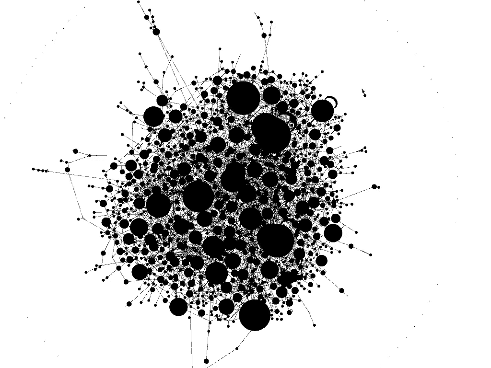

节点大小与输出度成比例

我们甚至可以通过悬停在其中一个大节点上来关注它:

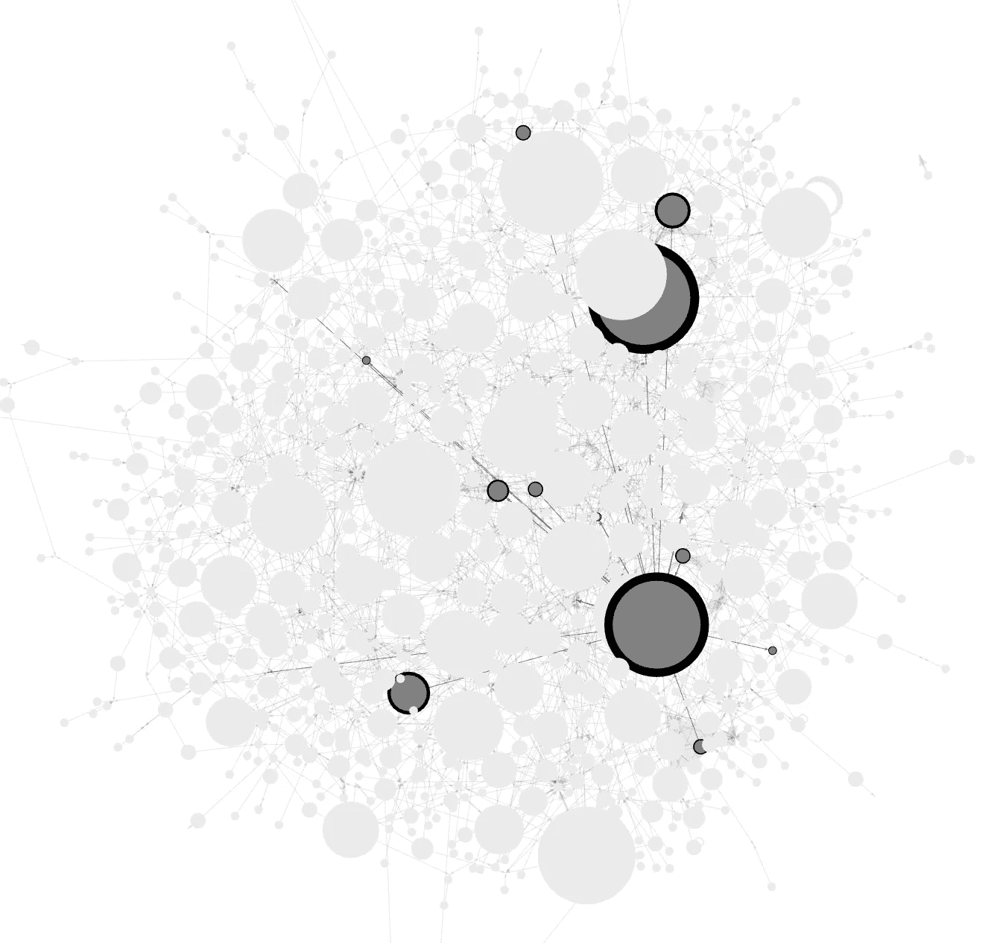

节点的邻域

最后，通过计算模块性统计，我们可以根据节点所属的社区对节点进行着色:

着色的过程类似于用于节点大小的过程——只是这次我们需要选择调色板，以及用于排序的模块化类。结果如下:

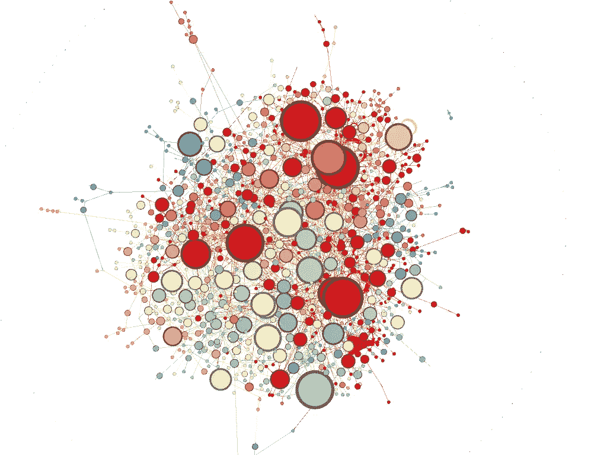

社区可视化

在进入下一个布局之前，让我们再玩一个参数:通过选择景点分布，枢纽(具有高出度的节点)被推到外围，而权威(高入度)更集中。有时，从随机布局重新开始会更好，因为它收敛得更快。

更改后，我们可以看到中心(突出显示)确实位于外围—如果我们过滤出度高于 12、入度低于 3 的节点，我们可以看到中心也不是权威:

具有吸引力分布的 Force Atlas 将枢纽投入到 perifery 中

# 弗鲁特曼-莱因戈尔德

该布局将节点模拟为质量粒子，将边模拟为字符串。然后，它只是最小化系统的能量。复杂度也是 O(N ),但建议使用最多 1K 个节点，因为实际收敛很慢。

请注意，这些边被视为无方向的。这种布局有助于理解图形的拓扑结构，因为拓扑上的近节点位于相同的邻近区域，而远节点彼此远离。因此，断开的组件很容易可视化。

我们将在我们的(已经按社区划分的)网络上运行它。

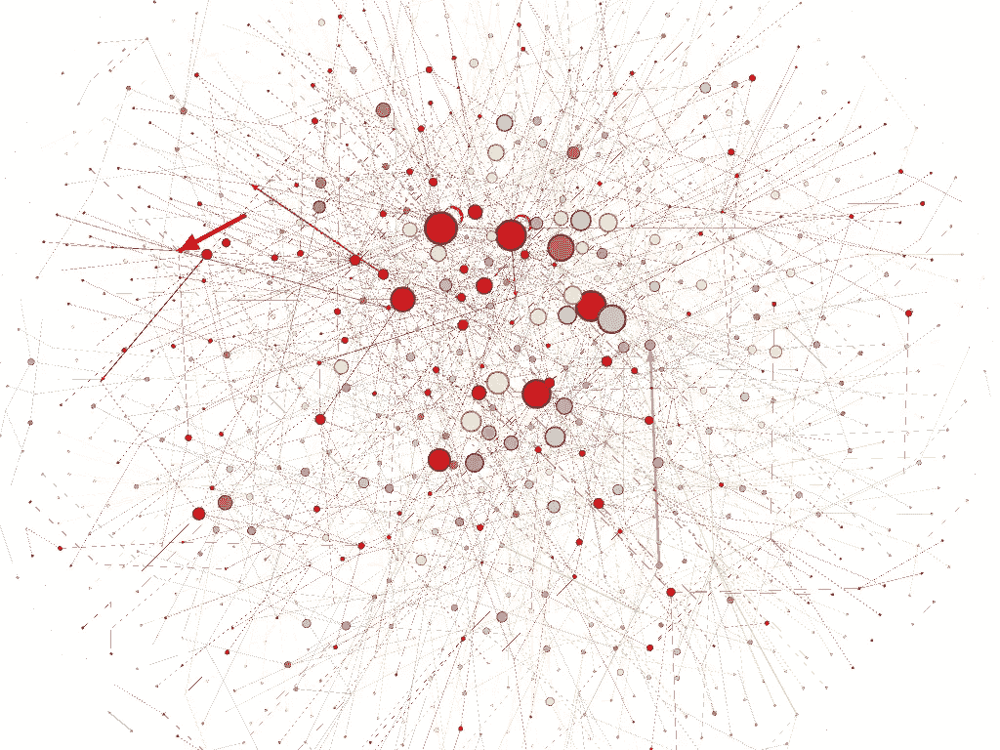

实际上，我们的图表中有很多不相连的部分。我们可以控制布局的面积和重心来避免它们的分散:

# **奥彭德**

这种布局需要一个无方向的加权图，对于检测集群非常有用。它比其他布局更快——复杂度为 O(N log(N))并且推荐用于高达 1M 节点的网络。

OpenOrd 基本上是 Fruchterman-Reingold，带有一个额外的参数(edge cut ),在优化过程中控制边的最大长度。默认值为 0.8:这意味着在优化过程中，长度超过当前最长边长 80%的每条边都被**切割**。这使得星团可以分离，因为高权重的长边会对远处的星团产生不适当的影响(还记得 Fruchterman-Reingold 基本上是一个弦系统吗？)

值 **1** 对应于标准 Fruchterman-Reingold，因为没有边的长度大于最长的边，值 **0** 对应于真正的侵略性切割(受每个非孤立节点必须保留至少一条边的事实的约束)。

我们在这里切换到黑色背景，因为这将有助于我们理解边缘的切割。而且，它看起来更酷。

我们可以看到一些边在优化过程中是如何被切割的，因为一些节点现在不自然地远离:

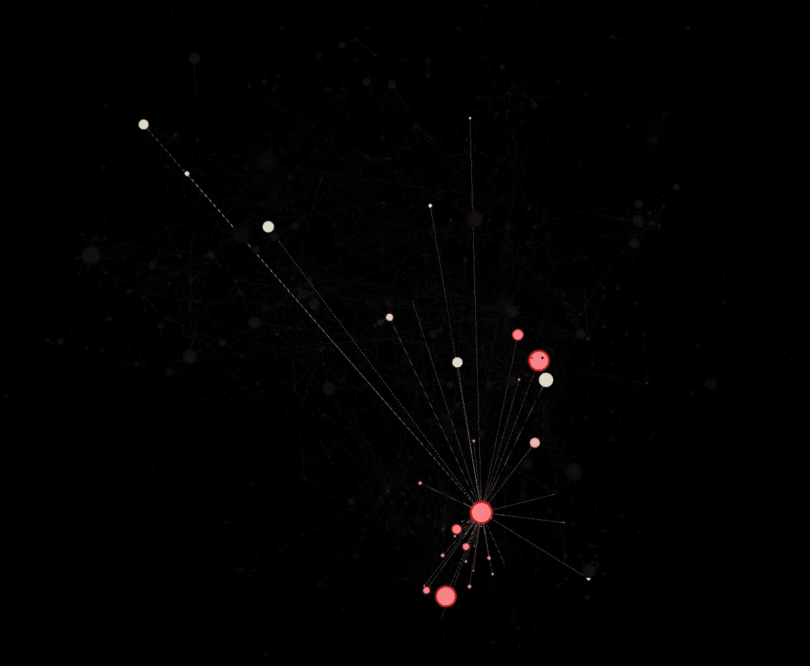

OpenOrd —关注一个节点。

# **圆形布局**

我不得不安装这个，因为它不是默认提供的——这很简单。你只需进入工具>插件>可用插件，检查其名称并点击安装。不幸的是，您需要重启应用程序来完成安装。

这种布局简单但功能强大:它根据您能想到的任何度量或属性对节点进行排序。您可以使用它来可视化它们的节点及其链接的分布。这种布局速度非常快——O(N ),因为它不需要运行任何优化。

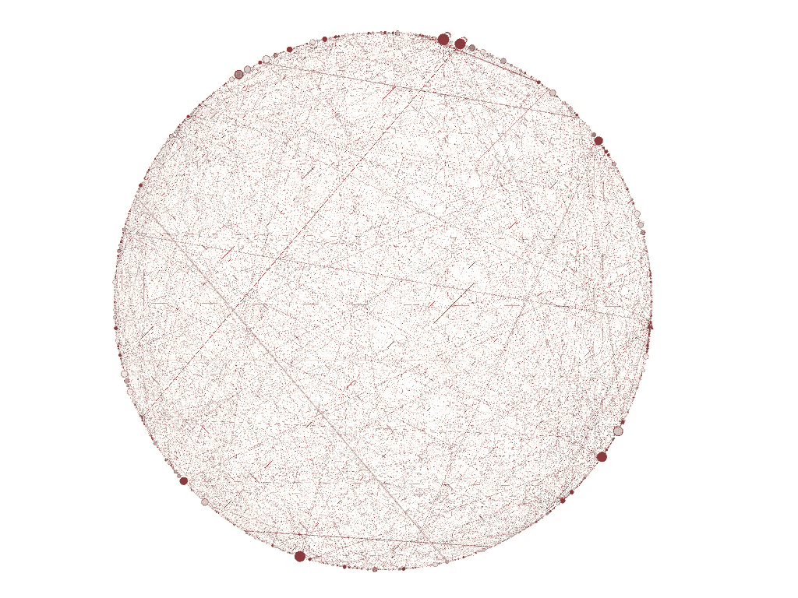

圆形布局(按向内角度顺时针排序)

你也可以用这个来准备一个不那么无聊的演示文稿！例如，我们可以使用 pandas(提示:使用**group by**+**nunique**)计算每个节点回答的不同*标签* (Python、C#等)的数量。姑且称此为**知识 _ 综艺**。我们可以用一个方框图来展示这个指标的分布，但也可以用一个圆形布局。

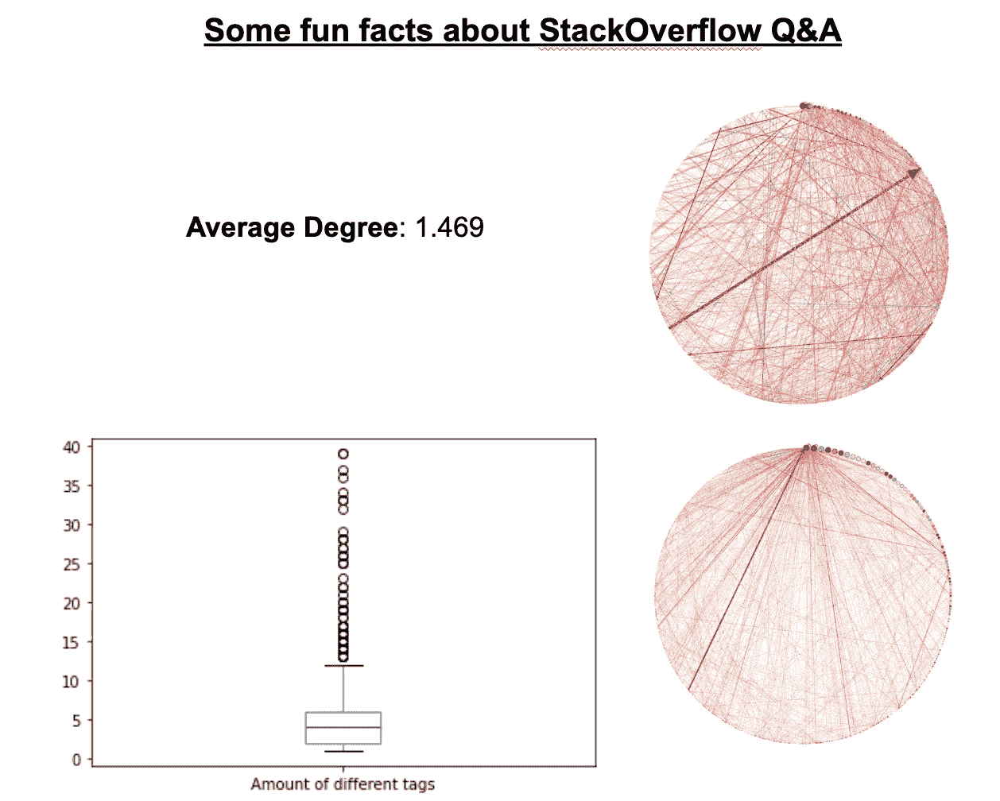

幻灯片示例使用圆形布局和节点大小来说明网络的统计事实

# **双圆形布局**

这是圆形布局的一个很酷的变体，您可以将顶部节点放置在外圆中，下面是度数的一个示例:

双圆形布局(按度数顺序，顺时针方向)

如果您既想可视化指标的分布，又想更详细地了解排名靠前的节点，这将非常有用。

# **径向轴**

这个将节点分组，并呈现为从一个中心圆向外辐射。它带有圆形布局插件。它也是 O(N ),并且对研究与属性相关的同向性极其有用。

然后，我们可以将节点的 **knowledge_variety** 分布在一个圆中，并将它们的度数分布在来自该圆的螺旋中。下面是它的样子——40 个螺旋，顺时针顺序(最大知识 _ 11 和 12 标记之间的变化)和低边缘宽度。请记住，节点大小与外部程度相关，颜色表示社区:

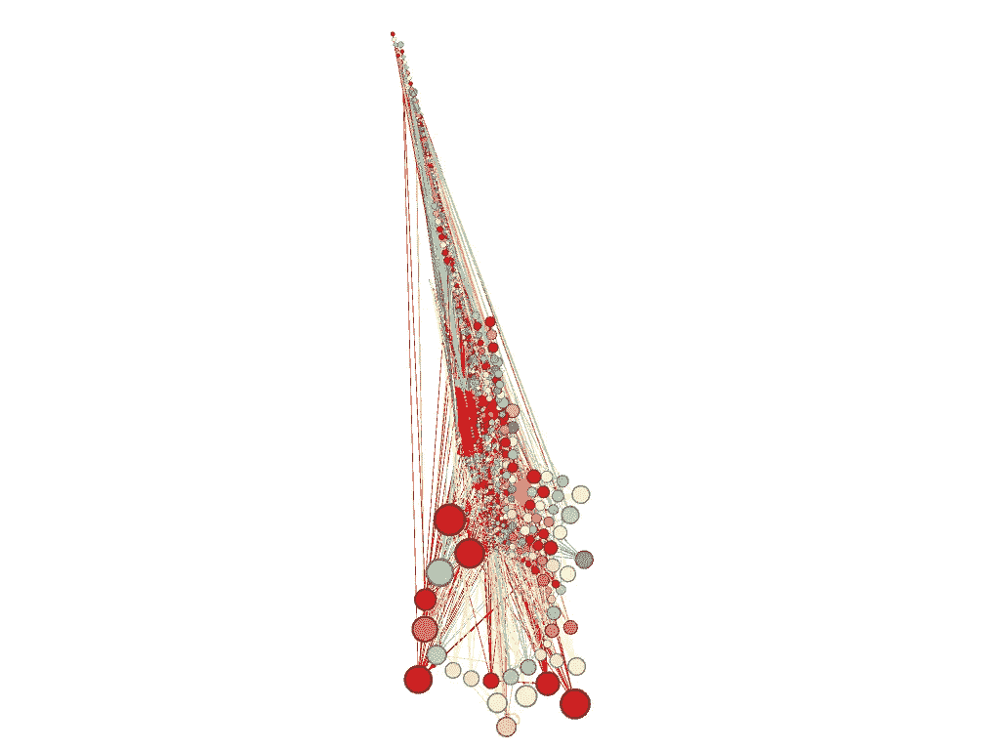

径向轴

*   最长的尾巴在第 1 小时；那里用户的外向度很低:大多数用户贡献的内容很少，而且是关于非常具体的主题。
*   **Out-degree** 与 **knowledge_variety** 相关:这是有道理的，因为你的知识越多样化，你就越能为整个社区做出贡献。然而，也有一些例外——超级用户知道很多非常具体的主题。

# **其他**

还有很多其他的布局，如果我感兴趣的话，将来我会再写一篇关于地理网络布局的教程！祝你黑客生涯愉快！

*你可以随时通过 LinkedIn* [*这里*](https://linkedin.com/in/gmosse) *联系我，讨论数据科学，自由职业优惠，数学，桌游。*