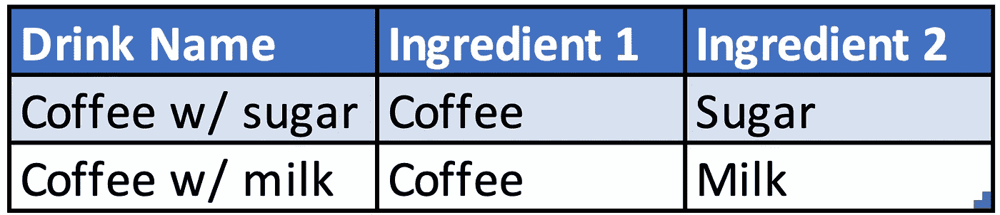
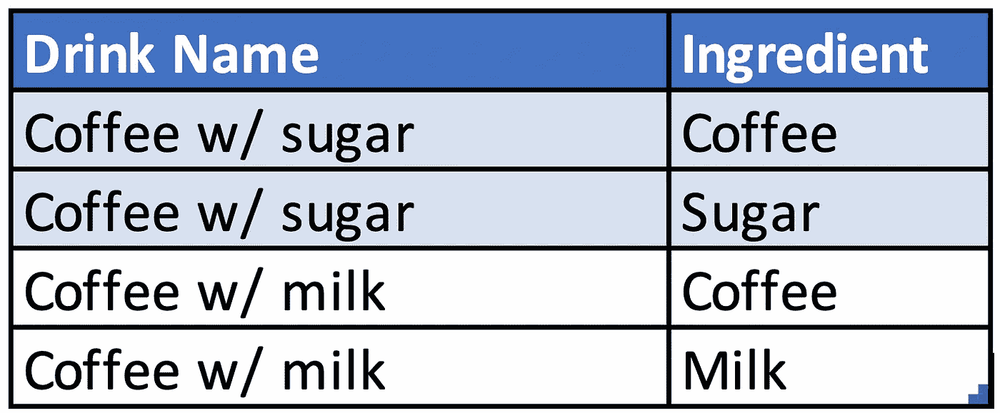
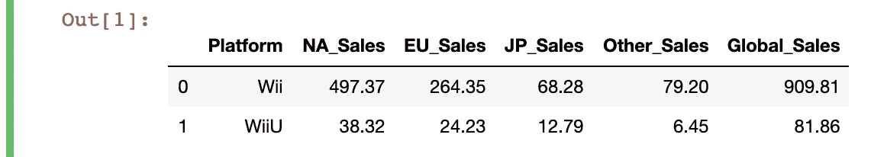
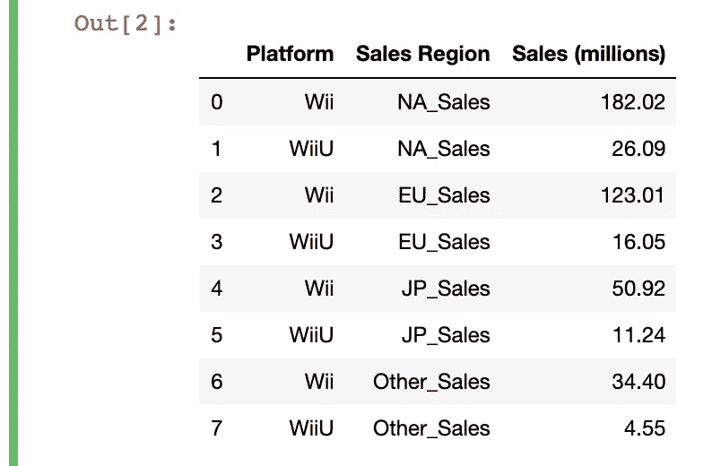
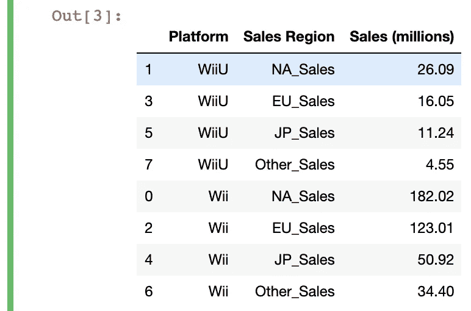

# 一种快速重新格式化熊猫数据框中的列的方法

> 原文：<https://towardsdatascience.com/a-quick-way-to-reformat-columns-in-a-pandas-dataframe-80d0b70de026?source=collection_archive---------39----------------------->

## 大蟒

## 使用 df.melt 将多个列压缩成一列。


姐姐塑造的形象

直接进入分析可能很诱人，但在此之前的一个重要步骤是预处理。

Pandas 提供了许多内置功能，允许您按照自己需要的方式重新格式化数据帧。在执行计算或创建可视化之前，大多数数据集都需要某种形式的整形。

**在这篇文章中，我们将会看到如何使用一个** `**df.melt**` **函数将多个列的值合并成一个。**

这意味着您正在将数据帧从“宽”格式更改为“长”格式。当许多列在技术上具有相同类型的值时，这很有帮助。

例如，假设你拥有一家咖啡店，开始经营两种饮料。为了跟踪每种饮料的成分，您制作了一个如下所示的表格:



目前这可能行得通，但是如果你想包含一种有三种成分的饮料呢？您必须创建另一个类似“配料 3”的列，但是如果您想要一种含有 4、5 甚至 10 种配料的饮料呢？每次需要输入更多数据时都生成新列并不是最优雅的解决方案。

相反，如果你有一张这样的桌子就太好了:



现在，你的桌子灵活多了。您的饮料可以根据您的需要添加或多或少的配料，并且您不需要为不同类型的数据条目改变表格结构。

让我们在一个更复杂的例子上看看如何用`df.melt`来做这件事。我们将使用[这个](https://www.kaggle.com/gregorut/videogamesales)视频游戏销售数据的修改版本，所以如果你想继续的话，请下载 csv 文件。我已经为这个练习加载并预处理了它，所以您可以使用下面的代码开始。

```
# pre-processing data
df = pd.read_csv('vgsales.csv').dropna()
df['Year'] = df['Year'].astype(int)
df = df.loc[df['Publisher']=='Nintendo']
df = df.loc[(df['Platform']=='Wii') | (df['Platform']=='WiiU')]
df = df[['Platform','NA_Sales','EU_Sales','JP_Sales','Other_Sales','Global_Sales']]
df = df.groupby('Platform').sum().reset_index()
```



*边注:如果你不熟悉* `*df.loc[]*` *功能，你可以看看我写的这篇文章和下面的其他矢量化熊猫解决方案。*

[](/you-dont-always-have-to-loop-through-rows-in-pandas-22a970b347ac) [## 你不需要总是在熊猫的行列中循环！

### 用向量化解决方案看一下“for 循环”的替代方案。

towardsdatascience.com](/you-dont-always-have-to-loop-through-rows-in-pandas-22a970b347ac) 

# 如何融化数据帧

您可以在上表中看到，我们有几个不同地区的总销售额。虽然这很容易阅读，但它不是最好的表结构。

我们的目标是将所有的销售额放在一列中，将所有的销售区域放在另一列中。

在此之前，我们先简单介绍一下`df.melt`函数。该函数有四个关键参数:

*   **id_vars** - >用来标识每一行的列(类似于索引列)—传递一个*列表*；
*   **value_vars** - >表格中要压缩(或取消透视)的列。如果您想压缩除 id_vars 之外的所有列，您可以将其留空—传递一个*列表*；
*   **var_name** - >新“类别”列的名称，其中的值是您传递给“value_vars”的列名—传递一个*标量值*；
*   **value_name** - >新“值”列的名称-传递一个*标量值*。

对于我们的表，我们需要用“Platform”列标识每一行，所以我们将把它传递给`id_vars`。我们的值列将是除“全球销售”之外的所有销售列，因为从技术上讲，这不是一个区域类别。我们将把一个列名列表传递给`value_vars`来实现这一点。

为了提高可读性，我们还将两个新列命名为“销售区域”和“销售额(百万)”，分别包含在`var_name`和`value_name`参数中。

最终的代码如下所示:

```
df = df.melt(id_vars=['Platform'], 
value_vars=['NA_Sales','EU_Sales','JP_Sales','Other_Sales'], var_name='Sales Region', 
value_name='Sales (millions)')
```



就在那里！我们已经将所有旧的列名移到一个新的 category 列中，并将它们的值合并到一个 values 列中。

为了更好地表示，我们还可以用一行额外的代码对表进行排序:

```
df1 = df1.sort_values(['Platform','Sales (millions)'], ascending=False)
```



我希望你发现这个`df.melt`的快速浏览对你的熊猫工作有用！不涉及太多细节，您也可以实现这种技术来创建满足 1NF 的表，并更好地组织关系数据库的输入。

Pandas 还提供了比我上面使用的方法更多的排序方法，所以如果你想了解更多，你可以看看这篇文章:

[](/4-different-ways-to-efficiently-sort-a-pandas-dataframe-9aba423f12db) [## 4 种不同的方法来有效地排序熊猫数据帧

### 正确探索、理解和组织您的数据。

towardsdatascience.com](/4-different-ways-to-efficiently-sort-a-pandas-dataframe-9aba423f12db) 

祝你和熊猫的冒险之旅好运！