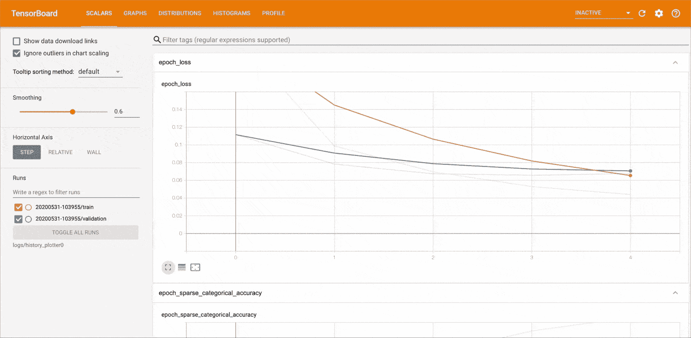
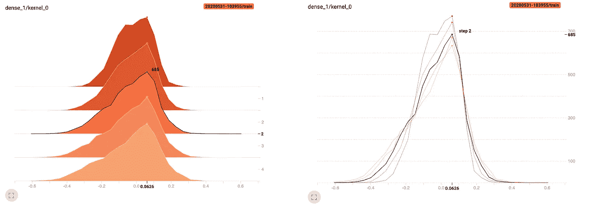
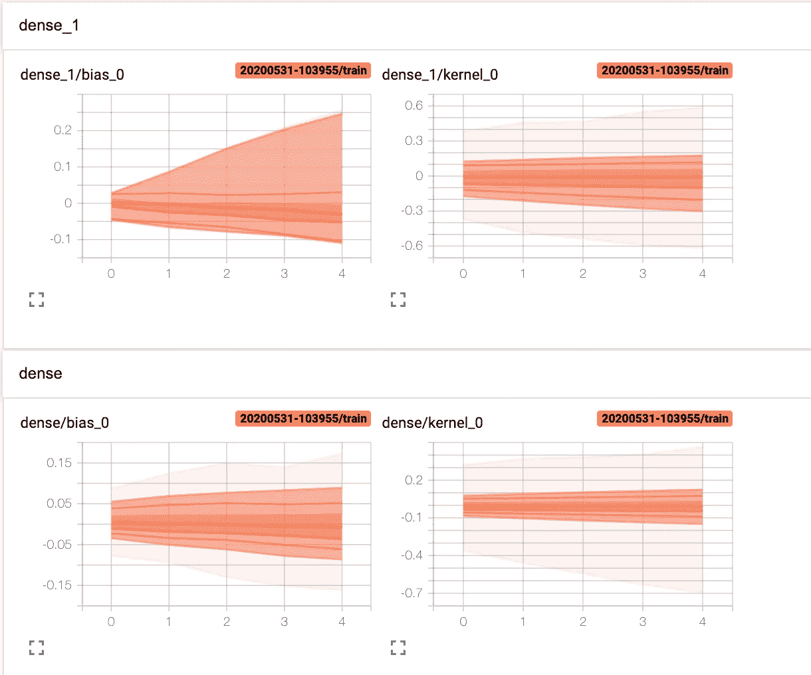
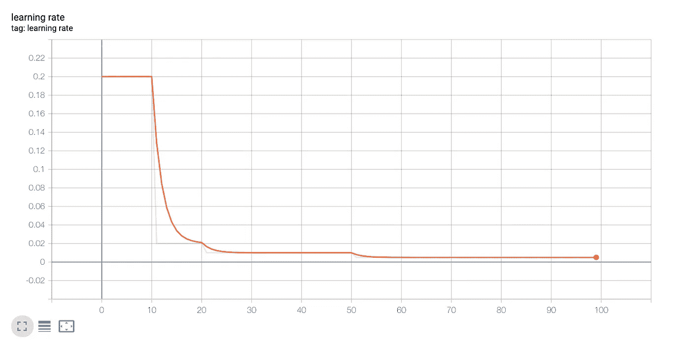
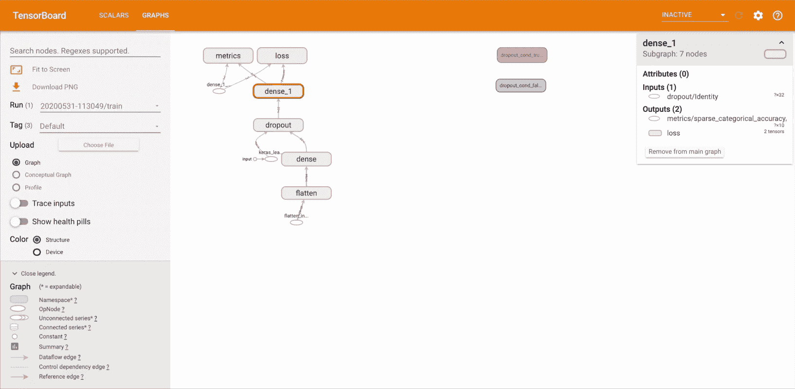
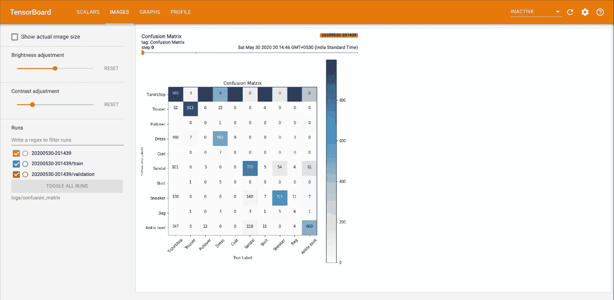
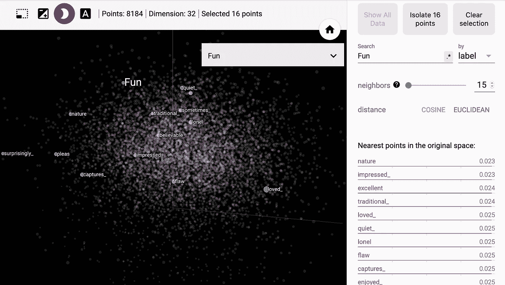

# TensorBoard 快速入门指南

> 原文：<https://towardsdatascience.com/a-quickstart-guide-to-tensorboard-fb1ade69bbcf?source=collection_archive---------27----------------------->

## 如何使用 TensorBoard 可视化 ML 实验


艾萨克·史密斯在 [Unsplash](https://unsplash.com?utm_source=medium&utm_medium=referral) 上拍摄的照片

大家都认同“视觉胜于文字”。可视化在任何一种解释中都提供了可行性和交互性。ML 建模也是如此。人们可能希望监控训练损失或权重和偏差，以改善模型性能。这可以用 TensorBoard 来可视化。

TensorBoard 是 TensorFlow 的可视化工具包。它提供了各种功能来绘制/显示机器学习管道的各个方面。

在本文中，我们将介绍 TensorBoard 的基础知识，并了解如何可视化各种机器学习任务中的一些要素。

# 如何推出 TensorBoard？

首先，我们需要了解如何使用命令行/笔记本导入和启动 TensorBoard。我们使用这个神奇的命令加载 TensorBoard 笔记本扩展:

```
%load_ext tensorboard
```

通过命令行或在笔记本中启动 TensorBoard。在笔记本上，使用 *%tensorboard* 线条魔法。在命令行上，运行不带“%”的相同命令。

```
%tensorboard --logdir <log_directory>
```

在接下来的章节中，我们将会看到什么是日志目录以及它的重要性。

# 损耗

一个模型应该是通用的，而且必须对看不见的数据做出准确的预测。为此，我们监控验证(或开发)数据的损失和其他指标，并确保损失不会相差太多。这可以通过在培训时间内可视化这些指标以更有洞察力的方式来完成。



可视化训练和评估损失和准确性

前面提到的是 TensorBoard 对 Train(橙色)和 Val(蓝色)损耗和精确度的交互式可视化(从上到下)。可以清楚地观察到，训练和 val 损失在训练过程中一直在减少(横轴是历元)，这给出了模型正在实现泛化以及低偏差的直觉。读取[偏差-方差权衡](https://en.wikipedia.org/wiki/Bias%E2%80%93variance_tradeoff)。

那么，我们该怎么做呢？

## 使用 Keras API

当使用 keras API 训练一个模型时，我们创建一个 tensorboard 回调，确保指标被记录在指定的目录中。

日志记录指标

## 使用自定义训练循环

当手动定义训练循环时，我们需要手动记录损失。 **tf.summary** API 促进了这一点。首先，我们为指定的日志目录定义一个文件写入器(分别用于训练和测试)，然后使用这个文件写入器实例，我们在每个时期后将数量记录为标量**。因此，我们可以在训练过程中逐步观察这些指标的趋势。**

自定义培训中的手动登录

# 可训练参数

在前面的部分中，在创建 tensorboard 回调时，我们将 *histogram_freq* 参数设置为 1。

```
tensorboard_callback = tf.keras.callbacks.TensorBoard(log_dir=log_dir, **histogram_freq=1**)
```

**直方图**和**分布**仪表盘允许我们可视化张量随时间的分布。使用这些，我们可以监控权重、偏差、激活等等。

*histogram_freq* 告诉 tensorflow 在每个历元后计算分布。如果设置为 0，则不会绘制任何分布。



密集层权重分布的偏移和叠加直方图

上图是模型中密集(完全连通)图层的权重分布直方图。左边是偏移视图，而右边是同一分布的叠加视图。

> 请注意，该分布类似于正态分布。

## 偏移视图

在偏移视图中，我们有一个三维图形:

1.  水平轴对应于权重的值；基本上这一层的权重取值范围。在这种情况下，[-0.6 到 0.6]。
2.  垂直轴对应于分布。直观地，这些值显示了层中相应权重值**相对于其他值**的出现次数。例如，在上面的图像中，我们可以看到峰值为 0.0626 的 685，这表面上意味着 685 个输入假定值为 0.0626。
3.  深度轴本质上是步骤(或时期)。我们可以观察这些步骤中重量分布的变化。

## 覆盖视图

叠加视图本质上是同一直方图的二维表示。这里，深度(历元)轴被压缩以获得分布之间的直接比较。我们可以将鼠标悬停在图上，突出显示特定步骤的分布。

还有另一种方法来可视化权重在各个时期的分布。



各时期权重和偏差范围的趋势

这是 tensorboard 互动工具包的**发行版**标签。

相邻的图实际上是先前直方图中深度和水平轴之间的图。

> 该图本质上描述了层的权重值在各个时期的变化范围。

# 韵律学

使用 TensorBoard，以及前面讨论的默认指标，我们还可以记录和可视化我们在建模中使用的任何自定义指标。在本例中，我们将可视化学习率，该学习率将由**自定义学习率调度程序进行调整。**

自定义学习率计划程序回调

我们首先定义一个自定义的学习率计划。然后我们为它创建一个回调，确保调度程序在定义每个时期的学习速率时被调用。我们已经使用 tf.summary API 记录了学习率，我们在前面的小节中已经讨论过了。



监控各时期的学习率

可以观察到，无论我们在调度程序中定义了什么，学习率都会下降(参见时期 10、20 和 50)。

# 计算图表

我们可以使用**图形**仪表板轻松查看模型结构的概念图，并确保它与我们的预期设计相匹配。这也是对 TensorFlow 如何解释模型的一个很好的洞察。



TensorBoard 的图表仪表板

每个展开的视图都显示了对模型计算工作流的更深入的了解。

对于 Keras 模型，除了创建一个 tensorboard 回调来查看 graphs 仪表板之外，不需要任何特别的工作。

然而，在必须定义自定义计算的情况下， **tf.function** 注释将 python 计算函数转换成张量流图。可以使用 **tf.summary 跟踪 API** 来跟踪和记录这个图表。

追踪 tf.function 图

如[文档](https://www.tensorflow.org/tensorboard/graphs)中所述，要使用摘要跟踪 API:

*   在您的函数调用站点之前立即使用 *tf.summary.trace_on()* 。
*   通过传递 *profiler=True* 向图形添加分析信息(内存、CPU 时间)
*   使用摘要文件编写器，调用*TF . Summary . trace _ export()*保存日志数据

# 形象

绘制图像类似于绘制任何其他标量值。但是要用 TensorBoard 可视化 matplotlib 的图，需要先转换成图像。为此，我们有一个将 pyplot 图转换成图像的样板代码:

绘制到图像

这里，我们举一个例子，用 tensorboard 绘制一个视觉上生动的[混淆矩阵](https://en.wikipedia.org/wiki/Confusion_matrix)。

首先，我们添加一个 LambdaCallback，它将在每个时期后被调用，计算混淆矩阵并记录下来。

创建 lambda 回调

然后，我们使用 pyplot 创建混淆矩阵的可视化。

情节混乱矩阵

这将返回一个 pyplot 图，我们使用前面讨论过的样板代码将它转换成图像。



混淆矩阵在历元上的转换

# 嵌入

嵌入本质上是非常复杂的量在向量方面的表示，其中向量中的值具有相对于其他相关量的归属的概念。我们可以使用 TensorBoard 的**嵌入投影仪**来可视化高维嵌入。这对监控 keras **嵌入层**很有用。



使用 TensorBoard 的嵌入投影仪可视化嵌入

我们以序列分类任务为例，将 imdb 电影评论分类为正面或负面。我们构建了一个简单的模型，包含一个嵌入层和几个完全连接的层。

为了记录和可视化，我们首先将词汇表中的单词写到文件中。

将词汇表写入文件

然后，我们将训练好的嵌入权重检查点放入一个变量，然后放入一个文件。

从变量中保存训练的权重

最后，我们设置投影仪配置并投影嵌入:

配置和投影

# 结论

我们看到了什么是 TensorBoard，并探索了一些基本的东西。然而，我想特别提到一些我在这里没有提到的东西。

1.  **超参数调谐**
2.  **假设分析工具**
3.  **仿形**
4.  **公平性指标(Beta)**

如果有兴趣，你可以在这里查看这些。

[这里的](https://github.com/rojagtap/tensorboard_notebooks)是本文所涉及主题的完整代码的链接，可以随意分叉。

# 参考

本指南中使用的代码引用自以下官方 TensorFlow 文档:

[](https://www.tensorflow.org/tensorboard/get_started) [## TensorBoard | TensorFlow 入门

### 在机器学习中，为了改进某些东西，你通常需要能够测量它。TensorBoard 是一款提供…

www.tensorflow.org](https://www.tensorflow.org/tensorboard/get_started) [](https://stackoverflow.com/questions/42315202/understanding-tensorboard-weight-histograms) [## 了解张量板(权重)直方图

### 看到和理解 TensorBoard 中的标量值真的很简单。然而，不清楚如何…

stackoverflow.com](https://stackoverflow.com/questions/42315202/understanding-tensorboard-weight-histograms) 

# 请参见

[](https://neptune.ai/blog/tensorboard-tutorial) [## 深入 TensorBoard:示例教程- neptune.ai

### 有一个常见的商业说法是，你不能改进你没有衡量的东西。这在机器学习中是正确的，因为…

海王星. ai](https://neptune.ai/blog/tensorboard-tutorial)