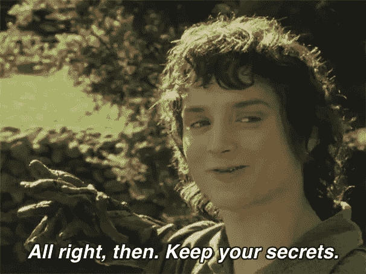
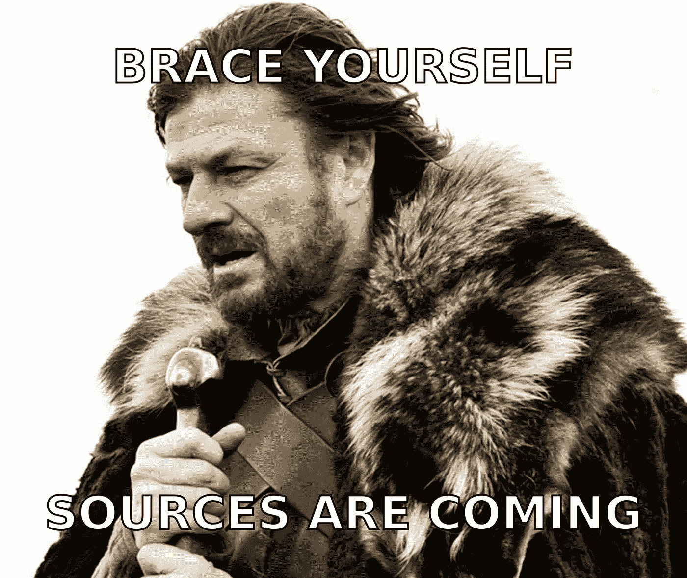
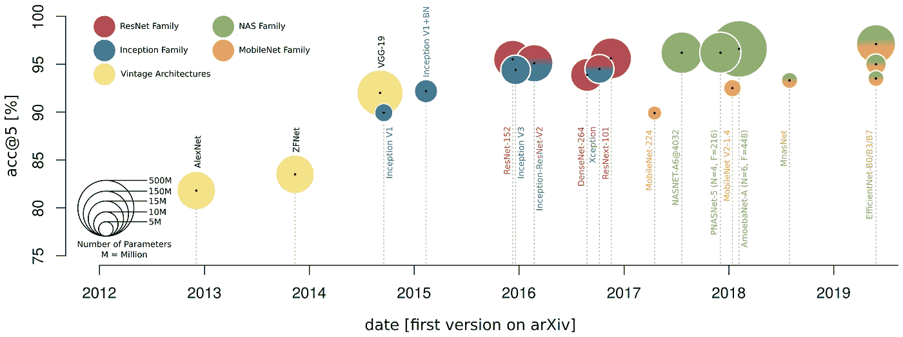

# CNN 深度学习阅读指南

> 原文：<https://towardsdatascience.com/a-reading-guide-about-deep-learning-with-cnns-3a0e0fc99b78?source=collection_archive---------32----------------------->

## 第一部分:图像识别和卷积骨干网

本系列的下一部分是:[第二部分:图像分割](/a-reading-guide-about-deep-learning-with-cnns-71768f4d87e7)

# 这个系列是关于什么的

想象一下，你一觉醒来，感觉有一种数据科学探险的冲动。你决定投身于人们谈论的深度学习。太好了，在深入无尽的 Github 森林，在远程资源库中四处乱砍之前，您打开 PC，查看一些艺术文献。在你准备的过程中，可能会发生的是，你偶然发现了一个有前途的作品，告诉你他们已经使用了三重 ResNeXt-101 级联掩模 R-CNN 或类似的东西…啊哈…

来源:[img lip](https://imgflip.com/memetemplate/156781749/All-Right-Then-Keep-Your-Secrets)

你的旅程可能会在这里结束，你会回到你舒适的小屋，没有装满闪亮的算法和知识的箱子，你可以在你当地的酒馆里分享。

这一系列是关于通过你在冒险中必须知道的术语和历史提供一个指南。深度学习文献、科学出版物以及关于它的博客和讨论，充满了概念和模型的缩写和花哨的名称。开始阅读它感觉就像试图用一个普通的水桶抓住一个瀑布。 ***在这个系列中，你会找到一个阅读指南，引导你浏览科学和非科学的里程碑文献，以及关于深度学习和卷积神经网络(CNN)的额外解释。***

# 这个系列的动机

几年前，我正处于投入深度学习冒险的境地。尽管有数据分析的背景，但习惯深度学习中应用的术语和概念还是有点挑战。开始阅读深度学习文学对我来说就像开始阅读《权力的游戏》小说一样:一大堆无尽的名字和关系；高度分支的家族树，以几乎相同的名字在这里和那里合并和分支…仍然，相当令人兴奋的阅读。

我开始从字面上绘制这些深度学习架构的家谱，最终有了从 2012 年到 2019 年底的 CNN 在图像识别、图像分割和对象检测方面的发展概况。我决定把它写下来，它最终变成了这篇开放存取评论论文[1]:

 [## 基于对地观测数据深度学习的目标检测和图像分割:综述-部分…

### 深度学习(DL)对大部分科学产生了巨大影响，并日益成为一种自适应的学习方法

www.mdpi.com](https://www.mdpi.com/2072-4292/12/10/1667) 

**非常欢迎任何对以科学文献为重点的 CNN 图像处理深度学习的科学但直观的综述和直接阅读指南感兴趣的人阅读它**。尽管它是为遥感杂志写的，但它从计算机视觉的角度讲述了进化，因此适用于使用 CNN 进行图像处理的每个领域，而不仅仅是遥感。

"好吧，既然这个指南已经存在，为什么还要写这篇中间文章呢？"合法的问题，为了进一步强调《权力的游戏》的类比，这样考虑它:主要的书籍讲述了所有事实和进展的故事，直到结束；与在会议、同行评审期刊和 arXiv 上发表的关于深度学习的科学文献相同。你可以通过阅读主要文献来了解整个故事。但是还有更多的，支持主要情节的次要故事，同人小说和关于单个角色的讨论，关于我们感兴趣的世界起源的整个故事，或者仅仅是传说。对我来说，我认为像 Medium、Youtube 或 Stackexchange boards 这样的地方是你可以找到关于深度学习文献的知识的来源，这使得主要故事更加直观。因此，除了科学文献之外，这份阅读指南还有一些其他的来源，我发现这些来源对于思考科学发表的论文中所讨论的内容非常有帮助。

# 如何使用本指南

下面的表格是以这样一种方式组织的，你可以决定你想要深入到什么程度。每个表格中的前几个来源是介绍、概述或评论。其余的按某种方式排序，你将逐步需要以前来源的信息。所以，我建议去**这个系列的 Github 库**，拿到表格，开始阅读，自己做笔记。花所有你需要的时间来通过，但是每次你在信息的深地牢中迷路时，回到指南并想出下一步去哪里，或者回到一个你感觉舒服的点并重新开始。

 [## thho/CNN _ 阅读 _ 指南

### 这份阅读指南发表在媒体故事系列中，是一份关于 CNN 深度学习的阅读指南。它补充道…

github.com](https://github.com/thho/CNN_reading_guide) 

我希望你能像我一样享受这次冒险，并经历那些洞察力开始相互交融的史诗般的时刻！

# 深度学习

来源: [imgflip](https://imgflip.com/memetemplate/18552174/Winter-Is-Coming)

# 图像识别和卷积骨干网

2012 年，Alex Krizhevsky 等人[2]通过引入 CNN AlexNet 赢得了 ILSVRC。加上 Ciresan 等人(2012) [3]的发表，2012 年可以被视为深度学习和 CNN 研究现代发展的起点。这两个出版物都是关于预测图像的单个标签的任务，即所谓的图像识别或图像分类。这项任务的后继者正致力于优化 CNN 的重要特征提取器，即所谓的卷积骨干网。由于卷积骨干也用于例如图像分割和对象检测，图像识别的发展成为整个领域的驱动力。因此，理解细胞神经网络在图像识别方面的发展对于进一步阅读是至关重要的。

介绍用于图像识别的 CNN 架构及其在 ImageNet 2012 数据集上的性能，圆圈的大小与对数标度中的参数数量有关。资料来源: [Hoeser and Kuenzer 2020 第 10 页](https://www.mdpi.com/2072-4292/12/10/1667) [1]。

上图显示了分为 5 个系列的里程碑建筑，有助于组织阅读

## 古典建筑

Vintage 架构以其堆叠运算的理念而闻名，该理念在深入网络的同时从输入数据中提取要素。他们建立了这种经常被比作哺乳动物视觉皮层的结构。

## 盗梦空间系列

Inception 家族起源于 Le Cun 等人 1989 年的早期工作[4](所谓的 LeNet)，其网络也被称为 GoogLeNet。他们因以下原因而闻名:

*   复杂的构建模块
*   参数高效设计，如卷积运算的瓶颈设计或因子分解
*   最重要的是，Inception 家族引入了批量规范化，这对训练深度网络非常重要。

## ResNet 家族

ResNet 家族都是关于残余连接的。这种设计卷积模块的新方法，通过连接绕过卷积运算，使网络变得相当深入，但仍然是可训练的。ResNet 家族的架构是当今非常受欢迎的特征提取器。

## 高效的设计

最后一组是 NAS 和 MobileNet 系列，因为它们的目标都是参数高效，它们共同发展，最终成为 2019 年的高效网络模型，即 sota 架构。

手头有了这些文献，你就为深度学习冒险的第一个挑战做好了充分的准备。我强烈建议你做些旁门左道的事情，比如访问一个在线课程，或者通过探索 TensorFlow 或 Pytorch 来尝试一下，如果你已经准备好进行下一步，就回到你的阅读指南。[在本系列的下一部分](/a-reading-guide-about-deep-learning-with-cnns-71768f4d87e7)中再见，我们将探讨图像分割这一章。

# 参考

[1]赫泽，T；利用对地观测数据的深度学习进行目标探测和图像分割:综述-第一部分:发展和最近趋势。遥感 2020，12(10)，1667。DOI: 10.3390/rs12101667。

[2]克里热夫斯基，a；苏茨基弗岛；Hinton，例如，使用深度卷积神经网络的 ImageNet 分类。神经信息处理系统的进展:f .佩雷拉、Burges、C.J.C .、Bottou、l .、Weinberger、K.Q .编辑。；柯伦联合公司:美国纽约州红钩镇，2012 年；第 25 卷，第 1097-1105 页。

[3] Ciresan，d；Meier，u；用于图像分类的多列深度神经网络。2012 年 IEEE 计算机视觉和模式识别会议(CVPR)论文集，美国罗德岛普罗维登斯，2012 年 6 月 16-21 日；第 3642-3649 页。

[4] LeCun，y；博瑟湾；登克，J.S。亨德森博士；霍华德；哈伯德，w。应用于手写邮政编码识别的反向传播。神经计算。1989, 1, 541–551.