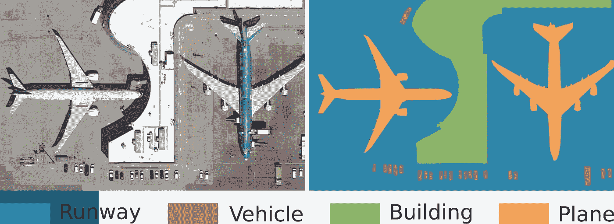
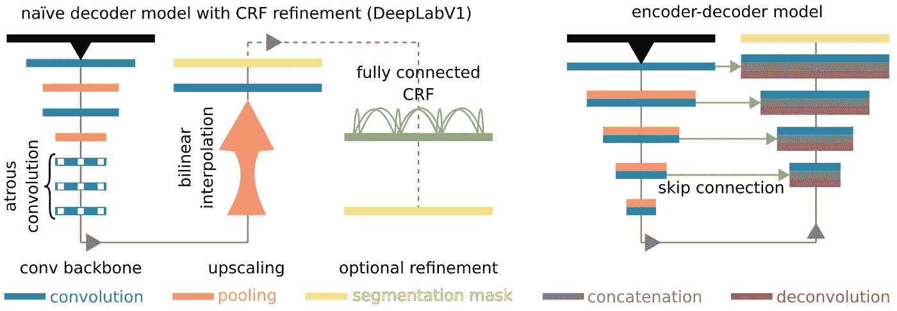
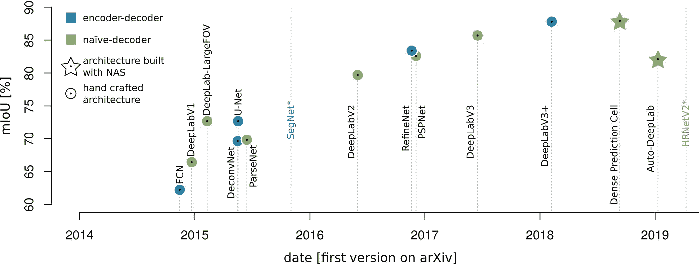

# CNN 深度学习阅读指南

> 原文：<https://towardsdatascience.com/a-reading-guide-about-deep-learning-with-cnns-71768f4d87e7?source=collection_archive---------58----------------------->

## 第二部分:图像分割

欢迎回到本系列的第二部分。如果你错过了第一部分，看看这里:[**第一部分:图像识别与卷积骨干**](/a-reading-guide-about-deep-learning-with-cnns-3a0e0fc99b78) **。**

在这一部分中，您将通过有关卷积神经网络(CNN)图像分割的文献找到指南，直到 2019 年。它在 [**这篇开放存取综述论文**](https://www.mdpi.com/2072-4292/12/10/1667) 中增加了非科学来源，以进一步增加对 CNN 进化的直观理解。

与第一部分相同，您可以在 github 资源库中找到源代码表:

 [## thho/CNN _ 阅读 _ 指南

### 这份阅读指南发表在媒体故事系列中，是一份关于 CNN 深度学习的阅读指南。它补充道…

github.com](https://github.com/thho/CNN_reading_guide) 

现在，让我们和 CNN 一起进入深度学习冒险的下一个篇章。

# 基于细胞神经网络的图像分割概述

在图像分割过程中，对每个像素预测一个类别，如下所示:

图像分割示例。修改依据: [Hoeser and Kuenzer 2020 第 8 页【1】](https://www.mdpi.com/2072-4292/12/10/1667)

当我们在第一部分中讨论的 CNN[变得更加流行时，它们首先被用于所谓的*基于小块的图像分割。*因此，CNN 以移动窗口方式在输入图像上移动，并预测*小块*(整个图像的一小部分)或整个小块的中心像素的类别。](/a-reading-guide-about-deep-learning-with-cnns-3a0e0fc99b78)

随着 Long 等人 2014 年[2]的工作，所谓的全卷积网络(FCNs)被引入，使用 CNN 的图像分割变得更加复杂。总的来说，FCNs 中的处理看起来是这样的:首先通过使用卷积骨干从输入图像中提取特征(**编码器**，[参见第一部分](/a-reading-guide-about-deep-learning-with-cnns-3a0e0fc99b78))。因此，分辨率越来越小，而特征深度越来越大。这样提取的特征图具有高语义，但是没有精确的定位。由于我们需要对图像分割进行逐像素预测，因此该特征图会被向上采样回输入分辨率**(解码器)**。与输入图像的不同之处在于，每个像素持有一个离散的类别标签，因此图像被分割成语义上有意义的类别。

存在两种主要的不同概念，即如何在解码器中进行上采样:

*   **朴素解码器**(该术语例如在 Chen 等人 2018 [3]中使用):通过应用例如双线性插值来完成上采样
*   **编码器-解码器:**上采样是通过可训练的去卷积操作和/或通过在上采样期间将来自编码器部分的特征与更高的定位信息合并来完成的，参见那些例子:

[资料来源:Hoeser 和 Kuenzer 2020 年第 17 页【1】](https://www.mdpi.com/2072-4292/12/10/1667)

为了利用深度学习深入研究图像分割，下表中的来源是很好的起点。请注意，除了 CNN 之外，还有其他执行图像分割的深度学习模型类型，如生成对抗网络(GANs)或长短期记忆(LSTM)方法；本指南主要关注 CNN。此外，有时从图像分割的角度讨论 R-CNN 家族的模型。本指南将在下一部分讨论物体检测时讨论它们。所以，当你在别的地方读到它们(比如在评论文章中)而这里没有提到它们时，不要感到困惑。

# 模糊神经网络在图像分割中的发展

PASCAL-VOC 2012 基准数据集上不同 FCN 启发的里程碑式架构的性能演变概述。*这些模型在其他数据集上进行了测试。资料来源:Hoeser 和 Kuenzer，2020 年，第 17 页[1]

DeepLab 家族的发展是 FCN 启发的图像分割模型发展的特征。DeepLab 变体可以在 naive-decoder 和 encoder-decoder 模型中找到。因此，本指南首先着眼于简单的解码器，然后转向编码器-解码器模型，从而对这一系列进行定位。

## 朴素解码器模型

朴素解码器模型的最重要的见解主要是建立所谓的 atrous 卷积和用于像素级预测的长距离图像上下文开发。阿特鲁卷积是普通卷积的一种变体，它允许在不损失图像分辨率的情况下增加感受野。DeepLab-V2 [4]中著名的阿特鲁空间金字塔池模块( **ASPP 模块**)以及后来的组合:Atrous 卷积和长距离图像上下文开发。阅读以下文献时，请关注这些功能的发展——阿特鲁卷积、ASPP 模块和远程图像上下文开发/解析。

## 编码器-解码器模型

今天，最著名的编码器-解码器可能是 U-Net [5]。为分析医学图像而开发的 CNN。其清晰的结构吸引了许多研究人员进行试验和采用，并以其跳跃连接而闻名，这允许编码器和解码器路径之间共享功能。编码器-解码器模型关注于在解码器中的上采样期间，利用来自编码器的更局部精确的特征映射来增强语义丰富的特征映射。

有了手头的文献，你将能够思考现代图像分割论文和 CNN 的实现。让我们在第三部分再次见面，我们将讨论对象检测。

# 参考

[1]赫泽，T；利用对地观测数据的深度学习进行目标探测和图像分割:综述-第一部分:发展和最近趋势。遥感 2020，12(10)，1667。DOI: 10.3390/rs12101667。

[2]龙，j；谢尔哈默，e；语义分割的完全卷积网络。IEEE Trans。肛门模式。马赫。智能。2014, 39, 640–651.

[3]陈；朱；帕潘德里欧；施若夫，f；语义图像分割的阿特鲁可分卷积编码器-解码器。在计算机视觉领域——ECCV 2018；法拉利 v，赫伯特 m，斯明奇塞斯库 c；韦斯，y，编辑。；施普林格国际出版公司:瑞士查姆，2018 年；第 833-851 页

[4]陈；帕潘德里欧；科基诺斯岛；墨菲，k。用深度卷积网、阿特鲁卷积和全连接条件随机场进行语义图像分割。IEEE Trans。肛门模式。
马赫。智能。2016, 40, 834–848.

[5] Ronneberger，o；菲舍尔，p。生物医学图像分割的卷积网络。医学图像计算和计算机辅助介入——MICCAI 2015；Navab，Hornegger，j .，
Wells，W.M .，Frangi，A.F .编辑；施普林格国际出版公司:瑞士查姆，2015 年；第 234-241 页。