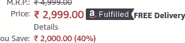

# Python 中的实时产品推荐器

> 原文：<https://towardsdatascience.com/a-real-time-product-recommender-in-python-c91d16554a0c?source=collection_archive---------39----------------------->


克里斯蒂安·威迪格在 [Unsplash](https://unsplash.com/s/photos/amazon?utm_source=unsplash&utm_medium=referral&utm_content=creditCopyText) 上拍摄的照片

## 我们如何调整我们的电子购物体验？

我们可能会同意，我们这些熟悉网上购物的人都有在亚马逊购物的经历。多年来，它无疑已经成为最大的电子购物中心之一。因此，当我们搜索某样东西时，我们可以依靠亚马逊的搜索算法，根据我们的搜索词为我们提供几个最佳选择。让我们来谈谈如何轻松使用基于亚马逊结果的实时产品推荐器，并微调我们的购物体验。

## 这个想法背后的动机

驱动的想法是，看看我们能使我们的购物过程变得多么健壮和用户友好。比如说，我们想买一副耳机。如果我们在亚马逊上搜索，它会给出一个大约 25-30 种产品的列表。现在，每个买家都有一些偏好。这些偏好中最重要的是品牌规格和定价。除此之外，买家还会考虑其他几个因素，如产品受欢迎程度、产品评级、产品评论和最佳价格匹配。此外，作为用户，我们有时也会觉得，如果我们能一眼看到几个产品提供的规格，并从专家的角度做出决定，那就太好了。

现在，每个顾客的需求都不一样。比方说，一些购物者关注评论，一些关注评级，而另一些则坚持价格。所以，如果我们能给用户提供决定他/她想关注什么的权力，这不是很好吗？所以，让我们看看如何实现这些目标。

## 这个想法

这个想法是给每个产品分配一个基于字段的分数，用户可以在购物时查看。例如，我们分配一个产品，基于流行度的分数，基于评论的分数，等等。随后，我们根据用户偏好计算加权分数。

让我们用一个具体的例子来看看这个想法。比如说，我们想买一个耳机。因此，我们搜索并获得一个包含 25 个项目的列表。我们根据评级为每个产品分配可变分数 x1，根据受欢迎程度分配 x2，根据评论分配 x3，根据价格限制分配 x4。现在，我们询问用户他/她是否有任何偏好，比如更关注某个方面。例如，如果用户希望更多地关注评论，我们将整体得分计算如下:

> y= x1+x2+ax3+x4

这给了 x3 更多的权重。如果用户没有这样的偏好，那么我们可以计算为。

> y= x1+x2+x3+x4

这里，我们将每个值标准化为最大值 1，以保持每个因素的权重平衡。接下来，我们可以根据 y 值对产品进行排序，以获得我们的结果。

同时，我们将创建所有产品的规格列表，以帮助具有特定需求的用户直观地了解哪种产品最适合他们。

让我们跳到应用程序

## 应用

如果我们在亚马逊网站上搜索，我们的选项如下所示。


我们将废弃亚马逊搜索算法给出的选项。我们将使用 Selenium Webdriver 来完成这项工作。


如果我们仔细观察搜索栏，并打破它，我们可以很容易地框住我们的直接搜索网址，这将有助于我们登陆亚马逊搜索页面。

```
import re
from selenium import webdriver
from selenium.webdriver.common.by import By
from selenium.webdriver.support.ui import WebDriverWait
from selenium.webdriver.support import expected_conditions as EC
from selenium.webdriver.chrome.options import Options
from bs4 import BeautifulSoupimport requests
def search_am(phrase):
    link="[https://www.amazon.in/s?k=](https://www.amazon.in/s?k=)"
    l_end="&ref=nb_sb_noss"
    phrase_w= phrase.replace(' ','+')
    link_full=link+phrase_w+l_end
    #print(link_full)

    driver = webdriver.Chrome()

    wait = WebDriverWait(driver, 5)
    driver.get(link_full)

    names_f=[]
    names=driver.find_elements_by_tag_name("a")
    i=0
    for name in names:
        className = name.get_attribute('class')
        if className=='a-link-normal a-text-normal':
            names_f.append(name)
            i+=1

    links=[]
    for i in names_f:
        temp= i.get_attribute('href')
        links.append(temp)

    driver.quit()
    return links
```

上面的函数帮助我们抓取搜索页面上所有列出的产品的所有链接，并返回链接。

每个链接都将我们引向一个特定的产品页面。


接下来，我们将重点关注产品页面的某些部分。

1.  评级部分:


这部分提到产品的等级。

2.受欢迎程度部分:在这里，我用收视率来衡量受欢迎程度。


3.价格部分:这部分给出了产品的价格。



4.规格部分:它列出了所有的产品规格和细节。


5.评论部分:这个部分反映了产品的评论。


现在，如果我们在这里用粗体字显示，那么每个评估都有一个声明。这一行给出了评论的要点。我们会拿起这些句子，判断情绪，分配复习分数。

让我们首先从产品页面中删除所需的细节。

```
def get_element_dets(link):
    driver = webdriver.Chrome()
    wait = WebDriverWait(driver, 2)
    driver.get(link)
    title_o= driver.find_elements_by_id("productTitle")
    title=title_o[0].text

    number_o= driver.find_elements_by_id("acrCustomerReviewText")
    try:
        popularity=(number_o[0].text)
    except:
        popularity='0'
    rate=driver.find_elements_by_css_selector("#reviewsMedley > div > div.a-fixed-left-grid-col.a-col-left > div.a-section.a-spacing-none.a-spacing-top-mini.cr-widget-ACR > div.a-fixed-left-grid.AverageCustomerReviews.a-spacing-small > div > div.a-fixed-left-grid-col.aok-align-center.a-col-right > div > span > span")
    try:
        rate_o=(rate[0].text).split(' ')[0]
    except:
        rate_o='0'
    feat_f=[]
    tag=[]
    value=[]
    #features=driver.find_elements_by_css_selector("#feature-bullets > ul > li > span")
    #for f in features:
    #    feat_f.append(f.text)
    price=0
    try:
        tag_o=driver.find_elements_by_tag_name('th')
        for name in tag_o:
            className = name.get_attribute('class')
            if className=='a-color-secondary a-size-base prodDetSectionEntry':
                tag.append(name.text)

        value_o=driver.find_elements_by_tag_name('td')        
        for name in value_o:
            className = name.get_attribute('class')
            if className=='a-size-base':
                value.append(name.text)
        i=0
        while i<len(value):
            t=str(tag[i])+':'+str(value[i])
            feat_f.append(t)
            i+=1
    except:
        feat_f=[':'] 
    try:
        price_o= driver.find_elements_by_id("priceblock_ourprice")
        for name in price_o:
            className = name.get_attribute('class')
            if className=='a-size-medium a-color-price priceBlockBuyingPriceString':
                price=(name.text)
                break
    except:
        price=0
    #price=price_o.text

    feedbacks=driver.find_elements_by_tag_name("a")

    feedback_f=[]
    for feed in feedbacks:
        className = feed.get_attribute('class')
        if className=='a-size-base a-link-normal review-title a-color-base review-title-content a-text-bold':
            feedback_f.append(feed.text)

    driver.quit()
    return feedback_f,title,rate_o,popularity,feat_f,price
```

上面的代码片段有助于删除产品页面所需的所有细节，并返回产品标题反馈、评分、流行度和其他所需的值。

```
def caller(phrase):
    links=search_am(phrase)
    data={}
    print(len(links))
    for link in links:
        data[link]={}
        feedback_f,title,rate,popularity,feat_f,price=get_element_dets(link)
        data[link]['feedback']=feedback_f
        data[link]['title']=title
        data[link]['rate']=rate
        data[link]['popularity']=popularity
        data[link]['features']=feat_f
        if isinstance(price, int):
            data[link]['price']=price

        else:

            data[link]['price']=price.split(' ')[1]
        #print(len(data))
    return data
```

上面的代码片段有助于以字典格式排列所有产品及其相应的特性。


每个产品的键都是它的链接，相应地，嵌套字典中的所有特性都是键值对。

Amazon 页面的标签很少会有变化，不过，最好还是使用 try 和 exception 块来处理错误，以防万一。

现在，在我们丢弃了所有需要的数据之后，让我们开始分配分数。

## 基于流行度和等级的系统

```
def assign_popularity_rating():
    with open('products.json', 'r') as openfile: 

        data = json.load(openfile) 
    temp=0
    for k in data.keys():
        p=int(data[k]['popularity'].split(' ')[0])
        r=float(data[k]['rate'])
        if p<50:
            temp=1
        elif p<100:
            temp=2
        elif p<150:
            temp=3
        else:
            temp=4
        score=(temp)
        data[k]['Popularity_Score']=score
        data[k]['Rating_Score']=r
        with open("products_mod.json", "w") as outfile: 
            json.dump(data, outfile)
```

上面的代码用于根据人口和评级来分配每个产品的分数。对于人口，我使用了宁滨或类的方法。我们已经从刮擦获得的值中获得的评级。

## 审查基于情感的系统

```
from textblob import TextBlob
def assign_sentiment_rating():
    with open('products_mod.json', 'r') as openfile: 

        data = json.load(openfile) 

    sm=0
    for k in data.keys():
        temp=data[k]['feedback']

        z=0
        sm=0
        for i in temp:
            #print(i)
            z+=1
            t=TextBlob(i).sentiment.polarity
            #print(t)
            sm+=t
        if (z==0):
            rating=0
        else:

            rating=sm/z
        data[k]['Review_Score']=rating
        with open("products_mod_2.json", "w") as outfile: 
            json.dump(data, outfile)
```

对于评论情感极性检测，我使用了 TextBlob 库的情感极性功能。它根据从评论中检测到的情绪分配一个从-1 到+1 的值。对于一个产品，我们有多个评论，因此，对于每个评论，我们都有一个值。因此，我们将从所有评论中获得的所有值相加，并除以评论的数量，试图使总分小于或等于-1。因此，我们对每个产品重复这一过程，并获得每个产品的评级。

## 价格相关性系统

```
def check_price_relevence():
    with open('products_mod_2.json', 'r') as openfile: 

        data = json.load(openfile) 
    print("Specify the approx price to tune search")
    price=int(input())
    print("Specify a margin")
    margin=int(input())

    for k in data.keys():
        data_ref=str(data[k]['price']).replace(',','')
        temp=float(data_ref)

        if temp<price+margin and temp>price-margin:
            rating=1
        else:
            rating=0

        data[k]['Price_relevence_Score']=rating
        with open("products_mod_3.json", "w") as outfile: 
            json.dump(data, outfile)
```

这是我们的价格相关性函数。它要求一个大概的价格和比较的利润。然后，它比较产品的价格和范围，以分配相关性分数。

在分配完所有分数后，我们的字典会为每个产品添加以下内容。


## 收集规格

接下来，我们将为有特定需求的客户创建一个包含所有列出产品规格的 csv 或 excel 文件。

```
import pandas as pd
def form_featureset():
    with open('products_mod_3.json', 'r') as openfile: 

        data = json.load(openfile)
        feat=[]
        set_c=[]
        for k in data.keys():
            temp=data[k]['features']

            temp2=[]

            for i in temp:
                tag=i.split(':')[0]
                if tag not in feat:
                    feat.append(tag)
        #print(feat)
        for k in data.keys():
            temp=data[k]['features']
            temp2=[-1]*len(feat)
            for i in temp:
                tag=i.split(':')[0]

                #print(tag)

                ind= feat.index(tag)
                #print(ind)

                temp2[ind]= i.split(':')[1]

            set_c.append(temp2)

    df=pd.DataFrame(set_c,columns=feat)
    df.to_csv('product_descriptions.csv',index=False)
    return df
```

这个片段生成了一个数据框，其中包含所有产品及其列出的规格，以提供对可用规格的洞察。


生成的规格表如下所示。对于产品页面中没有给出的值，我填了-1。

这些表格将有助于客户比较查找规格。

## 加权分数

```
def tune_search(choice):with open('products_mod_3.json', 'r') as openfile: 

        data = json.load(openfile)
    for k in data.keys():
            price_rel=data[k]['Price_relevence_Score']
            review_score=data[k]['Review_Score']
            pop_score=data[k]['Popularity_Score']
            pop_score_k=pop_score/4

            rate_score=data[k]['Rating_Score']
            rate_score_k=rate_score/5

            if choice==1:
                total_score=5*pop_score_k+rate_score_k+review_score+price_rel
            if choice==2:
                total_score=pop_score_k+5*rate_score_k+review_score+price_rel
            if choice==3:
                total_score=pop_score_k+rate_score_k+review_score+5*price_rel
            if choice==4:
                total_score=pop_score_k+rate_score_k+5*review_score+price_rel

            else:
                total_score=pop_score_k+rate_score_k+review_score+price_rel

            data[k]['Total_score']=total_score
            #print(data[k]['Total_score'])
    links=sort_d(data)

    return links
```

这段代码片段根据用户的选择提供了一个分数。我使用了一个非常基本的条件驱动方法。我将收视率除以 5，人口除以 4，以保持数值在 0 和 1 之间。这里权重值固定为 5。只是随便选的。

这都是关于我们的代码。

## 应用

给定的视频演示了该应用

无论选择是什么，我也给出了其他选择的链接，只是为了给用户额外的安慰和尝试其他选择的机会。

在我的例子中，你会看到 chrome 窗口，虽然它是自动的，会自己关闭，但会不断弹出，你可以使用 headless chrome 阻止它启动，并使用 chromeoptions()为你的 chrome 驱动程序利用它。

## 展望未来

可以通过两种方式修改应用程序或使其更加健壮，但这两种方式都需要数据，目前似乎还没有数据(据我所知)。

1.  如果当前的亚马逊情感数据集可用，我们可以制作自己的情感分类器，在其中我们可以将其他类别与积极和消极的情感放在一起，这将有助于我们基于评论的评分更加稳健。
2.  如果数据或规格是绝对存在的，我们可以为规格创建我们自己的特性嵌入。例如，如果我们有足够的笔记本电脑数据实例，我们可以为笔记本电脑创建一个嵌入或编码空间。我们可以将每台笔记本电脑表示为其规格的嵌入向量。我们可以根据用户需求创建新的规格向量。在那里，我们可以应用 K-最近邻算法来获得与需求向量最近的 K 个嵌入向量，并根据它们的欧几里德距离对它们进行排序。因此，我们可以获得规格接近用户要求的 k 笔记本电脑。这将让我们添加一个基于相关规范的分数，使我们的系统更加健壮。

## 结论

因此，我们可以通过几个步骤用 python 构建一个实时产品推荐引擎。

这里是 Github 的链接。

希望这有所帮助。