# 现实世界的时间序列预测:每日平均汇率

> 原文：<https://towardsdatascience.com/a-real-world-time-series-data-analysis-and-forecasting-121f4552a87?source=collection_archive---------9----------------------->

## 如何应用 ARIMA 模型预测时间序列数据

在 [Unsplash](https://unsplash.com?utm_source=medium&utm_medium=referral) 上 [NeONBRAND](https://unsplash.com/@neonbrand?utm_source=medium&utm_medium=referral) 拍摄的照片

时间序列数据的**平稳性**意味着序列的均值、方差和自相关等统计属性不会随时间而改变。序列平稳性的概念对于应用统计预测模型非常重要，因为:

1.  像 ARIMA 这样的大多数统计方法都是基于过程是平稳或近似平稳的假设[1]。
2.  平稳的时间序列可以提供有意义的样本统计，如均值、方差、与其他变量的相关性[1]。

过程的平稳性可以通过目视检查**时间序列图**或序列的**变差图来验证。可以执行像**增强的 Dickey-Fuller** 测试这样的统计测试来检查过程的平稳性。本文通过直观检查时间序列图和变异函数来验证平稳性。**

**时间序列图—** 如果给定的时间序列图显示一段时间内的**恒定均值和方差**，则该时间序列图可视为平稳过程。

**变异函数—** 是一种检查时间序列数据平稳性的图形工具。如果给定过程(时间序列)的变差函数在一定数量的滞后后显示稳定，则该过程被定义为平稳过程。

如果原始时间序列没有表现出平稳性，那么可以通过实施**变换**(例如对数变换)和**差分**来稳定该序列。

我们将把 ARIMA 模型应用于真实世界的数据集“美元和欧元之间的日平均汇率”。Sorren Bissgard 和 Murat Kulachi 在《时间序列分析和实例预测》一书中给出了数据集。下面给出了数据集的一个片段:

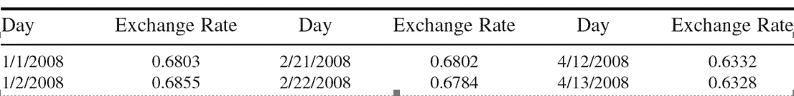

美元和欧元之间的日平均汇率

**平稳性:原始时间序列及其变差函数**

图 1 和图 2 分别展示了原始时间序列及其变异函数。图 1 显示该序列不是稳定的，因为它不遵循恒定的均值和方差。图 2 中的变差函数没有显示出稳定性，因为在大约 80°滞后之后，变差函数显示出下降趋势，从长远来看，变差函数可能无法保持稳定的模式，这表明该过程不是稳定的。

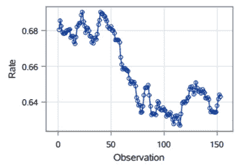

图 1:原始时间序列

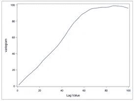

图 2:原始系列的变差函数

**平稳性:区别原始序列**

图 3 和图 4 分别显示了原始序列的一元差分过程的时间序列及其变异函数。图 3 示出了一个差分序列遵循恒定的均值和方差，表示平稳序列。此外，图 4 中的一阶差分变异函数显示了稳定系列的特征，因为它证明了长期稳定。因此，一个差分序列适合用于进一步分析。

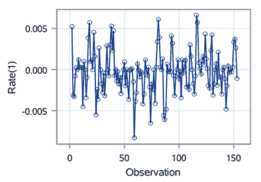

图 3:原始时间序列的一个不同过程

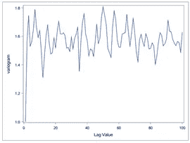

图 4:一个差分系列的变差函数

## 调查候选模型并选择最佳模型

可以阅读这篇[文章](/identifying-ar-and-ma-terms-using-acf-and-pacf-plots-in-time-series-forecasting-ccb9fd073db8) [— **时间序列分析:利用 ACF 和 PACF 图识别 AR 和 MA—**](/identifying-ar-and-ma-terms-using-acf-and-pacf-plots-in-time-series-forecasting-ccb9fd073db8)了解如何利用 ACF 和 PACF 图选择 ARMA 模型的阶数。

图 5 和图 6 显示了一个差分序列的 ACF 和 PACF。ACF 在一个滞后之后切断，并且 PACF 也从系列的开始切断。因此，ARIMA(p，d，q)可以是其中 p = 0，d = 1，q = 1 的候选模型。然而，我们也试验了 ARIMA (1，1，1)、ARIMA (0，1，2)和 ARIMA (1，1，2)来研究模型的性能。在应用不同的模型后，我们将把 AIC 作为一个性能指标来选择最佳模型。

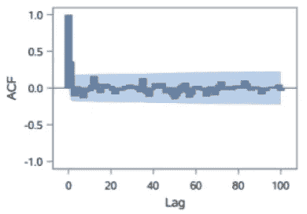

图 5:一个差分系列的 ACF

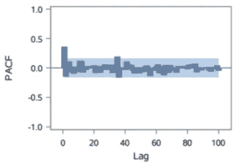

图 6:一个差分序列的 PACF

图 6、7、8 和 9 显示了我们在一个差分序列上实现的 4 个不同的前述模型的结果。所有候选模型的方差和标准误差大致相似。AIC 也显示了所有四种模型的相似值。ARIMA (1，1，1)模型的 AIC 最低，为-1398(图 8)，尽管所有的估计参数在统计上并不显著。ARIMA (0，1，1)和 ARIMA (0，1，2)可被视为最佳模式，因为它们的 AIC 是第二低的，但 ARIMA (0，1，2)的估计参数不显著。因此，我们最终选择 ARIMA (0，1，1)作为最佳模型(图 6)。

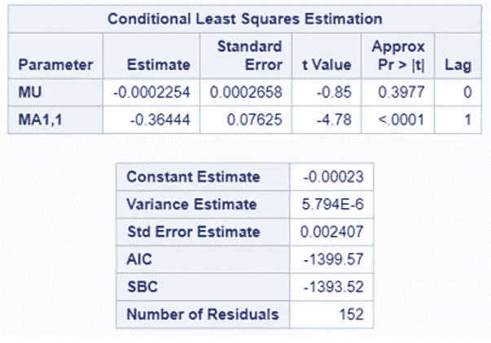

图 6: ARIMA (0，1，1)模型

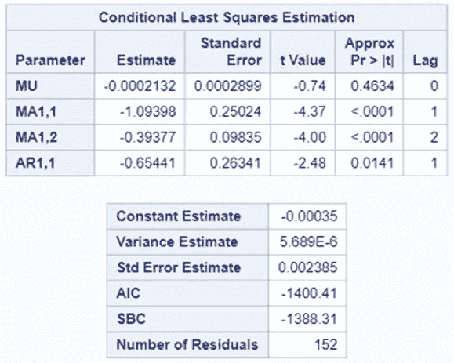

图 7: ARIMA (1，1，2)模型

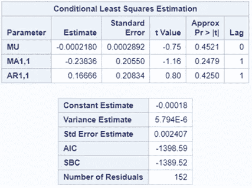

图 8: ARIMA (1，1，1)模型

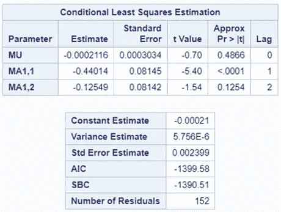

图 9: ARIMA (0，1，2)模型

## 最终模型的分析

以下是最终模型 ARIMA (0，1，1)的图。白噪声概率显示了白噪声的显著性，残差图显示了正态性。IACF 没有显示出任何不稳定性，白噪声概率是显著的。Q-Q 图遵循线性模式，残差分布也遵循正态曲线，这表明该模型满足正态假设。

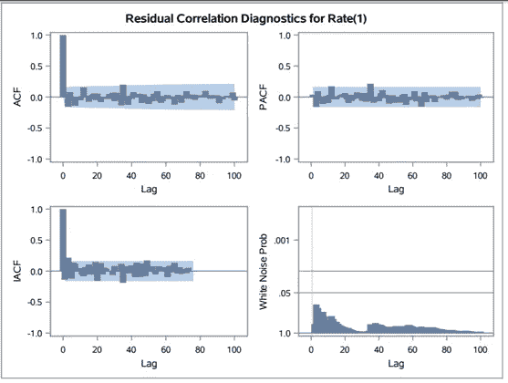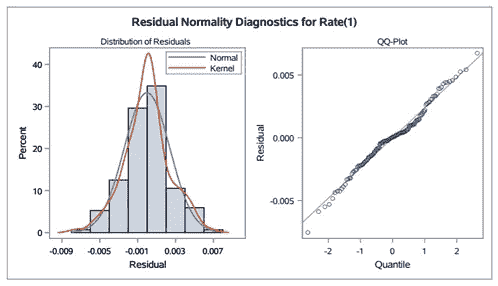

## 时间数列预测法

表 1 显示了该比率的预测值。标准误差显示预测值的稳定性，因为所有标准误差都不显著。图 10 显示了 7 天预测值的曲线，表明曲线稳定。表二。将原始比率值与预测值进行比较。平方误差(SE)显示原始值和预测值之间的平方误差。每个预测比率的 SE 显示预测比率非常接近原始比率，这表明 ARIMA 模型的预测质量良好。

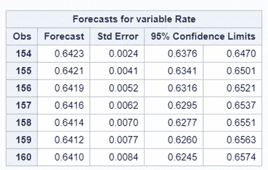

表 1:平均汇率预测

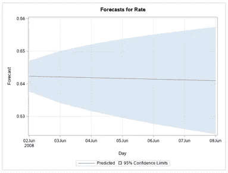

图 10:未来 7 天的汇率预测

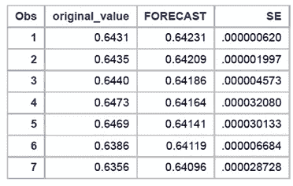

表 2:原始汇率和预测汇率的比较

**参考**

[1]https://people.duke.edu/~rnau/411diff.htm