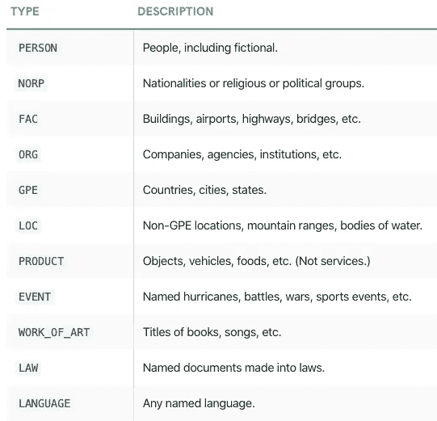
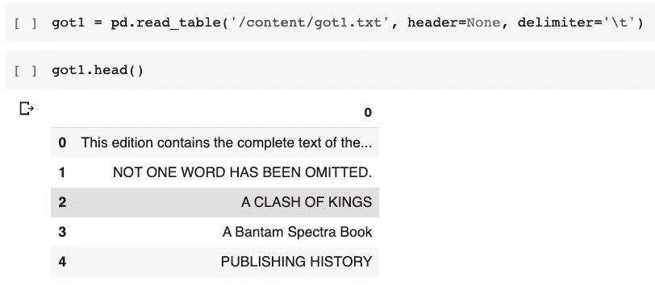
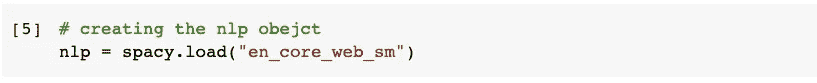
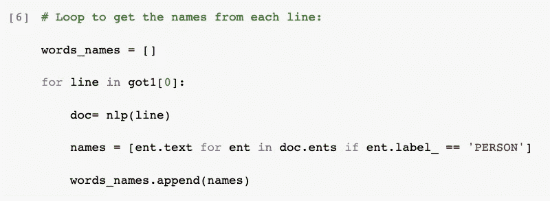
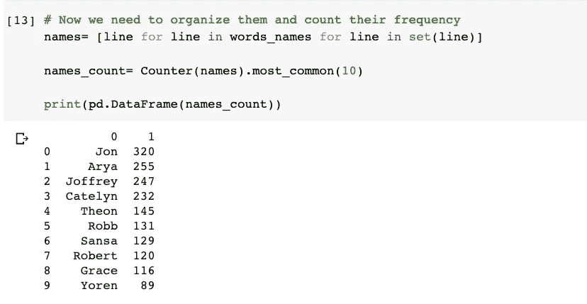
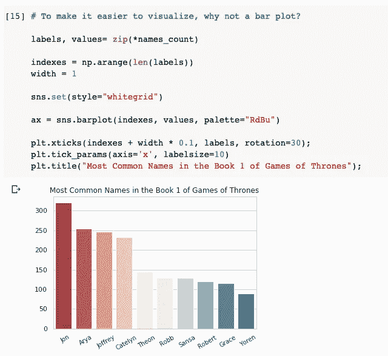

# (真正)温和地介绍命名实体识别以及如何使用它进行数据分析。

> 原文：<https://towardsdatascience.com/a-really-gentle-introduction-to-named-entity-recognition-and-how-to-use-it-for-data-analysis-ab25a1f39020?source=collection_archive---------29----------------------->

## 自然语言处理变得简单

## 用 Spacy 发现《权力的游戏》书中最受欢迎的名字！

话来了！托马斯·博诺梅蒂在 [Unsplash](https://unsplash.com?utm_source=medium&utm_medium=referral) 上拍摄的照片

NLP 是热门的东西，任何有抱负的数据科学家都应该学习它，对吗？当然，但是 NLP 除了在机器学习项目中的应用之外，还可以发挥更大的作用，因为它可以为数据分析带来强大的工具。

在本文中，我将使用 [spacy](https://spacy.io/) ，它是最流行的 NLP 任务库之一。它有很好的文档，提供了 10 种语言的模型，还有一个多语言库。我们的数据集将是流行的《权力的游戏》系列的第一本书，可以在这里下载。所有的代码和图表都来自我专门为你制作的笔记本，所以[请自便](https://github.com/lucasmoratof/nlp_basic_projects)。

## 为什么使用 NLP 进行分析？

作为数据分析师，我注意到当我们开始学习时，我们学习的很多内容都集中在 ML 建模、预测和人工智能上，有很多很酷的东西要学。然而，当遇到第一份工作机会时，通常会与数据分析、数据清理和数据可视化相关，所以我们应该投入更多的注意力来提高我们在这些领域的技能，NLP 可以在这个过程中提供很多帮助。

文本数据是杂乱的，很难组织。帮助我们理解它的方法之一是将单词转换成记号，记号是单词的数字表示。Spacy 出色地做到了这一点，它还使用一个通常非常有效的复杂统计模型来预测一个词在给定上下文中的功能。

## 什么是命名实体识别(NER)？

根据[文档](https://spacy.io/usage/linguistic-features#named-entities):“命名实体是一个“现实世界的物体”，它被赋予了一个名字——例如，一个人、一个国家、一个产品或一本书的书名”。下面你可以找到一个例子:

完整的列表可以在[这里](https://spacy.io/api/annotation#named-entities)找到。

## 如何使用 NER 进行数据分析？

在今天的例子中，我们使用的是《权力的游戏》第一本书，名为《国王的冲突》。假设你正在做你的分析，在这么多的角色中，你问自己,**哪一个名字在那本书里出现得最多？好了，不要再害怕了，因为 NER 在这里帮助你！**

想把它们都记住是不可能的！[来源](https://mtv.mtvnimages.com/uri/mgid:file:http:shared:mtv.com/news/wp-content/uploads/2015/04/joffrey-1430316003.gif?quality=.8&height=281&width=500)

首先，让我们看看数据是什么样子的:

来源:作者

好的，这是一个文本文件，每行都是一行。我们需要遍历这些行，并要求 spacy 选择一个名称，并将其保存到一个列表中。很简单，对吧？让我们把它翻译成代码！

首先，创建 NLP 对象。来源:作者

我们首先需要创建一个 NLP 对象。它加载模型，在这种情况下是英文模型，并使用这个对象，我们将转换和预测文本中的单词，如下例所示:

2:迭代每一行。

上面的代码的作用是:

*   创建一个空列表来存储我们的名字；
*   要求 nlp 对象处理每一行；
*   然后，当它预测单词是一个人时，它得到每个标记的文本；
*   最后，它应该将该名称存储在空列表中。

现在，我们可以看到为我们的书选择十大名字的结果:

来源:作者

哇！看那个！请记住，我们没有给算法任何信息，它自己预测了名字，至少对于前 10 名，它们都是正确的。另外，我们只用了很少几行代码就完成了所有这些工作。现在，为了让这些信息看起来更好，为什么不创建一个条形图呢？

## 结论

今天就到这里。在本文中，我向您展示了自然语言处理不仅仅是关于机器学习，还可以用于分析。我们探索了什么是 NER 以及如何使用它，并给出了一个实际的例子，欢迎您不仅仅是[自己去尝试](https://github.com/lucasmoratof/nlp_basic_projects)。

我希望你喜欢阅读，请在评论中告诉我你的想法，并在下一篇文章中看到你！