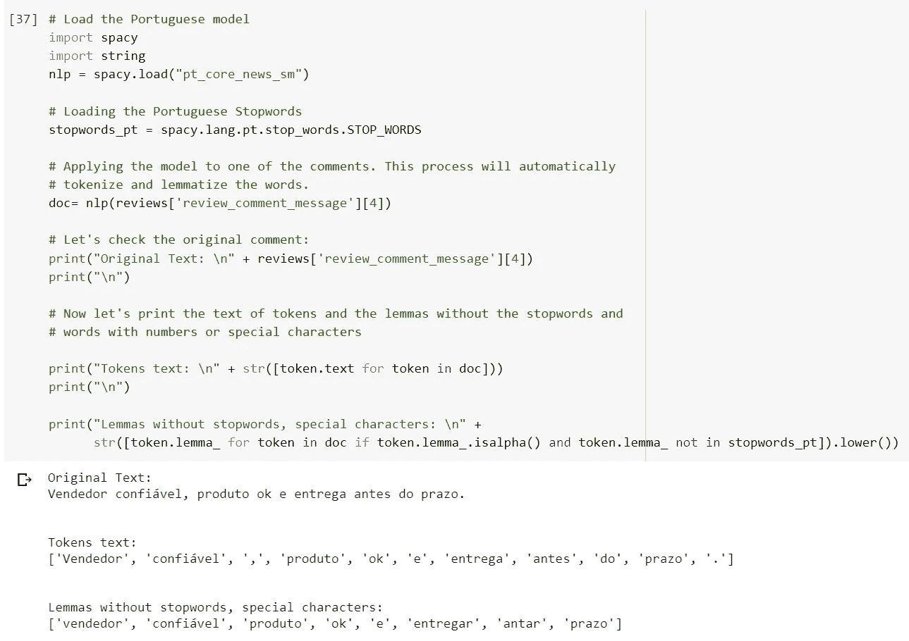

# Python 中 NLP 的(非常)温和的介绍

> 原文：<https://towardsdatascience.com/a-really-gentle-introduction-to-nlp-in-python-part-1-4712fe18ff3?source=collection_archive---------23----------------------->

## 自然语言处理变得简单

## 握住我的手，让我们一起开始吧。

帕特里克·托马索在 [Unsplash](https://unsplash.com?utm_source=medium&utm_medium=referral) 上的照片

我知道，这不容易。NLP 是每个人都在谈论的事情，似乎每个人都在做，除了在人群中迷失和悲伤的你自己。不用担心，自然语言处理(NLP)是一个很难学的东西，即使很少有人会承认这一点。

在本教程中，我将一步一步地讲述基础知识，没有冗长的解释(因为这里的目标只是介绍主题)，也提供了后面的所有代码(笔记本是[在这里](https://github.com/lucasmoratof/customers_review_project/blob/master/NLP_Customer_Review_ML_Complete.ipynb)等着你)，所以你可以跟随我通过整个过程。

数据来自巴西一家网上商店的顾客评论，原始数据集可以在 [OLIST](https://github.com/olist/work-at-olist-data/tree/master/datasets) 存储库中找到。我为 NLP 分析创建的转换后的文件可以在这里[找到](https://github.com/lucasmoratof/customers_review_project/blob/master/reviews_for_nlp.csv)。让我们检查第一行，看看是关于什么的:

来源:作者。

第一列是来自客户留下的评论的文本，第二列告诉是否是正面评论，如果是正面评论，则值为 **1** ，如果不是正面评论，则值为 **0** 。您可以查看本[笔记本](https://github.com/lucasmoratof/customers_review_project/blob/master/Review%20Quality%20for%20NLP.ipynb)了解更多关于我如何合并不同数据集以及如何创建目标要素的详细信息。

在这第一个教程中，我将介绍:

*   **NLP 的使用及其在机器学习中的应用；**
*   **基本预处理技术；**
*   **词汇化；**
*   **标记化。**

## 自然语言处理的使用

我们先来思考一下 NLP 的可能性。理解人们对某事的看法是一个强有力的工具，但是语言是一个很难学的东西。想想我们自己学习语言的过程，用词汇中所有不同的单词和它们之间的组合，以一种有意义的方式完全吸收它需要多长时间？然后，我们需要发展发现隐藏在词语背后的微妙情绪的技能，以便将一些事情分为真诚、傲慢、真实、虚假、讽刺等。如果这对我们来说很难，因为计算机要复杂得多，因为**它根本不理解任何单词**！

是的，它是正确的，计算机只理解数字，而不是单词。那么，如何让他们理解我们所说或所写的东西呢？简单来说，我们需要将单词转换成数字。当我们这样做时，计算机可以处理信息，并根据计算产生强大的洞察力，因此需要在运行任何机器学习文本数据中的算法之前进行这种转换。

## 自然语言处理和机器学习

在我们让计算机理解单词之后，我们可以使用机器学习来预测这些单词，如构建翻译应用程序，在打字时建议下一个单词，以及更复杂的应用程序，如理解文本的情感。

## 预处理技术

使文本计算机友好的第一步是清理它。我们这样做是为了让学习过程更顺利、更快。由于本文无意全面研究预处理技术，所以我将向您展示最基本的技术:

*   **小写单词**:否则电脑会把“猫”和“猫”理解成不同的东西。
*   **移除**:

1- **标点**:因为标点本身没有任何意义。

2- **停用词**:是经常出现的常用词，如“该”、“安”、“他”、“自己”等。删除这些单词减少了算法需要处理的数据量，使其速度更快。

## 词汇化

词汇化是将一个词转换成其基本形式的过程。我们可以认为基本形式应该出现在字典中，例如，英语中的单词“walked”、“walking”和“walks”都来自同一个词根“walk”，这就是该单词的引理*和*。

有趣的是，词汇化也用于根据词义而不仅仅是拼写来转换单词。一个例子是“更好”，它有“好”作为它的引理。这是一个强大的工具，因为它有助于减少以后需要处理的单词数量。

## 标记化

还记得我说过计算机只能理解数字吗？嗯，标记化就是将一个单词转换成一个数字表示，或者一个*标记*的过程。标记非常有用，因为它们使得在文本数据中应用机器学习模型成为可能，并且很少有方法可以做到这一点。

在 python 中，有一个名为 *spacy，*的库，它附带了一些非常方便的函数，可以帮助我们用几行代码完成所有这些预处理。我已经创建了下面的例子，所以你可以检查它的行动:

来源:作者

我们可以看到，记号将每个单词和标点符号分隔成单独的记号，并且引理将单词简化为它们的基本形式。如果你是一个说葡萄牙语的人，你会注意到它并没有那么好，就像将“antes”(之前)转换为“antar”，这没有任何意义。它也没有删除一些常见的单词，如“e”和“ok”。葡萄牙语库似乎是一个正在进行的项目，所以如果你打算使用除英语之外的任何包，请注意，但这是一个很好的第一种方法。请随意在其他文本中尝试该代码，看看它是如何工作的。

今天就到这里，我希望它能帮助你理解如何从 NLP 开始。非常欢迎你在下面的评论中留下你的想法。在你看来，NLP 的真正基础是什么？