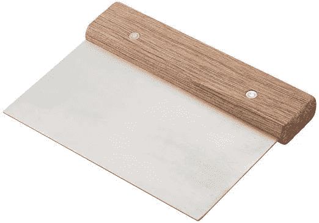
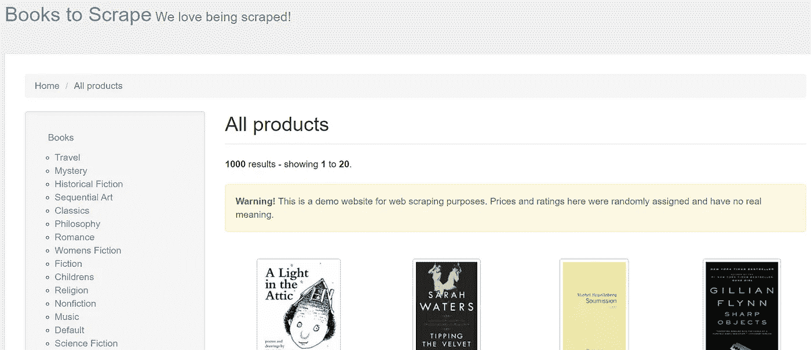
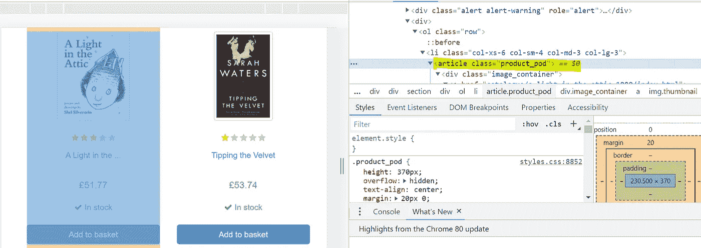
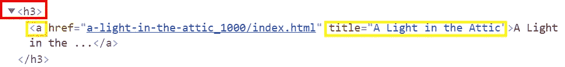
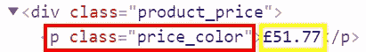
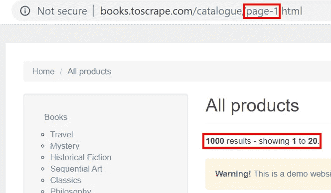
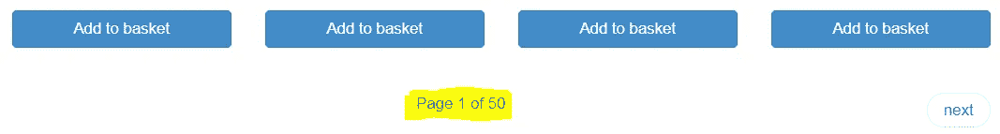

# (非常)温和地介绍了 Python 中的 Web 抓取

> 原文：<https://towardsdatascience.com/a-really-gentle-introduction-to-web-scraping-in-python-83cb9e536db8?source=collection_archive---------25----------------------->

## 废弃你的第一个网页，开始创建你自己的数据集！



就像在一个建筑工地，网页抓取是关于使用正确的工具！[来源](https://images-na.ssl-images-amazon.com/images/I/61h5J2F8L0L._AC_SX522_.jpg)

当我写了一篇关于数据科学家有能力废弃自己的数据的[重要性的文章时，我收到了几个关于如何开始这样做的问题，尽管有一些令人惊叹的教程，但它们可能会变得非常复杂，使完全初学者很难轻松跟上。](/be-brave-and-go-scrape-you-own-data-933eaeeb0f52)

我在这里的目的是向您展示有关工具和代码的基础知识，您可以使用这些工具和代码来收集数据并构建您的第一个数据集。在此之后，我希望您能够放心地继续学习和提高您对数据科学这一迷人领域的知识。

写满所有代码的笔记本就在这里。请便:)

## 你喜欢你的汤吗？

在 python 中，做网页抓取最流行的库是[美汤](https://www.crummy.com/software/BeautifulSoup/bs4/doc/)。它帮助我们从 [HTML](https://developer.mozilla.org/en-US/docs/Web/HTML) 文件中获取信息，并且，由于所有的网页都是用 HTML 编写的，我们使用大量我们称之为 *soup 命令*来提取我们需要的数据。

关于 HTML，至少有一些关于它的基本知识是有用的，包括它的书写方式和语法，但我应该警告你，这不是你在几天内就能学会的，所以我建议你在练习抓取技巧的同时学习它，至于我，就我个人而言，当我看到它们被用于实际例子时，我会学得更好。

## 从哪里开始刮？

在进入亚马逊、IMDB(电影评论)等真实世界的页面之前，我建议你看一下[抓取中心](http://toscrape.com/)，在那里你可以找到专门为想要练习抓取的人创建的页面。我之所以建议这样做，是因为像 e-bay 和其他巨头不希望人们抓取他们的页面，因为这会影响 page 的性能，所以他们创建了一些机制，使抓取变得更加困难。在本教程中，我们将使用一个[虚构的书店](http://books.toscrape.com/)，所以让我们来看看它是什么样子的:



[http://books.toscrape.com/](http://books.toscrape.com/)登陆页面。

## 我们的使命

今天的重点是基础知识，所以我们的目标是**用每本书的标题和价格**创建一个数据框架，这正是我们接下来要一步一步做的事情。

## 1-制作汤

第一步是找出我们想要的信息(书名和价格)在网站上的存储位置。要做到这一点，如果使用 Chrome，点击鼠标右键，选择“检查”。将显示所有 HTML 信息。然后，点击检查框左上角的箭头，用吸尘器将它吸到第一本书上，这样它将显示存储该项目信息的*类*的名称:



图书信息发现课。来源:作者。

所有图书信息都存储在*“product _ pod”*类下，这创建了我们所说的*容器，*一个存储一组数据的对象。然后，我们将创建一个 soup 对象，只需使用命令 [*find_all()*](https://www.crummy.com/software/BeautifulSoup/bs4/doc/) 获取该页面上每本书的信息:

```
20
```

结果显示，我们检索了大约 20 本书的信息。这是因为在 1000 本书的宇宙中，我们在这一页上只展示了 20 本书。我们以后会想办法获取所有书籍的信息。现在，我们将专注于探索第一本书，找出我们需要的信息，书名和价格，存储在哪里。

## 2-探索第一本书

如上所述，有 20 个容器可用，都具有相同的结构。让我们探索第一个:

结果很长，但是请花几分钟逐行阅读。你能弄清楚标题和价格在哪里吗？

```
<article class="product_pod"> <div class="image_container"> 
<a href="catalogue/a-light-in-the-attic_1000/index.html"></a> 
</div> <p class="star-rating Three"> 
<i class="icon-star"></i> 
<i class="icon-star"></i> 
<i class="icon-star"></i> 
<i class="icon-star"></i> 
<i class="icon-star"></i> </p> <h3><a href="catalogue/a-light-in-the-attic_1000/index.html" title="A Light in the Attic">A Light in the ...</a></h3> <div class="product_price"> 
<p class="price_color">£51.77</p> 
<p class="instock availability"> <i class="icon-ok"></i> In stock </p> 
<form> 
<button class="btn btn-primary btn-block" data-loading-text="Adding..." type="submit">Add to basket</button> 
</form> 
</div> 
</article>
```

如果你不熟悉 HTML，可以把它想象成一棵树。这里我们树的主干是<*article class = " product _ pod "*>，在这个结构中，一切都在后面。您应该已经注意到，我们在“a”元素下有一个标题，它也在“h3”元素内:



查找书名

要获得这些信息，语法类似于您想要访问数据框中的列，但是使用命令 *get()* 在“a”元素内导航:

```
'A Light in the Attic'
```

很简单，不是吗？价格呢？逻辑总是一样的，但现在我们有了不同的情况:



这里，我们将信息存储在元素“p”的一个*类*中。要访问它，我们需要使用 *find()* 函数，它需要对象和类名作为参数:

```
'51.77'
```

瞧啊。我们现在有了获取数据所需的代码！

## 3-抓取所有页面

让我们想想我们需要废弃多少页。通常，像我们这里这样的在线商店，喜欢在每个页面上展示按几个元素分组的产品。在我们的例子中，第一页显示了前 20 本书:



检查网页的组织方式总是很重要的。

有时我们拥有的总页数会显示在页面底部，所以让我们来看看:



要废弃的总页数。

我们不得不删除 50 页，因为每个页面的链接都是一样的，我们需要更改 *url* 的页码。有了这些知识，我们要做的是:

*   创建一个数字从 1 到 50 的列表；
*   启动两个空列表来存储关于标题和价格的信息；
*   启动一个 [*for 循环*](https://www.w3schools.com/python/python_for_loops.asp) ，该循环将迭代 50 页；
*   在每个页面中创建一个请求，然后为每本书创建容器；
*   使用另一个 for 循环，迭代每个容器以获得标题和价格；
*   最后，将这些信息添加到列表中。

这正是下面的代码所做的。我再一次邀请你一行一行地仔细阅读。我试图让它尽可能简单，因为理解代码是如何编写的很重要，所以你可以用你自己的方式来写:

## 4-创建数据框

创建列表后，我们只需使用我们的老朋友[熊猫](https://pandas.pydata.org/)将列表“压缩”在一起，并创建我们想要的数据框:

结果，我们有了一个新鲜出炉的数据框，随时可以使用！


抓取网页后产生的数据框。

## 最终考虑

我希望你对网络抓取的可能性感到兴奋。这可能非常具有挑战性，因为每个网站都是不同的，我们需要执行的策略也是如此，以便检索每个网站上的数据。但是在我看来，练习使用 Beautifulsoup 是提高你的网页抓取技能的最好方法。接下来，您可以使用该项目的笔记本作为起点，并尝试向数据框中添加更多信息，例如:

*   评级和
*   现货供应。

在您对语法感到满意之后，您还可以尝试改进循环，在每一页书内导航并获得产品描述。无论如何，你在这里学到的知识可以在网上的任何地方使用。

非常感谢你花时间阅读这篇文章，下一篇再见！