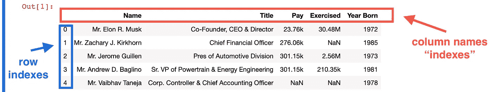
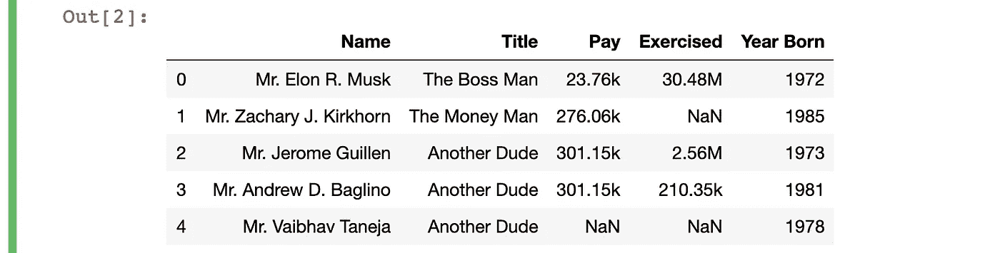

# 一个非常简单的方法来编辑熊猫数据帧中的一行一行

> 原文：<https://towardsdatascience.com/a-really-simple-way-to-edit-row-by-row-in-a-pandas-dataframe-75d339cbd313?source=collection_archive---------2----------------------->

## 大蟒

## 使用 pd.loc 根据条件更改数据的子集。


图片由@ [siscadraws](https://www.instagram.com/siscadraws/) 创建(Instagram)

您是否曾经需要根据某些条件编辑表格中的每一行？

这是数据分析项目的常见任务。每次需要这样做时，我都会在 StackOverflow 中搜索解决方案。最后，我阅读了 Pandas 文档，并创建了一个模板，每当我需要逐行编辑数据时，这个模板都能工作。

下面我们来看看如何使用熊猫。 **loc** 方法来选择你的数据的一个子集，如果它满足一个条件就编辑它。

*注意，在尝试下面的任何代码之前，不要忘记导入熊猫。*

```
import pandas as pd
```

# 对…的快速介绍。位置[]

熊猫文档对“**有这样的描述。loc[]** ":

> 通过标签或布尔数组访问一组行和列(在`*.DataFrame*`中)。

对于我们的例子，我们将使用这样的方法:

```
df.loc[row_indexer,column_indexer]
```

这里有一些样本数据，并举例说明了`row_indexer`和`column_indexer`指的是什么。(关于如何获取样本数据的解释，请查看我的另一篇文章[轻松从网站获取表格](https://bit.ly/byronown11)。)

```
df = pd.read_html('[https://finance.yahoo.com/quote/TSLA/profile?p=TSLA')[0](https://finance.yahoo.com/quote/TSLA/profile?p=TSLA')[0)]
```



摘自雅虎财经的样本表格

要设置一个`row_indexer`，您需要选择一个蓝色的值。最左边一列中的这些数字是“行索引”，用于标识每一行。一个`column_indexer`，你需要选择一个红色的值，它们是数据框的列名。

如果我们想要选择文本“Mr. Elon R. Musk”，我们需要执行以下操作:

```
df.loc[0,'Name']
```

这给了我们想要的输出:


选择 Elon Musk 名字的 df.loc 的输出

现在我们已经有了基本的东西，我们准备开始编辑我们的表格！

# 基于一组条件逐行编辑数据帧

现在，假设我们想要编辑表中一些人的“Title”值。让我们把埃隆·马斯克(Elon Musk)改成“老板”，扎卡里·柯克霍恩(Zachary Kirkhorn)改成“投资人”，其他人都改成“另一个家伙”。

我们需要遍历表中的每一行，检查“Name”值是什么，然后根据我们指定的更改编辑“Title”值。

为了逐行浏览数据，我们将使用 **df.index** ，它从数据帧中选择“行索引”。为了了解其工作原理，我们可以在一个基本的“for”循环中打印样本表中的索引:

```
for index in df.index:
    print(index)
```


for 循环的输出，用于打印数据帧的索引值

这为我们提供了与您在第一个屏幕截图中看到的最左边一列相同的值。

**为了搜索和编辑数据帧中每一行的数据子集，我们使用下面的代码:**

```
for index in df.index:
    if df.loc[index,'Name']=='Mr. Elon R. Musk':
        df.loc[index,'Title'] = 'The Boss Man'
    elif df.loc[index,'Name']=='Mr. Zachary J. Kirkhorn':
        df.loc[index,'Title'] = 'The Money Man'
    else:
        df.loc[index,'Title'] = 'Another Dude'
```

这个循环将遍历数据帧的每一行，检查“名称”是什么，然后根据它满足的条件编辑“标题”。我们的条件是，每一行的价值“名称”是否与“埃隆·r·马斯克先生”、“扎克里·j·柯克霍恩先生”和其他所有人在一起。

在本例中，因为第一行的“姓名”是“Mr. Elon R. Musk ”,所以脚本会将第一行的“头衔”值更改为“老板”。因为我们使用 **df.loc[]** 指定了行索引，所以它知道哪一行要执行这个更改。

生成的数据帧如下所示:



已编辑的数据帧，根据条件更改了“标题”值

我们已经根据前面指定的条件成功地更改了每一行的“Title”值！

我希望下一次您必须梳理成千上万的行并根据某些条件编辑值时，您会发现这很有用。

你应该查看一下 [df.loc[]文档](https://pandas.pydata.org/pandas-docs/stable/reference/api/pandas.DataFrame.loc.html\)，了解更多关于如何使用该方法的信息。你也可以看看 [Pandas 用户指南](https://pandas.pydata.org/pandas-docs/stable/user_guide/indexing.html#indexing-label)来获得更多关于索引和选择数据的提示。

编辑愉快！