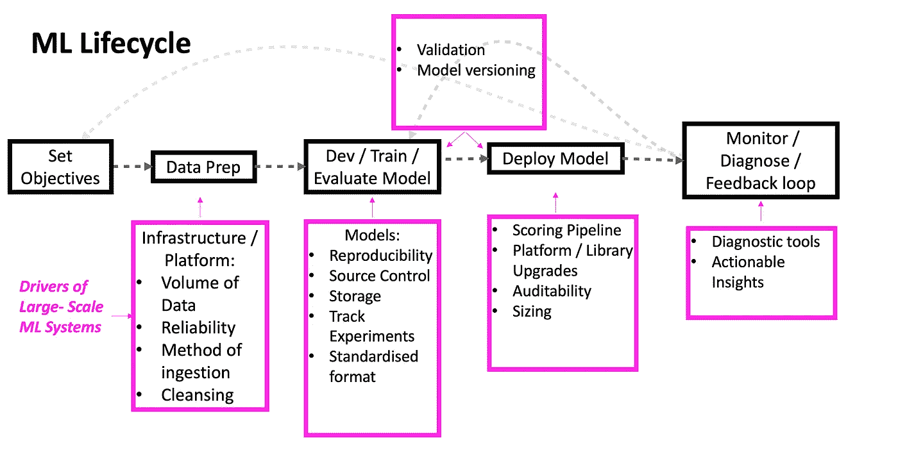
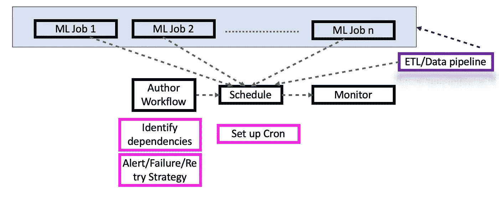

# ML-Ops 的配方:机器学习的扩展和操作

> 原文：<https://towardsdatascience.com/a-recipe-for-ml-ops-scaling-operationlising-machine-learning-9a532e3ecd34?source=collection_archive---------50----------------------->

## 在解决问题方面，机器学习理论得到了更多的重视，但对操作化和商业化的思考太少。让我们探索一下如何将规模带入 ML 解决方案。

典型的机器学习生命周期&实现大规模 ML 解决方案的相应驱动因素

# 前提

本文旨在给出有效扩展机器学习解决方案所需的概念层次。

与质量取决于代码/平台架构的传统软件不同，数据科学/机器学习完全是关于**微调指标**，**质量不仅取决于代码/平台架构，还取决于数据和调整的程度**。(来源:[数据报](https://www.slideshare.net/databricks/managing-the-complete-machine-learning-lifecycle-with-mlflow-230985564/6))

这是一个持续改进的生命周期，除了与健壮的部署管道无缝集成之外，还必须不断地使用/试验多种技术。

作为我们讨论的基础，本文以可再生能源、风力预测为例。所使用的 ML 算法超出了本文的范围，但是*我们将看到如何给引擎装上轮子*，扩展以满足每天处理的万亿字节信号。

# 设定目标

捕捉问题定义与雇佣最好的数据科学家来解决问题一样重要。考虑到可再生能源预测领域，针对一般受众的单一目标可总结如下:

***获取可用的最佳功率预测***

根据地区法规/市场要求，根据所需的预测类型、提交时间、提交频率和预测粒度(例如:每小时、每半小时、每“n”分钟等)设定目标。

## 数据准备:

根据手头的问题，数据科学家需要决定训练和部署模型所需的数据类型。数据工程团队将并行工作以创建主干网，并考虑以下因素:

1.  **摄取方法**(是否是 ftp、IOT、API、数据湖等)
2.  **数据量/频率**
3.  **清洗/清洁**:(去除噪声、副本、输入等)
4.  **可靠性**(质量、完整性、解决数据缺口、延迟等)

## 模型开发/培训/评估:

***数据科学家在检查可用数据的性质之前，不应该开始开发模型。***

算法的选择应与当前预测问题的性质以及这些算法对数据中观察到的不规则性/噪声的响应程度相关联。

## **平台**是从一开始就要做出的另一个重要选择:

1.  **可伸缩性**:这方面不仅包括各种预测下的模型/代码可伸缩性，还包括条件。为概念验证而编写的代码很少是可伸缩的。为可伸缩系统编写代码时，本质会发生变化，甚至数据科学家也可能需要忘记和重新学习。
2.  该平台需要容纳一个**高效的数据管道**:一个健壮的系统，用于及时接收、存储和检索，以便每天进行多次预测。
3.  **再现性，跟踪&存储**:全新场景培训的初始阶段包括实验和比后期更多的微调。因此，重要的是每个实验在所有水平上都是可重复的:即，模型被训练的条件。(*注意:模型版本化不同于代码版本化，这里模型将被标记上所有用于重新生成模型的工件。诸如****ml flow****等框架都内置了这些特性。*)。
4.  **标准化**:无论使用何种方法/算法，都应采用即插即用格式，与外部子系统的接口(如果适用)应通过标准接口，最好通过 API 封装。
5.  **度量/ KPI** s:性能度量的选择取决于领域，并且主要由业务参数驱动。例如:与准确性相关的指标，如 *nmae、RMSE、MAPE* 等。正被用于预测分析领域。
6.  当然，对于用于开发模型的代码和输入配置文件，隐含了**软件配置管理&版本控制**的原则。
7.  ***产品化就是让模型适应现实世界的条件，在这种条件下模型要经受*** *。*通常在纸面上或概念证明通常会在交叉验证层面产生良好的结果，但需要详细考虑的是**操作准确性**。通常，在部署到生产中之前，**应在近场条件下评估**模型。尽管模型性能是一个主观的问题，但是新的模型应该至少比部署的模型大几个点，如果不是这样，回归系统应该发出警报，并且记录异常/异常值。

## 部署:

1.  **成本&规模**:风力发电场通常根据其能源容量和资产数量进行分级。每个客户都需要一个基于单个服务器场的预测，或者需要一个包含多个服务器场的合并提交格式的预测，因此，每次部署的计算成本可能会有很大差异。**与此同时，平台和架构的选择应该确保成本不会随着部署的增加而呈指数增长，并且最终会趋于平稳。**
2.  可扩展的机器学习平台在不断发展，因此频繁的升级和图书馆的 eol ( *寿命终止)*公告是常见的。因此，任何类型的**软件升级，无论是更新的型号，还是库升级，都应该是 100%自动化的**。同样，解决方案架构扮演着重要的角色。理想情况下，基于容器的实现是首选，但这同样取决于要解决的问题以及随之而来的约束。
3.  **部署模型的可审核性**与可再现性同样重要；如果某项工作失败或未能以最佳方式执行，了解其原因非常重要，这将直接影响客户的响应时间。

## 监控/诊断/反馈回路:

1.  机器学习是一个持续改进的过程，因此部署模型意味着开发监控工具**来提供可操作的见解**。这些包括指标、异常值、异常值等。大多数公司低估了为此目的构建**内部**工具的优势，因为这些工具捕捉了这些模型所暴露的实际工作环境。
2.  由于季节变化、有限数据集上的训练、数据管道问题等，模型会随时间漂移。因此，安装一个**漂移监控**系统有利于操作。主动预警机制确保一个运行良好的系统能够管理大量模型。
3.  在设定部署目标的阶段，客户可能没有用于比较性能的基准数据。但是，一旦每日预测到位，更多的洞察力就会产生，从而导致一组更精确的目标。这最后一英里的连接是一个重要的环节，它导致从现场到产品管理/数据科学家的反馈循环。这通常会导致目标、再培训和度量的细化。

## ML-Ops 与 Dev-Ops

Dev-Ops 致力于建立生产大规模软件解决方案的自动化管道。因为预期的 o/p 是已知的，所以基于规则的系统非常适合这个范例。

但是，由于预测解决方案的主观性质(即，这里没有放之四海而皆准的标准，即期望的准确性水平)。)，因此为管道移植严格的基于规则的通过/失败方法可能不适用于 ML-Ops 中的所有级别。

典型的部署管道可能包括以下内容:

Airflow、Luigi 等是**工作流创作**工具的例子。它们标识了作业之间的依赖关系，并在出现故障时挂钩要采取的行动。**调度**通常包括设置 cron 作业——有许多类型的语法，有时当有复杂的调度时，创造性地组合它们。

*从培训、再培训到部署，能源预测是否有 100%****CI/CD****管道？*假设一个非常干净的数据管道，理论上是可以的。但大多数情况下，在培训过程中会涉及手动流程，例如:对于新客户，历史数据会更少，并且大多数特征是未知的。因此，训练者有意识地选择初始数据集。同样，在评分过程中，由于极端天气条件，某一天或一天中的某个时间的准确度误差飙升并不罕见，这并不意味着模型没有发挥作用。

只要有更多的数据可用，随着更复杂的机制的发展，就可以实现完整的 CI/CD。

## 结论

1.  仅仅关注理论和技术，而没有对模型执行环境的**理解**将导致机器学习世界中的许多循环。
2.  参与运营的团队需要具备基本的技术技能，并且应该能够**有效地与客户端和数据科学家**交流。
3.  机器学习解决方案总是持续改进模式，因此有必要拥有用于部署的**健壮的&高效的管道**和用于监控的**诊断工具**。
4.  **目标，** **基于证据的** **数据驱动的**决策是长期客户满意度的关键。