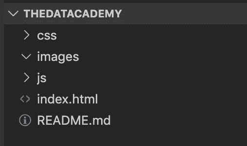
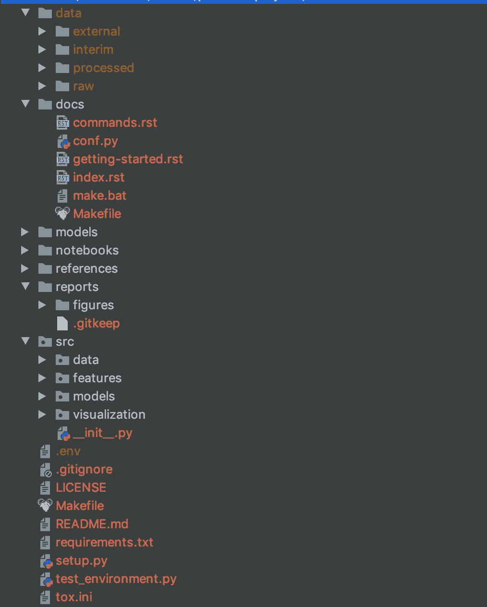
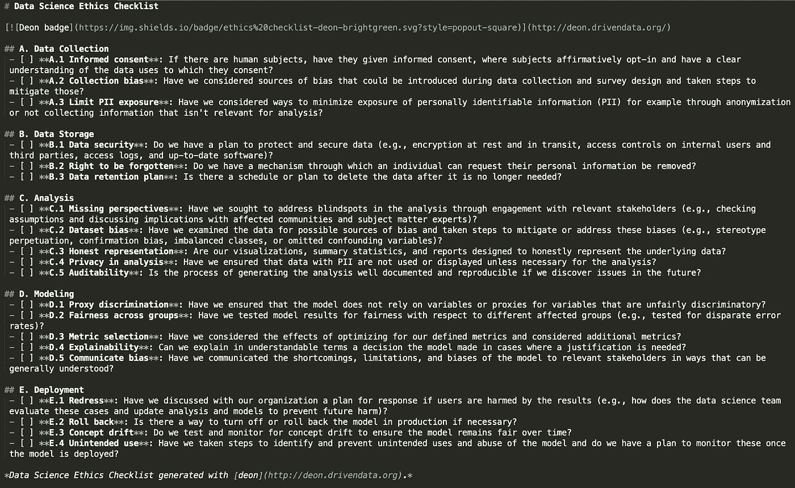

# 组织数据科学项目的秘诀

> 原文：<https://towardsdatascience.com/a-recipe-for-organising-data-science-projects-50a1cc539c69?source=collection_archive---------28----------------------->


罗马卡夫在 [Unsplash](https://unsplash.com/s/photos/recipe-book?utm_source=unsplash&utm_medium=referral&utm_content=creditCopyText) 上拍摄的照片

## 了解如何创建结构化和可重复的数据科学项目

数据科学项目本质上是实验性和探索性的。在从事这类项目时，很容易以一大堆难以破译或复制的代码告终。

数据科学项目在这方面不同于传统的软件工程项目。然而，创建一个可靠的代码结构是可能的，它将确保您的项目及其结果对于您自己和其他人来说都是可重复的和可扩展的。

在下面的文章中，我将为您提供一个包括工具、流程和技术的方法，用于建立数据科学项目，它将为您带来以下好处:

*   一致的项目结构，以便您的代码易于理解。
*   版本控制，这样您就可以在不破坏核心项目的情况下进行跟踪和更改。
*   一个隔离的虚拟环境，以便项目可以轻松地重现。
*   道德和安全项目。

# 项目结构

大多数 web 和软件开发编程语言都带有预定义的标准代码结构。例如，我最近一直在学习 [Bootstrap](https://getbootstrap.com/) ，当我下载这个项目时，我会自动得到一些类似下图所示的框架代码，这给我留下了深刻的印象。



这意味着，不管您正在构建的项目的确切性质如何，一个外人看到以这种标准方式组织的代码时，会立即知道在哪里可以找到某些文件，并可以轻松地跟踪您的代码。它对协作和再现性有很大的帮助。

有一个为数据科学项目开发的工具，可以自动创建一个名为[cookiecutter-data-science](https://drivendata.github.io/cookiecutter-data-science/)的标准项目结构。该工具可以通过 pip 安装。

```
pip install cookiecutter
```

要启动一个新项目，只需键入以下内容，没有必要先创建一个新目录，因为 cookiecutter 会为您完成这项工作。

```
cookiecutter https://github.com/drivendata/cookiecutter-data-science
```

该工具将带您通过一系列问题来设置您的项目。第一个将要求输入项目名称，该名称将是创建的目录的名称。


出现提示时继续回答问题。许多问题是可选的，你可以简单地点击与你的项目无关的回车键。

现在，您将拥有一个新目录，其名称与您为项目命名的名称相同。如果您导航到它，它将包含一个类似于此图的文件结构。项目结构包含一点 python 样板文件，但不限于 Python 项目，因为如果您使用不同的编程语言，它总是可以被删除。



# Github 知识库

Github 是一个版本控制工具，它存储项目的远程版本，称为存储库。任何有权限的人都可以将这个存储库克隆到他们的本地机器上。在提交到主版本之前，可以在这里进行更改和测试。

版本控制确保可以安全地对项目进行更改，而不会破坏原始代码库。这有助于项目的协作，也确保您不会破坏自己的代码！

要在您的项目中使用 Github，一旦您有了帐户，您应该在您的 Github 主页上创建存储库。通过点击**新建**按钮并遵循以下说明。


在 cookiecutter 设置过程中，它会要求您提供一个远程存储库。如果您给出了您创建的资源库的名称，那么您的项目将被存储在 Github 上。

关于 Github 更详细的使用说明，请看我之前的文章[这里](/introduction-to-github-for-data-scientists-2cf8b9b25fba)。

# 虚拟环境

您创建的每个项目都可能需要您正在使用的不同版本的编程语言和特定的库。虚拟环境在本地系统中创建一个隔离区域，包含项目的确切库和版本。

您或其他人可以很容易地复制这些环境，并且可以从任何位置创建和运行项目。它们是协作和可复制数据科学项目的重要组成部分。

创建虚拟环境有许多不同的工具。数据科学项目的热门选项包括 [Conda environments](https://docs.conda.io/projects/conda/en/latest/user-guide/concepts/environments.html) 、 [Virtualenv](https://virtualenv.pypa.io/en/latest/) 和 [Pipenv](https://github.com/pypa/pipenv) 。

您选择的工具通常取决于个人偏好或特定的项目需求，例如与项目所需的其他工具的兼容性。我个人使用 Pipenv，因为我主要使用 Python。我将快速浏览一下如何使用 Pipenv 为项目创建虚拟环境。

Pipenv 需要通过自制软件安装，如下所示。

```
brew install pipenv
```

要使用特定版本的 python 创建一个新环境，请将`cd`放入您的项目目录，然后运行如下所示的命令。

```
mkdir pip-test
cd pip-test
pipenv --python 3.7
```

要激活环境运行`pipenv-shell`，您现在将进入一个名为“pip-test”的新环境。

如果我们检查目录的内容，我们会看到 Pipenv 创建了一个名为`Pipfile`的新文件。这是需求文件的 Pipenv 等价物。每次在环境中安装软件包时，软件包名称和版本都会添加到该文件中。然后，可以在另一个系统或计算机上使用 pipfile 来为您的项目构建精确的环境。

# 伦理学

道德和数据保护的主题在数据科学领域变得越来越重要。我们必须确保正在构建的数据和模型不包含不公平的偏见，因为这些模型正越来越多地涉及人们的日常生活。保护敏感的客户数据免受潜在的黑客攻击或泄露也很重要。

您可以在项目中使用一些常用工具和程序来采取一些措施保护数据并确保项目无偏见。

首先是`gitignore.`档。您将在 cookiecutter 项目中看到这个文件是自动生成的。这些文件是一种确保某些文件或目录被忽略且不提交到您的存储库中的方法。例如，您通常不希望您的数据或模型文件在线可用。通过将它们添加到这个文件中，Github 将会忽略它们。如果我将`data/*`添加到这个文件中，那么整个数据目录将不会被添加到远程存储库中。

第二个工具叫做 [deon](https://deon.drivendata.org/) 。这使您可以轻松地向数据科学项目添加道德检查表。要使用该工具，只需运行`pip install deon`或者如果您在 Pipenv 环境中运行`pipenv install deon`。

要添加清单，只需运行`deon -o ETHICS.md`。这将把清单作为一个名为 ETHICS.md 的文件添加到您的项目目录中。该文件如下所示，包含一个建议问题列表，用于在整个项目中审查，以确定它是否符合伦理考虑。



我在本文中给出的方法适用于大多数数据科学项目。当然，在某些特殊情况下，您需要进行更改或添加额外的步骤。然而，我发现，通过遵循这些步骤，我可以更容易地创建有组织的项目，这些项目可以被他人分享、理解和处理。

感谢阅读！

我每月都会发一份简讯，如果你想加入，请点击此链接注册。期待成为您学习旅程的一部分！