# 告诉我你想要什么:基于客户偏好和产品评论的推荐系统

> 原文：<https://towardsdatascience.com/a-recommender-system-based-on-customer-preferences-and-product-reviews-3575992bb61?source=collection_archive---------31----------------------->

照片由[晨酿](https://unsplash.com/@morningbrew?utm_source=medium&utm_medium=referral)在 [Unsplash](https://unsplash.com?utm_source=medium&utm_medium=referral) 拍摄

德克萨斯州奥斯汀市西湖高中。

**如今，消费者面临着一个巨大的挑战**，他们要从任何产品类别的众多选择中做出选择。我开发并测试了一个系统，该系统可以将购物者对产品特性的偏好与在线评论推荐相匹配。我还执行了功能级别的情感分析，以确保推荐的产品在首选功能方面具有较高的客户满意度。这种推荐系统与最常见的方法有很大的不同，最常见的方法是将产品(如电影)作为输入，并找到类似的产品作为推荐。它也不使用购物者的历史，因此避免了冷启动问题，也非常适合一次性购买。

作为一名越野赛跑运动员，我想为跑鞋建立一个推荐系统。我的推荐系统([**【runningshoe4you.com】**](https://runningshoe4you.com/))对来自 18 家制造商的 505 款跑鞋进行了 10 万次评论，与综合评分最高的跑鞋相比，它找到了更符合消费者理想偏好的跑鞋，而无需阅读大量的产品评论。我为这个推荐系统编写的 Python 代码可以从我的一个 GitHub 仓库获得:[**https://github.com/JoshB02/recommender-system-tools**](https://github.com/JoshB02/recommender-system-tools)

对于消费者来说，如果不花费大量的时间和精力来评估众多的备选方案，就很难找到符合其偏好的合适产品。奇怪的是，Amazon.com 网站给用户增加了阅读评论的负担，一次一个产品。例如，通过关键字“跑鞋”进行搜索会产生许多页面的结果，在第一页上就显示了 68 种产品。用户必须点击一个产品，并阅读该产品的评论；对于另一个产品的评论，用户必须点击第二个产品，并重复这个乏味的过程。我确信亚马逊已经发现这种展示产品信息的方式可以使其利润最大化，但是我觉得这占用了我们过多的时间。

为了让它变得简单一点，亚马逊确实提供了一组按钮，代表它从词频分析中找到的评论关键词或短语。图 1 显示了某双跑鞋的关键字或主题按钮。如果我们点击一个按钮，比如说，*完美匹配*，亚马逊会显示所有包含该关键词的评论。虽然这种方法很有用，因为它允许购物者根据她在产品中寻找的东西来关注评论，但它仍然需要她阅读许多评论，每个产品一次一个功能。这个过程可能会令人沮丧。

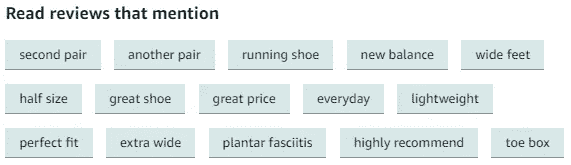

图 1:亚马逊网站上一双鞋评论的关键词按钮(来源:Amazon.com)

## **提取用户评论中提到的产品特征**

我用了名词(如舒适)、动词(如舒适)、形容词(如舒适)和副词(如舒适)从评论中提取产品特征。

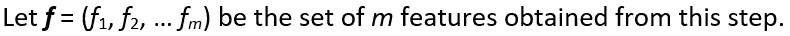

我将产品评论集转换成二进制值(0 或 1)的矩阵，这是基于它们是否包含对这些特性或相关词的提及，如表 1 所示。

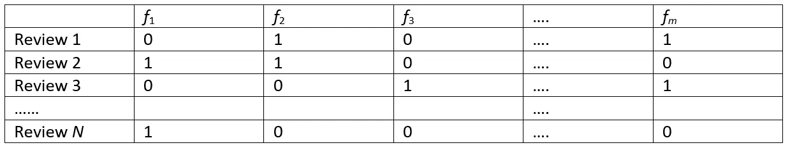

表 1:使用特征的产品评论的向量表示

从上表中可以看出，每个评论都可以表示为一个特征向量，其中 1 (0)表示该特征或相关词在该评论中(未)被提及。原始评论数据对于进行情感分析仍然是有价值的，因为所有与情感相关的信息都将在上述步骤中丢失。作为二进制表示的替代，我们也可以使用词频-逆文档频率( *tf* - *idf* )来表示评论向量。

## **获得关于期望特征的用户输入**

有两种可能的方法可以在不侵犯用户隐私的情况下获得用户的输入。首先，我可以让用户从列表中选择她喜欢的产品特性。这将提供期望的特征向量。

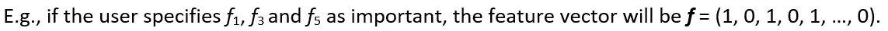

然而，如果我只考虑用户已经明确指定的特性，那么这些推荐会更有意义。

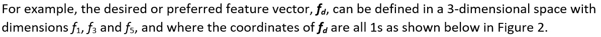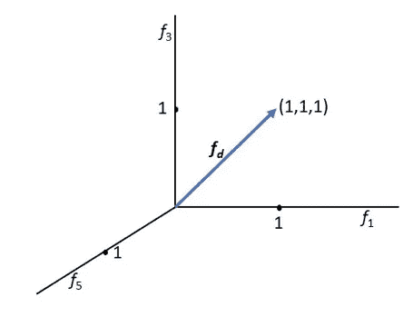

图 2:购物者选择的具有三个特征的特征空间

有时，购物者可能不确定她喜欢的功能，但可以指出她可能听说过或感兴趣的产品。在这种情况下，我们可以使用以下公式来确定客户评论中哪些功能与该产品密切相关:

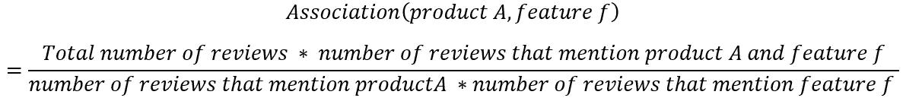

如果关联值大于 1，则关系显著，我们可以推断，当人们写产品 *A* 时，他们将其与特征 *f* 相关联(反之亦然)。1 以上的关联值越大，关系越强。因此，当购物者表示对产品感兴趣时，将具有高关联值的特征作为她可能感兴趣的特征集是合理的。

## **获得偏好和评论之间的匹配分数**

有多种方法可以获得评论和所需特征向量之间的匹配分数。余弦相似性是最常见的方法，在这种情况下，余弦相似性是同一空间中期望的特征向量和评论向量之间的角度的余弦。设 *D* 是由用户选择的或者从与所选产品的高关联值推断的特征集合。

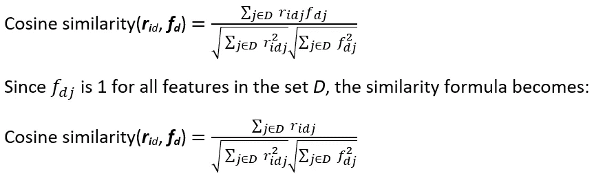

一个产品和一组期望的特征的平均余弦值向我们展示了购物者在产品中寻找的东西和评论中提到的特征之间的匹配。如果分数接近 0，则匹配度低，而分数接近 1 表示强匹配。如果总共有 *N* 个评论，那么对于给定的一组特征，将获得 *N* 个余弦分数，并计算每个产品的平均值。

余弦相似度中要求精确单词匹配的替代方法是**单词嵌入**。虽然原则上更好，但是对于单词嵌入，我面临着推荐系统不能很好地区分不同特征的问题。例如，虽然缓冲和舒适是跑鞋的两个不同特征，但标准的单词嵌入是基于新闻和其他主题，其中缓冲和舒适很可能彼此非常接近地出现。因此，在单词嵌入方法中，缓冲和舒适被视为相似的单词，这导致了较差的推荐。我在创业的时候写过一篇关于这个话题的文章:[**https://medium . com/swlh/word-embeddings-vs-bag-of-words-The-curious-case-of-recommenders-systems-6ac 1604d 4424**](https://medium.com/swlh/word-embeddings-versus-bag-of-words-the-curious-case-of-recommender-systems-6ac1604d4424)

## **特征级情感分析**

虽然相似性分析显示了关注推荐系统的用户认为重要的相同特征的评论，但是它不能区分正面和负面的情感。考虑两个简短的评论:

点评(一):“这鞋一点都不舒服，但是很耐穿”。

评论(二):“如此令人惊讶的舒适的鞋子，加上我也喜欢的支持。”

如果购物者将*舒适度*指定为重要特征，则两条评论的相似性得分会更高；然而，与第一次评论相关的产品不应该被推荐，假设类似的观点在产品的其他评论中得到回应。因此，除了计算相似性得分之外，还需要进行情感分析。

虽然一个产品的总体情感分数可能是有用的，但我们需要知道用户对产品的某个特定特性的感受。我们可以使用的一个简单假设是，客户将在特征词周围的词窗口中表达她对特征的情感。例如，在简短评论“这些鞋子具有卓越的耐用性”中，*卓越的*一词抓住了关于特征*耐用性*的情感。因此，从一篇评论中，如果我们提取一个窗口，比如说，在特征词的右边和左边都有三个词(当可用时)，我们可以将这个词窗口通过情感分析器。例如，窗口大小为 3，排除像 *a* 、 *the* 或 *be* 这样的停用词，我们将从上面两个简短评论中获得以下内容:

来自评论(一):鞋子一点也不舒服

从审查(二):如此令人惊讶的舒适的鞋子，加上也

这些评论的提取部分现在可以通过情感分析器发送，产生的情感分数可以归因于特征*舒适度*。

虽然所有的情感分析量表都包含负值，但用户更熟悉亚马逊的 1-5 评级量表。我使用 Python 中的 VADER 情感分析器，它有[-1，+1]的标度。为了给出亚马逊量表上的情感评分，我运行了一个线性回归:亚马逊评分=*C*+*a** VADER+误差，其中 *C* 是一个常数，而 *a* 是 VADER 评分的系数。根据我收集的数据，我得到 *C* = 3.66 和 *a* = 1.36，调整后的 *R 平方*为 42.2%。均方根误差(RMSE)为 0.228，相当不错。因此，我的推荐系统不会显示 VADER 的情感评分，而是显示亚马逊对每个产品特性的预测评分，评分范围为[1，5]。

## **提出建议**

对于每件产品，我计算了购物者选择的特征的相似性得分和情感得分的加权和。由于 VADER 的量表是[-1，+1]，这种相似性和情感分数的增加不会对量表造成问题。推荐的产品是加权分数最高的产品。

## **数据采集和预处理**

我用 Selenium 用 Python 写了一个刮刀，从亚马逊产品评论页面和其他网站上刮了超过 100k 条跑鞋评论。大量文本的一个常见问题是语料库包含大量单词。为了减少这些词汇，我有选择地删除了停用词，同时保留了否定停用词，因为它们颠倒了情感的极性。为了进一步减少总字数，我使用了词汇化。此外，我转换了所有的词类(例如，舒服，舒服，等等。)和同义词转化为相应的名词(comfort)。然而，出于情感分析的目的，我保留了原始的评论集。

对于购物者指定的每个组合，我的推荐系统计算(I)特征向量与每个评论向量 *rid* 的余弦相似性，(ii)每只鞋的平均余弦相似性，计算为一只鞋的所有评论的平均值，以及(iii)对于每个选择的特征，每只鞋的平均亚马逊调整情感分数。

作为一个例子，考虑一个用户告诉系统，一双跑鞋的三个特征——*舒适*、*支撑*和*耐穿*——对她来说很重要。对于这三个特征，来自我的系统的三个推荐显示在表 2 中，包括匹配分数(在 0 和 1 之间)，亚马逊为每个特征调整的情绪，以及平均特征情绪。为了评估我的建议，我考虑了 Amazon.com 评价最高的三款跑鞋。如表 3 所示，这些鞋子的匹配分数(平均值= 0.20)明显低于我的系统推荐的分数(平均值= 0.52)。类似地，评分最高的鞋子的每个特征的情感评分都低于我的推荐。更重要的是，在我的推荐中，讨论这三个偏好特征的评论的百分比明显更高(我们的推荐平均为 50.1%，而评分最高的鞋子为 14.5%)。不同的顾客可能出于各种原因喜欢一种产品。因此，一个总体评价很高的产品仅仅意味着很多顾客在产品中找到了喜欢的东西。然而，这并不一定意味着产品非常适合购物者的特定偏好。

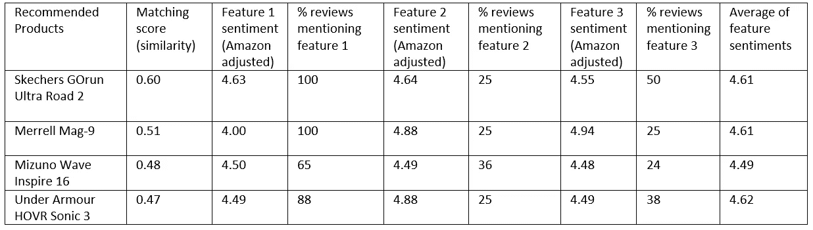

表 2:特性*舒适性*、*支撑性*和*耐久性*的四项建议

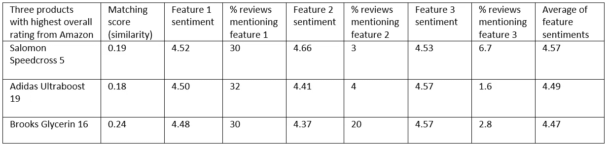

表 3:使用亚马逊三个最高综合评分推荐的鞋子

## **相似的功能，更低的价格？**

尽管大牌品牌的吸引力显而易见，但我的推荐系统可以找到价格低于顶级品牌、但具有相似特征的产品，并且可能对这些特征有更积极的看法。例如，如果用户指定一种产品，系统计算该产品和十二个特征中的每一个之间的关联值。然后，它选择三个关联度最高的功能，并推荐，比如说，三个价格较低的产品，但由于与更贵的产品具有相同的功能而受到评论者的称赞。下面显示了用户指定零售价格标签为$240 的水野彩香波预言 8 的情况下的结果(表 4)。

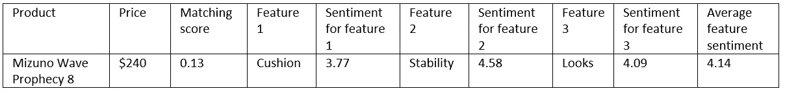

表 4:与购物者指定的产品相关的特征

我的系统发现与该产品关联最大的三个特征是*坐垫*、*稳定性*和*外观*。基于这些特征，系统建议的三个备选产品的价格明显较低(120 美元至 150 美元)，而匹配得分则高得多，特征情感得分也是如此(表 5)。

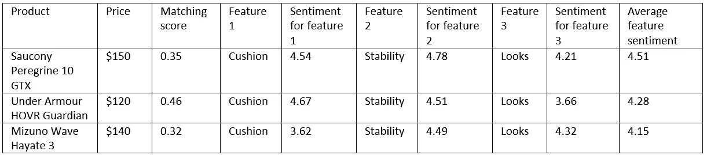

表 5:三款价格较低、功能匹配较好的推荐产品

## **外卖**

虽然电子商务使提供无限种类的产品成为可能，但其成功的最大障碍是购物者在搜索、发现和评估大量不熟悉的选择时所付出的大量时间和精力。我的方法是通过匹配购物者对产品的需求和之前顾客对其购买的描述来推荐产品。结果，消费者只能选择几个她真正看重的产品特征。

同样，我为这个项目写的 Python 代码可以在:[**https://github.com/JoshB02/recommender-system-tools**](https://github.com/JoshB02/recommender-system-tools)获得