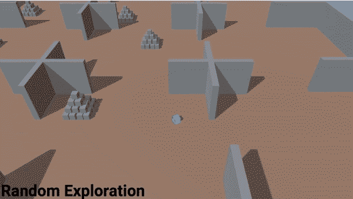

# 代理驱动的探索中的好奇心

> 原文：<https://towardsdatascience.com/a-reinforcement-learning-approach-towards-sentient-ai-96bea67b5de5?source=collection_archive---------63----------------------->

## 通过揭开认知的秘密走向人工通用智能之路

来源:https://unsplash.com/

最近，我在听一些与人工智能相关的讲座，并偶然看到了 GOTO Copenhagen 会议，会上 Unity Technologies 的人工智能和人工智能副总裁 Danny Lange 讨论了智能在生物进化和学习中的作用。我发现他的演讲非常有趣，我想与你分享我的一些直觉。

# **像 Siri 和 Alexa 这样的代理真的有智能吗？**

今天存在的智能体不能真正被归类为智能体。例如，Siri 和 Alexa 等个人助理使用一些机器学习来进行语音识别和其他一些活动，但它们基本上是硬编码的软件，是由人为人设计的。

几年前，亚马逊为他们的 Alexa 项目配备了大约 10，000 名员工，所以很多后端实际上是由人来运行的。看起来好像是计算机在执行某些任务，但实际上是人在执行这些任务，这意味着它非常依赖于人来完成。甚至亚马逊和网飞的预测也只是基于聪明人挑选各种商品的建议的算法。欺诈检测、股票交易和脸书馈送都是人们创造的智能算法，但它们本身并不真正智能。

# 那么什么是真正的智慧呢

来源:https://unsplash.com/

人类通常被认为是智能的缩影，但机器最终会超越人类。超级计算机的处理能力和内存已经超过人类，人类的内存相对于计算机真的很差。那么，如果这些极其聪明的个人助理如 Alexa 甚至人形机器人如 Sophia 都不能被归类为具有智能，那么是什么造就了智能呢？

> **字典对智力的定义大致为:**
> 
> **“获取知识和技能的能力”**

人类所知的唯一真正的智慧是生物系统。动物和人类都有智力。大自然赋予了生命智慧，但是为什么人类真的有智慧，或者有智慧的目的是什么。它基本上是基于几个原则，其中之一是熵。

所以，对于一个生物有机体来说，为了维持自身，它需要消耗能量来维持其复杂的结构。在这个世界上有这种持续的能量流动，一个生物吃东西来消耗能量和维持秩序，而这些能量又会被另一个生物吃掉。

另一个原则是所有生物都需要繁殖和变得丰富，最重要的是应该了解物理学，特别是惯性和重力。例如，人类需要意识到走路时不会摔倒。我们需要智慧，这是实践这些原则的持续需要。因此，人类基本上可以被视为作用于环境并改变环境以造福自身的主体。

来源:https://unsplash.com/

大自然发明了大脑，大脑从根本上来说只是基础设施，通过大脑，它通过化学机制、细胞结构、使用化学机制相互交流的多细胞生物、控制肌肉和提供嗅觉、触觉、味觉、听觉和视觉的感觉器官的能力来实现智能。

像视觉这样的东西在很久以前就出现了，从感光细胞到眼睛的进化，可能仅仅经历了 35 万年。因此，大自然不断进化这些东西，使其变得更有效率，这就是智能的来源，而当前的人工智能系统远远不具备上述智能能力。

# 大自然的学习方法——强化

本文提出了一个在机器学习代理中开发这些系统的框架。该框架建立在神经网络和强化学习(RL)的基础上，但不使用任何标准的 RL 方法。该系统展示了生物系统中存在的智能形式，并使用不同于标准的学习方法来密切模拟现实世界中的学习过程。拟议系统的一部分将类似于世界级 AlphaGo Zero 和 AlphaZero 中使用的系统，这种系统能够在没有人类输入的情况下在大约三天内学会围棋(而象棋只需四个小时)。

> 众所周知，智能存在于人类(和其他动物)身上，它基于神经网络，因此要发明人工智能，你必须求助于自然。具有空间环境、物理引擎、重力、惯性、碰撞等的 3D 引擎是一个受控的封闭生态系统，将非常类似于真实世界。所以，把游戏引擎想象成人工智能开发的生物穹顶。

来源:[https://unsplash.com/](https://unsplash.com/)

像 Unity 这样的公司已经建立了一个名为 ML agents 的开源框架，在这个框架中，人们可以尝试所有这些概念，如了解物理，导航以解决问题，并取得一些成就。围绕视觉理解，在机器学习和人工智能方面有很多研究，比如第一人称射击游戏，其中有一个机器人试图真正擅长射击。在机器人学习如何行走的运动控制方面也有很多研究，在认知挑战方面，如 DeepMind 的 AlphaGo，这是很了不起的。然而，它们都是真正有限的。像 Unity 正在使用的生态系统有各种各样的工具和现有资产，比迄今为止使用的要复杂得多。

## DeepMind 的联合创始人兼首席执行官戴密斯·哈萨比斯说:

> “作为一名前视频游戏设计师，我非常高兴能与 Unity 合作，为开发和测试解决现实世界问题所需的智能灵活算法创造虚拟环境。”

视频游戏实际上比其他任何东西都更能促进人工智能的发展，因为它非常接近真实世界，而真实世界在自然界已经存在了大约 5 亿年，环境具备所有的基本要素，因此它不会因为对人工智能的发展有任何贡献而被抛弃。

# 代理驱动的探索

使用外在和内在奖励的代理驱动的探索在人工智能社区中产生了很多谈论，它离人工通用智能(AGI)更近了一步。

> 外在奖励是指从环境中获取、实现或收集某些东西。它出现在各种游戏中，代理人必须收集点数或金币。

它是特定于环境的，它与获得“富有”这一外在奖励的想法相比较。内在奖励指的是好奇心、耐心或不耐烦、快乐、韧性、爱、同理心等。这些是非常重要的，因为所有的人类都是基于这些内在的奖赏而生活，这些奖赏是自然专门为代理人开发的。所有的人和动物都有内在的奖励，这是它们赖以生存的基础。它可以和外在奖励相比，就像变得“快乐”和变得“富有”一样。

标准的强化学习有一定的限制，在那里，非常不可能发生的荒谬的不可能场景发生了，然后更不可能的事情也发生了，所以所有这些不可能的场景聚集在一起，形成了一个不可思议的不可能场景，称为稀疏回报空间。

> 假设一个代理人处于这种极不可能的场景中。一个代理进入一个房子，房子有许多房间，在一个随机的房间里，一个按钮出现。当代理按下按钮时，一个金字塔将出现在另一个房间中。还有一些静态金字塔来忽悠代理。代理人必须去推倒金字塔，拿到金字塔顶上的金盒子。现在代理必须完成所有这些场景。

来源:https://gotocph.com

使用标准的强化学习算法，随机探索，它不会学习它，因为它不会在这个随机的事件链上绊倒。

因此，我们需要其他东西来帮助代理理解这个复杂的场景，并在这个环境中实现它的目标。

# **关键成分——好奇心**

但是大自然解决了这个问题，因为人类可以学习这种不可能的场景及其结果。这个问题的解决方案是增加探索的策略，偏向代理人而不是随机性，考虑内在的回报。这就是好奇心内在回报的来源。

**对新奇事物的追求在数学上可以定义如下:**

> ○观察值 *xt* 和 *xt+1*
> 
> ○ *在*动作，使得 *xt* 转换到 *xt+1*
> 
> ○嵌入！ *(x)*
> 
> ○预测 *p(* ！ *(xt+1) | xt，at )*
> 
> ○ **奖励*rt =*—*log p(***)***(XT+1)| XT，at***
> 
> ○训练到最大 *rt*
> 
> ○代理现在倾向于预测误差高的转换

来源:https://gotocph.com

所以通常当一个机器学习模型被建立时，主要的焦点是最小化误差，以便预测变得尽可能好。

> **也就是说，现在具有高预测误差的转换是受欢迎的，并且代理不确定它是否做了什么，因此它做了(或者出于好奇)。**

**所以，在这个只有外在奖励的场景中，代理人在做随机探索，它没有发现太多东西。当内在奖励时，好奇心只给予代理人，它还没有解决问题，但它从一个房间到另一个房间，在看到静态金字塔时撞倒它们，以知道如果它撞倒金字塔会发生什么。代理因此更具探索性，它不断地寻找它所知最少的东西。**

****

**来源:https://gotocph.com**

**现在代理人被给予了好奇心的内在奖励和外在奖励，也就是同时保持好奇心和变得富有。经过训练后，可以观察到代理更有方向性，它会寻找并找到按钮，它不会被所有其他金字塔愚弄，它只会打翻金色金字塔并解决问题。**

**很多人已经预测，强化学习有各种各样的限制，就像无法解决的稀疏问题，所以很明显，人类将进入下一个人工智能冬天。但是，像上面这样的问题是相当复杂的，它正在由某些公司实施。因此，系统需要查看整个目录，挑选客户从未见过的商品，并尝试购买，而不是随机挑选商品展示给用户。也就是说，它首先从最不可能的产品开始，然后通过好奇而不是随机地尽可能多地了解用户。**

****

**来源:https://unsplash.com/**

> **好奇心一直是许多科技发现和人类发展进步背后的主要因素，甚至可能成为真正智能机器的核心原则。**

**参考资料:**

**[https://gotocph . com/2018/sessions/571/on-the-road-to-artificial-general-intelligence](https://gotocph.com/2018/sessions/571/on-the-road-to-artificial-general-intelligence)**