# 哪个更重要？在你用随机森林做决定之前要小心

> 原文：<https://towardsdatascience.com/a-relook-on-random-forest-and-feature-importance-2467dfab5cca?source=collection_archive---------8----------------------->

## 再看特征重要性和随机森林

无论你是谁，是一名刚刚完成他/她的第一门机器学习课程的学生，还是一名经验丰富的数据科学家，或者基本上是当今任何从事技术工作的人，你都必须听说过 Random Forest。随机森林是一种集合树模型，主要用于分类。它出现于 90 年代，至今仍是许多行业中最常用、最稳定、最精确的模型之一。

然而，今天我们不会关注随机森林本身。相反，我们应该重新审视一下**特征重要性**，或者可变重要性，不管你喜欢怎么称呼它。我们都知道，大多数随机森林实现(例如 s *klearn，也称为 Sci-Kit Learn* )都有内置的可用特性重要性，这种特性重要性最早出现在 Leo Breiman 在 2001 年的论文“[随机森林](https://link.springer.com/article/10.1023/A:1010933404324)”中，该论文首次恰当地介绍了随机森林。也就是说，将所有节点的加权杂质减少相加，并对所有树进行平均。这种方法被称为 MDI 或平均减少杂质。

# 1.基尼系数和排列重要性

MDI 中的杂质实际上是一个函数，当我们使用一个众所周知的杂质函数 *Gini index* 时，该度量就变成了 Gini importance，内置在 Sklearn 的 RandomForestClassifier 中。

除了 Gini 重要性或 MDI，还有另一种评估特征重要性的方法，即随机置换袋外样本中的特征值。这被称为平均降低精度，MDA，也称为排列重要性。已经有关于评估特征重要性的这两种不同方法的比较的研究:

我将使用一个非常简单的展示来比较这两种方法，使用 python 中的 *sklearn* 包中的随机森林分类器和 Iris 数据集，以及*rfpip*包(用于计算排列重要性)。

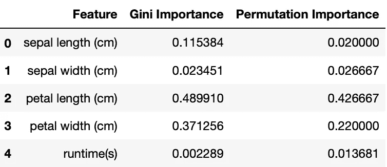

使用 sklearn 的两种方法的比较

对于这样一个简单的数据集，这两种方法给出了不同的结果，这再明显不过了。此外，如果您自己尝试多次(您可以在页面底部找到我的代码)，您将会看到这些结果实际上每次都有所不同。这是因为这两种方法不仅都使用了某种类型的随机抽样，而且都来自于一个具有随机内在特性的随机森林模型。

您应该注意的另一件事是运行时。如前所述，与排列重要性相比，内置的基尼重要性具有几乎实时的运行时间。但是在我们的例子中，由于 Iris 的大小，差异并不是很大:它只有 150 个观察值，只有 4 个特征。如果我们在更大的数据集上进行比较:

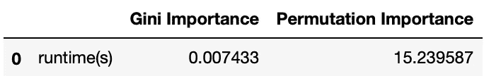

使用较大数据集的运行时比较

现在你一定在想，我有这些优点和缺点，我应该用哪一个呢？嗯，也许有第三条路比这两条都好？

# 2.空气(实际杂质减少)的重要性

在上面的比较中，我们知道，与排列重要性相比，基尼系数的重要性以惊人的速度增长。如果我们能在基尼系数 1 上做一点小小的改变，这样我们不仅能得到更快的结果，而且偏差也更小，会怎么样呢？ *Stefano Nembrini* 在他的 [2018 论文](https://academic.oup.com/bioinformatics/article/34/21/3711/4994791)中介绍了这样的方式:

> 在常规 RF 中，在每个树节点处，从𝕆≡{1,…,p}⁠.采样 mtry 分裂候选变量相反，我们从 1 到 2 *p* 采样，即变量从𝕆∪ℙ⁠采样，而ℙ≡{p+1,…,2p}⁠.如果选择的变量索引为 j∈𝕆⁠，那么 Xi=j 通常用于拆分。如果 j∈ℙ⁠，变量π*Xi = j p*，即具有重新排序的样本 ID 的原始变量，用于分割。如果是 j∈𝕆⁠，这种分裂导致的杂质减少通常会导致 *Xi* 的重要性变化，而如果是 j∈ℙ⁠.，则杂质减少请注意，不会重复执行该过程。
> 
> 最后，在整个森林生长之后，变量 *Xi* 的估计去偏置杂质重要性计算如下:

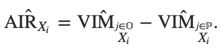

> 我们将这种新的 VIM 称为实际杂质减少(空气),以避免与其他 VIM 产生误解。

可悲的是，自从 AIR 被引入才一年，并没有很多研究关注这种新方法的正确性和准确性。此外，AIR 目前仅在 R 库 *Ranger* 中可用，这是一个因其在 R 上快速实现随机森林而闻名的库。当分配新的 Ranger 对象时，您可以将参数“importance”指定为“infinity _ corrected”以使用 AIR 重要性。

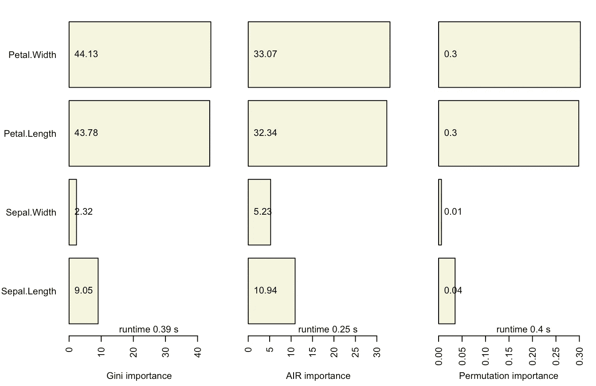

Ranger (R)中可用的三种不同方法的条形图

这里的运行时间是在一定重要性方法下拟合随机森林模型所花费的时间。看起来三种方法的性能相似，主要是因为我们使用的数据集很小。如果我们把它换成我们之前用 5000 个观察值和 500 个特征建立的数据集，我们仍然可以看到运行时间上的巨大差距:

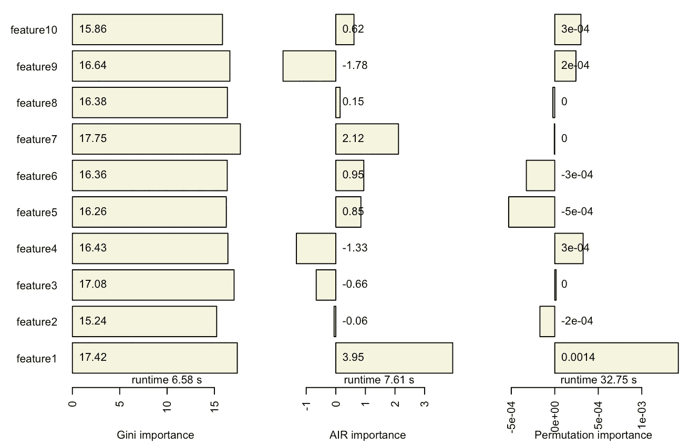

5000 * 500 数据集上三种不同方法的条形图，此处仅显示前 10 个特征

# 3.鸣人？博鲁塔！

*Boruta* 也是 R 上的一个库，专注于使用置换随机值来选择特征。它将所有特征分为三类:拒绝、尝试和确认。希望感谢 [*丹尼尔·霍莫拉*](http://danielhomola.com/2015/05/08/borutapy-an-all-relevant-feature-selection-method/) ，这个特性选择库在 python 中可用。它速度更快，并且有更多的自定义设置。

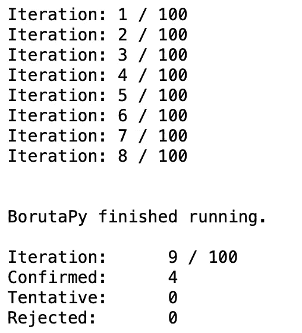

经过 8 次迭代后，Boruta 选择了所有 4 个“重要”的特性

与 R 上的原始版本相比，python 上的 Boruta 有一些令人兴奋的有趣的新参数，包括我最喜欢的一个， *perc* ，它为功能选择设置了阈值的百分位数，如果感觉太苛刻的话。将此值设置为较低的值允许选择更多的功能，但也会导致较高的错误率。

# 4.Shap，在 Shapley 值中

我知道你可能在博弈论讲座中听过这个名字很多次，在一些专注于数据科学的网站上也试图介绍这个包。是的，这个包是用博弈论的方法编写的，是的，它是一个强大而流行的工具，但是我不打算解释关于博弈论和算法本身的事实。我将用一个简单的例子来说明它能做什么。

现在，假设我们想看看数据的第一次观察如何影响预测:

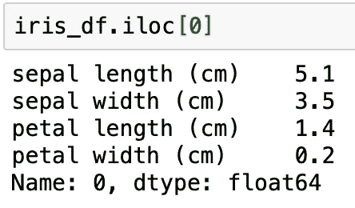

虹膜的首次观察

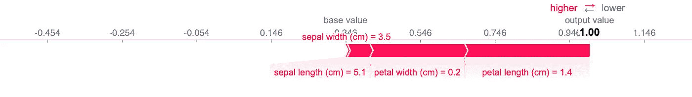

单一观察值的解释

我们可以看到花瓣长度为 1.4 厘米和花瓣宽度为 0.2 厘米是第一次预测为 1 的主要“原因”。

如果我们稍微移动一下代码，我们还可以看到数据集中每个观察的效果:

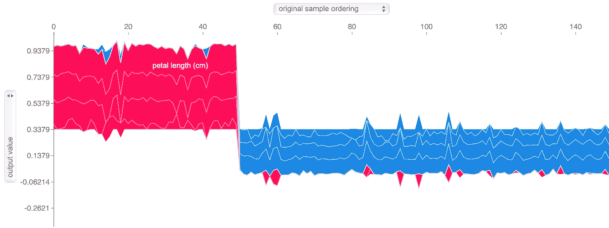

所有观察结果的解释

Shap 的可视化不仅丰富多彩，更好看，而且是交互式的，这意味着如果你将鼠标移到它上面，你可以看到每个观察的信息。然而，正如你们中的一些人可能已经发现的那样，Shap 与多类别分类斗争。上面的 X 轴是按原始样本排序的，应与 Iris 一样，保持第 1 类 50、第 2 类 50 和第 3 类 50 的顺序。

好了，最后但同样重要的是，回到特性重要性。使用 shap 值，我们可以解释特性如何影响模型的输出。因此，我们可以预期 shap 值是特征重要性的度量:

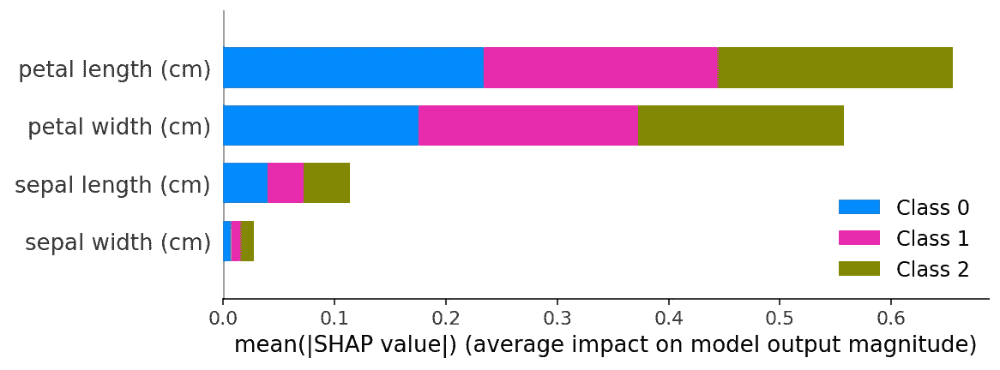

每个特征的平均绝对形状值的条形图

几乎和我们之前谈过的方法一样的趋势，是吗？然而，无论您为同一个随机森林模型运行多少次代码，您都会得到相同的结果:Shap 值为要素提供了一致的重要性评估。

# 结论

我们已经讨论了使用随机森林模型评估要素重要性的所有不同方法。哪个最好？谁也说不准。我们只有数学证据证明哪一个更有偏见。老实说，你可以接受上面为 Iris 数据集介绍的任何特征重要性，因为这个问题没有正确的答案。毕竟，机器学习和数据科学都与解释有关。无论你使用什么工具，只要它有意义，并且你能让数据故事流动，使用它绝对没有错。下面是我做的比较所有这些方法的表格(运行时间使用之前生成的 5000*500 数据集计算):

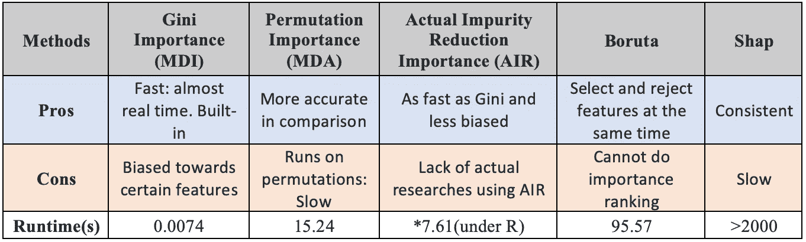

* : AIR 仅在 R 上可用，AIR 运行时与 Gini 运行时在 R 上几乎相同

最后但同样重要的是， *LIME* 也是用于特性重要性的非常流行的包之一。希望我将来会介绍*石灰*，并添加所有这些工具之间的比较。

点击[此处](https://github.com/Frank-Xu-Huaze/Medium/tree/master/Feature_Importance)查看来自我的 Github 的所有源代码。