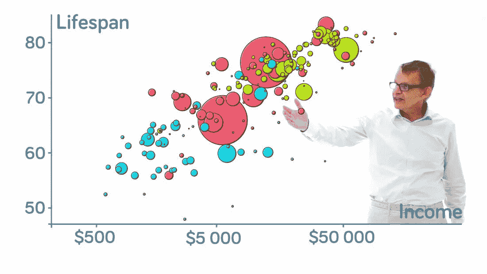
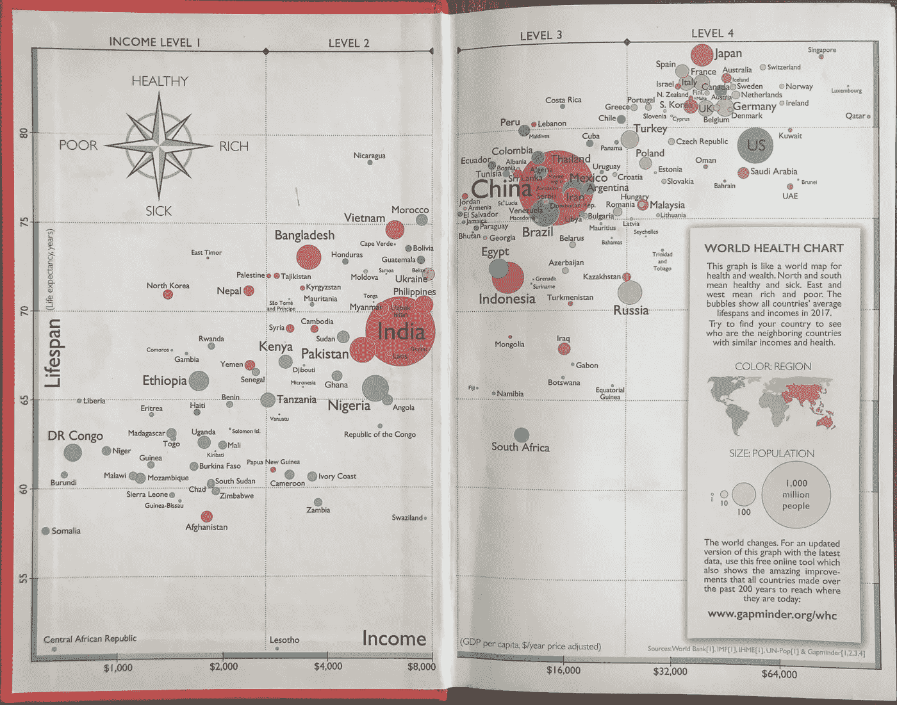
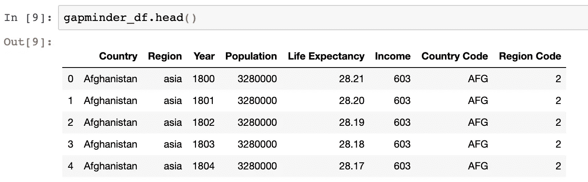
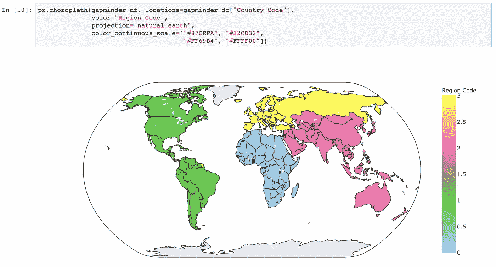
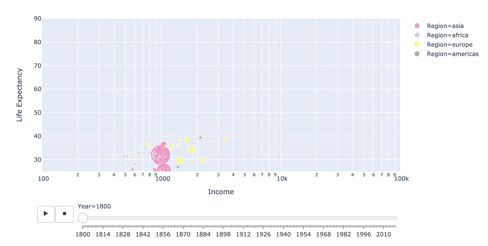

# 用 Python 和 Plotly 重新制作真实气泡图

> 原文：<https://towardsdatascience.com/a-remake-of-the-factfulness-bubble-chart-with-python-and-plotly-cd40ff7b3011?source=collection_archive---------20----------------------->

## [可视化](https://towardsdatascience.com/data-visualization/home)

## 让我们用基于数据的世界观更新我们的知识

图片来源: [Gapminder](https://www.gapminder.org/answers/how-does-income-relate-to-life-expectancy/)

去年，我的一个最好的朋友送给我一本书，并附上一张纸条:“我希望这将是你对世界的理解的一个修正，也是对你的全球焦虑的一个补救”。这本书有一个醒目的橙色封面，标题是:“**真实性:我们对世界错误的十个理由——以及为什么事情比你想象的更好”**，作者是上图中气泡图背后的先生汉斯·罗斯林，以及其他合著者。

这本书改变了我看待世界的方式，并为我提供了正确解读我所收到的关于我们这个世界的信息的工具。这里，最热烈的掌声送给封面中的气泡图(出现在第一页):

从一本已经写好的书上重新做一个图表似乎有点多余，但是…

我并不希望有一天每个人都会读这本书，而是决定采取行动，在不同的媒介上传播真实，因为一位智者曾对我说:

> 宇宙为行动喝彩，而不是一厢情愿。

使用 [Gapminder](https://www.gapminder.org/) 的[公开数据](https://open-numbers.github.io/)中的公开数据，我将展示如何制作这个气泡图。Python 和交互式可视化库 [Plotly](https://plot.ly/python/) 是这次翻拍的最佳工具。

这篇文章的重点是传播事实和创造互动的视觉效果。如果你想了解数据加载、清理和格式化的适度但必要的步骤，我鼓励你在这里查看代码[，在这里](https://nbviewer.jupyter.org/github/cereniyim/Plotly-Gapminder-Visualization/blob/master/Factfullness-BubbleChart.ipynb)查看源数据[。](https://github.com/open-numbers/ddf--gapminder--systema_globalis)

**让我们从气泡图的元素开始:**

*   每个泡泡代表一个国家
*   颜色是一个区域
*   泡泡的大小显示了这个国家的人口

**我们将使用以下数据框，重新创建地块:**

以下是代表世界四个地区的颜色:

**使用上面的颜色编码，让我们重新制作气泡图:**

最新的世界图片

*   y 轴上以年为单位的寿命
*   x 轴是经通货膨胀调整的人均国内生产总值(PPP ),即收入

你可以将鼠标悬停在图表上，查看国名以及一个国家的财富和健康状况的确切数字！

我们的世界不再划分为“发达”与“发展中”或“富裕”与“贫穷”[根据你过时的世界观插入一对对比]。现在，世界各国根据世界银行认可的四种收入水平进行分类。

最重要的是，大多数国家处于中等水平(2 级和 3 级)，平均预期寿命为 73 岁！

**如果你想知道从 19 世纪到 2018 年，我们可爱的世界是如何在收入水平和预期寿命方面取得长足进步的:**

**加分:**汉斯·罗斯林讲解各国 200 年动画泡泡图:

恭喜你！你用基于事实和数据的观点更新了你对世界的认识，谢谢你和我一起踏上了这段旅程😊。如果你想跟上我们世界的统计数据，那就继续使用 [Gapminder 工具](https://www.gapminder.org/tools/#$chart-type=bubbles)！

对于评论或建设性的反馈，您可以通过回复、 [Twitter](https://twitter.com/cereniyim) 或 [Linkedin](https://www.linkedin.com/in/ceren-iyim) 联系我！

**来源:**

 [## Gapminder 工具

### 每个人都能理解的动画全球统计数据

www.gapminder.org](https://www.gapminder.org/tools/#$state$time$value=2018;;&chart-type=bubbles)  [## ✨推出 Plotly 快递✨

### Plotly Express 是一个新的高级 Python 可视化库:它是 Plotly.py 的包装器，公开了一个简单的…

medium.com](https://medium.com/plotly/introducing-plotly-express-808df010143d)