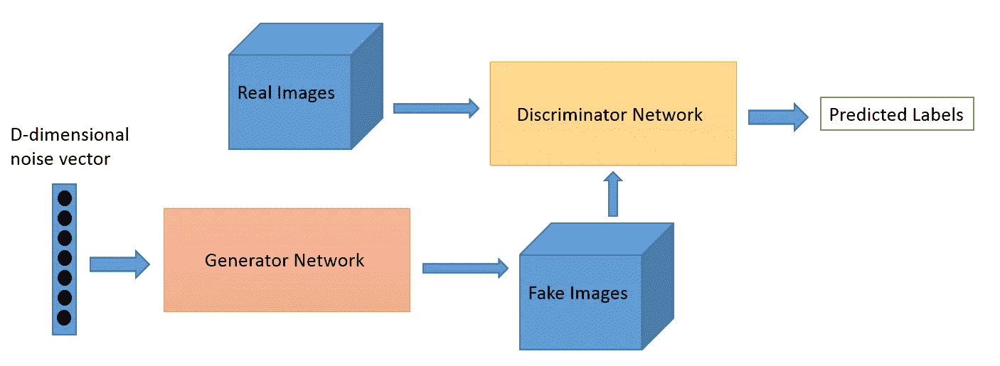
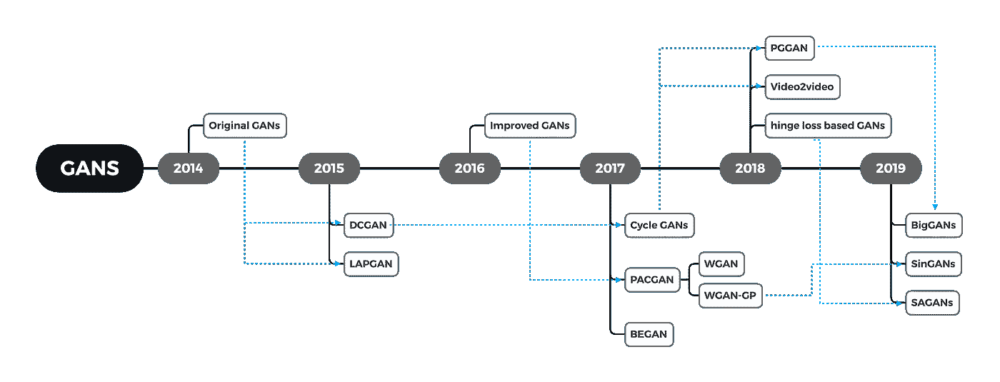

# 生成对抗网络研究综述

> 原文：<https://towardsdatascience.com/a-review-of-generative-adversarial-networks-9af21e94bda4?source=collection_archive---------68----------------------->

## 甘一家是如何改变机器学习的工作方式的？

深度学习的历史已经显示出有点不寻常。许多实践，比如 80 年代发明的卷积神经网络，在 20 年后才卷土重来。虽然大多数方法都卷土重来，但生成对抗网络是过去十年中深度学习领域最具创新性的技术之一。虽然具有行为良好的梯度的传播和丢弃算法的判别网络显示出非常成功，但是生成网络的情况就不一样了。在最大似然估计期间，深度生成网络在近似难以处理的概率计算方面存在问题。此外，它不能在生成上下文中利用线性单位的优势。甘斯来协助这个领域解决这两个问题，同时将一个生成性和一个歧视性的网络结合在一起。

gan 最初是由蒙特利尔大学的 Goodfellow 等人[1]提出的。 ***基本框架包含一个对抗对手的生成器，而鉴别器则学习分辨一个样本是属于数据分布还是来自生成网络。这个想法是让这两个网络在相互竞争的同时变得更好。***

最直接的建模是将鉴别器和发生器作为多层神经网络。生成器学习从潜在空间到数据分布的映射，趋向于变得类似于地面数据分布。另一方面，鉴别器试图区分真实的数据分布和生成器生成的数据。生成网络的目标是欺骗鉴别器，使其认为产生的新数据来自真实的数据分布；这样，它增加了鉴别器的错误率。

图 1:GAN 的构建模块([https://MC . ai/deep-convolutionary-generative-adversarial-networks DCG ans/](https://mc.ai/deep-convolutional-generative-adversarial-networksdcgans/))

我们应该强调，GAN 的作用不是复制训练中使用的数据，而是产生新的数据。我们可以将其描述为两人游戏，这两个网络彼此对立，这意味着最终目标是实现一种均衡，在这种均衡中，这些经过训练的网络对彼此具有最佳反应。*此时，他们无法再提高，训练停止。然而，这种平衡很难达到，甚至难以维持，这是 GANs 的第一个问题。*另一个问题是，没有办法验证生成器是否已经像其他深度学习技术一样，学会了在保留的数据集中产生类似于真实生活数据分布的分布。

在原始论文中，实验表明，数据量和网络深度对更好的性能起着巨大的作用。当数据点是图像时，这意味着数据量应该与像素数成指数关系。考虑到图像有数百/数千个像素，这意味着在现有的计算能力和数据还无法实现的网络中可以实现更好的结果。

GANs 的应用非常广泛，从艺术、时尚、广告、科学到视频游戏。然而，这些网络也被用于恶意目的，例如使用 GANs 生成的合成图像创建虚假的社交媒体档案。我们可以看到，它在计算机视觉领域的应用更加广泛。

图 GANs 自原始论文以来的路线图，受[9]启发

图 1 给出了从原始文件开始的 GANs 路线图。由于篇幅所限，我将简单列出所提到的方法以及它们所解决的问题——许多论文在培训过程中进行的修改都集中在原来的工作上。

深度卷积 gan(DC gan)[2]具有更好的性能，因为当用于图像时，它不是用多层感知器来定义生成器(G)和鉴别器(D ),而是用 CNN 来定义。它没有汇集图层，因此为了增加空间维度，它使用了反卷积。对 G 和 D 中除 D 的最后一层和 G 的第一层之外的所有层的批次进行归一化，以便不会丢失关于数据分布的正确平均值的信息。

训练设置的改变是由 ImprovedGANs [3]提出的，与小批量鉴别、虚拟批量标准化和特征匹配有关。鉴于原始 GANs 的分辨率较低，LAPGAN [4]在拉普拉斯金字塔中使用 CNN 生成了分辨率更高的图像。渐进 GANs (PGGAN) [5]还提出了一种基于渐进神经网络的训练修改，通过渐进增加新层，从低到高分辨率增加鉴别器和生成器。

图像到图像的转换传统上使用包含对齐对的训练集来学习输出和输入图像之间的映射。CycleGANs [6]使用对抗性损失将图像从源域 X 映射到目标域 Y，缺少对。此外，他们将这种损失与实现循环恒定性的逆映射相结合。

原始甘的另一个问题是模式崩溃，这意味着它们倾向于产生相似的样本，即使在不同的数据集上训练。包装工用他们所谓的包装来处理这个问题。主要的变化发生在判别网络中，使得网络能够基于来自同一类的多个样本，来自真实的和生成的数据分布，来做出决策。

自我注意力生成对抗网络(SAGAN) [8]提出使用具有注意力的远程依赖性模型来生成图像。它使用 G 和 D 的频谱归一化，并证明改善训练过程。

使用 GANs 的另一种不同方式是在单一自然图像上训练生成器，使用 FC GANs 的金字塔，每个学习图像的不同尺度的分布。

GANs 中有待解决的一个问题是，它们假设生成的样本具有不同的生成参数，这意味着它们不能直接产生离散数据。另一个公开的问题是如何测量一个训练有素的生成网络的不确定性。

1.  I. Goodfellow、J. Pouget-Abadie、M. Mirza、B. Xu、D. Warde-Farley、S. Ozair、a .库维尔和 Y. Bengio，《神经信息处理系统进展》，第 2672-2680 页，2014 年。
2.  A.拉德福德，l .梅斯和 s .钦塔拉，“利用深度卷积生成对抗网络的无监督表示学习”，arXiv 预印本 arXiv:1511.06434，2015 年。
3.  T.Salimans，I. Goodfellow，W. Zaremba，V. Cheung，a，和 X. Chen，“训练 gans 的改进技术”，载于《神经信息处理系统进展》，第 2234-2242 页，2016 年。
4.  E.L. Denton，S. Chintala，R. Fergus 等人，“使用拉普拉斯金字塔对抗网络的深度生成图像模型”，载于《神经信息处理系统进展》，第 1486–1494 页，2015 年。
5.  T.Karras、T. Aila、S. Laine 和 J. Lehtinen，“为提高质量、稳定性和变化性而逐步种植甘蔗”，arXiv 预印本 arXiv:1710.10196，2017 年。
6.  J.-Y. Zhu，T. Park，P. Isola 和 A. A. Efros，“使用循环一致的对抗网络进行不成对的图像到图像翻译”，载于 IEEE 计算机视觉国际会议论文集，第 2223-2232 页，2017 年。
7.  Z.林，A. Khetan，G. Fanti 和 S. Oh，“Pacgan:两个样本在生成性对抗网络中的力量”，载于《神经信息处理系统进展》，第 1498-1507 页，2018 年。
8.  H.张，I .古德菲勒，d .，a .奥登纳，“自我注意生成性对抗网络”，arXiv 预印本 arXiv:1805.08318，2018。
9.  J.桂，孙志军，温永义，陶，叶，“生成性对抗网络:算法，理论与应用”arXiv 预印本 arXiv:2001.06937，2020 .