# IBM 高级机器学习和信号处理述评

> 原文：<https://towardsdatascience.com/a-review-of-ibms-advanced-machine-learning-and-signal-processing-certification-371bd937bb76?source=collection_archive---------24----------------------->

## Coursera 上的高级机器学习和信号处理课程的全面可视化指南


沙哈达特·拉赫曼在 [Unsplash](https://unsplash.com?utm_source=medium&utm_medium=referral) 上拍摄的照片

T 他的评论不仅旨在向您提供我对这门课程的看法，还旨在让您深入了解课程所涵盖的主题，并教授一些关键概念。

高级机器学习和信号处理课程由 IBM 开发，可在 Coursera 上获得。它可以作为单独的课程，也可以作为由四部分组成的大规模开放在线课程(MOOC)的一部分，即[高级数据科学专业](https://www.coursera.org/specializations/advanced-data-science-ibm)。

[可扩展数据科学基础](https://www.coursera.org/learn/ds?)重点介绍了云中 Apache Spark 的基础知识，并介绍了 IBM Watson Studio (IBM 的云服务)。相比之下，这门课程明显更深入，侧重于更高级的机器学习概念和信号处理。

该课程由两位 IBM 数据科学家讲授，分别是[罗密欧·肯兹勒](https://www.linkedin.com/in/romeo-kienzler-089b4557/)和[尼古拉·曼切夫](https://www.linkedin.com/in/nikolaymanchev/?originalSubdomain=uk)。我发现他们两个都是优秀的导师。

# 第一周

第一周从 ML 线性代数的概述开始。它非常简单，涵盖了 ML 中使用的不同数据对象以及对这些对象的数学运算。这里实际上有一些非常有用的知识片段，例如(1)一个**向量**必须只包含**一种数据类型**，而一个**元组**可以包含**多种数据类型**。(2)张量可以作为任意 N 维空间的通称:


标量>矢量>矩阵>张量

高维向量空间是第一课之后的自然进展。在这里，罗密欧描述了几个有用的定义和概念，并触及了高维数据背后的直觉。我们将在本课程的后面部分更深入地探讨这些概念。

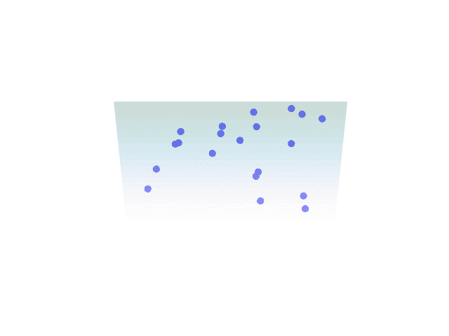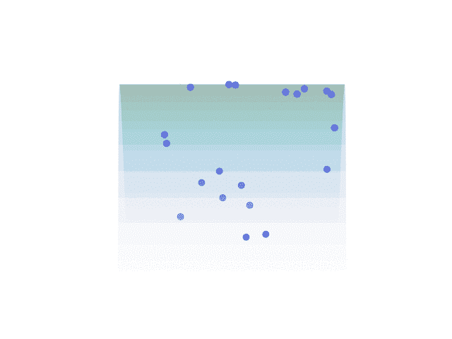

投影到 2D 平面上的 3D 数据(左)和投影到 3D 超级平面上的 4D 数据(右)——第三周会有更多的介绍

我们还讨论了有监督的和无监督的机器学习之间的区别。简而言之就是—

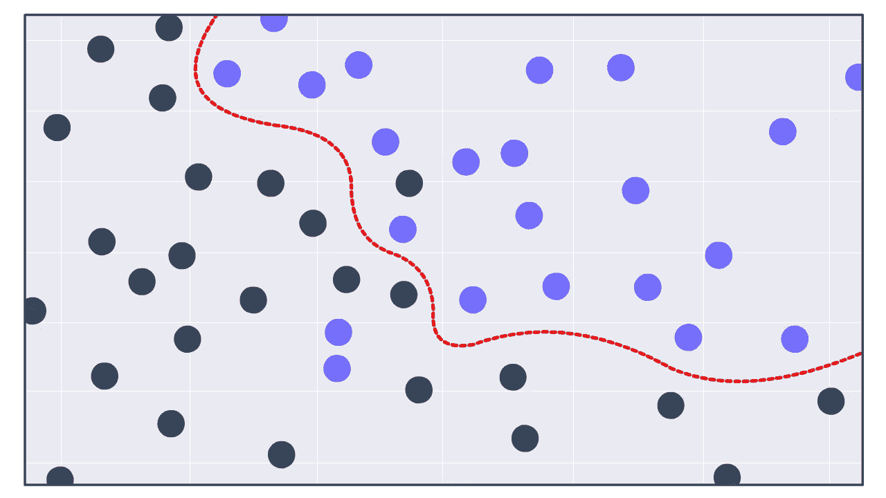

**监督学习**:机器学习，其中输出标签、标志或值已被分配给每个样本。这是算法的**目标**，并指导学习过程。例子包括-

*   分类-目标值是离散的
*   回归-目标值是连续的

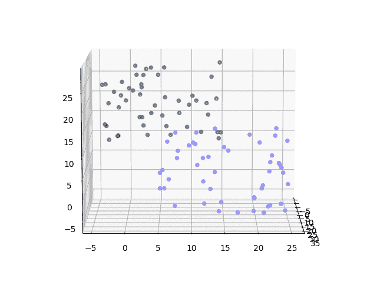

**无监督学习**:不存在输出标签、标志或值的机器学习。这意味着算法需要在数据中找到模式，并输出一些有助于我们理解这些模式的东西。例子包括-

*   聚类-样本被分成不同的聚类/类别
*   维数减少-减少了特征的数量，同时最大限度地减少了数据丢失

最后，罗密欧谈到了 ML 管道，它是你的数据处理步骤的“流程”。例如，对于简单的多类分类，您可以使用以下管道。

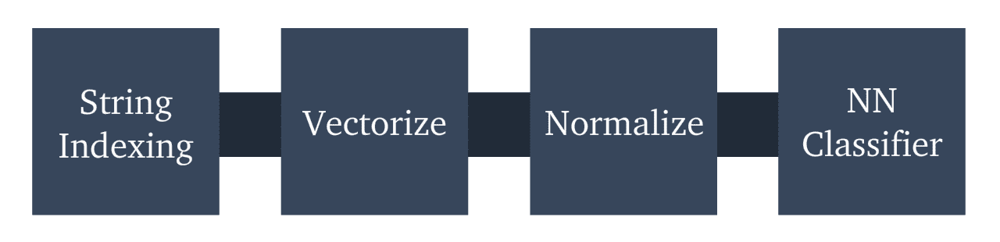

这里一个特别有用的概念是数据管道的**模块化。通过将该过程的每个步骤分割成独立的部分，我们能够快速切换不同的预处理方法、ML 算法或其他训练参数。**

有了 Spark pipeline 对象，完整的集成流程将拥有 **fit** 、 **evaluate** 和 **score** 功能。这使得不同模型之间的快速原型和比较成为可能。这意味着我们可以用更少的时间建立一个更好的模型。

本周的代码非常多，我认为这是非常好的，因为它是从上一门课开始的。编程任务只是检查您的环境设置是否正确，不幸的是，我认为这错过了复习本周所涉及的关键编码部分的机会。


[绿色变色龙](https://unsplash.com/@craftedbygc?utm_source=medium&utm_medium=referral)在 [Unsplash](https://unsplash.com?utm_source=medium&utm_medium=referral) 上拍摄的照片

# 第二周

我们这周讨论了很多。涵盖的主题总结如下:

*   线性回归
*   批量梯度下降
*   拆分(训练集、验证集和测试集)
*   过度装配和装配不足
*   估价
*   逻辑回归
*   朴素贝叶斯
*   支持向量机
*   交叉验证
*   超参数调谐
*   集成学习(决策树、随机森林、梯度推进等)
*   正规化

这似乎很多。**是很多。**

这真的让我惊讶，这个星期包括了多少。仅仅是关于朴素贝叶斯的那一节，如果研究到一个合理的深度就可以轻易地耗费许多许多小时(*贝叶斯统计是一个* ***非常*** *深的兔子洞*)。

尽管如此，这一周教授的主题范围很广，深度也很深。一些讲座深入许多算法背后的数学和直觉。而其他人展示了如何用 Apache SparkML 应用算法，这真的很酷。

作为一个例子，我们用 Spark 构建了一个梯度提升树分类器，如下所示:

*   首先我们导入必要的模块*(假设我们已经导入了我们的训练数据* ***df*** *，它被存储为一个熊猫数据帧)*

```
from pyspark.ml.feature import StringIndexer, VectorAssembler,
                               Normalizer
from pyspark.ml.linalg import Vectors
from pyspark.ml.classification import GBTClassifier
```

*   利用我们在第一周学到的知识，我们初始化数据管道的每个组件:

```
# create unique index for each unique string (our target classes)
indexer = StringIndexer(inputCol='class', outputCol='label')# convert our multiple dataframe input columns to a vector
vectorAssembler = VectorAssembler(inputCols=['x', 'y', 'z'],
                                  outputCol='features')# normalize our input values
normalizer = Normalizer(inputCol='features', outputCol='features_norm', p=1.0)
```

…包括分类器:

```
gbt = GBTClassifier(labelCol='label', featuresCol='features',
                    maxIter=10)  # this will run for 10 iterations
```

*   创建每个组件后，我们将它们放入一个 Spark 管道对象中:

```
pipeline = Pipeline(stages=[indexer, vectorAssembler, normalizer,
                            gbt])
```

现在我们已经构建了管道，我们只需输入`pipeline.fit(df_train)` 来训练我们的模型。

在 IBM Watson Studio 中使用 Spark 实现这一点意味着我们可以轻松扩展。在这种情况下，它不是必需的，但是对于大型数据集和更复杂的模型，它非常有用。

这周有几个小测验，大部分都很短，但还是不错的。编程任务非常简单，在到达顶点项目之前通常都是如此。


由 [Norbert Levajsics](https://unsplash.com/@levajsics?utm_source=medium&utm_medium=referral) 在 [Unsplash](https://unsplash.com?utm_source=medium&utm_medium=referral) 上拍摄的照片

# 第三周

本周我们关注无监督机器学习。特别是**聚类**和**主成分分析** (PCA)。

聚类部分非常直观。总体而言，聚类是一种非常简单的算法。但是我相信课程的这一部分提供的解释和例子非常令人难忘，而且非常容易理解。

PCA 部分更有挑战性。涵盖以下内容:

*   降维
*   PCA(当然)
*   协方差和相关矩阵
*   特征向量和特征值
*   数据投影

PCA 用于降维，我们试图减少数据集中的维数(特征),同时保留尽可能多的信息。

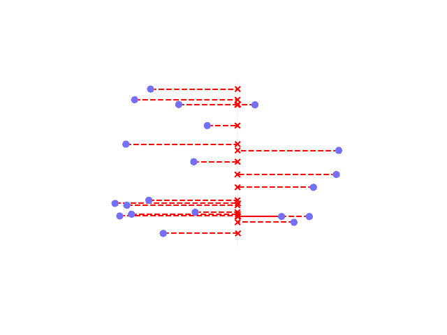

3D 数据被投影到 2D 平面上

通过将 3D 空间中的每个点投影到 2D 平面上，我们可以轻松地将数据集从 3D 缩减到 2D(如上所示)。

在高层次上，PCA 做同样的事情，但是试图尽可能地保持数据点之间的距离。

这种尽可能多地保留信息(距离)的行为在分类中至关重要。因为正是这些距离允许我们将数据点分成不同的类别。

例如，让我们从两个不同的方向看一个 3D 图:

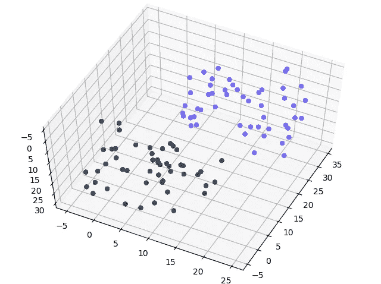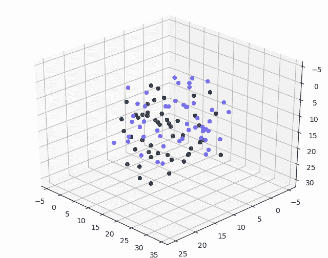

如果我们去除两幅图中的颜色差异，我们仍然能够很容易地区分左边图像中的两个独立的集群。然而，在正确的图像中，我们不会。

现在想象我们把这些点投射到一个平行于我们视线的表面上。聚集左边的投影点很容易，右边的就不可能了。

通过将点投影到使点之间的方差最大化的表面上，PCA 有效地优化了我们左边的场景。

总的来说，这一周非常有趣，每个概念都非常直观，这很棒！像每周一样，有测验和一个编程作业。再说一次，这个任务很简单。


张秀坤·施罗德在 [Unsplash](https://unsplash.com?utm_source=medium&utm_medium=referral) 上拍摄的照片

# 第四周

这就是本课程“信号处理”部分的内容。虽然在很大程度上是数据科学或机器学习，但我发现这一周绝对令人着迷。

## 傅里叶变换

我们从傅立叶变换(FT)开始，它允许我们将复杂信号(时域)分解为构成信号的频率(频域)。

这取决于你的背景，可能有也可能没有任何意义，所以简而言之。

噪音由振动组成。最简单的振动由重复的上下运动组成，产生正弦曲线(或正弦波)。

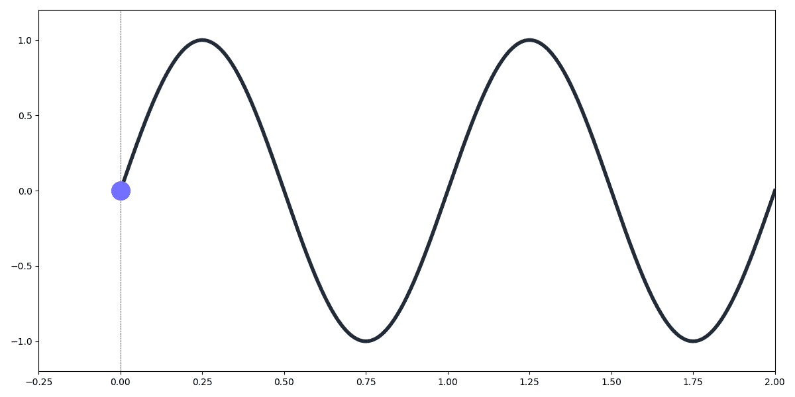

y 轴代表波的振幅，x 轴代表时间。一次完整的上下运动的长度称为波长。

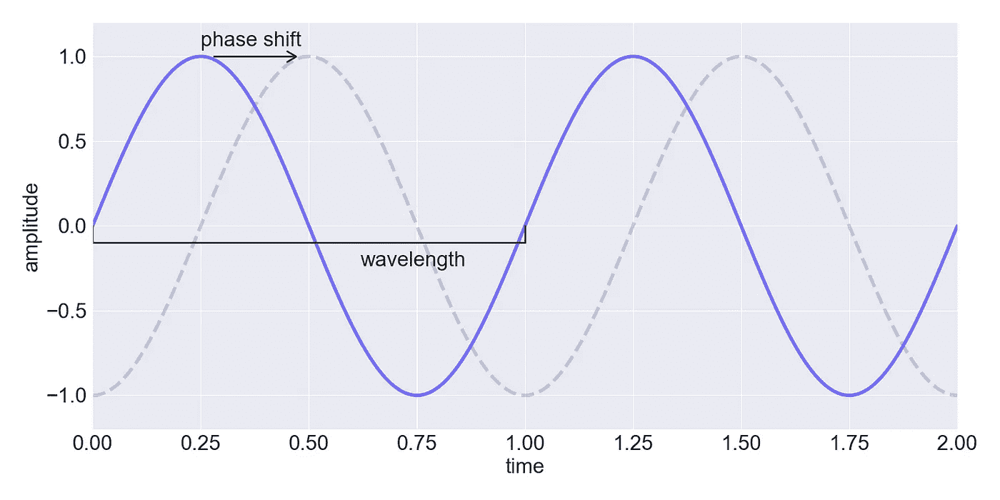

如果我们合并两个波长，它们会产生一个新的波，这个新的波是这些波的振幅相加，这种合并被称为叠加。

现在考虑下面的波:

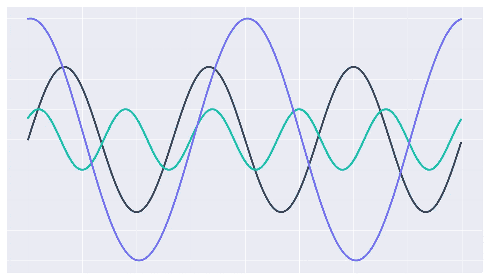

每个波都是一个简单的正弦曲线，但它们组合在一起就形成了一个复杂得多的模式:

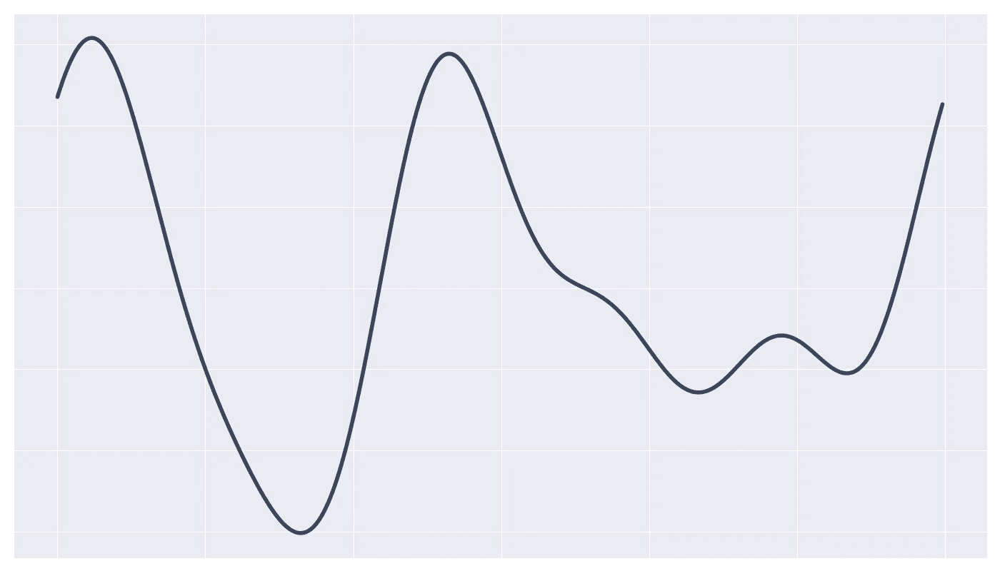

傅立叶变换允许我们输入复合波信号，并输出每个组成正弦波的频率和振幅。

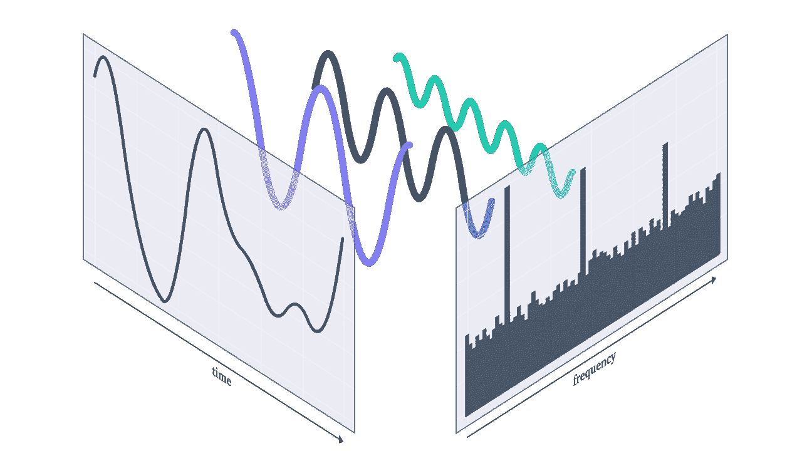

查看波形有两种方式。在**时域**(左)，或者在**频域**(右)。

时间域是你已经看到的，它是波形。x 轴上有**时间**，y 轴上有**振幅**。

相反，频域显示了构成波的组成频率。x 轴上有**频率**，y 轴上有**振幅**。

傅立叶变换在这两幅图之间转换(逆傅立叶变换涵盖了频域到时域转换)。

## 周摘要

金融时报引人入胜，但不是本周的唯一焦点。它分为**两个**主题，这两个主题都包括以下子主题:

**傅立叶变换**

*   信号分解、时域和频域
*   信号产生和相移
*   FT 背后的数学和直觉
*   离散快速傅立叶变换

**小波**

*   连续小波变换
*   缩放和平移
*   机器学习中的小波

小波和 FT 一样有趣。我发现自己很容易参与到这个星期的活动中，这是由于所涵盖的主题和教学标准的混合。我相信这在很大程度上是因为尼古拉对材料的了解。

编程作业也不是特别具有挑战性，有点填鸭式。但这是我唯一的抱怨，这一周真的很吸引人，教得很好，并在最后的讲座中很好地联系到机器学习。

# 结论

我发现这门课非常有益。由于该课程仅在 IBM Watson Studio 上进行，因此还有一层额外的用途。这是对 IBM 云服务的完美介绍。当然，这通过增加曝光率为 IBM 带来了好处，但对于任何数据专业人员来说，这也是一项无价的额外技能。

课程的技术性更强的方面非常好。材料的范围很广，大部分主题都有合理的深度。

与任何 MOOC 一样，我认为重要的是要注意到，要真正加深你的理解，最好是密切关注所教的内容。然后，去找更多的材料，进一步研究。

最后，试着学以致用，写/说你学到的东西。如果你能应用并解释你所学到的东西，你会理解得更多，从而从课程中获得更多。

编程作业并不特别具有挑战性。在斯坦福的机器学习课程中，我经常会花几个小时完成每项作业。相比之下，通过这门课程，我通常可以在 10-20 分钟内完成编程作业。

***然而*** ，这是由顶点工程保存的，是全专精的一部分。这引出了我的最后一点:

> 整体明显大于部分之和。

我认为，要从本课程中获得最大的利益，最好是完成完全专业化。一旦完成一到三门课程，最后的顶点项目是真正巩固所学的一切。

我希望这篇评论对你有所帮助，非常感谢你读到这里！如果你对课程有任何问题，请在下面告诉我！

谢谢，

如果您有兴趣了解 IBM 的可伸缩数据科学基础，我在这里写了另一篇评论！

[](/a-summary-of-the-advanced-data-science-with-ibm-specialization-1-4-5caf48c011df) [## 对 IBM 可伸缩数据科学基础的回顾

### 我的想法是，在 IBM 的高级数据中，对可伸缩数据科学基础中的关键概念进行分解…

towardsdatascience.com](/a-summary-of-the-advanced-data-science-with-ibm-specialization-1-4-5caf48c011df)