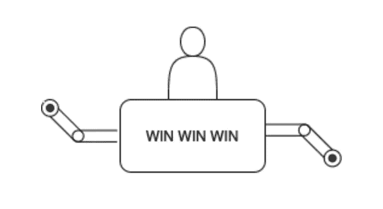
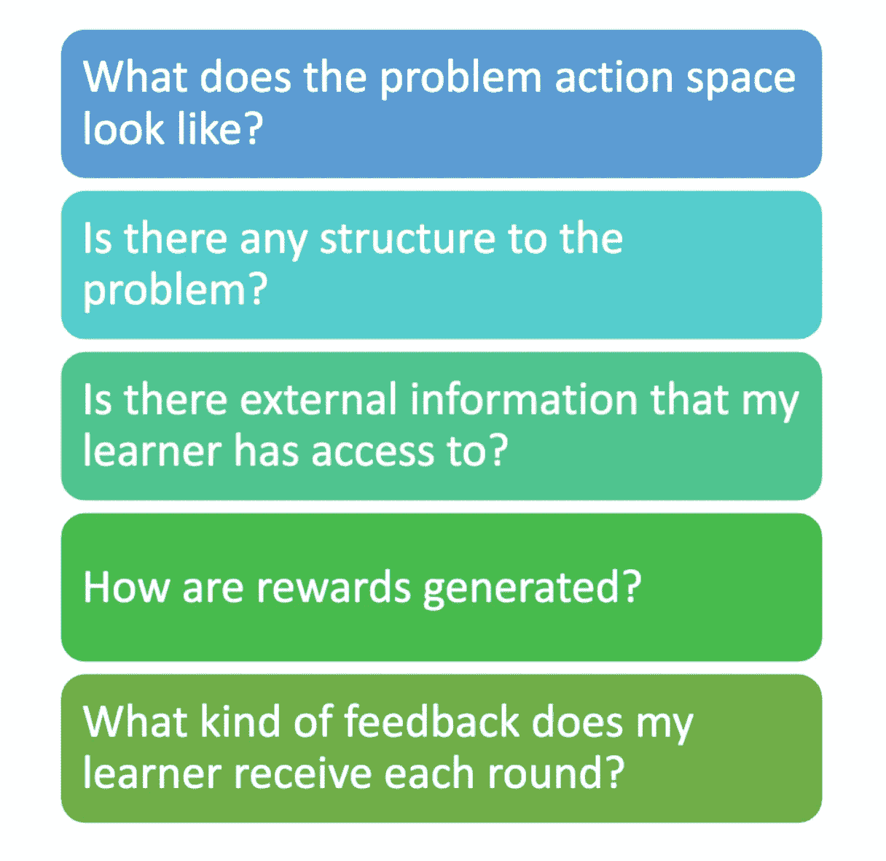
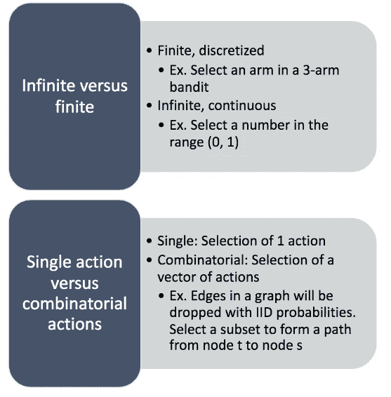
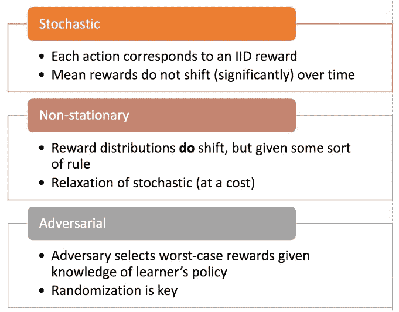
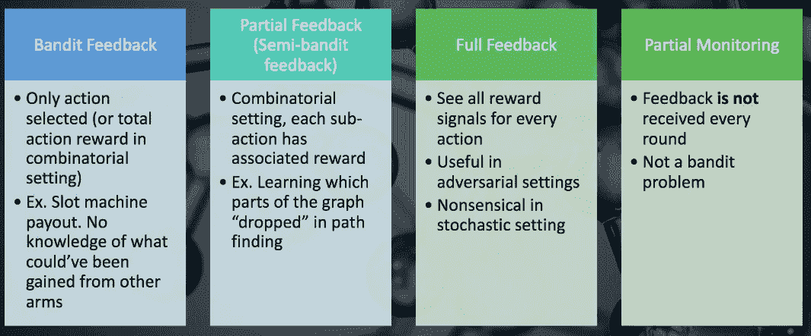

# 多臂 Bandit 算法路线图

> 原文：<https://towardsdatascience.com/a-roadmap-to-multi-arm-bandit-algorithms-a5a074d41a24?source=collection_archive---------33----------------------->

最近一直在读 Tor Lattimore 和 Csaba Szepesvári 的 [Bandit Algorithms，并在一个读书会上讨论。我想，在思考或描述强盗问题时，最好退后一步，在一个非常高的层次上总结一些人们可能会问的主要问题！](https://tor-lattimore.com/downloads/book/book.pdf)

如果你还不熟悉 bandit 算法，不用担心！我希望在我的小组通过 Bandit 算法文本进行研究时，能对它们做一个很好的记录(真的很好！).但是现在，让我做一个简短而甜蜜的总结:

Bandit 算法是一种可以在不确定环境中执行的学习算法。具体来说，他们的名字来源于老虎机的想法。它可能有许多手臂，拉一只手臂可能会给你奖励。其思想是，通过平衡探索和利用，bandit 算法可以理解每只手臂的潜在奖励分布，允许学习者利用并获得可能的最佳累积奖励。

那么，他们为什么被称为土匪呢？因为他们拿走你所有的钱(或者说，老虎机确实 lol)。

正如我们将从我提出并强调的一些问题中看到的，bandit 算法为许多学习问题提供了一个非常通用的公式，只要我们保留某些关键假设(例如今天选择一个动作不会改变明天可用的动作)。对于更复杂的学习问题，强化学习就变得必要了！

我们将在本帖中考虑的一些问题包括:

事不宜迟，让我们开始吧！

# 行为空间

你的环境是什么样的，你的学习者需要什么样的行动空间来与环境互动？

## 无限对有限

首先要区分的是无限和有限动作空间之间的区别。有限动作空间很好理解。这类似于每次“选择 k 个分支中的一个”,很可能是大多数人第一次想象 bandit 算法与他们的环境交互的方式。

相比之下，无限的行动空间也是可能的。你可能会想“但是怎么做呢？”因为这几乎是不可能的。但事实上，如果我们的空间有限，这是很有可能的。我的意思是，想象你只有一个动作，但是你可以用从 0 到 1 的一系列值来选择它。现在你的空间是无限的！零到一之间的任何数字都是可能的(也许是我们施加在手臂上的力的大小)。关键是这里有一些约束使得问题成为可能，比如奖励结构上的[李普希茨条件](https://en.wikipedia.org/wiki/Lipschitz_continuity)，使得最优行动不能隐藏在任意小的空间中。

## 单一动作对组合动作

你的土匪和它的环境互动时，是只允许拉一只胳膊(玩一个动作)还是可以同时玩多个？这就是单一作用空间和组合作用空间的区别！如果你有一个环境，让你的学习者可以同时拉多个手臂(同时玩多个动作)，那么你就有了一个组合动作空间。

想象一下，你有一个图，你的学习者想要从节点 S 到节点 t。每一轮，学习者有机会选择它将包括在从 S 到 t 的路径中的边。然后，整个图中的每条边将以该边唯一的概率被丢弃。如果你的学习者的路径完全完好无损，那么当它从 S 导航到 t 时，它会得到奖励。否则，它不会得到任何奖励。这种边的子选择是组合动作空间的一个例子！

总而言之:

# 问题结构

处理强盗问题的另一个基本问题是你的问题/环境是否有结构。我的意思可以简单地表述为:选择一个动作会显示出你没有玩过的动作的任何信息吗？如果是，问题有结构！否则，你有一个无组织的土匪问题。

一个非结构化的土匪问题并不是没有希望的(事实上，这似乎很常见)。这只是意味着，如果我有一个双臂强盗，我不能通过玩手臂 1 来学习任何关于手臂 2 的东西。我可能知道他们都是通过高斯分布产生奖励，但是这并没有给我任何联系。

相比之下，我们可以有一个双臂土匪，双臂产生的回报与伯努利分布，有一个单一的参数。我的意思是说，臂 1 由𝜃θ参数化，臂 2 由 1−𝜃1−θ.参数化只有一个参数需要学习，这是整个问题的基础，通过弹奏第一只手臂，我获得了关于另一只手臂的信息！

# 外信息

你的学生可以利用任何额外的信息吗？这可以极大地提高算法的性能(通常是以好的方式)。

例如，如果你有一个上下文，你的学习者可以通过上下文强盗算法来利用它。假设你有一个双臂土匪，但手臂在一周的不同天表现不同(但在一周的相同天表现相同)。如果你用一个普通的 bandit 算法来解决这个问题，回报将会非常不稳定，并且会损害性能。然而，如果你在行动决策过程中使用上下文(一周中的几天),那么你的学习者应该表现得更好！

再一次，想象你的 bandit 算法正试图学习一个流行的搜索引擎的广告投放。它可以只从动作集中选择一个广告并显示给用户，但这可能会导致整体表现不佳。相反，如果有一个向量表示使用搜索引擎的用户的一些信息，也许我们可以将用户上下文向量合并到我们的 bandit 算法学习过程中！

# 奖励机制

土匪问题如何产生奖励？它们是随机的，并且来自同一个分布吗？或者，也许，环境是敌对的，奖励被选择为最坏的情况，给定了关于 bandit 算法如何学习的知识。

## 随机的

在随机奖励生成设置下，每个动作对应一个 IID 奖励。也就是说，每个动作都有一个基础分布，当选择一个动作时，它会从中进行采样。它永远不会改变，因此学习者只需要探索手臂，直到它能够正确地限制奖励产生分布的形状。

## 非平稳的

从技术上讲，奖励分布可以是非平稳的，但学习算法将为此付出代价。鉴于**如何**回报将是不稳定的某种规则，分析可以考虑这将如何影响整体表现。这可以被看作是对随机设置的放松，但这是有代价的。

## 对手的

在对抗的环境中，所有的假设都被抛弃了。奖励是以对抗的方式选择的，旨在选择最差的结果，让学习者失去兴趣。幸运的是，在这样的环境中，学习者仍然可以做很多事情(随机化是关键)。我希望在另一个帖子中更详细地谈论这一点！

总结一下:

# 学习者反馈

我们在这里要强调的最后一个问题是，强盗式学习者收到的反馈的性质。为了使一个问题成为强盗问题，学习者需要在每一轮/每一时间步结束时收到一个奖励信号。但是学习者收到了多少反馈呢？

## 土匪反馈

Bandit feedback 是一个术语，指的是只从学习者选择的行为中获得奖励信息。如果手臂一被使用，只有手臂一的奖赏被观察；其他的手臂，虽然可以玩，但不能玩，所以学习者不能获得关于它们或它们的奖励的信息。

这是传统的强盗设定，例如，当环境是随机的时，这很有意义。在组合设置中，非常有趣的是，bandit 反馈只为子动作的组合提供了一个信号。也就是说，学习者不会立即看到每个子动作提供了什么，而是看到了累积的信号。

## 全面反馈

另一方面，学习者可以观察到每一步的所有行动回报。这在对抗环境中非常有用，并且允许开发一些有趣的算法。在随机环境中，这没有任何意义，因为这样一来，学习者就永远不需要探索了。他们会简单地根据有界观测值选择最佳臂，然后在每个时间步更新边界。这会使随机问题变得非常琐碎。

## 部分反馈/半土匪反馈

可以把这个反馈场景看作是 bandit 和 full feedback 之间的中间地带。它在组合设置中最有意义，指的是观察到累积奖励信号的情况，但在组合空间中选择的每个子动作的子分量信号也是如此。

如果一个人正在对上班所花费的时间进行建模，这可能很有意义。如果我今天走了一条小路，并且知道这样做需要大约 5 分钟，那么当我明天开车去上班时，我可以应用那个子信息。

## 部分监控

在不是每一轮都收到反馈的情况下，我们处于 bandit 算法之外。然而，如果你感兴趣，我鼓励你研究一下[部分监控](https://arxiv.org/pdf/1902.00470.pdf)。

以下是这些设置的汇总图:

# 包扎

所以，这就是我目前总结的在处理多臂土匪和土匪问题时要考虑的一些关键问题。我做得怎么样？我错过了什么关键问题吗？让我知道！