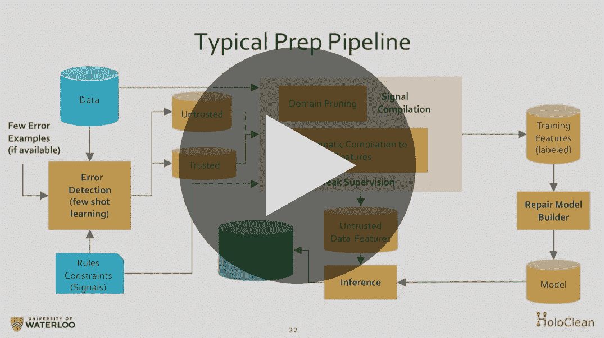

# 用于自动化结构化数据准备的可扩展预测引擎

> 原文：<https://towardsdatascience.com/a-scalable-prediction-engine-for-automating-structured-data-prep-dc95154109d8?source=collection_archive---------25----------------------->

## [活动讲座](https://towardsdatascience.com/event-talks/home)

## Ihab 易勒雅斯| TMLS2019

来自多伦多机器学习峰会的演讲:【https://torontomachinelearning.com/ 

## **关于演讲者**

伊哈布·易勒雅斯是滑铁卢大学的计算机科学教授，也是 Tamr |[https://cs.uwaterloo.ca/~ilyas/](https://www.youtube.com/redirect?q=https%3A%2F%2Fcs.uwaterloo.ca%2F%7Eilyas%2F&v=z2RQz9zdpy0&event=video_description&redir_token=bBAGYYLzt8CePy93GA44nK7jLzd8MTU4MjgzODcwMUAxNTgyNzUyMzAx)的联合创始人

## 关于谈话

“数据科学家花费大量时间准备、清理和转换原始数据，然后才有机会将这些数据提供给他们精心制作的模型。

尽管努力建立稳健的预测和分类模型，但数据错误仍然是低质量结果的主要原因。这种大规模的劳动密集型数据清理工作仍然是数据科学自动端到端人工智能管道的主要障碍。

**在本次演讲中，我将重点讨论作为推理问题的数据准备和清理，这可以通过利用 ML 中的现代抽象来实现自动化**。

我将描述 HoloClean 框架，这是一个用于结构化数据的可伸缩预测引擎。该框架有多个成功的概念证明，包括清理普查数据、市场研究数据和保险记录。多个商业企业的试点显示，在将源(训练)数据提供给下游分析之前，这些数据的质量有了显著提高。

HoloClean 构建了两个主要的概率模型:一个数据生成模型(描述数据的预期外观)；以及一个实现模型(描述错误如何被引入到预期的干净数据中)。该框架使用少量学习、数据扩充和自我监督来学习这些模型的参数，并使用它们来预测错误及其可能的修复。"

[YouTube](https://www.youtube.com/watch?v=z2RQz9zdpy0)