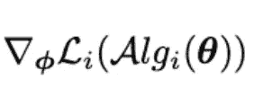
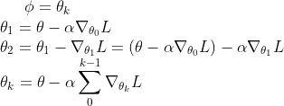
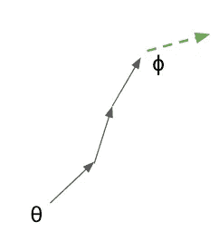
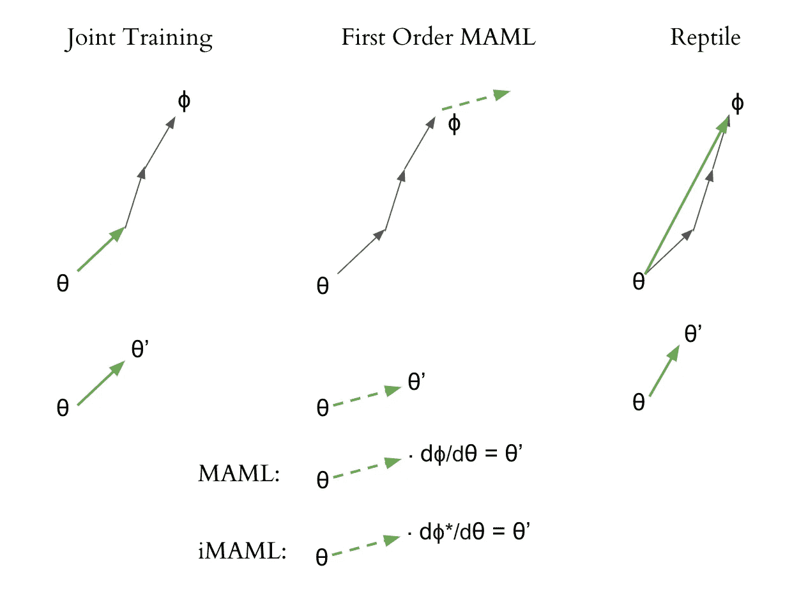

# 寻找有效的元学习:哺乳动物、爬行动物和相关物种

> 原文：<https://towardsdatascience.com/a-search-for-efficient-meta-learning-mamls-reptiles-and-related-species-e47b8fc454f2?source=collection_archive---------20----------------------->

一个经常被抱怨的事实是，现代机器学习的能力往往是狭窄和脆弱的:虽然给定的*技术*可以应用于许多任务，但个人学习的*模型*只专注于一个，并且需要大量数据来获得这种专业能力。

元学习提出:有没有一种方法可以跨任务训练一个模型，使特定新任务的获取更快、数据效率更高，而不是在每个新任务上从头开始？元学习和相关的少量学习学科的方法有许多形式——从学习任务不可知的嵌入空间到递归网络，递归网络顺序传递训练数据并在它们的状态进化权重中编码学习*算法*——但可以说这些方法中最直观的是 MAML:模型不可知的元学习。

[题外话:这篇博客文章将假设一定量的元学习背景，主要围绕学习不是发生在单一任务上，而是发生在任务分布上的想法。如果你对这种想法或元学习作为一个概念有点不确定，我推荐你阅读[我之前关于元学习的文章](/learning-about-algorithms-that-learn-to-learn-9022f2fa3dd5)，然后回到这篇文章，它更详细地研究了 MAML 和相关方法。]

MAML 的前提是:如果我们想要一个初始模型，它可以适应从一些任务分布中抽取的新任务，给定每个新任务上的少量数据点，我们应该将我们的模型构造成*直接针对那个目标*进行优化。具体而言，MAML 执行以下一系列步骤:

1.  定义一些**组初始参数** : θ
2.  **从任务分布中抽取一个任务*t*，**对来自 *t* 的训练批次数据进行 k(一般为< 10)步梯度下降**，初始化参数值为θ。在 k 步的末尾，你得到了参数ϕ.**
3.  从任务 *t* 在参数值ϕ评估你在测试批次上的损失，然后计算该损失**相对于我们初始参数θ的导数。也就是说，计算我们如何修改我们的跨任务网络初始化，以在对新任务进行少量优化步骤后导致更好的损失。这种导数，通过学习过程本身传播回起始权重的值，与我们通常在梯度下降中采用的导数非常明显不同，我们很快会深入研究。**
4.  使用该梯度向量来更新我们的θ初始化参数，丢弃为该特定任务学习的ϕ，并使用新的采样任务再次开始该过程，**用我们最近更新的θ值**初始化我们的网络。

根据这种方法，一个合理的问题是:

*这和训练一个平均来说对所有任务都有效的参数向量是一回事吗？*

我将对这种方法使用的简写是联合训练，在这种方法中，我们只是从不同的任务中抽取交替的批次，并对每个批次进行正常的梯度下降。我不清楚 MAML 是否真的胜过联合训练的实证答案，但是从概念上来说,*MAML 试图做的事情有微妙的不同，而且，以我的经验来看，解开这种差异的项目很有价值，不仅有助于更清楚地了解 MAML 本身，还有后来提出的对它的修改。*

# 什么样的初始化是好的？

MAML 学习一个好的跨任务初始化的目标提出了一个显而易见的问题:不同的参数初始化有哪些不同的方式使*变得*好？它们可能会以哪些方式影响最终损失值？更简单地说，对于某些任务分配，是什么使一个初始化比另一个更好？

因为，有时候，最开始并不是参数开始的最佳位置

首先，让我们想象一下我们在一个新任务上根本不优化的情况。在这种情况下，我们的“最终”参数值ϕ和初始θ值没有区别。θ的变化意味着ϕ的等价变化，因为它们是相同的值。

当我们真正开始对任务采取优化步骤，并学习不同于θ的特定任务ϕ时，事情就变得更有趣了。

就像上面一样，你的元学习θ的好处只是它在任务中具有低损失，因此从那里采取的优化步骤获得了领先，因为从那个低损失值开始。一般来说，优化会使你的损失相对于你的起点更好，所以有一个较低的损失初始化提供了一个较低的最终损失的粗略上限，可以使你学到的最终ϕ更好。

然而，让我们想象另一种情况，出于某种原因，我们只能在初始化值θ之间进行选择，这些值在您绘制的新任务中具有相同的损失值。在这个世界上，我们不能通过降低初始参数的损失来降低优化后的损失，因为我们已经人为地移除了那个杠杆。在这种情况下，一个初始化比另一个初始化更好的其他方式有哪些？

为了形象化，让我们想象一个简单的例子，其中我们所有的等效损耗点都在理论最小值周围的 2D 圆内。想象一下，一个点位于一个高原上，当你向最小值的方向移动时，它停留在一个高损耗处，直到它在最后一刻下降。另一个点位于向下朝向最小值的缓坡顶部。即使这些点以相同的(相对较高的)损失开始，渐变山顶上的点显然更好，*至少在使用梯度下降作为优化策略的情况下，因为梯度下降将很容易沿着从起点到最小损失点的倾斜路径进行。另一方面，高原上的点不会给梯度下降提供任何初始工作，因此寻找最小值会更加困难。*

因此，这是两个粗略的概念，在这两个概念中，初始化可能是“好的”:

1.  他们可以自己**有低损失**在期待跨任务
2.  他们可以通过**更好**的方式进行定位，以促进任务中后续的损失减少步骤

这显然是一个粗略的概念分类，我当然不会说这完全抓住了参数和损失之间的关系，但我确实认为这是一个有用的二分法

在高层次上，MAML 的希望是，因为它计算的导数说明了初始值的变化如何通过梯度下降传播以影响最终值——简而言之，因为它通过 SGD 本身反向传播*——它可以(理论上)找到根据标准(1)和标准(2)都是好的初始化。*

联合训练没有每任务优化的内部循环，不能显式地考虑这种优化的效果，由于在没有进一步优化的情况下，每个采样任务的损失较低，联合训练只会倾向于找到好的初始化。

为什么我们会关心这种区别呢？一个原因是，很难找到一组参数可以很好地“平均”解决所有任务；它可能只需要在一个参数向量中捕获太多的信息。然而，考虑到在整个任务分布中学习到的任何参数都必须在分布中不同任务的性能之间进行权衡，如果我们能够找到能够在新任务中有效学习的参数，我们将有望从给定少量特定任务示例的固有均值回归中恢复过来。

在实践中，对于任何给定的算法或任务集，这两个标准实际上不是非此即彼的二分法，而是一种混合物——算法可能更多地依赖于一种方法或另一种方法来驱动其性能，并且可能在不同的任务中不同程度地依赖于每一种方法。我见过的大多数经验评估都没有很好地区分它们的性能提升是来自低损失初始化还是容易优化的初始化。公平地说，这种概念上的区别可能太混乱，很难映射到一个清晰的实验度量上；我当然没试过。

但是，在缺乏良好的实证测试的情况下，很难知道:也许从易于优化的初始化中可以获得巨大的收益，MAML 在寻找这种初始化方面具有理论优势，或者也许它们只是理论上的边缘情况，没有真正的实际价值，元学习通常只是通过找到平均良好的参数而成功。我认为我们还没有十分肯定地回答这个问题。但是记住 MAML 的理论价值*命题*很大程度上依赖于找到好的初始化的希望是有用的，因为低损失和每任务优化的容易。

# 打破链条

让我们仔细看看 MAML 用来优化的导数。用话说，MAML 的目标是:

> 我如何修改我的初始化参数(θ)以减少参数(ϕ)的损失，我在应用每任务梯度下降到θ的几个步骤后达到？

从数学上来说，看起来是这样的:

来源:具有隐式梯度的元学习(Rajeswaran 等人)。我们在这里列出的方程的最终量，是用我们在多个步骤后达到的参数计算的损失的导数，相对于你的初始θ

让我们更仔细地看看这两个组成部分。

Alg(θ)这里是对初始θ参数应用优化算法(本例中为 SGD 的 k 步)后得到的值。ϕ和 Alg(θ)是一个意思；后者只是强调了一个事实，即你的终点(ϕ)是你起点 *(θ)，*的函数，而到达终点的算法是梯度下降。等式的这一部分与你执行另一步正常梯度下降是一样的:评估你在任务 *i* 中损失的梯度，无论你最终得到什么参数(在这种情况下，ϕ，也称为 Alg(θ))。所以，导数的这一部分简单明了。

这就是事情变得棘手的地方。通常情况下，计算梯度所依据的权重与将要更新的权重相同。但在这种情况下，我们在最终权重ϕ计算单任务损失梯度，但随后想要更新我们的*初始*权重θ。这些是任务之间的权重，是我们在每个新任务开始时开始优化的共享初始化。这些是我们最终想要在元学习循环中学习的权重，所以我们需要一个梯度。这意味着，我们不仅仅需要相对于ϕ的损失梯度，还需要更深一层，相对于θ。这就是为什么 MAML 算法可以优化一组参数，以支持有效的*学习过程，*，而不仅仅是性能更好的固定参数点。

这种二级衍生是**MAML 不同于简单联合训练的最显著方式。**

这个“更深一层”要求我们使用链式法则。为了在这里使用链式法则，我们需要将ϕ的损失梯度乘以ϕ的参数值相对于θ的梯度。换句话说，为了知道如何操纵θ来影响我们在ϕ的损失，我们需要:

1.  知道改变ϕ的方向，以降低损失
2.  知道改变θ的方向，以便在特定方向上移动优化后的值ϕ

直观地说，该导数的目标是捕捉多步梯度下降过程的动态，并对θ的变化进行优先排序，这将有效地通过该过程传播影响。在不知道(2)的情况下，如果你只是天真地对θ应用和对ϕ一样的变化，你可能最终不能有效地减少损失，因为从新θ开始的学习过程可能不会导致ϕ值朝着你想要的方向移动。

我们从初始化θ到ϕ的方法是通过对新采样任务的 k 个批次执行梯度下降。

捕捉基本梯度下降中参数更新过程的方程。最终的 phi 值取决于损耗相对于在沿着链的每个中间参数值处计算的参数的导数(由下标为 0-k 的θ表示)

为了确定θ的偏移如何传播到最终ϕ的变化，您需要捕捉在这个链中的每个点计算的梯度将如何响应计算它们的参数点的值的变化。如果我们改变θ，我们会得到不同的参数初始值(显然)，但我们也会计算出不同于之前的*梯度*。这是二阶导数，测量θ的变化如何影响在该θ值下计算的矢量值损失*梯度*。计算完整的 MAML 导数需要计算在更新的 *k* 步骤中使用的 *k* 导数的*的二阶导数。*

这带来了一些问题。首先，二阶导数的计算和存储成本很高，因为默认情况下它们是 n 参数平方的矩阵。此外，它要求我们记录在 k 次更新中遇到的不同权重向量，因为我们需要在梯度计算步骤中使用它们来计算每个位置的二阶导数。这意味着，对于一个 N 参数模型——在现代模型中，N 可以非常大——一个 k 步元学习模型将需要访问 kN 内存，以存储内部循环中的那些中间参数矩阵。

这种与 MAML 的天真实现相关联的强烈的存储器需求给了研究人员有意义的激励，以搜索捕捉完全实现的梯度的一些元素的有效近似，但是具有较低的计算需求。这种冲动是 MAML 变体的动机，我们将在这篇文章的剩余部分进行探索。

# 一阶 MAML

事实证明很难有元算法的好图片，所以，这里是科学家认为所有当前哺乳动物的第一个祖先看起来像什么的渲染图，一个**一阶哺乳动物**，如果你愿意的话...

这里要解决的问题是:如何计算导数来告诉你对初始值的改变如何影响最终损失值？你是如何做到这一点的呢？

解决问题最简单的方法是…让我们试着忽略这个问题，看看这会给我们带来多大的损失。务实的本能，即使不是最令人满意的。这是一阶 MAML(或 FOMAML)采取的策略。

在数学上，不是实际估计上述参数间导数矩阵(参数向量ϕ相对于初始参数向量θ的导数，这需要缓存中间 SGD 步骤)，而是 FOMAML 假设导数只是一个单位矩阵。换句话说，这意味着对初始参数的单位变化对应于梯度下降后参数值的单位变化的假设进行编码。

从概念上讲，如果这个假设成立，这将意味着初始化值的差异不会导致不同的优化路径，它们只会导致固定优化路径的移动(因为，如果您将路径想象为不变的和刚性的，当您移动起点时，终点也会移动相同的量)。

通过假设相对于ϕ的梯度是一个单位矩阵，你失去了捕捉初始化可能改变你的优化路径的方式的能力，而不仅仅是移动它，但是，从积极的一面来看，链式法则中难以计算的部分消失了，我们相对于θ的更新就变成了我们在ϕ.得到的损失梯度

θ按绿色箭头的方向更新，这是在ϕ计算的测试集损耗的梯度

FOMAML 获得更好损失值的策略是根据在ϕ对测试集计算的损失梯度来更新θ。有趣的是，考虑到这与简单地执行联合训练(最基本的多任务方法，混合来自不同任务的批量数据，并对每个数据采取一个正常的一阶梯度步骤)既不同又相似。

最大的相似之处在于，用于更新θ的步骤本质上与您在普通梯度下降中使用的步骤完全相同:**在单个点计算的单个一阶梯度。**

第一个区别是，在 FOMAML 中，我们使用一个单独的每任务测试集来计算梯度，这在 k 步训练中没有使用。然而，我并不认为这是一个有意义的区别:在只有小 k 步训练的情况下，从训练集中采样的新批次重复这 k 步训练中看到的示例的可能性非常低，这将使从相同基础分布中采样的训练集和测试集在数据点对模型的新颖性方面基本相等。

第二个区别是，我们采取梯度下降的几个步骤，然后在这些步骤之后根据梯度*来更新我们的参数，而不是根据梯度*来更新我们的参数向量。这是一个差异，但至少对我来说，我们应该预期的含义是什么还不清楚:在优化链中的几个步骤之后计算的梯度似乎并不比之前计算的梯度本质上更有信息量。**

# 冷血的单纯

全 MAML 和一阶 MAML 展示了光谱的两端:一端是概念上合理的方法，具有强烈的内存和计算要求，另一端是简化，降低计算负担，但代价是一组非常有限的假设。

在这种背景下，OpenAI 的爬虫方法出现了，作为这两种对立选择的中间点:一种启发式方法，它添加了比单个梯度步骤捕获的更多的信息，但以一种回避 MAML 的明确形式主义的方式这样做。(题外话:不，作者没有解释为什么这种方法被称为爬行动物，除了它为现有的 MAML 方法提供了一种替代方案的明显背景之外)。

“真的吗？以我命名的机器学习模型？”

正如机器学习中的许多事情一样，我发现爬行动物最容易首先作为算法来解释，然后再用数学形式主义的语言来解释。

就像在 MAML 一样，这个问题被构造为对任务分布的少量学习:每次任务被采样，我们对来自该任务的批数据执行 k 步梯度下降，其中 k 变化，但通常小于 10。

对于每个任务，爬虫取ϕ，即在任务上 k 步后达到的参数，并计算对初始参数θ的更新，作为在这 k 次更新中参数空间的总移动，或(ϕ-θ)。这相当于采取多个梯度下降步骤，在步骤 0 开始的位置和步骤 k 结束的位置之间画一条线，然后使用该向量作为θ的更新方向。有趣的是，如果 k=1，这和联合训练是一样的:由于单个梯度步长的起点和终点之间的线和步长本身是一样的，而θ只会被拉向任务在该点的损失的一阶导数的方向。

θ根据绿色箭头更新:指向 k 步优化解决方案的向量

当我们采取多步梯度下降时，事情变得更加有趣。现在，我们获得了关于损失面的更多信息，因为我们汇总了在多个不同点做出的损失估计。这为我们提供了类似于通过计算显式二阶导数获得的信息——如果多个梯度都通过向同一方向前进而相互加强，这意味着梯度值在该点没有太大变化，我们的聚合向量将更强烈地指向该方向。

这里要注意的是，这个公式打破了干净的 MAML 链规则推导:我们不直接计算最终的测试集损失导数，并乘以一个参数到参数，就像我们以前做的那样。这纯粹是一种启发性的说法，即“向从几个步骤的任务训练中产生的全局参数移动”。但是，在直观的层面上，因为我们在多个步骤上聚合梯度，所以当初始化在“易于优化”的位置时，我们给予单任务损失梯度更大的权重，因为这些位置更有可能在一行中有多个梯度都指向相同的方向，这将加在一起。如果初始化是在一个给定的任务中，由于多个步骤中的噪声、冲突梯度而难以优化的地方，则单个步骤的梯度将会抵消。如果你眯着眼睛，你可以看到这在概念上相当于根据一个项来更新θ，该项通过θ对ϕ的影响量来缩放ϕ的损耗，因为如果θ位于更嘈杂的梯度处，对θ所做的任何改变都可能导致优化路径找到有意义的不同ϕ值，其中你上次计算的梯度可能不再适用。

所有这一切都表明:这绝对是一种启发，你应该把我的这个框架作为一种可能的解释，而不需要任何具体的实证检验。

作者还认为，这种方法具有找到θ初始化的效果，即在参数空间中期望接近每个任务的最佳参数。他们在这里的主张是基于将 k 个步骤后达到的参数视为最佳参数的良好近似。这让我觉得不是很有说服力:在梯度下降的一个步骤和带你找到一个任务的最优解的整个优化过程之间，有一个非常有意义的质的区别。即使爬行动物采取 k 个步骤，该 k 通常相当小，因此看起来每个任务上达成的解决方案在质量上更类似于单步更新的结果，而不是最佳参数配置。

# 隐式 MAML

正如我几次提到的，完全计算最终参数ϕ相对于初始参数θ的导数是一件痛苦的事情。为了能够通过多步计算过程传播导数，您需要存储 k 步中每一步的中间参数。当我们谈论百万参数神经网络时，必须为每个元更新步骤在内存中存储整个网络的多个副本是一个有意义的障碍，特别是当 k 步内部优化循环中的 k 上升时。

其中，FOMAML 假设一个世界中的导数是微不足道的，而爬行动物构建了一个启发式算法，该算法无需直接计算梯度信息的各个方面，隐式 MAML 或 iMAML 构建了一个近似导数，该近似导数在分析上比爬行动物的更有根据，但比 FOMAML 的梯度只是恒等式的假设允许更大程度的表达。

iMAML 将问题框定为:

**最优单任务参数ϕ*相对于θ的导数是多少？**

如果你使用这种新的框架，一些量在分析上变得更简单，更容易处理。但是，乍一看，这似乎是一个注定要失败的努力:你的损失空间中的最小损失点就是它所在的位置，而不管你在哪里初始化你的参数。那么，你的θ初始化参数怎么可能影响最小损失点的位置，使得计算该点相对于它们的导数成为可能呢？

隐式 MAML 的作者引入了一个修正来解决这个问题:一个正则化，根据解与初始值的距离来惩罚解。当您在单个任务的更新中远离初始值时，距离的平方损失最终会超过较低损失的好处，并且您会达到最小损失的平衡点。因此，在这个修改的目标下，不同的初始点将在不同的地方定位该平方距离损失的中心，并且因此导致*混合*损失的不同最小损失点，该混合*损失包括真实的潜在损失和距离损失**。**这在初始参数值和空间的最小损耗点(在混合损耗下)之间建立了关系，使得讨论最小损耗参数相对于θ的导数变得有意义。*

起初，这个修改的目标看起来像是一个纯粹任意的改变，以使导数被很好地定义(在某种程度上这是真的)，但当我们记住元学习试图解决在每个新任务的*几步*学习设置中表现良好的初始化时，这似乎更合理。所以，如果你的问题的定义意味着你在一个新的任务上只是采取了一些学习步骤，那意味着你将永远没有机会远离你的初始化。在这种情况下，优先考虑附近解决方案的修改目标似乎更像是一个合理的近似，而不是纯粹出于数学上的权宜之计。

由θ和当前参数值之间的平方范数正则化的正常损耗

足够方便的是，*该*目标的最优参数相对于θ的梯度具有封闭形式的解析解，并且该封闭形式的解可以使用共轭梯度有效地计算，而不需要存储计算全导数所需的中间优化参数值的链。我不打算深入共轭梯度如何工作的细节，以及为什么它会更有效，因为那将是它自己的独立博客帖子，但我强烈推荐[这本](https://www.cs.cmu.edu/~quake-papers/painless-conjugate-gradient.pdf)写得很好，容易理解的教程，如果有人想了解更多。

Alg*的导数——对应于正则化目标的最优值的参数——相对于初始参数。这就是我们用作参数对参数的导数，乘以ϕ的损失得到我们的 MAML 式更新

因此，如果我们假设在 k 个步骤之后我们得到的参数足够接近于我们的正则化目标下的最优*，那么最优参数值相对于θ的导数将是我们实际得到的参数的导数的非常好的近似。有了这个近似的分量，我们就可以把它和易于计算的ϕ损耗梯度结合起来，并把它们插入到更新规则中。*

的确，除非我们的正则项如此强大，以至于我们在几步之后淹没了实际损失的影响，否则我们很可能不会实际到达最小损失点:k 通常很小，因此ϕ只是在最小值(有希望的)方向上梯度下降几步的结果。但是假设总是要求有一点点错误，以使你的计算更好，这一点在实践中似乎很有可能成立。

将这种方法与 MAML 和一阶 MAML 放在一起是有用的。在原始的 MAML 中，ϕ相对于θ的梯度就是字面上的量，完全和适当地计算，痛苦的内存需求和所有。在一阶 MAML 中，我们假设初始参数的变化导致最终值的不断变化，并且基本上放弃了捕捉 k 步学习过程的动态如何可能取决于您的起点。在隐式 MAML 中，我们允许θ的实际值影响参数间梯度，但仅通过考虑由θ引起的(正则化的)理论最优值，而不是我们从θ到ϕ所采用的经验 SGD 路径。因此，这介于两者之间:一个简化的假设，但仍能捕捉我们初始参数周围的损失情况的特征。

# 所有的简化都有其简单的方式

下图试图将这些不同的方法结合在一起，并直观地展示它们之间的区别。单个小箭头表示特定任务中特定批次的损耗梯度。绿色表示使用哪个梯度或梯度组合来更新初始参数θ。

联合训练使用在初始化时计算的损失来更新，因为联合训练只使用每个任务的单个批次。MAML 的各种变体都以虚线箭头梯度开始，这是在 k 个更新步骤后达到的参数ϕ处计算的损耗。一阶 MAML 直接使用该损失作为初始化的更新向量。MAML 取该向量，并将其乘以ϕ相对于θ的(矩阵)梯度。iMAML 将其乘以修改的目标最优参数相对于θ的梯度。爬虫将所有单个 k 更新相加，然后缩小该向量，并使用它来更新θ。

在联合训练中，在更新参数之前，每个任务只运行一个批次，因此它们本质上只使用来自第一个(也是唯一的)批次的梯度进行更新。在 MAML 的变体中，我们采取多个更新步骤，并且在乘以最终参数相对于初始参数的梯度的某个版本之后，来自这些批次中的最后一个批次的梯度被用于更新θ。

**结论**

除了脆弱性之外，对现代机器学习的另一个广泛批评是它倾向于给自己讲一般的故事:为其方法为什么应该有效提出理论上的理由，观察实证性能增益，并假设后者验证了前者的理论主张。

本着这种精神，用一些基础的经验问题来平衡这篇主要是概念性和理论性的文章似乎是有用的，有助于思考哪些概念性的主张得到了最多的支持。

**利用二阶信息的算法真的比类似 FOMAML 的联合训练算法更好吗？**

据我所知，是的，但这种差异在 k 值较小时更明显，有点矛盾地表明，大部分值在θ中，在任务中的损失较低，使用多步信息更有利于获得低损失。当 k 较大时，您可能能够更有效地“弥补”在优化方面的不足。在较大的 k 值下，MAML、伊玛目和爬行动物在测试任务中仍然表现出色，但没有那么显著。

更有原则的 iMAML 是否胜过更具启发性的爬行动物？
我……不确定。这方面的实证结果很少，而且似乎没有定论。看看 iMAML 论文中报道的那些，iMAML 在 Omniglot 上的表现比爬虫好(在 Omniglot 上，每个任务对来自不同字母表的字母进行分类)，但是在 mini ImageNet 上在它的误差范围内

这里的部分问题是——因为原始 MAML 本身的计算非常昂贵——我们主要是在现有模型已经表现很好的简单任务上进行测试，并关注 97 %- 99%之间的准确性差异。我希望看到更多在没有元方法的情况下确实难以学习的评估任务，但显然这将带来很高的计算成本。

元学习有一个崇高的理想——学会如何学习，如何适应一项看不见的任务。而且它确实比更简单的联合训练方式要好。但重要的是，不要过于陷入元学习为自己创造的大框架中，而是要试图识别更简单和更复杂方法之间的实际机械区别，并严格评估我们对它们所增加的价值的推理是否符合现实。

**我还有一些未解决的问题:**

*   是否存在一个 k 值，使得福马尔和 MAML 收敛到等价的性能？测试的 k 值 1 和 5 比你实际使用的要低得多，即使对于非常数据有效的微调也是如此，而且不清楚元优化方法是否仍然能在那些更现实的领域中提供价值
*   相对于仅仅找到一个一般的好的起点，元学习在多大程度上实际上优化了更有效和高效的几步更新？我希望看到更多的度量标准(或指出现有的)通过实际描述更新路径来分割这种差异，并实际定性地检查 MAML 与联合训练方法所学到的东西。