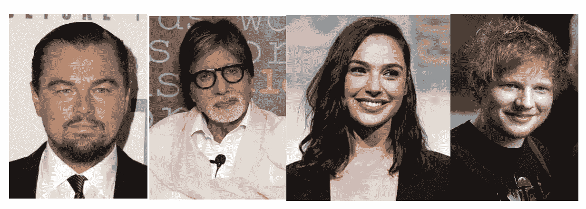
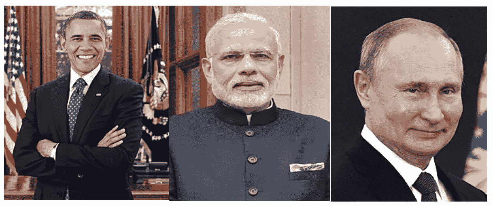

# 基于半监督嵌入的模糊聚类

> 原文：<https://towardsdatascience.com/a-semi-supervised-embedding-based-fuzzy-clustering-b2023c0fde7c?source=collection_archive---------22----------------------->

## 维基百科名人页面的自动标记

[图像来源](https://unsplash.com/photos/QtFAXP6z0Wk)

[**聚类**](https://www.geeksforgeeks.org/clustering-in-machine-learning/) 是将群体或数据点分成若干组，使得同一组中的数据点更加相似的任务。而另一方面， [**模糊聚类**](https://en.wikipedia.org/wiki/Fuzzy_clustering) 是一种聚类形式，其中每个数据点可以属于多个聚类。 [**半监督学习**](https://en.wikipedia.org/wiki/Semi-supervised_learning) 是一类机器学习，我们通过显示少量已标记数据，让机器学习或决定大量未标记数据。

既然我们已经完成了所有术语的定义，让我们来讨论一些现实生活中的场景，并进入这篇博客的主题。

通常情况下，我们对自己想要的集群有一个想法。例如，如果我们对城市进行分组，我们希望看到更多的城市被分组在一起，而不是城市郊区或城镇。类似地，如果我们对人进行聚类，我们希望看到来自相似背景/领域/爱好的人被分组在一起。

> 这篇博客的主要思想是通过向我们的算法展示一些我们希望我们的聚类是什么样子的例子，来定义一种创建模糊聚类的新方法。在这个博客中，我们将把维基百科名人分为 5 个组/群。更多细节，这个名人数据集是如何创建的可以在[这里](/process-wikipedia-using-apache-spark-to-create-spicy-hot-datasets-1a59720e6e25)找到。但是，这并不重要，因为我已经提供了数据的子集和所需的代码，供您尝试和使用这个概念。最重要的是，这种技术非常通用，它可以很容易地应用于许多用例，比如 plug & play。

# **问题陈述**

我们有一个维基百科名人数据集(包含所有过去或现在有维基页面的名人)。我们想自动将这些人分成 5 组。

1.  ***艺术家*** :所有演员、音乐家、电影制作人、艺术创作人、画家等
2.  运动员:任何运动项目的运动员
3.  ***科学家/研究人员*** :任何背景的科学家，如物理学家、化学家、生物学家、历史学家、计算机科学家等
4.  *领导人/政治家:任何国家或地区的领导人/政治家*
5.  ****其他影响者*** :哲学家、教师、医生、企业家、技术人员等*

*值得注意的一点是，有些人可能属于多个类别，正如我们所知，许多运动员后来进入政界或在职业生涯中表演等。因此，我们想要实现的是模糊分组/聚类，而不是硬聚类。*

# *对数据的研究*

*在设计策略或算法之前，我们先看一次数据。*

**

*数据集快照*

*数据集由两列组成，标题和内容。标题是这个维基百科页面的人的名字，内容是关于他们童年、职业、成就等的页面内容(大文本)。*

*维基百科大约有 598 万页面，其中有 105 万页面是关于人的。所以，我们的数据集由 105 万个名人的维基百科页面组成。*

*可能有许多现在或过去的运动员、艺术家、领导人等等，人们可能不知道。这种算法的美妙之处在于，它能以适当的概率自动为它们找到正确的聚类。*

# *设计战略*

## *步骤 1:创建一个小标签数据*

*第一步将是利用半监督学习的好处，或者简单地说，利用我们拥有的少量信息。 ***我们会列出每个组的一些知名人士，并获取他们的维基百科页面。这个列表可能是你的选择，可能因人而异。让我们看看我列出的不同类别的人。****

> ****艺人*** :莱昂纳多·迪卡普里奥，阿米特巴·巴强，盖尔·加朵，艾德·希兰*
> 
> ****运动员*** :安德烈·阿加西、玛丽亚·莎拉波娃、萨钦·滕杜尔卡尔、莱昂内尔·梅西*
> 
> ****科学家/研究人员*** :阿尔伯特·爱因斯坦、艾萨克·牛顿、德米特里·门捷列夫、查尔斯·达尔文*
> 
> ****领导人/政治家*** :巴拉克·奥巴马、纳伦德拉·莫迪、弗拉基米尔·普京*
> 
> **:史蒂夫·乔布斯、拉里·佩奇、比尔·盖茨、艾伦·格林斯潘、萨尔·汗、杰弗里·辛顿**

****

****艺人****

****

****运动员****

****

*****科学家/研究人员*****

****

*****领导人/政治家*****

****

*****其他影响者*****

**这个列表就像我们创建的 21 个人的小标签数据。训练集看起来像**

****

**21 人的培训组**

## **步骤 2:为有限的标记数据生成嵌入**

**我们现在有 21 个维基百科页面的语料库。我们可以把每一页称为语料库的一个文档。我们将生成每个文档的嵌入。一个 [**嵌入**](https://developers.google.com/machine-learning/crash-course/embeddings/video-lecture) 是一个相对低维的空间，你可以将高维向量平移到其中。嵌入使得在大量输入上进行机器学习变得更加容易，比如表示单词的稀疏向量。它可以是任何长度。在这项工作中，我使用了 100 维嵌入。不同长度绝对可以玩。我使用 [NMF](https://en.wikipedia.org/wiki/Non-negative_matrix_factorization) (非负矩阵分解)来生成这些嵌入。**

## **非负矩阵分解**

**[非负矩阵因式分解](https://en.wikipedia.org/wiki/Non-negative_matrix_factorization) (NMF 或 NNMF)是一种算法，其中矩阵 V 被因式分解成(通常)两个矩阵 W 和 H，其性质是所有三个矩阵都没有负元素。**

**矩阵 **V** 被分解成两个矩阵 **W** 和 **H** 的乘积**

****V = W.H****

****

**矩阵 V 分解成 W & H 矩阵**

**在上面的例子中，矩阵 V 的维数是 4 * 6。我们可以把它看作一个有 4 个文档和 6 个单词的语料库。单元格 Aᵢⱼ的每个条目是单词 Wⱼ在文档 Dᵢ.中出现的次数我们将文档的特征维度从 6 降低到 2。因此，矩阵 W 的维数为 4 * 2，矩阵 H 的维数为 2* 6。**

**从另一个角度来看，在新的映射中，每个文档由两个潜在特征表示，即矩阵 w。矩阵中某个单元的值越高，该文档与潜在特征的关联程度越高。矩阵 H 定义了每个单词属于这些潜在特征的程度。**

****

**直观矩阵分解**

**我们可以用矩阵 W 作为嵌入或降维矩阵。降维使得对大量输入进行机器学习变得更加容易，比如表示单词的稀疏向量。在 python 中，我们可以简单地使用 sklearn 提供的 NMF 包。**

**使用 NMF 创建 V 矩阵并将其分解为 W 和 H**

**结果，我们把 Vᵀᴿᴬᴵᴺ分解成了 Wᵀᴿᴬᴵᴺ和 Hᵀᴿᴬᴵᴺ**

****

**Wᵀᴿᴬᴵᴺ矩阵**

## ****步骤 3:创建组嵌入****

**我们有 5 个群体:艺术家、运动员、科学家、政治家和领导人。我们从每个组中挑选了一些人，并创建了 21 个包含训练集的记录。我们将使用在 Wᵀᴿᴬᴵᴺ为每个组学习的嵌入的平均值，并将其称为组/簇嵌入。**

**例如，艺术家嵌入将作为:**

***Artistsᵉᵐᵇᵉᵈᵈᶦⁿᵍ =平均水平(莱昂纳多·dicaprioᵉᵐᵇᵉᵈᵈᶦⁿᵍ，阿米塔布·bachchanᵉᵐᵇᵉᵈᵈᶦⁿᵍ，加尔·gadotᵉᵐᵇᵉᵈᵈᶦⁿᵍ，埃德·sheeranᵉᵐᵇᵉᵈᵈᶦⁿᵍ)***

**生成集群嵌入的代码**

## **步骤 4:为整个语料库生成嵌入**

**测试集包含除了 21 个名人页面之外的所有剩余的 105 万个名人页面，我们已经将其作为标记的训练数据。现在，对于每个文档，我们需要生成一个嵌入，并且潜在特征需要与训练集的潜在特征相同。也就是说，我们需要产生 Vᵀᴱˢᵀ、Wᵀᴱˢᵀ和 Hᵀᴱˢᵀ.**

**让我们一个一个地看每个矩阵**

1.  ****Vᵀᴱˢᵀ** :通过计算单词‘w’在文档中出现的次数，我们可以很容易地生成 Vᵀᴱˢᵀ。只是我们需要小心，我们只采用我们在训练数据中看到的单词，并以相同的顺序忽略新单词。**
2.  ****Hᵀᴱˢᵀ** :矩阵 Hᵀᴱˢᵀ代表每个单词属于潜在特征的多少。因此它和 Hᵀᴿᴬᴵᴺ.是一样的即 Hᵀᴱˢᵀ = Hᵀᴿᴬᴵᴺ**
3.  **Wᵀᴱˢᵀ: 这是主要的也是唯一剩下的让我们去寻找的母体。我们将使用矩阵代数来找到它。让我们看看如何-**

****

**计算 Wᵀᴱˢᵀ的矩阵代数**

**在代码中，我们不需要接受 inverse 和 all，因为包为我们做了这些，没有隐式地指定它。**

**计算 Wᵀᴱˢᵀ的代码**

## **步骤 5:分配聚类概率**

**最后一步是分配每个维基百科名人聚类分数，并将其转换为概率。为此，我们使用聚类嵌入对页面嵌入进行余弦相似度计算，然后归一化得分以获得概率。**

**例如，如果我们必须给演员汤姆·汉克斯分配聚类分数，过程将是:**

****分数计算****

**艺术家=余弦 _sim(汤姆·汉克斯 *ᵉᵐᵇᵉᵈᵈᶦⁿᵍ* ， *Artistsᵉᵐᵇᵉᵈᵈᶦⁿᵍ) = 0.68***

**SportsPerson = cosine_sim(汤姆·汉克斯 *ᵉᵐᵇᵉᵈᵈᶦⁿᵍ* ，*sportspersonsᵉᵐᵇᵉᵈᵈᶦⁿᵍ)= 0.04***

**科学家=余弦 _sim(汤姆·汉克斯 *ᵉᵐᵇᵉᵈᵈᶦⁿᵍ* ，*scientistsᵉᵐᵇᵉᵈᵈᶦⁿᵍ)= 0.1***

**政客=余弦 _sim(汤姆·汉克斯 *ᵉᵐᵇᵉᵈᵈᶦⁿᵍ* ，*politiciansᵉᵐᵇᵉᵈᵈᶦⁿᵍ)= 0.01***

**影响者=余弦 _sim(汤姆·汉克斯 *ᵉᵐᵇᵉᵈᵈᶦⁿᵍ* ，*influencersᵉᵐᵇᵉᵈᵈᶦⁿᵍ)= 0.1***

> **余弦相似度是一个总是在 0 到 1 之间的数字。0 表示没有相似性，1 表示完全相似**

****分数对概率的标准化****

**艺人概率= 0.68/(0.68+0.04+0.1+0.01+0.1)~ 0.72**

**运动员概率= 0.04/(0.68+0.04+0.1+0.01+0.1)~ 0.05**

**科学家概率= 0.1/(0.68+0.04+0.1+0.01+0.1)~ 0.11**

**政治家概率= 0.01/(0.68+0.04+0.1+0.01+0.1)~*0.01***

**影响者概率= 0.1/(0.68+0.04+0.1+0.01+0.1)~ 0.11**

> **概率加起来是 1。汤姆·汉克斯是一名艺术家，有 72%的机会被分配到艺术家群体。我们对所有的名人维基页面都这样做，并得到聚类概率。**

**用于分配聚类概率的代码**

**看看一些名人的这些概率。概率被转换成下面的百分比。**

****

**一些名人的百分比聚类概率。**

# **结束注释**

**我们设计了一种非常新颖和有效的基于半监督嵌入的模糊聚类技术。这对于许多用例来说是相当普遍的。我们使用先验知识给集群一个形状和一个启动。**

**可以通过以下方式进一步改善结果:**

1.  **使用提供的初始标记数据。我们可以提供更多高质量的数据来改善最终结果。**
2.  **播放或交叉验证正确的嵌入长度。**
3.  **设计一个更具创新性的策略来发现集群嵌入，而不仅仅是简单的平均。**

**如果任务是分别标记每个运动项目的运动员，那么你的种子数据和算法会有什么变化？请评论你的想法。所有的代码和一小部分维基百科名人数据集可以在这里找到。**

*****我的 Youtube 频道更多内容:*****

** [## 阿布舍克·蒙戈利

### 嗨，伙计们，欢迎来到频道。该频道旨在涵盖各种主题，从机器学习，数据科学…

www.youtube.com](https://www.youtube.com/channel/UCg0PxC9ThQrbD9nM_FU1vWA) 

> **关于作者-:**
> 
> Abhishek Mungoli 是一位经验丰富的数据科学家，拥有 ML 领域的经验和计算机科学背景，跨越多个领域并具有解决问题的思维方式。擅长各种机器学习和零售业特有的优化问题。热衷于大规模实现机器学习模型，并通过博客、讲座、聚会和论文等方式分享知识。
> 
> 我的动机总是把最困难的事情简化成最简单的版本。我喜欢解决问题、数据科学、产品开发和扩展解决方案。我喜欢在闲暇时间探索新的地方和健身。在 [**中**](https://medium.com/@mungoliabhishek81) 、**[**Linkedin**](https://www.linkedin.com/in/abhishek-mungoli-39048355/)**或**[**insta gram**](https://www.instagram.com/simplyspartanx/)**关注我，查看我[以前的帖子](https://medium.com/@mungoliabhishek81)。我欢迎反馈和建设性的批评。我的一些博客-********

*   ******[以简单&直观的方式分解时间序列](/decomposing-a-time-series-in-a-simple-and-intuitive-way-19d3213c420b?source=---------7------------------)******
*   ******[GPU 计算如何在工作中拯救了我？](https://medium.com/walmartlabs/how-gpu-computing-literally-saved-me-at-work-fc1dc70f48b6)******
*   ******信息论& KL 散度[第一部分](/part-i-a-new-tool-to-your-toolkit-kl-divergence-5b887b5b420e)和[第二部分](/part-2-a-new-tool-to-your-toolkit-kl-divergence-736c134baa3d)******
*   ******[使用 Apache Spark 处理维基百科，创建热点数据集](/process-wikipedia-using-apache-spark-to-create-spicy-hot-datasets-1a59720e6e25)******
*   ******[每个数据科学家都应该避免的五个错误](/5-mistakes-every-data-scientist-should-avoid-bcc8142d7693)******
*   ******[比较哪种机器学习模型表现更好](/compare-which-machine-learning-model-performs-better-4912b2ed597d)********