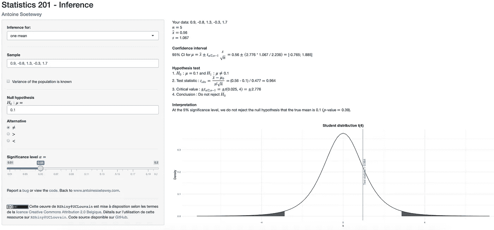

# 一个闪亮的手动推断统计程序

> 原文：<https://towardsdatascience.com/a-shiny-app-for-inferential-statistics-by-hand-a607bed39e7d?source=collection_archive---------43----------------------->

## 关于如何构建置信区间和手动对 3 个主要参数进行假设检验的指南

推断统计学的闪亮应用:假设检验和置信区间

统计学分为四个主要分支:

*   描述统计学
*   推论统计
*   预测分析
*   探索性分析

描述性统计提供了数据的概要；它有助于以简洁的方式解释数据，而不会丢失太多信息。数据可以用数字或图形来概括。参见[手工描述性统计](https://www.statsandr.com/blog/descriptive-statistics-by-hand/)或 R 中的[以了解更多关于这一统计分支的信息。](https://www.statsandr.com/blog/descriptive-statistics-in-r/)

预测分析的分支旨在根据一个或几个自变量预测一个因变量。根据要预测的数据类型，它通常包括回归或分类等方法。

探索性分析侧重于使用图形方法来深入研究数据，并确定数据集中不同变量之间存在的关系。因此，它们更类似于数据可视化。

推断统计学使用从总体中随机抽取的数据样本进行推断，即得出关于总体的结论(参见[总体和样本的差异](https://www.statsandr.com/blog/what-is-the-difference-between-population-and-sample/))。换句话说，来自样本的信息用于对总体中感兴趣的参数进行归纳。推断统计学中的两个主要工具是置信区间和假设检验。这里有一个闪亮的应用程序，可以帮助你使用这两个工具:

*   [统计-201](https://antoinesoetewey.shinyapps.io/statistics-201/)

这个闪亮的应用程序专注于置信区间和假设检验:

*   1 和 2 表示(非配对和配对样本)
*   1 和 2 的比例
*   1 和 2 差异

以下是完整的代码，如果你想加强它(见一个例子，如何使用这个应用程序后，嵌入式代码):

*请注意，如果应用程序已达到每月使用限额，链接可能会失效。如果是这种情况，请稍后再试。*

# 这个 app 怎么用？

请遵循以下步骤:

1.  通过此[链接](https://antoinesoetewey.shinyapps.io/statistics-201/)打开应用程序
2.  选择您想要进行推断的参数(即平均值、比例或方差)
3.  在样本中写入您的数据。观察值由逗号分隔，小数是一个点
4.  设置零假设和替代假设
5.  选择显著性水平(大多数情况下α=0.05)

在结果面板中(根据屏幕大小位于右侧或下方)，您将看到:

*   用一些适当的描述性统计数据概括一下你的样本
*   置信区间
*   假设检验
*   解读
*   以及假设检验的说明

还提供了达到最终结果的所有公式、步骤和计算。

我希望你会发现这个应用程序有助于进行推断统计，尤其是手动置信区间和假设检验。

和往常一样，如果您有与本文主题相关的问题或建议，请将其添加为评论，以便其他读者可以从讨论中受益。

**相关文章:**

*   [一款闪亮的手工线性回归应用](https://www.statsandr.com/blog/a-shiny-app-for-simple-linear-regression-by-hand-and-in-r/)
*   [最佳资产配置实用指南](https://www.statsandr.com/blog/practical-guide-on-optimal-asset-allocation/)
*   [用闪亮的 app 画字云](https://www.statsandr.com/blog/draw-a-word-cloud-with-a-shiny-app/)
*   [如何在 blogdown 中嵌入闪亮的 app](https://www.statsandr.com/blog/how-to-embed-a-shiny-app-in-blogdown/)

*原载于 2020 年 1 月 15 日 https://statsandr.com***。**