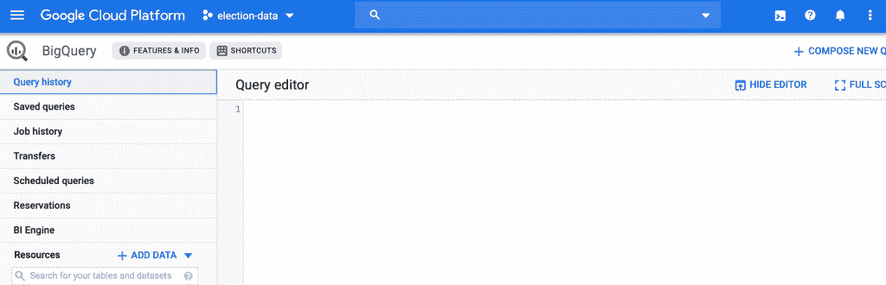

# 从 Google BigQuery 分析公共数据的简短指南

> 原文：<https://towardsdatascience.com/a-short-guide-to-analyze-public-data-from-google-bigquery-667126efbe24?source=collection_archive---------28----------------------->

图片来源:凯文·Ku 摄于 [Pexels](https://www.pexels.com/photo/coding-computer-data-depth-of-field-577585/?utm_content=attributionCopyText&utm_medium=referral&utm_source=pexels)

## 这里有一个如何使用 Google BigQuery 分析大数据集的指南。

互联网上有大量的数据集需要分析，但却没有足够的磁盘空间来存储它们。如果您像我一样是数据科学的新手，那么您很有可能遇到过这个错误“您已经用完了磁盘空间”，而您的代码运行在一个 10 GB 的 CSV 文件上，该文件被压缩在您的磁盘上的某个地方，并因缺少足够的空间而喘不过气来。

欢迎来到云的世界。这对我简直是一个启示。我用谷歌大查询开始了这个伟大的旅程。它肯定不是唯一的，当然也不是最便宜的。但是，谷歌允许你至少在一年内免费使用它的服务，直到一个固定的期限。

这篇文章假设读者对 SQL 有基本的了解，因为它是与数据库通信的最有效的方式。如果你想学习 SQL 或 SQLite，考虑参加 Datacamp 或 Coursera 的在线课程，一旦你对它有点熟悉了，练习是关键。

在接下来的段落中，我们将一步一步地介绍使用 Google BigQuery 的过程，并在此过程中制作出一份精美的分析报告。请注意，BigQuery 的范围相当广泛，但我将从它最基本的用途开始，即访问公共数据集并在 R 上查询它(无需下载到我的磁盘上)。

什么是 BigQuery？正是谷歌的“[企业数据仓库让你能够利用谷歌基础设施](https://cloud.google.com/bigquery/what-is-bigquery)的处理能力运行超快的 SQL 查询。因此，当您运行大数据分析时，您的磁盘可以呼吸。

要开始使用 BigQuery，您可以上传自己的数据集，或者访问他们的一个公开可访问的数据集。这个库不是很大，但是足够好让你开始练习你的动作。

第一步。首先在[谷歌云](https://console.cloud.google.com/)上登录或创建一个账户。当你登录时，你会看到一个显示你使用谷歌云服务的仪表盘。在左侧面板中，浏览主页–>大数据–>大查询。

第二步。进入 BigQuery 页面后，创建一个新项目并将数据集存储在该项目中，这样就可以跟踪所有的查询和数据集。好处是 BigQuery 存储了您过去对一个项目的所有查询，因此您可以在将来的任何时候重新运行它们。节省了大量时间。有 20 个免费项目的报价。所以，放轻松。

要创建一个新项目，请在上面的蓝色面板中，Google Cloud Platform 旁边，单击 new project。给它一个名字，BigQuery 会自动给它分配一个项目 ID。我们以后需要这个身份证。项目创建后，您将在上面的蓝色面板中看到它。我的项目名为“选举数据”。

我的谷歌大查询项目的快照

第三步。我们现在可以开始探索数据集库了。在左侧面板中，单击添加数据–>浏览公共数据集。数据集根据它们所属的广泛主题进行分类。你挑吧。或者，有一个选项也可以添加位于“Resources ”-> big query-public-data 下面的左侧面板中的数据集。滚动浏览数据集，并单击您想要分析的数据集。我选择了“谷歌政治广告”进行分析。

我的谷歌大查询项目的快照

第四步。你已经完成一半了。我们现在将从探索主面板上的数据集开始。顾名思义，Schema 对列定义进行布局。详细信息部分显示选定数据集下相关表中的大小、类型和公共列。我的数据集是六个表的集合，可以在查询时轻松地处理它们。最后一部分“预览”给出了所选表格前几行的简要预览。

我的谷歌大查询项目的快照

第五步:从这里开始，我们可以选择两种方式进行。首先，在 BigQuery 控制台中运行查询并保存结果。其次，将这个 BigQuery 设置与您选择的 IDE 链接起来，就像您在 Python、R 或任何其他选择的语言中处理 SQL 一样。我选择了 R-studio。

步骤 6:要在 R-studio 中处理 BigQuery 数据集，将项目 ID 存储在一个变量中，然后按如下方式进行。这里，get_table 中的一个项目是一个大文件夹，所有公共数据集都存储在这个文件夹中。“数据集”是您选择用于分析的数据集的名称，“表”是主数据集中选择的表。运行此区块以访问数据集。

我的 R Studio 项目的快照

第 7 步:这是第一个查询。FROM here 显示了从所选的查询数据集访问的最终表的名称，在这里它用“.”链接到主数据集。这里是您的项目 ID，useLegacySQL = TRUE 允许我们使用遗留 SQL 命令进行查询。

该查询计算表中的行数，即 56，987。

我的 R Studio 项目的快照

我的 R Studio 项目的快照

BigQuery 对一个人可以查询和访问的数据量施加了每日限制。不过，在疯狂使用查询之前熟悉一下自己是个好主意。

该查询显示了表中的所有列和十行。

我的 R Studio 项目的快照

所以，就这样了。我希望它很容易理解和使用。让我知道您在探索 BigQuery 时想到了什么，或者您对其他类似平台的体验如何。我还在下决心。🙂