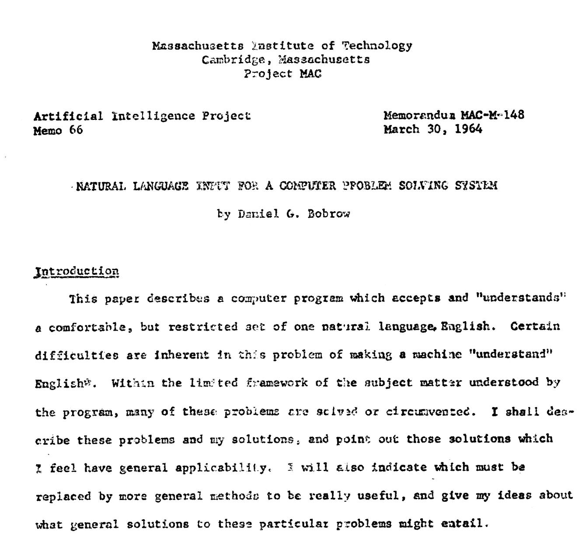
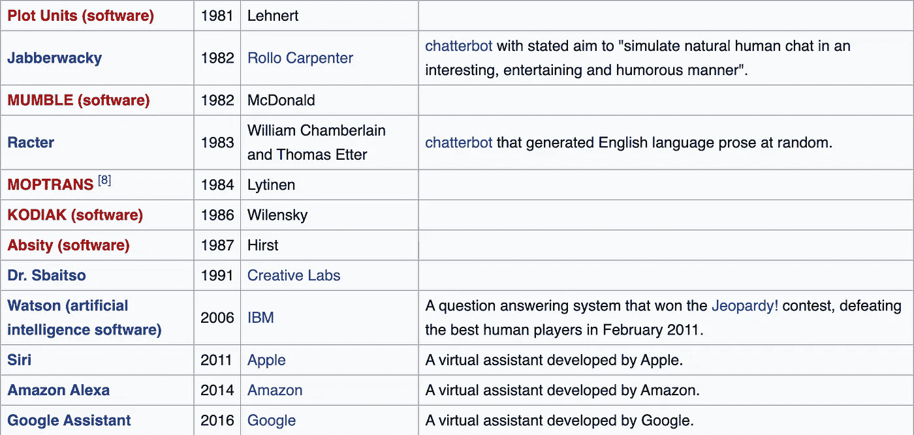

# 自然语言理解简史

> 原文：<https://towardsdatascience.com/a-short-history-of-natural-language-understanding-f1b3c382f285?source=collection_archive---------36----------------------->

照片由 Unsplash 上的 [@allecgomes](https://unsplash.com/@allecgomes) 拍摄

## 人工智能中自然语言处理的一个子课题

在探索自然语言处理时，我偶然发现了术语**自然语言理解**。这让我对语言有了更多的思考，不仅仅是处理过程，还有意义。

***黄色的花是什么意思？***

当然，它可以简单地表示一朵黄色的花，作为一个物体。

它可以是你所爱的人最喜欢的花，让你想起婚礼的那一天，一段珍贵的回忆或悲伤，这取决于具体情况。

也许你总是带黄色的花去你祖母的坟墓。

在墨西哥，黄色的花金盏花象征着死亡。墨西哥的庆祝活动以金盏花鲜艳的黄色和橙色为特色。

照片由 [@albrb](https://unsplash.com/@albrb) 拍摄

黄色的花可以代表开悟，这就是为什么它在印度经文中被广泛用来代表佛陀和毗湿奴。

在法国，黄色的花代表嫉妒。

随着时间的推移，意思是一样的吗？

在维多利亚时代的英国，黄色的花被用来象征单恋。维多利亚时代的人用花就像我们用表情符号一样。

说到表情符号——这个看起来很无辜。

# 🍆

它在网上最常用来代表阴茎。

当汗液滴表情符号旁边时，表示射精。

我们从开花到射精有点快。

无论是口语、文本还是符号，语言中的意义和语境都不是那么容易的。

## 什么是自然语言理解？

如果意义是如此的困难，那么将这种意义变成一个自动的过程似乎是一个挑战。

在这篇文章中，我探索了术语自然语言理解，主要从维基百科的文章开始，并通过一些我感兴趣的其他来源进一步阐述。

> **“自然语言理解** ( **NLU** )或**自然语言解释** ( **NLI** )是人工智能中自然语言处理的一个子课题，处理机器阅读理解。”

以这种方式，它处理一些相当困难和复杂的事情。

如果在人工智能(AI)领域内操作，它可以被认为是一个人工智能难题。什么是 [*理解*](http://v) ？

> “理解是一个与抽象或物理对象(如人、情况或信息)相关的心理过程，通过这一过程，一个人能够思考它并使用概念来充分处理该对象。理解是知者和理解对象之间的关系。”

理解可以自动化吗？

照片由 [@heathermount](https://unsplash.com/@heathermount) 拍摄

这个过程可以被充分描述以复制它或者使用人工语言(编程/代码)来更好地理解它吗？

如果这两个问题的答案都是肯定的，那么你可能对自然语言理解有些兴趣。

然而，这些问题可能不相关，你可能只是想从自然语言的角度来探索它——人类说话、发短信或交流。

如果你曾经学过一种不同于你母语的语言，你可能在某种程度上理解句子可以表达相同的意思，也可以表达不同的意思，而且有不同的社会背景，这些句子表达不同的意思。

语言具有社会性和动态性，它是不断变化的，而不是一成不变的。

Insight 可以应用于自动推理、机器翻译、问答、新闻收集、文本分类、语音激活、存档和大规模内容分析。

## 自然语言理解的历史

可能有许多方法来讲述自然语言理解的历史，但是如果我们从你在维基百科上能读到的东西来看，它是从学生程序开始的。

**1964 年**学生丹尼尔·鲍勃为他在麻省理工学院的博士论文写的。

学生使用基于规则的系统进行逻辑推理。

这些规则由软件开发人员预先编程，能够解析自然语言。

这被认为是计算机理解自然语言的最早尝试之一。

在此之前，约翰·麦卡锡在 1955 年创造了人工智能这个术语。

丹尼尔·鲍勃的论文题目是 ***计算机问题解决系统的自然语言输入*** *。*

事实上，这份出版物可以在 [ResearchGate](https://www.researchgate.net/publication/37597683_Natural_Language_Input_for_a_Computer_Problem_Solving_System) 上找到。

Daniel Bobrow 题为*计算机问题解决系统的自然语言输入*的论文截图

它展示了计算机如何理解简单的自然语言输入来解决代数问题。

1965 年，一年后，麻省理工学院的约瑟夫·韦岑鲍姆写了《伊莉莎》。

伊莱扎是一个互动程序，用英语就任何话题进行对话，最受欢迎的是心理治疗。

与伊莱扎聊天机器人的对话。权利:[公共领域](https://en.wikipedia.org/wiki/ELIZA#/media/File:ELIZA_conversation.jpg)。

创作者将程序视为一种展现人机交流肤浅性的方法。

然而，令他惊讶的是，许多人把类似人类的感觉归功于计算机程序，包括他的秘书。

伊莱扎的工作是通过简单的分析和把关键词替换成固定短语。

伊莱扎作为一个玩具项目获得了惊人的人气。

尽管如此，它仍可被视为 2020 年商业系统的早期范例。

**1969** 斯坦福大学的 Roger Schank 为自然语言理解引入了概念依赖理论。

该模型使用以下基本表示性标记:

*   *现实世界的物体*，每个都有一些*属性*。
*   *现实世界的动作*，每个都有属性
*   *次*
*   *位置*

一组*概念转换*然后作用于这个表示。

如何使意义独立于输入中使用的单词？

**1970** ，William A. Woods 引入了扩充转换网络(ATN)来表示自然语言输入。

这些网络称为一组*‘有限状态自动机’*。

可以在现代社会的许多设备中观察到状态机的行为，这些设备根据它们所呈现的事件序列执行预定的动作序列。

这与*相位结构规则*形成对比。*阶段结构规则*用于将自然语言句子分解成其组成部分，也称为'*句法类别'*，包括词汇类别(词类)和短语类别

有限状态自动机被递归调用。

> “一个**有限自动机**可以被看作一个只有**有限**内存量的程序。一个**递归自动机**就像一个可以使用**递归** ( **递归地调用**过程**和**)的程序，但是在它的变量空间中又超过了**有限的**内存量。[ [递归自动机](https://courses.engr.illinois.edu/cs373/fa2009/recaut.pdf) ]

1971 年，特里·维诺格拉德在麻省理工学院完成了他的博士论文《SHRDLU》。

这个程序可以在一个受限的儿童积木世界中理解简单的英语句子，以指导机械臂移动物品。

[斯坦福 HCI](https://hci.stanford.edu/winograd/shrdlu/) 发布的原始屏幕显示。

这一成功的演示为该领域的继续研究提供了巨大的动力。

维诺格拉德出版了他的书《作为认知过程的语言的 T2》。

> 这本书可能是有史以来第一部在计算机帮助下对自然语言处理的思想史进行全面、权威和原则性的描述【[书评](https://www.aclweb.org/anthology/J83-1005.pdf)

让这个故事更加有趣的是维诺格拉德后来建议的那个人。

拉里·佩奇是谷歌的创始人之一，特里·维诺格拉德是他的顾问。

20 世纪 70 年代和 80 年代，SRI International 的自然语言处理小组继续进行该领域的研究和开发。

> “SRI 国际(SRI)是一个美国非营利性科学研究机构和组织，总部设在加利福尼亚州门洛帕克。斯坦福大学的董事们于 1946 年建立了斯坦福研究所，作为支持该地区经济发展的创新中心。该组织成立时名为斯坦福研究所。斯坦福国际研究所于 1970 年正式脱离斯坦福大学，并于 1977 年更名为斯坦福国际研究所。

**1982** ，另外 *Gary Hendrix* 成立了赛门铁克公司，最初是一家为个人电脑上的数据库查询开发自然语言界面的公司。

然而，赛门铁克改变了方向。

**1983** ，Michael Dyer 在耶鲁开发了 BORIS 系统，该系统与 Roger Schank 和 W. G. Lehnert 的工作有相似之处。

在 20 世纪 80 年代和 2010 年之间的几十年里，进步变得更加模糊，这仍然是我需要了解更多的一段时间。至少在自然语言理解方面(NLU)。就 NLP 而言，总体而言，确实取得了进展。

**1980 年**随着用于语言处理的机器学习算法的引入，自然语言处理发生了一场革命。

计算能力稳步增长，乔姆斯基语言学理论的主导地位逐渐减弱(例如，乔姆斯基语言学理论的理论基础阻碍了语料库语言学的发展，而语料库语言学是语言处理机器学习方法的基础)。

> 乔姆斯基发展了一套文法的形式理论，其中转换不仅操纵表面字串，也操纵与它们相关的剖析树，使得转换文法成为一套树状自动机系统

最早使用的机器学习算法，如决策树，产生了类似于现有手写规则的*硬 if-then 规则*系统。

→ **统计模型**最近受到了更多的关注，它基于将实值权重附加到组成输入数据的特征来做出软概率决策。

在维基百科的“自然语言处理的历史”页面上有一个最新软件的列表。这可以追溯到 1954 年 T2 的乔治城实验。然而，我选择展示 20 世纪 80 年代到 20 世纪 10 年代。

并非所有这些系统都专注于自然语言理解。

近几十年来，我们看到了其他系统的崛起，如 IBM Watson。

**2011 年**，沃森计算机系统参加了*危险边缘的比赛！对阵冠军布拉德·鲁特和肯·詹宁斯。*

一方面，这是一个有趣的进步，另一方面，人们还在争论这样的系统到底有多“理解”**例如*根据约翰·塞尔的说法，沃森甚至没有理解这些问题。*

*认知科学家、帕托姆理论的发明者约翰·鲍尔支持这一评估。*

*从最近的语音助手可以注意到，如 Siri、亚马逊(Alexa)和谷歌(Nest)这些并不总是理解你。不得不说更近了，现在的人都在用设备对话。*

*数以亿计的人正在与盒子或智能手机交谈，这些设备在某种程度上可以理解你。*

*在未来的岁月里，看看我们如何理解或解释语言肯定会很有趣。现在是 2020 年，我们正在接近理解人类如何交流。我们也更接近于理解如何让设备以一种人类可以理解并进行对话的方式进行交流。*

*我希望你觉得这篇文章很有趣，并且让你对自然语言理解更感兴趣。*

*当我们理解这个世界的时候，它一定会在某个地方发生变化。虽然我们在任何时候都可能只有有限的理解，但创建一张地图并看看它通向哪里肯定是有趣的。*

*这可能会导致一些误解。*

*机器能被编程理解你吗？*

**

*照片由 [@kristapsungurs](https://unsplash.com/@kristapsungurs) 拍摄*

*这是#500daysofAI，您正在阅读第 425 篇文章。500 天来，我每天都在写一篇关于或与人工智能相关的新文章。*