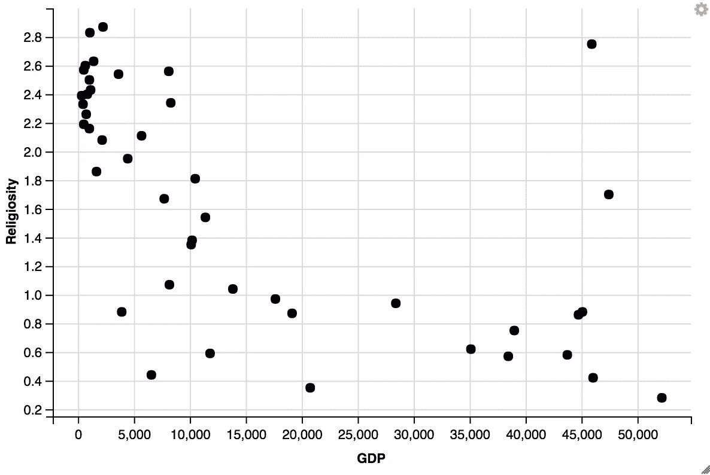
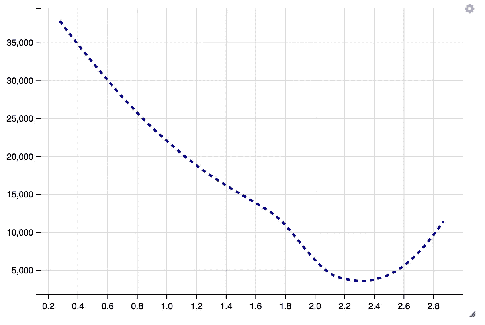
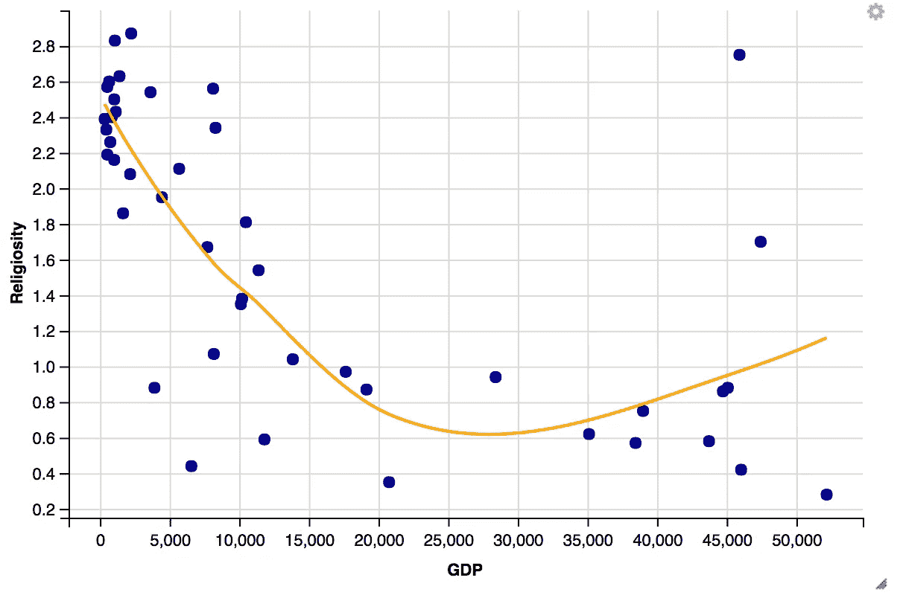
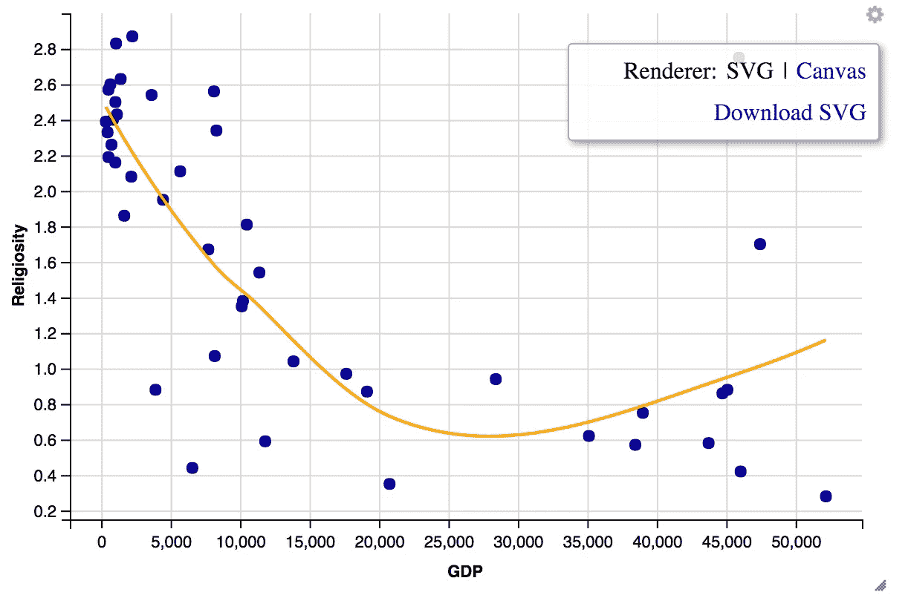
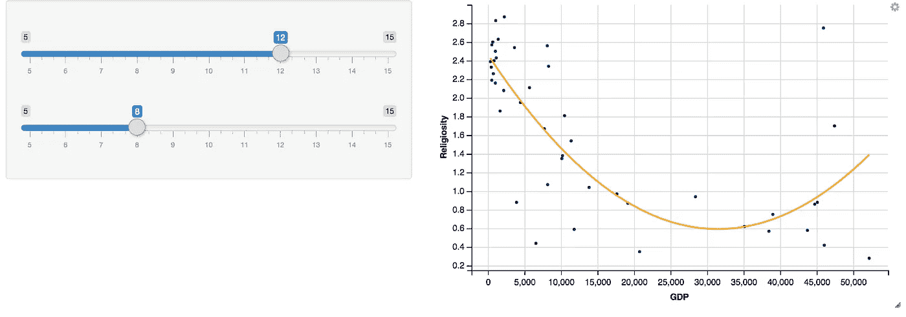
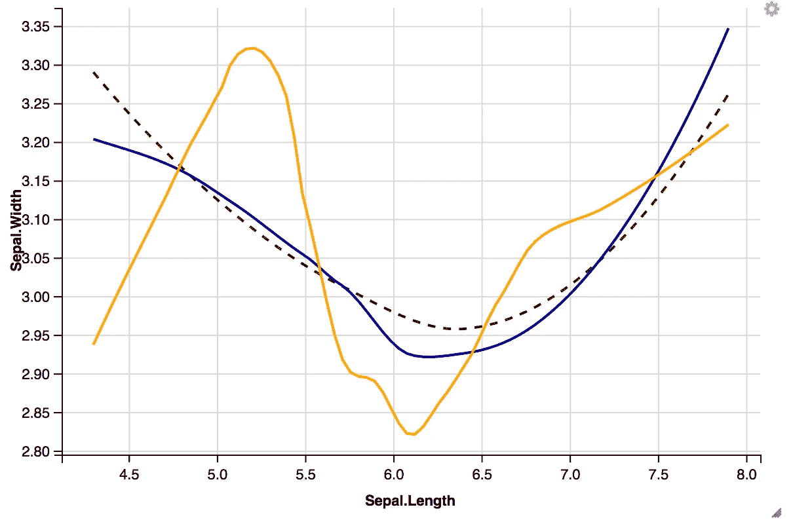
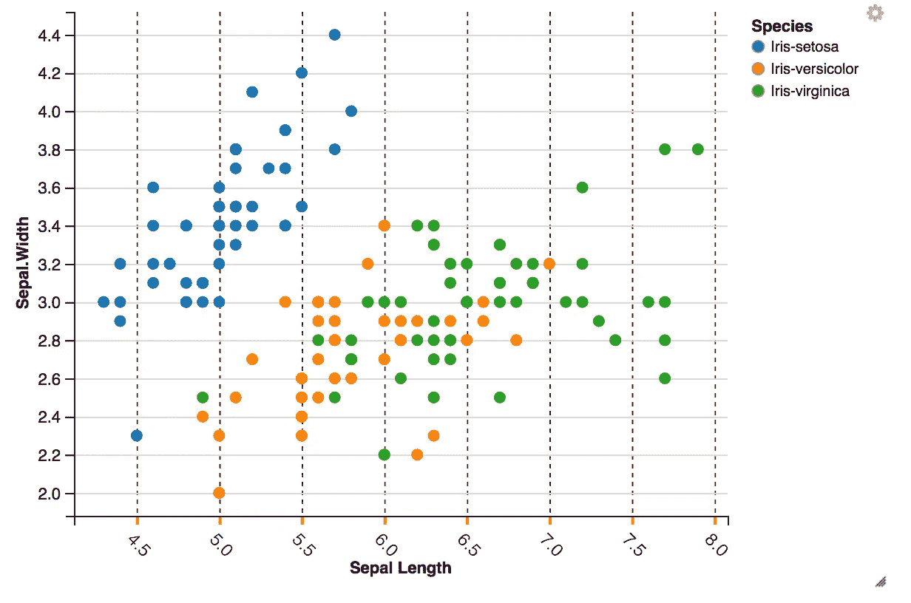
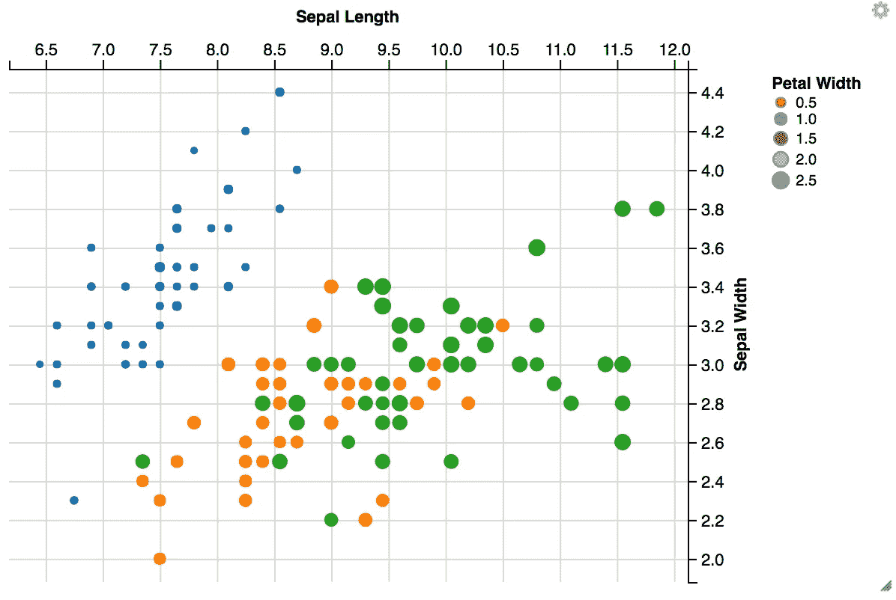
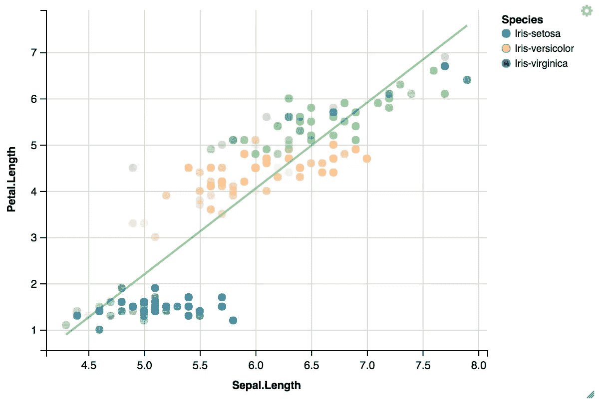
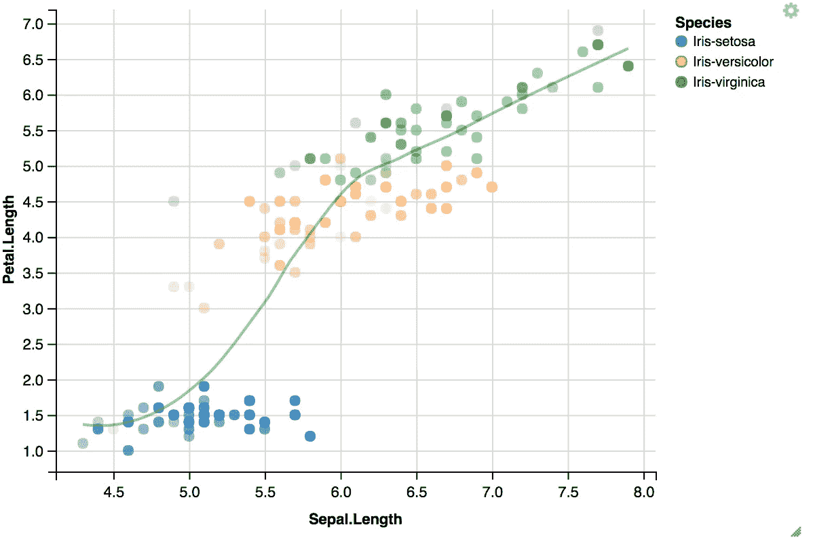

# ggvis 简介

> 原文：<https://towardsdatascience.com/a-short-introduction-to-ggvis-52a4c104df71?source=collection_archive---------26----------------------->

## 例谈图形的语法

*Grammar of Graphics*是 Leland Wilkinson 在图形领域数十年工作和研究的成果，它为 **R** 图形库提供了哲学基础，如 *ggplot2、ggvis* 和 **Julia** 图形库，如*牛虻。虽然，还有其他库可以为您提供真正令人惊叹的图形，但这些包的不同之处在于，它们基于 Wilkinson 所做的研究，该研究试图将图形视为一种语言，并将其分解为单独的组件，就像任何其他语言将其组件分解为主语、动词、宾语等。*

威尔金森在 20 世纪 70 年代早期写了一个以其全面的图形而闻名的统计软件包，后来他在 90 年代中期把它卖给了 SPSS。在 SPSS 工作的时候，他写了他的突破性的研究，不久前提到过。他的研究对计算机科学中的图形哲学产生了重大影响。由 Winston Chang 和 Hadley Wickham 维护的**R**gg plot 2 中最著名的绘图软件包，其基本原理来自于*图形语法。另一个这样的软件包是 ggvis。我们会谈到后者。*


由 [Jason Coudriet](https://unsplash.com/@jcoudriet?utm_source=unsplash&utm_medium=referral&utm_content=creditCopyText) 在 [Unsplash](https://unsplash.com/s/photos/chart?utm_source=unsplash&utm_medium=referral&utm_content=creditCopyText) 上拍摄的照片

# 为什么是 ggvis 而不是 ggplot2？

《T21》本身就是一个了不起的包。ggvis 没有从中拿走任何东西，相反，它只是前者的扩展，具有构建 HTML 图形的能力。因为 ggvis 图形是 HTML，所以它们可以用在一个漂亮的 web 应用程序、R markdown 报告中，也可以和 JavaScript 一起使用。一会儿我们会弄清楚其中一些意味着什么。

## **资源**

关于 *ggvis* 的文档可以在[这里](https://www.rdocumentation.org/packages/ggvis/versions/0.4.3/readme)找到，还有一个关于[数据营](https://www.datacamp.com/courses/ggvis-data-visualization-r-tutorial)的非常好的教程。如需更多信息，您可以访问 *ggvis* 上的 [RStudio 的博客，以及一份关于](https://blog.rstudio.org/2014/06/23/introducing-ggvis/) [*图形*](http://civilstat.com/2012/09/the-grammar-of-graphics-notes-on-first-reading/) *语法的简明摘要。*本帖的**主要目的**是**探究和理解 *ggvis*** *的*语法*和*句法*。*

```
$ religiongdp <- read.table("/Users/kovid.rathee/Downloads/ReligionGDP.csv", header=TRUE, sep=",")
$ religiongdp %>% ggvis (~GDP, ~Religiosity) %>% layer_points()
```

我们首先要了解的是从 [*马格里特*](https://cran.r-project.org/web/packages/magrittr/index.html) 包中取出的*管道*操作符 **% > %** 。这就像*壳管*操作器的工作一样。



从第一张图片本身来看，这种模式很明显。越是宗教化的国家，越不繁荣(从 GDP、幸福等方面来看)。这里不算，因为我们没有数据)他们是。不过，也有一些例外。但是，我们也可以从数据中看到这一点。为什么要创建图表？因为图表很容易理解。他们讲述完整的故事，而不是一篇十页的文章。他们让我们预测未来——或者至少他们应该让我们预测未来。

```
religiongdp %>% compute_smooth(GDP ~ Religiosity) %>% ggvis (~pred_, ~resp_) %>% layer_lines(stroke := "darkblue", strokeWidth := 3, strokeDash := 5)
```



```
religiongdp %>% compute_smooth(GDP ~ Religiosity) %>% ggvis (~pred_, ~resp_) %>% layer_points(fill := "darkblue", size = 0.5)
```

## 回归和趋势线

用一条*有点像*的线来绘制原始数据。我们可以认为是一条*回归*线。数据集中的*特征*不足以进行适当的*分类*从而*猜测*一个国家或一个州的 GDP 应该是多少。除了宗教信仰，还有很多更重要的东西，比如人口，政府形式等等。但是，即使从这张图表中，我们也可以粗略地确定 GDP 和宗教信仰之间存在负相关关系——尽管有两个主要的例外，科威特和美国。我们可以称他们为*离群值*。



虽然橙色趋势线是数据的一个相当不错的表示，但如果我们在这里谈论做出预测，基于不同算法的分类，如 KNearestNeighbour 等。可能需要。这个想法是将所谓的离群值也放入算法运行其原因后将创建的许多类中的一个。

请注意重现右上角的*设置*按钮。当你点击那个按钮时，它会为你提供一个选项来下载一个 *svg* 文件或者一个 *png* 文件。



你想要什么?可缩放矢量图形或便携式网络图形。阅读一些关于什么时候使用哪个的信息。

## 交互式图表

*ggvis* 也有别于 *ggplot2* ，因为它具有类似*输入滑块的交互功能。*互动性是 *ggvis 的主要成就之一。*它的工作方式与在 Tableau 或 Qlikview 环境中的工作方式相同，但是，当您使用这些库编写自己的代码时，您将对这些图形的渲染方式有更多的控制和更清晰的理解。这里有一个例子:

```
religiongdp %>% ggvis (~GDP, ~Religiosity) %>% layer_points(fill := "darkblue", size := input_slider (5,15,value=1)) %>% layer_smooths(stroke:="orange", span = input_slider (5,15,value=1))
```



带有滑块输入的图形。制作了一个非常好的交互式图表，可以嵌入到应用程序中。

```
iris %>% ggvis(~Sepal.Length,~Sepal.Width,fill=~Species) %>% layer_smooths(span = 2, stroke := “darkred”, strokeDash := 6) %>% layer_smooths(span = 1, stroke := “darkblue”) %>% layer_smooths(span = 0.5, stroke := “orange”)
```



只需使用%>%运算符，就可以用不同的格式在图上定义不同的线。这让生活变得简单多了。

```
iris %>% ggvis(~Sepal.Length,~Sepal.Width,fill=~Species) %>% layer_points() %>% add_axis ("x",title="Sepal Length",properties=axis_props(axis=list(stroke="darkblue"),grid=list(stroke="brown",strokeDash=3),ticks=list(stroke="orange",strokeWidth=2),labels=list(angle=45, align="left", fontSize=12)))
```



著名 Iris 数据集的基本点状图。在这种情况下，我们可以通过颜色来识别花的种类，位置代表了叶子的尺寸——长度和宽度。

```
iris %>% ggvis (~Sepal.Length,~Sepal.Width) %>% mutate(Sepal.Length = Sepal.Length * 1.5) %>% layer_points(fill=~Species,size=~Petal.Width) %>% add_axis(“x”,title=”Sepal Length”,orient=”top”) %>% add_axis(“y”,title=”Sepal Width”,orient=”right”) %>% add_legend(c(“size”,”fill”),title=”Petal Width”))
```



在这里，我们试图添加另一个变量到图中。花瓣宽度——除了能够绘制萼片尺寸和通过颜色识别物种，我们还可以通过一个点的强度/大小来表示花瓣宽度。

```
iris %>% ggvis(x=~Sepal.Length,y=~Petal.Length,fill=~Species) %>% layer_points(opacity=~Sepal.Width) %>% layer_model_predictions(model="lm",stroke:="green",opacity=3)
```



使用图层模型预测的线性拟合线。有很多预定义的模型可以用来绘图。线性拟合线在这里没有什么意义。但如果是这样的话，它应该是这样的。

```
iris %>% ggvis(x=~Sepal.Length,y=~Petal.Length,fill=~Species) %>% layer_points(opacity=~Sepal.Width) %>% layer_model_predictions(model="loess",stroke:="green",opacity=3)
```



可能，不正确的例子使不透明度成为萼片宽度的函数。但这对于可视化变量的强度、严重性和大小非常有用——这些变量无法绘制在 x-y 平面上。

## 结论

*ggvis* 是一个很棒的包，它提供了对 *ggplot2* 的升级，具有许多新时代的功能，如交互式绘图和创建 HTML 绘图的能力，使这些绘图能够嵌入到闪亮的应用程序中等等。威尔金森的工作极大地影响了绘图语言中的话语——这是日常工作，同时进行数据分析、商业智能、机器学习等。